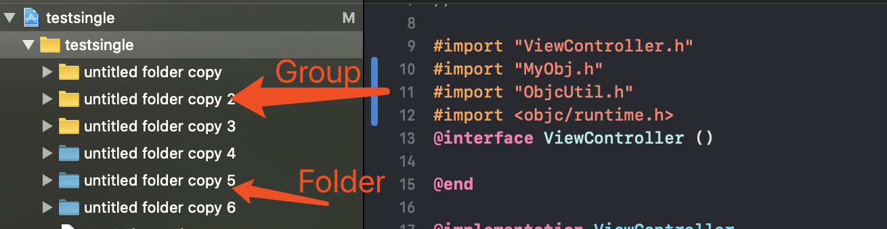

Folder和Group在Xcode工程目录下面一个是蓝色文件夹一个是黄色文件夹。

他们的区别如下

- Group以**黄色文件夹**显示，它是一种逻辑上的结构，在Finder中不一定有一个对应着的真实文件夹
- Folder以**蓝色文件夹**显示，它是和Finder中的文件夹一一对应的，它作为资源被整个引用进项目，不参与编译代码，也就是说不存在于complie sources列表里面。

可以看到虽然我们将MyGroupFolder以Folder的形式引入了，但是它并未参与到Compile Sources列表中。

然后我们编译通过之后，找到Products中的产物xxx.app，然后show in Finder跳转到文件夹中，然后选中.app，右键显示包内容

我们看到刚才的MyGroupFolder确实是被整体的打包到了产物.app中，并且是被原样打包，有几个Folder就打包了几个。

我们可以看到引入的时候是有一个复选框和两个单选框的，我们解释一下他们各自的作用

- Copy items if needed这个选项用于当你引入的文件和工程文件不在一起时，可以直接copy到工程文件中
- Create groups用于将文件以Group的形式引入
- Create folder references用于将文件以Folder的形式引入

当然了引入的时候也是可以选择多项引入的，可以Command键多选或Shift连选

#### 借鉴文章

[工程目录中Folder和Group区别](https://www.jianshu.com/p/2ddba8c0062c)