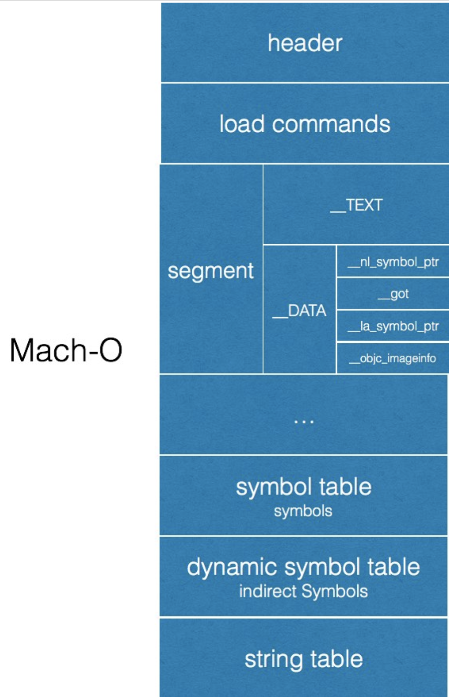

[TOC]

因为最近在看项目过程中涉及到Mach-o方面的知识，而我只是对这方面有着模糊的理论知识，还没有实际的操作过。所以网罗了很多资料来巩固知识。

#### 什么是Mach-O文件格式

Mach-O是全称为Mach Object format的缩写，是Mach/iOS上普遍应用的一种文件，常见的主要由以下类型

1. Executable：可执行文件，应用的主要二进制。我们打出来的包，右键显示包内容即可查看主执行文件
2. Dylib Library：动态链接库（又称DSO或DLL），在iOS中基本上就是系统自带的共享动态库
3. Static Library：静态链接库，也就是我们常说的.a文件
4. Bundle：不能被链接的Dylib，只能在运行时使用dlopen( )加载，可当做**macOS**的插件
5. Relocatable Object File ：可重定向文件类型

与之相对的还有一个FatBinary的文件，就是我们常说的胖二进制文件。通常一种架构的Mach-O只能在对应的架构上运行，而胖二进制就是囊括了多种架构的Mach-O文件的一个集合体。

#### Mach-O文件主要包括哪几部分

Mach-O 文件主要由Header，LoadCommand，Data组成，其中Data中包含多个Segment，Segment中包含多个Section

> - Mach-O Header：包含字节顺序，magic，cpu 类型，加载指令的数量等
> - Load Commands：包含很多内容的表，包括区域的位置，符号表，动态符号表等。每个加载指令包含一个元信息，比如指令类型，名称，在二进制中的位置等。
> - Data：最大的部分，包含了代码，数据，比如符号表，动态符号表等。

#### 有什么方法可以查看Mach-O文件

1. 可以使用MachOView开源工具进行查看Mach-O文件的信息
2. 可以使用`clang -S -o - test.c | open -f`    可以查看单个文件生成的汇编代码，其中 **. 开头的行是汇编指令不是汇编代码**，其它的都是汇编代码

#### MachO的section是怎样的

- 可以使用 `xcrun size -x -l -m a.out` 来查看a.out里的section

> 在运行时，虚拟内存会把 segment 映射到进程的地址空间，虚拟内存会避免将全部执行文件全部加载到内存。
>
> __PAGEZERO segment 的大小是 4GB，不是文件真实大小，是规定进程地址空间前 4GB 被映射为不可执行，不可写和不可读。
>
> __TEXT segment 包含被执行的代码以只读和可执行的方式映射。
>
> - __text section 包含编译后的机器码。
> - **stubs 和** stub_helper 是给动态链接器 dyld 使用，可以允许延迟链接，在首次使用而非加载时去绑定其符号地址
> - __cstring 可执行文件中的字符串。
> - __const 不可变的常量。
> - __objc_classname, __objc_methname, __objc_methtype，这三部分是不变的
>
> __DATA segment 以可读写和不可执行的方式映射，里面是会被更改的数据。
>
> - `__nl_symbol_ptr` 中的 non-lazy 符号是在动态链接库绑定的时候进行加载的
> - `__la_symbol_ptr` 中的符号会在该符号被第一次调用时，通过 dyld 中的 `dyld_stub_binder` 过程来进行加载
> - **`la_symbol_ptr`是懒绑定（lazy binding）的符号指针，在加载的时候，并未直接确定符号地址，而是在第一次调用该函数的时候，通过PLT(Procedure Linkage Table)进行一次懒绑定**
> - __const 需要重定向的常量，例如 char * const c = “foo”; c指针指向可变的数据。
> - __data已经初始化的全局常量
> - __bss 未初始化的静态变量，例如 static int i; ANSI C 标准规定静态变量必须设置为0。运行时静态变量的值是可修改的。
> - __common 未初始化的外部全局变量。例如在函数外定义 int i;
> - __dyld 是section占位符，用于动态链接器。
>
> __LINKEDIT Segment 包含需要被动态链接器dyld使用的符号和其他表，包括符号表、字符串表等
>
> - Symbol Table，符号映射
> - Dynamic Symbol Table 动态符号表是加载动态库时的函数表，是符号表的子集。动态符号表的符号 = 符号在原所属符号表中的offset + 原所属符号表在动态符号表中的offset + 动态符号表的基地址base。在动态符号表中查找到的这个符号的值，又等于该符号在符号表中的offset
>
> 更多 section 类型介绍可以查看苹果文档：[Mach-O develop.apple.com](https://developer.apple.com/library/archive/documentation/Performance/Conceptual/CodeFootprint/Articles/MachOOverview.html) [OS X Assembler Reference](https://developer.apple.com/library/content/documentation/DeveloperTools/Reference/Assembler/000-Introduction/introduction.html)

- `xcrun otool -s __TEXT __text a.out/xcrun otool -v -t a.out`  查看某个段的内容
  - otool还有很多可用的option，待以后有时间慢慢研究和测试吧

- `lipo 命令`，常用 thin拆出对应架构的文件，使用create合成文件。关于该命令的详细使用情况可以使用man 查看：man lipo



#### 和延迟绑定有关的知识

在所有拥有延迟加载符号的Mach-O文件里，它的符号表中一定有一个`dyld_stub_helper`符号，它是延迟符号加载的关键！延迟绑定符号的修正工作就是由它完成的。绑定符号信息可以使用`XCode`提供的命令行工具`dyldinfo`来查看，执行以下命令可以查看`python`的绑定信息

所有的延迟绑定符号都存储在`_TEXT`段的`stubs`节区（桩节区），编译器在生成代码时创建的符号调用就生成在此节区中，该节区被称为“桩”节区，桩只是一小段临时使用的指令，在`stubs`中只是一条`jmp`跳转指令，跳转的地址位于`__DATA`段`__la_symbol_ptr`节区中，指向的是一段代码，类似于如下的语句：

```
push xxx
jmp yyy
```

其中xxx是符号在动态链接信息中延迟绑定符号数据的偏移值，yyy则是跳转到`_TEXT`段的`stub_helper`节区头部，此处的代码通常为：

```
lea        r11, qword [ds:zzz]
push       r11
jmp        qword [ds:imp___nl_symbol_ptr_dyld_stub_binder]
```

`jmp`跳转的地址是`__DATA`段中`__nl_symbol_ptr`节区，指向的是符号`dyld_stub_binder()`，该函数由dyld导出，实现位于dyld源码的“dyld_stub_binder.s”文件中，它调用`dyld::fastBindLazySymbol()`来绑定延迟加载的符号，后者是一个虚函数，实际调用`ImageLoaderMachOCompressed`的`doBindFastLazySymbol()`，后者调用`bindAt()`解析并返回正确的符号地址，`dyld_stub_binder()`在最后跳转到符号地址去执行。这一步完成后，`__DATA`段`__la_symbol_ptr`节区中存储的符号地址就是修正后的地址，下一次调用该符号时，就直接跳转到真正的符号地址去执行，而不用`dyld_stub_binder()`来重新解析该符号了

#### Dyld作用

dyld是Apple的动态链接库加载器，内核做好App的初始准备后，交个dyld负责。作用如下：

- 从内核留下的原始调用栈引导和启动自己
- 将程序依赖的dylib递归加载进内存，考虑缓存机制
- non-lazy符号立即link到可执行文件，lazy的存表里
- Runs static initializers for the executable
- 找到可执行文件的main函数，准备参数并调用
- 程序执行中负责绑定lazy符号，提供runtime dynamic loading services，提供调试器接口
- 程序main函数return后执行static terminator
- 某些场景下main函数结束后调用libsystem的_exit函数

#### 编译器Attribute

`__attribute__` 是一个兼容 GCC 的编译器指令，对编译器的一些属性进行设置，可以修饰函数，变量，类型等。当多个属性同时使用时，可以通过 `__attribute__ ((attribute-list))` 语法嵌套使用

`used` 可以将编译器对于未使用的静态变量的优化关闭。

`section("__DATA,sec")`可以将特定的变量存储在mach-o文件的自定义的段和节内

`__COUNTER__` 是一个计数宏，会从 `0` 开始，每预编译一次便会自增 `1`。系统中的MAX，MIN宏内部就使用了COUNTER来保证它内部使用的变量的唯一

通过 `asm` 或 `__asm__` 设置汇编标签可以便于我们查看汇编代码时快速查找和定位 

`__attribute__` 是编译器提供给我们的可以操作的可以操作编译器相关流程的一个属性。它的格式为`__attribute__((attribute-list))`。GCC中常用的有以下几种

- `format (archetype, string-index, first-to-check)`，可以使编译器根据提供的参数检查字符串

  - archetype 代表哪种风格，NSLog中使用的是NSString  `#define NS_FORMAT_FUNCTION(F,A) __attribute__((format(__NSString__, F, A)))`

  - string-index 指定第几个参数是格式化字符串，***主意这里的index是自然数，从1开始***

  - first-to-check 指定第一个可变参数的索引

  - ```cpp
    int my_printf (void *my_object, const char *my_format, ...) __attribute__((format(printf, 2, 3)));
    ```

- **`constructor`**  确保此函数在`main`函数之前被调用，**iOS中在`+load`之后`main`之前执行，这是一个很好的时机，此时runtime已经初始化和加载完毕，同时main函数还没开始调用**

  - 它可以有一个参数，代表优先级，100以内是内定的，自定义的需要>100，且数越小优先级越高

    ```c
    __attribute__((constructor(101)))
    static void beforeMain(void) {
        NSLog(@"beforeMain");
    }
    ```

- **`cleanup`** 修饰一个变量，在变量的作用于结束的时候自动执行一个方法，可以想象成swift中的defer

  ```c
  // void(^block)(void)的指针是void(^*block)(void)
  static void blockCleanUp(__strong void(^*block)(void)) {
      (*block)();
  }
  #define onExit\
      __strong void(^block)(void) __attribute__((cleanup(blockCleanUp), unused)) = ^(){}
  ```

- **`used`**   告诉编译器即使我修饰的变量，函数没有被引用，在Release模式下时也不要做优化

  ```css
  #define BeeHiveDATA(sectname) __attribute((used, section("__DATA,"#sectname" ")))
  ```

- `nonnull`    指定的参数不能为空指针

  ```css
  extern void *
  my_memcpy (void *dest, const void *src, size_t len)
    __attribute__((nonnull(1, 2)));
  ```

- **`objc_runtime_name`** 用于 `@interface` 或 `@protocol`，将类或协议的名字在编译时指定成另一个

  ```css
   __attribute__((objc_runtime_name("OtherTest")))
   @interface Test : NSObject
   @end
  ```

- `noreturn`    用于标注不需要返回值得函数

- `noinline` 和 `always_inline` 用于告诉编译器是否将此函数优化为内联，和Swift中@inline,@inlinable相似

- `warn_unused_result` 当函数返回值未被使用时，发出警告.和Swift中的@discardableResult相似

- Clang中特有的attribute包括

  - `availability` 给定的API的可用范围，可以声明`introduced`引入版本，`deprecated`不建议版本，`obsoleted`废弃版本，`unavailable`不支持的平台，`message`警告信息。swift中是@available。实际上Latnner说过**Swift只是LLVM的一层语法糖**
  
- `unavailable` 告诉编译器此方法不可用
  
- `overloadable`   可以用于函数重载

- **objc_subclassing_restricted**    该类不能被继承

- **objc_requires_super**    必须调用父类方法

- **objc_boxable**    使其具有OC的语法糖功能
  
- **enable_if**   检查参数是否合法

- **objc_designated_initializer**    指定初始化方法。类似于Swift中的便利构造器和非便利构造器

- **const**  主要修饰参数是数值的函数，重复调用相同数值参数，优化返回

关于更多的Attribute里面可用的参数[attribute总结使用篇](https://www.jianshu.com/p/29eb7b5c8b2d)

#### 宏定义

**#**	用来把参数转换成字符串

**@#**	用来将参数转换成字符，使用单引号

**##**	用于将多个语言符号拼接为一个符号

**`__VA_ARGS__`**	将宏定义中的可变参数(**...**)平铺展开到对应位置

**`__VA_ARGS__`**	前面加上**##**，当可变参数的个数为0时，可以把它前面的逗号去掉，避免编译出错

**\\**	进行宏定义的换行

常用的预定义宏  **`DATE`,`TIME`,`FILE`,`FUNCTION`,`LINE`,`COUNTER`,`func`**

下面是对Gcc的内置宏定义的解释：

https://gcc.gnu.org/onlinedocs/cpp/Common-Predefined-Macros.html

https://github.com/gcc-mirror/gcc/blob/master/gcc/config/aarch64/aarch64-c.c

下面是导出gcc内置宏定义的方法：

https://stackoverflow.com/questions/2224334/gcc-dump-preprocessor-defines

##### 如何导出宏定义

use `-E -dM` options instead of -c. Example (outputs them to stdout):

```
 gcc -dM -E - < /dev/null
```

For C++

```
 g++ -dM -E -x c++ - < /dev/null
```

#### 编译器相关

##### 程序的编译阶段大概有以下几个

- input: **输入阶段**，输入源代码到一个备用空间
- preprocessor: **预处理阶段**，进行宏替换，头文件导入。预处理器在发生变更的地方插入以 `#` 开头的 `行标记`。跟在 `#` 后面的数字是在源文件中的行号，而最后的数字是在新文件中的行号
- compiler：**编译阶段**，进行词法分析、语法分析、语义分析，最终生成 IR
- backend: **后端**，LLVM 会通过一个一个的 Pass 去优化，最终生成汇编代码。
- assembler: **汇编**，生成目标文件
- linker: **链接**，链接需要的动态库和静态库，生成可执行文件
- bind-arch: **架构绑定**，通过不同的架构，生成对应的可执行文件

##### 常用的一些clang命令

 `clang -ccc-print-phases test.m`  输出从源码输入到定型的几个阶段

`clang -rewrite-objc test.m`  查看oc源代码的c实现

`clang -### test.m -o main`	查看内部操作命令

`clang -E test.m -o test_preprocessor.m` 可以只对源码执行预处理阶段，-o选项一般都是用来执行输出文件路径和名称

`clang -fmodules -fsyntax-only -E -Xclang -dump-tokens test.m`  查看对源码的词法分析结果

`clang -fmodules -fsyntax-only -Xclang -ast-dump test.m` 查看对源码的语法分析并生成抽象语法树AST

`clang -S -fobjc-arc -emit-llvm main.m -o main.ll`	生成IR中间代码，IR 是编译前端的输出，后端的输入

LLVM IR有三种表现形式

`clang -S -fobjc-arc -emit-llvm test.m`	生成 text 格式的 IR, 扩展名为.ll
`clang -c -fobjc-arc -emit-llvm test.m`	生成 bitcode 格式的 IR, 扩展名为.bc

// ll 生成汇编
`clang -S -fobjc-arc main.ll -o main.s`

// bc 生成汇编
`clang -S -fobjc-arc main.bc -o main.s`

// 生成目标文件

`clang -fmodules -c 汇编源文件 -o 目标文件`

// 生成可执行文件

`clang 目标文件名 -o 可执行文件名`

##### Clang Static Analyzer静态代码分析

> clang static analyzer 引擎大致分为 **CFG，MemRegion，SValBuilder，ConstraintManager 和 ExplodedGraph 几个模块。clang static analyzer 本质上就是 path-sensitive analysis**
>
> 整个 clang static analyzer 的入口是 AnalysisConsumer，接着会调 HandleTranslationUnit() 方法进行 AST 层级进行分析或者进行 path-sensitive 分析
>
> `clang -fmodules -E -Xclang -dump-tokens main.m`	输出所有 token 和所在文件具体位置

`clang -fmodules -fsyntax-only -Xclang -ast-dump main.m`	打印出语法树

> clang 静态分析是通过建立分析引擎和 checkers 所组成的架构，这部分功能可以通过 clang —analyze 命令方式调用。clang static analyzer 分为 analyzer core 分析引擎和 checkers 两部分，所有 checker 都是基于底层分析引擎之上，通过分析引擎提供的功能能够编写新的 checker
>
`clang —analyze -Xclang -analyzer-checker-help test.m`	列出针对源码的所有 checker

`clang -cc1 -analyzer-checker-help` 列出所有能调用的 checker

**`DumpCFG，DumpCallGraph，DumpLiveVars 和 DumpViewExplodedGraph`**	为常用的Checker

##### AST 小知识

TranslationUnitDecl 是根节点，表示一个源文件。Decl 表示一个声明，Expr 表示表达式，Literal 表示字面量是特殊的 Expr，Stmt 表示语句

##### LLVM-IR

> LLVM IR 有三种表示格式，第一种是 bitcode 这样的存储格式，以 .bc 做后缀，第二种是可读的以 .ll，第三种是用于开发时操作 LLVM IR 的内存格式。
>
> 一个编译的单元即一个文件在 IR 里就是一个 Module，Module 里有 Global Variable 和 Function，在 Function里有 Basic Block，Basic Block 里有 指令 Instructions

IR 基本语法:

> - @ - 代表全局变量
> - % - 代表局部变量
> - alloca - 指令在当前执行的函数的堆栈帧中分配内存，当该函数返回到其调用者时，将自动释放内存。
> - i32：- i 是几这个整数就会占几位，i32就是32位4字节
> - align - 对齐，比如一个 int,一个 char 和一个 int。单个 int 占4个字节，为了对齐只占一个字节的 char需要向4对齐占用4字节空间。
> - Load - 读出，store 写入
> - icmp - 两个整数值比较，返回布尔值
> - br - 选择分支，根据 cond 来转向 label，不根据条件跳转的话类似 goto
> - indirectbr - 根据条件间接跳转到一个 label，而这个 label 一般是在一个数组里，所以跳转目标是可变的，由运行时决定的
> - label - 代码标签

> LLVM IR 是 SSA 形式的，维护双向 def-use 信息，use-def 是通过普通指针实现信息维护，def-use 是通过内存跳表和链表来实现的

**llc** 编译器是专门编译 LLVM IR 的编译器用来生成汇编文件

**lli** 可以直接解释执行LLVM IR

**完整的Clang命令帮助**	可以使用 `man clang` 或者 `clang help` 来查看

##### Swift编译常用命令

`swiftc test.swift`	直接生成可执行程序

`swiftc -dump-ast test.swift` 生成AST

`swiftc -emit-ir test.swift`    生成llvm  ir文件

`swiftc -emit-assembly test.swift`    生成汇编

#### LinkMap.txt

设置Build Settings里的Write Link Map为YES时，编译完成后会生成一个文件，这个文件包括三方面的内容:Object files, Sections, Symbols

> **Object files**
>
> 这个部分的内容都是 .m 文件编译后的 .o 和需要 link 的 .a 文件。前面是文件编号，后面是文件路径。
>
> **Sections**
>
> 这里描述的是每个 Section 在可执行文件中的位置和大小。每个 Section 的 Segment 的类型分为 **TEXT 代码段和** DATA 数据段两种。
>
> **Symbols**
>
> Symbols 是对 Sections 进行了再划分。这里会描述所有的 methods，ivar 和字符串，及它们对应的地址，大小，文件编号信息。
>

#### 参考资料

##### MachO文件

[Mach-O 可执行文件](https://objccn.io/issue-6-3/)

[Apple 操作系统可执行文件 Mach-O](https://ming1016.github.io/2020/03/29/apple-system-executable-file-macho/)

[深入iOS系统底层之程序映像](https://juejin.im/post/5c6a976ae51d451eb711a90f)

[Mach-O 文件格式探索](https://www.desgard.com/iosre-1/)

[Mach-O 文件格式解析](https://www.exchen.net/mach-o-文件格式解析.html)

[对Mach-O文件的初步探索](http://icetime.cc/2020/02/05/2020-02/%E5%AF%B9Mach-O%E6%96%87%E4%BB%B6%E7%9A%84%E5%88%9D%E6%AD%A5%E6%8E%A2%E7%B4%A2/)


[MustOverride 源码解读](https://kingcos.me/posts/2019/dive_into_mustoverride/)

[美团外卖iOS App冷启动治理](https://tech.meituan.com/2018/12/06/waimai-ios-optimizing-startup.html)


[Macho文件浏览器---MachOView](https://www.jianshu.com/p/175925ab3355)

[iOS程序员的自我修养](https://juejin.im/post/5d527302f265da039d32c246)

##### Attribute

[c语言中__attribute__的意义](https://www.jianshu.com/p/dda61084f9b5)

[__attribute__详解及应用](https://www.jianshu.com/p/965f6f903114)

##### 宏定义

[#、##、__VA_ARGS__和##__VA_ARGS__的作用](https://blog.csdn.net/q2519008/article/details/80934815)

[iOS深思篇 | 宏定义](https://juejin.im/post/5cebce946fb9a07ece67aec4)

[深入理解C语言中宏定义](https://gaomf.cn/2017/10/06/C_Macro/)

##### Runtime

[戴铭-Objc Runtime 总结](https://ming1016.github.io/2015/04/01/objc-runtime/)

[南峰子-Objective-C Runtime 运行时](http://southpeak.github.io/2014/10/25/objective-c-runtime-1/)

[dylib动态库加载过程分析](https://feicong.github.io/2017/01/14/dylib/)

##### iOS性能优化和LLVM底层

[与调试器共舞 - LLDB 的华尔兹](https://objccn.io/issue-19-2/)

[深入剖析 iOS 性能优化](https://ming1016.github.io/2017/06/20/deeply-ios-performance-optimization/)

[深入剖析 iOS 编译 Clang / LLVM](https://ming1016.github.io/2017/03/01/deeply-analyse-llvm/)

[iOS编译过程](https://developerdoc.com/essay/LLDB/iOS_Compiler/)

##### Chrome浏览器

[Chrome 鲜为人知的秘籍(内部协议)&&Chrome功能指令大全](https://www.cnblogs.com/highsea90/p/4269801.html)

[chrome下可用的所有的工具](chrome://chrome-urls/)