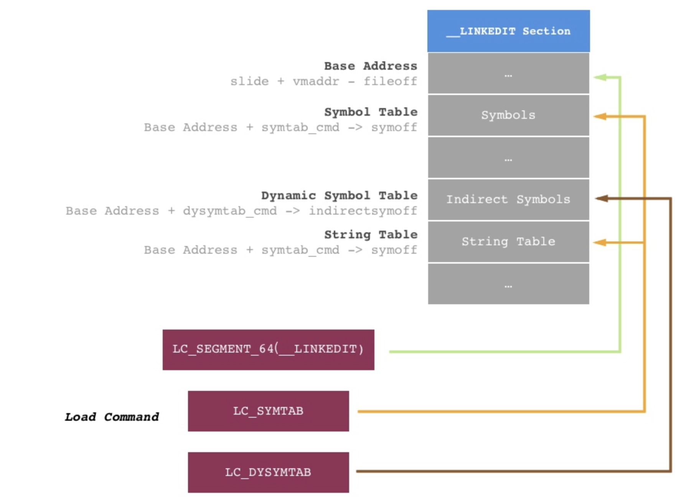
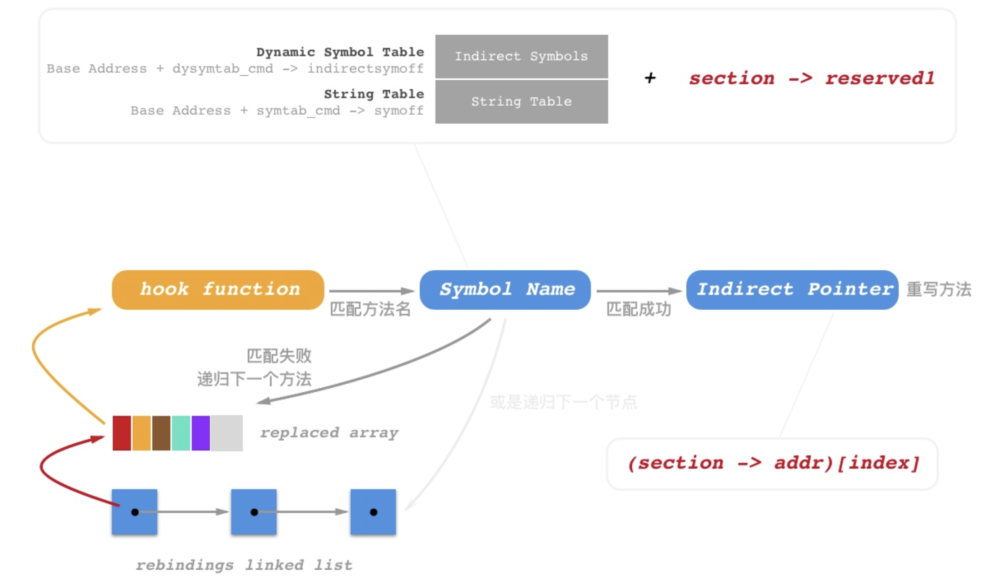

最近在学习MachO文件相关的资料时，发现很多资料里都提及到了fishhook，这篇文章就膜拜记录一哈

### ASLR

随机内存布局（ASLR）是操作系统为防止缓冲区溢出攻击而存在的内存保护机制。该机制通过在程序载入内存时，将地址进行随机偏移来实现,增加攻击者预测目的地址的难度，防止攻击者直接定位攻击代码位置，达到阻止溢出攻击的目的。

所以，Mach-O 文件每次加载进内存的时候地址都是不一样的，这个偏移量是每次程序启动时给出的随机值，可以通过 `_dyld_get_image_vmaddr_slide` 函数获得

> 各种表在 Mach-O 文件中，是位于 Section 数据之后的一些记录数据

#### 懒加载和非懒加载

懒加载（lazy load），又叫做延迟加载。在实际需要使用该符号（或资源）的时候，该符号才会通过 dyld 中的 `dyld_stub_binder` 来进行加载。与之相对的是非懒加载（non-lazy load），这些符号在动态链接库绑定的时候，就会被加载

#### MachO中的Lazy和非Lazy指针表存在哪里

在MachO文件中 `__DATA.__la_symbol_ptr` 和 `__DATA.__nl_symbol_ptr` 这两个Section分别存储了**lazy binding指针表**和**non lazy binding指针表**，表中保存着与字符串表对应的***函数指针***

Mach-O 文件中通过 dyld 加载的 Lazy Binding 表在加载过程中并没有直接确定地址列表，而是在第一次调用该函数的时候，通过 **PLT(Procedure Linkage Table)** 进行了一次 Lazy Binding确定了调用的函数地址，之后再调用的时候读取到的就是函数的地址了。

具体说来：**通过  `__TEXT.__stub_helper` 调用dyld中的 `dyld_stub_binder` 方法计算对应的函数地址进行绑定，绑定到 `__DATA.__la_symbol_ptr` 内对应的地址上面，之后调用对应的函数**

#### 什么是DST

Dynamic Symbol Table(Indirect Symbols): 动态符号表是加载动态库时导出的函数表，是符号表的 subset。动态符号表的符号 = 该符号在**原所属表指针**中的偏移量（offset）+ **原所属表**在**动态符号表**中的偏移量 + 动态符号表的**基地址**（base）。在动态表中查找到的这个符号的值又等于该符号在 symtab 中的 offset。 *Lazy symbol reference* 是指在方法在第一次调用的时候，会根据 dyld 过程时加载的映射地址进行处理，完成绑定操作

#### nm -n(`-n` 参数是根据已知地址进行排序) 查看文件符号信息知识点

- 小写代表作用域为 *Local*，大写代表符号是 *Global(external)* 的。
- `A` - 符号值是绝对的，在链接过程中不允许对其改变，这个符号常常出现在**中断向量表**中。
- `B` - 符号值出现在内存 *BSS* 段。例如在某一个文件中定义全局的 *static* 方法 `static void test`，则符号 *test* 的类型为 `b`，切存储于 *BSS* 中。其值为该符号在 *BSS* 中的偏移。一般来说，*BSS* 分配在 RAM 中。
- `C` - 称为**Common Symbol** **一般符号**，是为初始化的数据段。该符号不包含于普通的 Section 中。只有在链接过程才会进行分配。符号的值为所需要的字节数。
- `D` - 称之为 **Data Symbol**。位于初始化数据段中。一般分配到 *Data Section* 中。例如全局的 `int table[5] = {233, 123, 321, 132, 231};`，会分配到初始化数据段中。
- `T` - 该符号位于代码区 *TS* 中。
- `U` - 说明**当前文件中该符号是未定义的，该符号的定义在别的文件中**

#### 什么是PIC

### PIC原理

为了解决dylib的代码段能被共享，PIC（地址无关代码）技术就产生了。PIC原理很简单，就是把指令中那些需要被修改的部分分离出来，跟数据部分放在一起，这样指令部分就可以保持不变，而数据部分是每个进程都有一个副本。

dylib需要被修改的部分（对地址的引用），按照是否跨模块分为两类，引用方式又可以分两类：函数调用和数据访问。这样就分成了4类：

1. 第一种是模块内部的函数调用、跳转等。
2. 第二种是模块内部的数据访问，比如模块中定义的全局变量、静态变量。
3. 第三种是模块外部的函数调用、跳转等。（比如动态库a调用动态库b中的函数）
4. 第四种是模块外部的数据访问，比如访问其它模块中定义的全局变量

当你的应用程序想要调用 Mach-O 文件外部的函数的时候，或者说如果 Mach-O 内部需要调用系统的库函数时，Mach-O 文件会：

1. 先在 Mach-O 文件的 _DATA 段中建立一个指针（8字节的数据，放的全是0），这个指针变量指向外部函数。
2. DYLD 会动态的进行绑定！将 Mach-O 中的 _DATA 段中的指针，指向外部函数

#### GOT

mach-o文件的数据段有一个got section（got：Global Offset Table 全局偏移表），当代码需要引用该全局变量时，可以通过got中相对应的项间接引用

#### fishhook 调用注意点

在进行 hook 的代码逻辑中，在声明一个 `strlen_rebinding` 实例之后，需要手动调用方法 `rebind_symbols` ，其中需要传入一个 `rebinding` 数组的头地址，以及其 *size*

#### String Table

在程序中，字符串的长度是不固定的，所以会将其放在 string table 中，然后存储它在 string table 中的偏移。如果其他部分想要引用某个字符串，那么他首先需要找到 string table 的起始地址，然后根据偏移量找到相应字符串的起始位置并向后读取字符，直到遇见 `\0`才会停止读取过程，最后返回读到的字符串。

这也是 `LC_SYMTAB`额外记录 string table 地址的原因，string table 通常用于是放置 Section 名、变量名、符号名的字符串表，字符串末尾自带的 \0 为分隔符（机器码00）。知道 strtab 的基地址（base），然后加上在 Symbol Table 中找到的该字符串的偏移量（offset）就可以找到这个字符串。**符号名字符串的地址 = strtab的基地址base + 符号表中该符号名的偏移量offset**

#### **Symbol Table**

Symbol Table: 即符号表。每个目标文件都有自己的符号表，记录了符号的映射。符号表的结构是一个连续的列表，其中的每一项都是一个 struct nlist。符号表里的内容就是描述某个符号的名称、类型、地址、索引、连接方式等信息。通过符号表可以找到特定符号在指针表中的索引

#### Linkedtit Base Addr

是**Linkedit Segment 在文件中的首地址**，计算方式为slider + 内存地址vmaddr - 文件偏移fileoff

在 *Load Command* 中，`LC_SYMTAB` 和 `LC_DYSYMTAB `中所记录的 Offset 都是基于 **__LINKEDIT** 段的。 `LC_SYMTAB` 中通过偏移量可以拿到**symtab 符号表首地址**、**strtab 符号名称字符表首地址**以及**indirect_symtab 跳转表首地址**

#### 二次遍历 Load Command 的目的

第一次遍历的遍历目的有三个，为了找出 `LC_SEGMENT(__LINKEDIT)`、`LC_SYMTAB` 和 `LC_DYSYMTAB` 三个 **Load Command**，从而我们可以计算出 *Base Address*、*Symbol Table*、*Dynamic Symbol* 和 *String Table* 的位置。

而在第二次遍历中，我们需要获取的是 `LC_SEGMENT(__DATA)` 中 `__nl_symbol_ptr` 和 `__la_symbol_ptr` 这两个 *Section*。其目的是为了确定 **lazy binding指针表** 和 **non lazy binding指针表** 在 *Dynamic Symbol* 中对应的位置，方法就是获取到 *reserved1* 字段

> 官方原理解释即：dyld通过更新Mach-O中的__DATA段的特定section中的指针，来绑定懒绑定和非懒绑定的符号。fishhook为传入rebind_symbols函数的每个符号名进行判断，决定其更新后的函数实现体的地址，并完成对应的函数替换，以此来重新绑定这些符号。
>
> 对于给定的image，**DATA段通常包含两个跟动态符号绑定相关的section：**nl_symbol_ptr和**la_symbol_ptr，分别是non-lazy binding和lazy binding。**nl_symbol_ptr是一个指针数组，存储的是非懒绑定的bound data（约束数据）（当一个库被加载的时候的bound），**la_symbol_ptr也是一个指针数组，存储的是一个叫做dyld_stub_binder的routine在首次调用那个符号（也可能是dyld在launch的时候绑定的）的时候导入的函数。为了在这些section中的特定位置找到那个符号的名称，我们必须经历几个中间层。对于这两个相关的section，section headers（在定义）中提供了一个偏移量offset（即reserved1字段），这些offset存在于间接符号表（indirect symbol table）中。间接符号表也存储于Mach-O二进制文件的**LINKEDIT段中，只是一个数组而已，里边存储的是对应于符号表中（也在**LINKEDIT段）的索引，这些索引的顺序与指针在非懒绑定和懒绑定符号section的顺序保持一致。因此，对于nl_symbol_ptr section，其section的起始地址在符号表中的索引，即为indirect_symbol_table[nl_symbol_ptr->reserved1]。符号表本身是一个存储nlist结构体（见中）的数组，并且每一个nlist都包含了一个在**LINKEDIT段的字符串表中的索引，这个字符串表实际上存储的是真实的符号名。因此，对于每一个**nl_symbol_ptr和**la_symbol_ptr指针，我们能够得到其对应的符号及字符串，跟给定的符号名进行比较，如果匹配上了，我们就将section中的指针替换掉。
>
> > **nl_symbol_ptr和**la_symbol_ptr都是由Indirect Pointer组成的指针数组。其中的元素决定了我们调用的方法应该以哪个代码段的方法来执行。通过Indirect Pointer，取出符号名，当与rebinds传入的函数名匹配则重写该Indirect Pointer指向的地址，即完成了函数的rebind操作

附上一张官方的图

#### 参考资料

[巧用符号表 - 探求 fishhook 原理（一）](https://www.desgard.com/fishhook-1/)

[巧用符号表 - 探求 fishhook 原理（二）](https://www.desgard.com/fishhook-2/)

[动态修改 C 语言函数的实现](https://draveness.me/fishhook/)

[fishhook 源码学习](https://rimson.top/2019/06/03/fishhook/)

[Hook 原理之 fishhook 源码解析]([https://amywushu.github.io/2017/02/27/%E6%BA%90%E7%A0%81%E5%AD%A6%E4%B9%A0-Hook-%E5%8E%9F%E7%90%86%E4%B9%8B-fishhook-%E6%BA%90%E7%A0%81%E8%A7%A3%E6%9E%90.html](https://amywushu.github.io/2017/02/27/源码学习-Hook-原理之-fishhook-源码解析.html))

[Fishhook————一种Hook动态库C函数的工具](https://zhuanlan.zhihu.com/p/89794872)

[fishhook源码分析](https://blog.csdn.net/ZCMUCZX/article/details/80289590)

[[源码阅读] Mach-O 与 fishhook](https://www.todayios.com/fishhook-analysis/)

[分析 fishhook](https://zhangbuhuai.com/post/fishhook.html)

[Mach-O应用 fishhook动态修改C函数](https://developerdoc.com/essay/LLDB/Mach-O_fishhook/)

[fishhook探究](https://www.coderzhou.com/2019/06/05/fishhook/)

[趣探 Mach-O：FishHook 解析](https://www.open-open.com/lib/view/open1487057519754.html)

[Mach-O应用 fishhook动态修改C函数](https://developerdoc.com/essay/LLDB/Mach-O_fishhook/)

[dylib动态库加载过程分析](https://feicong.github.io/2017/01/14/dylib/)

[聊一聊iOS中的hook方案]([http://icetime.cc/2020/02/08/2020-02/%E8%81%8A%E4%B8%80%E8%81%8AiOS%E4%B8%AD%E7%9A%84hook%E6%96%B9%E6%A1%88/](http://icetime.cc/2020/02/08/2020-02/聊一聊iOS中的hook方案/))

[iOS程序员的自我修养-fishhook原理-五](https://wukaikai.tech/2019/08/12/iOS程序员的自我修养-fishhook原理（五）/)

[iOS程序员的自我修养-MachO文件动态链接-四]([https://wukaikai.tech/2019/08/12/iOS%E7%A8%8B%E5%BA%8F%E5%91%98%E7%9A%84%E8%87%AA%E6%88%91%E4%BF%AE%E5%85%BB-MachO%E6%96%87%E4%BB%B6%E5%8A%A8%E6%80%81%E9%93%BE%E6%8E%A5%EF%BC%88%E5%9B%9B%EF%BC%89/](https://wukaikai.tech/2019/08/12/iOS程序员的自我修养-MachO文件动态链接（四）/))

