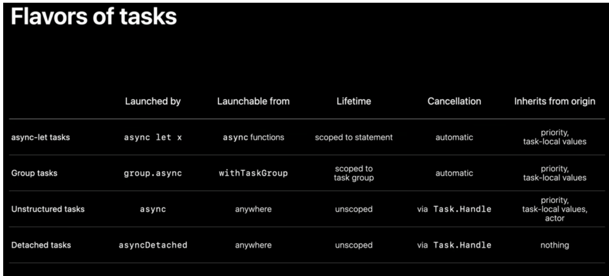

#### `将`Swift代码添加为自定义LLDB命令

文章：https://juejin.cn/post/6977212326424346661

使用以下结构

`command alias [command_name] expr -l Swift -O -- [swift_code]`

将它添加到`.lldbinit文件`中

#### 探索Swift结构化并发

https://xiaozhuanlan.com/topic/3625784190

结构化并发基于结构化编程，以任务的形式执行，每个任务都代表一个程序执行的上下文

##### 常见的几种不同风格的任务

###### async-let

普通let绑定过程：运行等号右边的初始化表达式和绑定左边的变量名

并发绑定过程：Swift首先创建一个新的子任务，此时程序控制流出现两个分支

1. 用于子任务，立即开始下载数据
2. 用于父任务，立即将result变量名绑定到一个展位符，然后执行后面的语句

###### 任务树

任务树有每个父任务和子任务之间的链接组成。父任务只有在所有子任务都已经完成后才结束工作

swift并发是协作式并发，而不是抢断式并发。

###### 组任务

使用withThrowingTaskGroup创建任务组，添加到组中的任务不能脱离它的闭包范围。创建的子任务会立即开始并行执行

每创建一个新任务，该任务执行的工作在称为@Sendable闭包中执行。`@Sendable`闭包是禁止捕获可变变量

#### 未曾设想的苹果文档

https://xiaozhuanlan.com/topic/0483621759

DocC 通过编译源码中的**文档注释**和 DocC 专属的**文档文件**生成文档的文本内容

使用 `markup`格式编写，默认情况下，DocC 会通过列出公共接口，并按类型进行分组来形成**主页**，作为文档的入口。所有 DocC 文件必须在**与项目同名**的 **documentation catalog** 中才有效

DocC 中的文档一共分为三类：

1. 在官方文档中被普遍使用，用于具体介绍接口的**参考文档**（Reference）。
2. 形式更加灵活自由，用于介绍框架背后构造（如不同组件之间的联系）的**文章**（Articles）。
3. 通过交互式的逐步指导，帮助用户完成最佳实践的**教程**（Tutorials）
   1. 一个**教程目录**（`@Tutorials`）包含一个介绍（`@Intro`）和多个**篇目**（`@Chapter`），一个篇目又可以包含多个**教程页**的引用（`@TutorialReference`）
   2. 一个**教程页**（`@Tutorial`）包含一个介绍（`@Intro`）和多个**章节**（`@Section`），一个章节只能包含一个**步骤集**（`@Steps`），步骤集之下的**步骤**（`@Step`）是最小的结构

文档可以导出，也可以使用 `xcodebuild docbuild -scheme SlothCreator -derivedDataPath ~/Desktop/SlothCreatorBuild`导出

#### Swift 并发编程：原理探究

https://xiaozhuanlan.com/topic/7604819352

没有上下文切换损耗，Continuation 之间的切换仅需一次函数调用的成本

同步函数的调用方式：

- 每个线程中都有其各自的函数栈
- 当在某个线程调用一个函数时，会将此函数帧压入栈中，函数帧保存着函数的必要信息和局部变量等
- 当函数调用完成并返回时，此函数帧会从栈中弹出

异步函数调用方式：

- 异步函数在调用时，会同时在栈和堆中各增加一个函数帧，栈中保存只在函数内部使用的局部变量等内容，而一些异步相关的内容，例如`await` 标记的地方（称为**挂起点 \*suspension point\***），则保存在堆中

Task 可以包含一系列的异步操作，Task group 可以包含一系列的 Task

在一个 Task 中，我们会包含两个部分：**挂起点（Suspension point）**和**延续点（Continuation）**，这两部分的标识是 `await` 关键字，`await` 所标记的位置，会被 Swift 编译器判定为一个潜在的挂起点，而 `await` 后面的部分，必定会在挂起点执行完毕后才行（由运行时决定），因此这部分会被称为延续点

加入了 `await` 的异步函数，并不能保证与调用它的函数在同一线程执行，同样，在 `await` 返回后的代码也无法保证在同一线程执行，因此我们需要在任何加入了 `await` 的地方避免以下行为：

- 在 `await` 前加锁
- 在 `await` 前后访问线程私有数据

Actor 也是基本类型，并且为引用类型。Actors 最重要的一个特性是，任何 Actors 类型中的可变状态，在同一时间只运行一个任务（Swift 结构化并发模型中的 Task 概念）访问，也就是说 Actors 本身不允许并发访问

`在访问 Actors 的可变状态时，我们需要增加 await 关键字，因为任何访问 Actors 中可变状态的操作，都有可能形成一个挂起点（suspension point）。`

#### 在 SwiftUI 中遇见并发编程

https://xiaozhuanlan.com/topic/2957164803

用于异步刷新的API。task，refreshable，AsyncImage

#### 初探GroupActivities

https://xiaozhuanlan.com/topic/0593748621

#### Swift中的ARC机制

https://xiaozhuanlan.com/topic/1569740283

withExtendedLifetime，

