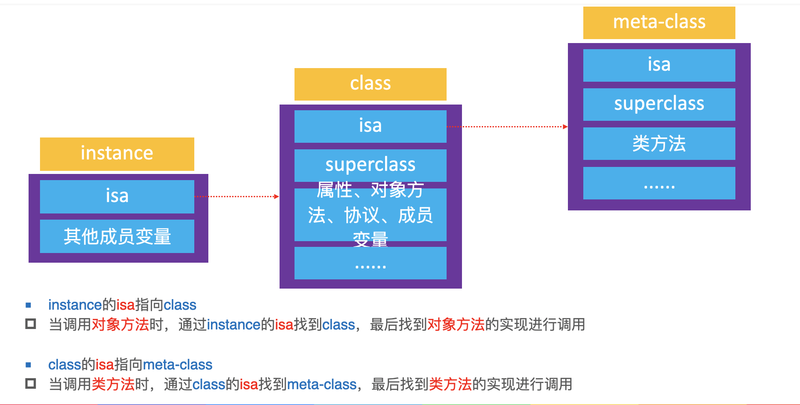
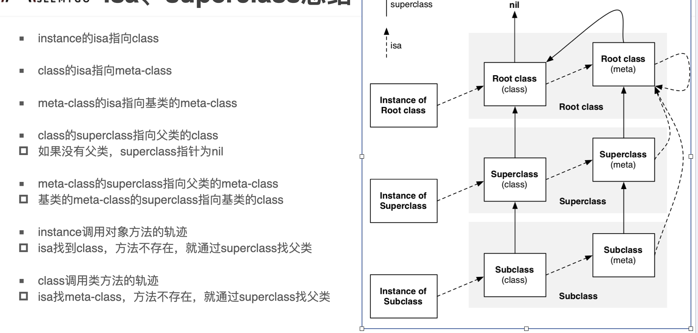

# Objective-C的本质

- 我们平时编写的Objective-C代码，底层实现其实都是C\C++代码
- 将Objective-C代码转换为C\C++代码
  - `xcrun -sdk iphoneos clang -arch arm64 -rewrite-objc OC源文件 -o 输出的CPP文件`
  - 如果需要链接其他框架，使用-framework参数。比如-framework UIKit

# 2个容易混淆的函数

- 创建一个实例对象，至少需要多少内存？
  - \#import <objc/runtime.h>
  - **class_getInstanceSize**([NSObject class]);
- 创建一个实例对象，实际上分配了多少内存？
  - \#import <malloc/malloc.h>
  - **malloc_size**((__bridge const void *)obj);

# 常用LLDB指令

- print、p：打印
- po：打印对象
- 读取内存
  - `memory read/数量格式字节数` 内存地址
  - `x/数量格式字节数` 内存地址
  - x/3xw 0x10010
  - 格式
    - x是16进制，f是浮点，d是10进制
    - 字节大小
    - b：byte 1字节，h：half word 2字节
    - w：word 4字节，g：giant word 8字节
- 修改内存中的值
  - memory write 内存地址 数值
  - memory write 0x0000010 10

# OC对象的分类

- Objective-C中的对象，简称OC对象，主要可以分为3种

- instance对象（实例对象）
  - instance对象就是通过类alloc出来的对象，每次调用alloc都会产生新的instance对象
  - instance对象在内存中存储的信息包括
    - isa指针
    - 其他成员变量
- class对象（类对象）
  - 每个类在内存中有且只有一个class对象，分类的方法、协议等都会挂到class对象里面
  - class对象在内存中存储的信息主要包括
    - isa指针
    - superclass指针
    - 类的属性信息（@property）、类的对象方法信息（instance method）
    - 类的协议信息（protocol）、类的成员变量信息（ivar）
- meta-class对象（元类对象） 
  - 每个类在内存中有且只有一个meta-class对象
  - meta-class对象和class对象的内存结构是一样的，但是用途不一样，在内存中存储的信息主要包括
    - isa指针
    - superclass指针
    - 类的类方法信息（class method）

以下代码获取的objectClass是class对象，并不是meta-class对象

`Class objectClass = [[NSObject class] class]`

# 查看Class是否为meta-class

`#import <objc/runtime.h>`

`BOOL result = class_isMetaClass([NSObject class]);`

# isa

class、meta-class对象的本质结构都是struct objc_class

