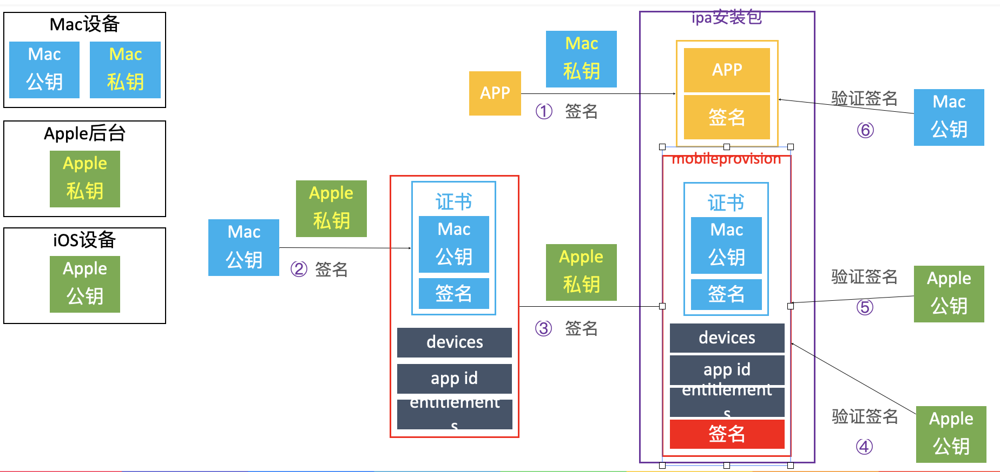
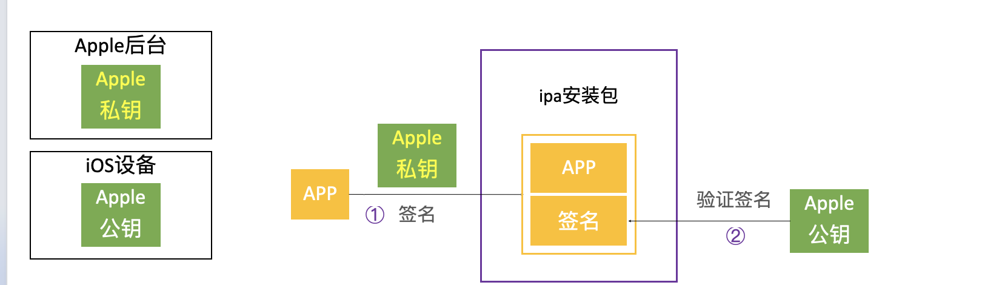

[TOC]


# 准备工作

## 手机越狱

iOS 逆向需要一台越狱设备，当前流行的越狱工具有：

https://pangu8.com/ios-14-6-jailbreak/

`unc0ver`：https://www.unc0ver.dev/ 配合AltStore安装

`checkra1n`：https://checkra.in/ 直接安装

`Taurine`：https://taurine.app/

## 安装插件和应用

### iOS端：

`Cydia Substrate`：俗称基板，手机越狱后默认就有安装，不同越狱软件搭载的基板也可能不一样。允许第三方开发者在越狱系统的方法中打一些补丁或扩展方法。

`Apple File Conduit “2”`：让 iOS 设备支持访问所有系统文件，不装这个iFunBox、爱思助手访问不了系统文件。源地址：https://ichitaso.tk/apt/

`Filza`：访问 iOS 设备文件系统的 APP。

`AppSync Unified`：让设备可以安装任意 APP，不再验证签名，现在推荐使用App Manager

`OpenSSH`：让 Mac 可以通过 `ssh` 连接 iOS 设备。

`Vi IMproved`：vim 命令行工具。

`adv-cmds`：一些终端命令行工具，比如 `ps` 查看系统运行中的进程命令。

`Cycript`：在 iOS 设备上调试运行中的 APP 的脚本语言。

`Reveal Loader`：UI 调试神器，要配合 Mac 版的 Reveal。

`Liberty Lite`：屏蔽越狱检测插件，有些 APP 会检测设备是否越狱，然后做一些针对性限制。

### Mac端：

`iFunBox`：电脑端访问 iOS 设备文件系统。https://www.i-funbox.com/en_download.html

`爱思助手`：iOS 手机助手，功能强大。https://www.i4.cn/

# 使用SSH链接iOS设备

## iOS系统常用账户

iOS系统有2个常用账户：`root`、`mobile`，默认密码都是 `alpine` 。

**root**：最高权限账户，可以操作所有文件，`$HOME` 是 `/var/root` 。
**mobile**：普通权限账户，只能操作一些普通文件，不能操作系统级别的文件，`$HOME` 是`/var/mobile`。

## OpenSSH简单教程

前提：在 Cydia 里安装好 `OpenSSH` 插件，并让 iPhone 和 Mac 处在同一路由器下。

使用 Mac 的终端登录 iPhone：

```css
ssh 账户@iPhone当前连接的WiFi的IP地址
```

例如，我的 IP 是192.168.51.86，我登录 root 账户：

```
ssh root@192.168.51.86
```

输入默认密码：

```
alpine
```

退出登录命令：

```
exit
```

## iOS终端的中文乱码

新建 `~/.inputrc` 文件，文件内容问：

```
set convert-meta off
set output-meta on
set meta-flag on
set input-meta on
```

然后将电脑里的 `/usr/share/locale/en_US.UTF-8` 拷贝到手机的相同路径下。

在 `~/.profile` 文件中添加 `export LC_ALL='en_US.UTF-8'` 。

重新使用 SSH 登录 iPhone。

## 修改账户默认密码

登录 root 账户，然后输入 `passwd` 命令，再输入2次密码，则可修改 root 账户的默认密码。

输入 `passwd mobile` 命令，再输入2次密码，则修改 mobile 账户的默认密码。

## SSL、OpenSSL

**SSL**：Secure Sockets Layer 的缩写，是为网络通信提供安全及数据完整性的一种安全协议，在传输层对网络连接进行加密。

**OpenSSL**：SSL的开源实现，绝大部分 HTTPS 请求等价于：**HTTPS + OpenSSL**，OpenSSH 的加密就是通过 OpenSSL 完成的。

## SSH的通信过程

先了解一下客户端和服务器端的一些密钥和配置文件的位置：

| **客户端（Mac）**   | 路径                      | 描述                  |
| ------------------- | ------------------------- | --------------------- |
| ~/.ssh/known_hosts  | 保存服务器端公钥信息      | 链接过的服务端信息    |
| ~/.ssh/id_rsa.pub   | 公钥                      | 密钥认证过程中使用    |
| ~/.ssh/id_rsa       | 私钥                      |                       |
| /etc/ssh/ssh_config | 作为客户端时的ssh配置文件 | 包含ssh的一些配置信息 |

**服务器端（iPhone）**

| 路径                          | 描述                      |
| ----------------------------- | ------------------------- |
| /etc/ssh/ssh_host_rsa_key.pub | 公钥                      |
| /etc/ssh/ssh_host_rsa_key     | 私钥                      |
| /etc/ssh/sshd_config          | 作为服务端时的ssh配置文件 |
| ~/.ssh/authorized_keys        | 密钥认证的授权文件        |

### 建立安全连接

**客户端（Mac）** 与 **服务器端（iPhone）** 在建立安全连接过程中，服务器端会提供自己的身份证明，也就是会将服务器端公钥（`/etc/ssh/ssh_host_rsa_key.pub`）等信息发送给客户端（`~/.ssh/known_hosts`）。

第一次建立连接，也就是客户端并无服务器端的公钥信息，就会询问是否连接此服务器，同意连接则会将服务器端的公钥等信息写入客户端，下次建立连接就不会再次询问。

如果服务器端的公钥信息发生改变，则应该删除客户端保存的公钥信息（在 `~/.ssh/known_hosts` 中找到服务器ip，删除对应行即可。也可以用命令：`ssh-keygen -R 服务器主机地址`），重新建立连接。

### 客户端认证

**基于密码的客户端认证**：使用账号和密码即可认证，每次连接都需要输入密码，并且此认证方式并不安全。

**基于密钥的客户端认证**：免密码认证，最安全的一种认证方式。SSH-2默认会优先尝试密钥认证，如果认证失败，才会尝试密码认证。

#### 配置密钥认证

在客户端使用命令，创建**公钥**（`~/.ssh/id_rsa.pub`）和**私钥**（`~/.ssh/id_rsa`），如果已经存在，则会提示是否覆盖。

```
ssh-keygen
```

在客户端使用命令，将客户端的公钥内容追加到服务器端的**授权文件**（`~/.ssh/authorized_keys`）尾部，过程中会让输入一次账户密码。

```
ssh-copy-id 账户@服务器主机地址
```

我们再次登录服务器端，回车后直接成功登录，无须输入账户密码。注意追加授权文件时使用的账户和再次登录服务器端使用的账户需要是同一个，如果需要使用多个账户则分别添加。

除了使用 `ssh-copy-id` 命令，还可以直接远程拷贝文件的方式来实现，使用 `scp` 命令，将客户端的公钥拷贝拷贝到服务器某路径。scp 是 secure copy 的缩写，是基于 SSH 登录进行安全的远程文件拷贝命令，把一个文件copy到远程另外一台主机上。

从电脑拷贝文件到手机上：

```
scp ~/.ssh/id_rsa.pub 账户@服务器主机地址:~/.ssh
```

从手机拷贝文件到电脑上：

```
scp 账户@服务器主机地址:~/.ssh ~/.ssh/id_rsa.pub
```

其实也就是前面的路径拷贝到后面的路径。

将 `id_rsa.pub` 的内容追加到 `authorized_keys` 文件中：

```
cat id_rsa.pub >> authorized_keys
```

### 安全传输

至此，就可以开始进行安全传输了。

## 通过USB进行SSH登录

默认情况下，由于 SSH 走的是 TCP 协议，Mac是通过网络连接的方式 SSH 登录到 iPhone ，要求 iPhone 和 Mac 处于同一路由器下。

为了加快传输速度，也可以通过 USB 连接的方式进行 SSH 登录，Mac 上有个服务程序 `usbmuxd`（它会开机自启动），可以将 Mac 的数据通过 USB 传输到 iPhone。

所在路径：`/System/Library/PrivateFrameworks/MobileDevice.framework/Resources/usbmuxd`

下载 usbmuxd 工具包 v1.0.8 版本，获得 `tcprelay.py` 和 `usbmux.py` 脚本文件。下载地址：https://cgit.sukimashita.com/usbmuxd.git/

将远程22端口和本地2222端口做一个端口映射，多个映射以空格隔开：

```
sudo python2.7 ~/DevEnv/usbmuxd/tcprelay.py -t 22:2222
```

将 iPhone 通过 USB 与 Mac 连接，然后新开一个窗口，登录本地的2222端口：

```
ssh root@127.0.0.1 -p 2222
```

从电脑拷贝文件到手机上：

```
scp -P 2222 ~/.ssh/id_rsa.pub root@localhost:~/.ssh
```

从手机拷贝文件到电脑上：

```
scp -P 2222 root@localhost:~/.ssh ~/.ssh/id_rsa.pub
```

# Cycript

Cycript 是 Objective-C++、ES6（JavaScript）、Java 等语法的混合物，也就是语法格式支持这些语言。可以用来探索、修改、调试正在运行的 iOS/Mac APP。

官网：http://www.cycript.org/
文档：http://www.cycript.org/manual/

在使用 Cycript 之前，需要通过 Cydia 安装 Cycript，然后 Mac 通过 SSH 登录 iPhone。

**提示**：在编写 Cycript 过程中，按 tab 键会有语法填充和提示。

## 开启Cycript

开启 Cycript，通过 SSH 登录 iPhone 后，可以直接使用下面命令：

```
cycript
```

开启成功，终端则会显示：

```
cy#
```

常用快捷键（推荐使用 iTerm 终端，默认终端快捷键会冲突）：

```
Control + D  #关闭Cycript
Command + R  #清屏
Control + C  #取消输入
```

使用 Cycript 调试程序：

```
cycript -p 进程ID
或
cycript -p 进程名称
```

`ps` 命令是 process status 的缩写，使用 ps 命令可以列出系统当前的进程（需要在 Cydia 安装 `adv-cmds` 插件）。

列出所有进程：

```
ps -A
```

列出结果，下面这个进程是喜马拉雅 APP：

```
15462 ?? 3:30.87 /var/containers/Bundle/Application/2991BBBF-1444-4A60-89FE-4991586C20BF/ting.app/ting
```

搜索关键词：

```
ps -A | grep 关键词
```

所以如果我们要调试喜马拉雅 APP，则通过 SSH 登录 iPhone 后，使用下面命令（进程ID可能会变，建议使用进程名称）：

```
cycript -p ting
```

## 常用语法

开启 `expand` 功能，Cycript 会把格式符号翻译成相应的格式，如 `\n` 会被翻译成一个换行，让输出的可读性更高：

```
cy# ?expand
expand == true
```

获取 `UIApplication` 对象：

```
cy# [UIApplication sharedApplication]
#"<XMUIApplication: 0x117e0f9e0>"

cy# UIApp
#"<XMUIApplication: 0x117e0f9e0>"
```

使用 `var 变量名 = 值` 来定义变量，定义的变量在 APP 进程结束前一直有效：

```
cy# var keyWindow = UIApp.keyWindow
#"<UIWindow: 0x118a145b0; frame = (0 0; 375 812); autoresize = W+H; gestureRecognizers = <NSArray: 0x2824d6220>; layer = <UIWindowLayer: 0x282ac0600>>"

cy# keyWindow
#"<UIWindow: 0x118a145b0; frame = (0 0; 375 812); autoresize = W+H; gestureRecognizers = <NSArray: 0x2824d6220>; layer = <UIWindowLayer: 0x282ac0600>>"
```

使用 `#内存地址` 来获取对象：

```
cy# UIApp.keyWindow 
#"<UIWindow: 0x10931dbd0; frame = (0 0; 375 812); autoresize = W+H; gestureRecognizers = <NSArray: 0x2814c5c50>; layer = <UIWindowLayer: 0x281ace6a0>>"

cy# #0x10931dbd0
#"<UIWindow: 0x10931dbd0; frame = (0 0; 375 812); autoresize = W+H; gestureRecognizers = <NSArray: 0x2814c5c50>; layer = <UIWindowLayer: 0x281ace6a0>>"
```

`ObjectiveC.classes` 打印出所有已加载的 OC 类：

```
cy# ObjectiveC.classes
{NSLeafProxy:NSLeafProxy,JSExport:JSExport,PFEmbeddedMulticasterImplementation:PFEmbeddedMulticasterImplementation,PFMulticasterDistributionMethods:PFMulticasterDistributionMethods,__NSGenericDeallocHandler:__NSGenericDeallocHandler,__NSAtom:__NSAtom,_NSZombie_:_NSZombie_,__NSMessageBuilder:__NSMessageBuilder,Object:Object,NSProxy:NSProxy,EXTNil:EXTNil,_YYWebImageWeakProxy:_YYWebImageWeakProxy,YYTextWeakProxy:YYTextWeakProxy,_YYImageWeakProxy:_YYImageWeakProxy,WVExtContext:WVExtContext,WVWeakObjectWrapper:WVWeakObjectWrapper,WVExtHandler:WVExtHandler,SDWeakProxy:SDWeakProxy,PHFDelegateChain:PHFDelegateChain,_NMLWebImageWeakProxy:_NMLWebImageWeakProxy,_NMCADisplayLinkWeakProxy:_NMCADisplayLinkWeakProxy,NELayoutComponentDelegateProxy:NELayoutComponentDelegateProxy,MCDelegateIntercept:MCDelegateIntercept,
```

使用 `*对象` 语法，来获取对象的所有成员变量，打印出来的键值对是成员变量名和成员变量值：

```
cy# *UIApp
{isa:NSKVONotifying_XMUIApplication,_responderFlags:@error,_delegate:#"<XMAppDelegate: 0x282bf9540>",_remoteControlEventObservers:1,_topLevelNibObjects:null,_networkResourcesCurrentlyLoadingCount:0,_hideNetworkActivityIndicatorTimer:null,_editAlertController:null,_statusBar:null,_statusBarRequestedStyle:0,...
```

使用 `recursiveDescription()` 函数，递归打印 view 所有子控件（跟 LLDB 一样的函数）：

```
cy# UIApp.keyWindow.recursiveDescription().toString()
`<UIWindow: 0x10931dbd0; frame = (0 0; 375 812); autoresize = W+H; gestureRecognizers = <NSArray: 0x2814c5c50>; layer = <UIWindowLayer: 0x281ace6a0>>
   | <UITransitionView: 0x109362430; frame = (0 0; 375 812); autoresize = W+H; layer = <CALayer: 0x281c7b180>>
   |    | <UIDropShadowView: 0x1093bad40; frame = (0 0; 375 812); autoresize = W+H; layer = <CALayer: 0x281c7b2e0>>
   |    |    | <UILayoutContainerView: 0x10974a430; frame = (0 0; 375 812); autoresize = W+H; layer = <CALayer: 0x281b18980>>
   |    |    |    | <UIView: 0x10935ec80; frame = (0 0; 375 812); layer = <CALayer: 0x281a2fca0>>
   |    |    |    | <UITransitionView: 0x109364100; frame = (0 0; 375 812); clipsToBounds = YES; autoresize = W+H; layer = <CALayer: 0x281a2e240>>
   |    |    |    |    | <UIViewControllerWrapperView: 0x1093bbc40; frame = (0 0; 375 812); autoresize = W+H; layer = <CALayer: 0x281c79ca0>>
```

使用 `choose()` 函数筛选出某种类型的对象：

```
cy# choose(UIViewController)
[#"<UIViewController: 0x109380ee0>",#"<UIViewController: 0x1093b25c0>",#"<XMPageViewController: 0x109792ee0>",#"<XMMainTabBarController: 0x10a814000>",#"<XMFindTopViewController: 0x10a846a00>",#"<XMSegmentTabViewController: 0x10a848a00>",#"<XMNavigationController: 0x10a849a00>",#"<XMFindFlowViewController: 0x10a91c400>",#"<XMNavigationController: 0x10a93f600>",#"<XMSoundCustomViewController: 0x10a98d000>",#"<UINavigationController: 0x1098a0e00>",#"<XMNewDiscoveryViewController: 0x109961000>",#"<XMNavigationController: 0x109961600>",#"<XMPersonalCenterViewController: 0x109963200>",#"<XMNavigationController: 0x109963a00>"]
```

## 工具库使用

类似 iOS 开发里的各种工具类，我们也可以把自己写的一些 Cycript 代码封装起来，方便快速开发。

MJ 大神封装的工具库：https://github.com/CoderMJLee/mjcript 。

从 GitHub 下载后，将 `mjcript.cy` 文件拷贝到 `/usr/lib/cycript0.9` 目录下，可以重命名为 `MJTool.cy` 。

每次都需要 `@import` 导入才能使用：

```
cy# @import MJTool
{}

cy# MJAppId
@"com.xr.chuangyin"

cy# MJAppPath
@"/private/var/containers/Bundle/Application/6241E28B-FE27-4F31-8633-9FDEF5D3C30A/Dagou.app"

cy# MJFrontVc()
#"<JFLoginVC: 0x10bb46300>"

cy# MJInstanceMethodNames(JFLoginVC)
[&"toWebViewUrl:",&"requestTicketInfo:qqInfo:wxInfo:",&"handleAppleLoginReuslt:",&"loginAppleHandleAppleId:identityToken:authorizationCode:",&"onClickPhoneLogin:",&"onClickIdLogin:",&"onClickOneKeyLogin:",&"onClickAppleLogin:",&"loginWithWxInfo:qqInfo:type:",&"appleLoginBtn",&"setAppleLoginBtn:",&"thirdPartView",&"setThirdPartView:",&"viewDidLoad",&"setupUI",&"dealloc",&".cxx_destruct",&"viewWillAppear:"]

cy# MJInstanceMethodNames(#0x10bb46300)
[&"toWebViewUrl:",&"requestTicketInfo:qqInfo:wxInfo:",&"handleAppleLoginReuslt:",&"loginAppleHandleAppleId:identityToken:authorizationCode:",&"onClickPhoneLogin:",&"onClickIdLogin:",&"onClickOneKeyLogin:",&"onClickAppleLogin:",&"loginWithWxInfo:qqInfo:type:",&"appleLoginBtn",&"setAppleLoginBtn:",&"thirdPartView",&"setThirdPartView:",&"viewDidLoad",&"setupUI",&"dealloc",&".cxx_destruct",&"viewWillAppear:"]
```

## 封装Cycript

除了直接使用别人封装好的 Cycript 代码，我们自己也可以封装。类似 mjcript.py 那样，将常用代码封装在一个 .cy 文件中。

`exports` 参数名固定，用于向外提供接口：

```
(function(exports) {
    exports.变量名 = 变量值;

    exports.方法名 = function(参数) {
        return 返回值
    };
})(exports);
```

调用方式：

```
文件名.方法名(参数)
文件名.变量名
```

例如编写以下代码，保存为 `test.cy`，并将此文件放在 `/usr/lib/cycript0.9` 目录下。

```
(function(exports) {
    exports.age = 100;

    exports.sum = function(a, b) {
        return a + b
    };
})(exports);
```

测试：

```
cy# @import test
{sum:function (t,e){return t+e}}

cy# test.sum(10, 20)
30

cy# test.age
100
```

如果在定义变量和函数的时候，不使用 exports，则相当于是定义全局的变量和函数。全局则需要注意标识符命名唯一，防止多个 .cy 文件中的标识符名称冲突，我这里使用了 test_ 前缀。

```
(function(exports) {
    test_age = 100;

    test_sum = function(a, b) {
        return a + b
    };
})(exports);
```

测试：

```
cy# @import test
{}

cy# test_sum(10, 20)
30

cy# test_age
100
```

# 使用Reveal调试UI

- Reveal是一款调试iOS程序UI界面的神器
- 官网：[https://revealapp.com](https://revealapp.com/)
- 下载：https://revealapp.com/download/

## 配置流程

1.在 iPhone 上的 Cydia 中安装 `Reveal Loader` 或 `Reveal2Loader` 插件。

[](https://blog.6ag.cn/wp-content/uploads/2021/03/IMG_0868.png)

2.在 iPhone 设置中找到 `Reveal` ，进入 `Enabled Applications`，将需要调试 UI 的 APP 打开开关。

[](https://blog.6ag.cn/wp-content/uploads/2021/03/IMG_0869.png)

3.在 Mac 上安装 Reveal 应用，最好是 4 以上的版本，因为 4 以下的版本只支持 WiFi 调试，速度太慢。

[](https://blog.6ag.cn/wp-content/uploads/2021/03/61F06956-F103-4974-8285-4829DD4D297E.png)

4.如果使用 `Reveal Loader` 插件，则将 Mac 上 `/Applications/Reveal.app/Contents/SharedSupport/iOS-Libraries/RevealServer.framework/RevealServer` 改名为 `libReveal.dylib` 拷贝到 iPhone 的 `/Library/RHRevealLoader/libReveal.dylib` ，不存在的目录需要自己创建。

[](https://blog.6ag.cn/wp-content/uploads/2021/03/E5D041C9-8B7B-4D73-BAC5-4B0E048734F8.png)

如果使用 `Reveal2Loader` 插件，则将 Mac 上的 `/Applications/Reveal.app/Contents/SharedSupport/iOS-Libraries/RevealServer.framework` 拷贝到iOS设备的 `/Library/Frameworks/RevealServer.framework` 目录下替换原来文件。

5.使用 `killall SpringBoard` 命令重启手机桌面，或者 `reboot` 重启手机。

```
iPhone-X:~ root# killall SpringBoard
```

6.先在 iPhone 上打开要调试的 APP，并重新打开 Mac 上的 Reveal 即可开始 UI 分析。

[](https://blog.6ag.cn/wp-content/uploads/2021/03/E50B9CC1-AAC7-4602-9983-B55D8E4D1F64.png)

## 常见问题

越狱手机有时候插上 USB 再打开 Mac 上的 Reveal ，会直接未响应，重启手机并重新越狱后又恢复了。猜测是因为 `Apple File Conduit “2”` 插件引起的，换官方源更新插件。

经测试发现 Reveal 24 版本会出现很多红色警告， Reveal 21 表现良好。

## 推荐使用Lookin来查看UI

1. 通过Cydia 安装 Lookin Loader
2. 手机端打开App，Mac端打开Lookin即可

# 认识Mach-O

## 什么是 Mach-O

Mach-O 是 Mach object 的缩写，是 iOS/Mac 上用于存储程序、库的标准格式。

可执行文件是 Mach-O 文件的一种类型，不能说 Mach-O 文件等价于可执行文件。

在 xnu 源码中，可以查看 Mach-O 格式的详细定义。在源码的 `EXTERNAL_HEADERS/mach-o/loader.h` 文件中，我们可以看到 Mach-O 格式的所有文件类型：

```
#define    MH_OBJECT    0x1        /* relocatable object file */
#define    MH_EXECUTE    0x2        /* demand paged executable file */
#define    MH_FVMLIB    0x3        /* fixed VM shared library file */
#define    MH_CORE        0x4        /* core file */
#define    MH_PRELOAD    0x5        /* preloaded executable file */
#define    MH_DYLIB    0x6        /* dynamically bound shared library */
#define    MH_DYLINKER    0x7        /* dynamic link editor */
#define    MH_BUNDLE    0x8        /* dynamically bound bundle file */
#define    MH_DYLIB_STUB    0x9        /* shared library stub for static */
                    /*  linking only, no section contents */
#define    MH_DSYM        0xa        /* companion file with only debug */
                    /*  sections */
#define    MH_KEXT_BUNDLE    0xb        /* x86_64 kexts */
#define    MH_FILESET    0xc        /* set of mach-o's */
```

xnu是苹果iOS/MacOS等操作系统的内核，下源码地址：https://opensource.apple.com/tarballs/xnu/

常见的 Mach-O 文件类型：

| 类型        | 描述                                                         |
| ----------- | ------------------------------------------------------------ |
| MH_OBJECT   | 源文件编译后的目标文件（.o），静态库文件（.a），静态库文件其实就是多个 .o 文件合并在一起 |
| MH_EXECUTE  | 可执行文件，iOS里在 xx.app/xx ，Mac则在 xx.app/Contents/MacOS/xx |
| MH_DYLIB    | 动态库文件，.dylib 、xx.framework/xx                         |
| MH_DYLINKER | 动态链接编辑器，也就是 /usr/lib/dylb 工具                    |
| MH_DSYM     | 存储着二进制文件符号信息的文件，xx.dSYM/Contents/Resources/DWARF/xx ，常用于分析APP的崩溃信息 |

## Mach-O文件的基本结构

**Mach-O由3个部分组成**

| 名称             | 描述                                                         |
| ---------------- | ------------------------------------------------------------ |
| Header           | 包含文件类型，目标架构类型等                                 |
| Load commands    | 描述文件在虚拟内存中的逻辑结构和布局，相当于一份目录索引     |
| Raw segment data | 存放了所有的原始数据，而Load commands相当于Raw segment data的索引目录 |

[](https://blog.6ag.cn/wp-content/uploads/2021/04/E6D865A7-9922-45F2-9792-D8338C69737C.png)

### 窥探Mach-O的结构

#### 命令行工具

`file` 命令查看 Mach-O 文件的基本信息：

```
file Dagou
Dagou: Mach-O 64-bit executable arm64
```

`otool` 命令查看 Mach-O 特定部分和段的内容：

```
otool -h 文件路径  # 查看Mach-O文件的header信息
otool -l 文件路径  # 查看Mach-O文件的load commands信息
```

`lipo` 命令用来处理多架构 Mach-O 文件：

```
lipo -info 文件路径  # 查看架构信息
lipo 文件路径 -thin 架构类型 -output 输出文件路径  # 导出某种类型的架构
lipo -create 文件路径1 文件路径2 -output 输出文件路径  # 合并多种架构类型
```

#### GUI工具

使用 `MachOView` 可视化查看 Mach-O 文件的结构，下载地址：https://github.com/mythkiven/MachOView 。

#### Universal Binary（通用二进制文件）

同时适用于多种架构的二进制文件，它包含了多种不同架构的独立的二进制文件，它有以下特点：

1. 因为需要存储多种架构的二进制，所以通用二进制文件要比单架构二进制文件更大。
2. 因为两种架构之间可以共用一些资源，所以两种架构的通用二进制文件大小不会达到单一架构版本的2倍。
3. 运行过程中只会调用其中的部分代码，所以运行起来不会占用额外的内存。
4. 通用二进制文件通常也被称为“胖二进制文件（Fat binary）”。

### iOS开发中的编译链接

在iOS开发中，有很多功能都是现成可用的，比如 UIKit 框架、GUI 框架、I/O、网络框架等等，这些库都是通过链接器链接到 Mach-O 文件中的。

**静态库**：静态库是编译时链接的库，需要链接进 Mach-O 文件中，如果需要更新就必须重新编译一次，无法做到动态加载和更新。

**动态库**：动态库是运行时链接的库，Mach-O 是文件编译之后的产物，动态库并没有参与 Mach-O 文件的编译和链接。所以 Mach-O 文件中没有包含动态库的符号定义，也就是说这些符号会直接显示未定义，但是他们的名字和对应库的路径会被记录下来。在运行时通过 `dlopen` 和 `dlsym` 导入动态库时，会根据记录的路径找到对应的库，再通过记录的名字符号找到绑定的地址。

**编译**：将 OC 代码编译成汇编代码，汇编代码编译成机器代码。

**反编译**：在同一种架构平台下，每一条汇编指令都有与之对应的唯一的机器指令，所以可以把机器代码反编译成汇编代码，但汇编代码没办法反编译成 OC 代码。

> 勾选 `Xcode - Debug - Debug Workflow - Always Show Disassembly`，断点则可看到汇编代码。

**动态库共享缓存**：iOS 系统的动态库的 Mach-O 文件存放在动态库共享缓存（`dyld shared cache`）里，比如 UIKit、MapKit 等等库。从 iOS3.1 开始，为了提高性能，绝大部分系统动态库文件都打包存放到了一个缓存文件中。缓存文件路径：`/System/Library/Caches/com.apple.dyld/dyld_shared_cache_arm`**XXX** ，XXX 代表 ARM 处理器指令集架构。

指令集（CPU指令架构的集合）：

| 指令集 | 机型                                                         |
| ------ | ------------------------------------------------------------ |
| armv6  | iPhone、iPhone3G、iPod Touch、iPod Touch2                    |
| armv7  | iPhone3GS、iPhone4、iPhone4S、iPad、iPad2、iPad3（The New iPad）、iPad mini、iPod Touch3G、iPod Touch4、iPod Touch5 |
| armv7s | iPhone5、iPhone5C、iPad4                                     |
| arm64  | iPhone5S、iPhone6、iPhone6 Plus、iPhone6S、iPhone6S Plus、iPhoneSE、iPhone7、iPhone7 Plus、iPhone8、iPhone8 Plus、iPhoneX、iPad5、iPad Air、iPad Air2、iPad Pro、iPad Pro2、iPad mini with Retina display、iPad mini3、iPad mini4、iPod Touch6 等等 |
| arm64e | iPhoneXS、iPhoneXR、iPhoneXS Max 等等                        |

> 动态库共享缓存一个非常明显的好处是节省内存，现在 `ida` 、 `Hopper` 反编译工具都可以识别动态库共享缓存。
> 所有指令集原则上都是向下兼容的，也就是 `arm64` 指令集架构原则上支持以上所有设备。

#### dyld

`dyld` 叫**动态加载器**（又叫动态链接编辑器），是 iOS 中用来加载可执行文件、动态库的工具，其实它本身也是一个 Mach-O 文件。它可以加载 `MH_EXECUTE`、`MH_DYLIB`、`MH_BUNDLE` 三种类型的 Mach-O 文件。

dyld 位置 `/usr/lib/dyld` ，源码地址：https://opensource.apple.com/tarballs/dyld/

#### 从编码到APP安装到手机

想要了解 Mach-O 文件，首先要了解从编写代码，开发 APP 到 APP 打包并安装到手机上的整个过程：

1. 首先我们编写完成代码之后，会通过 LLVM 编译器 **预处理** 我们的代码，比如将宏替换到指定位置。
2. 预处理结束后，LLVM 会对代码进行 **词法分析** 和 **语法分析**，生成 **AST**（AST是抽象语法树，主要用来进行快速遍历，实现静态代码检查的功能）
3. AST 会生成 **IR**，IR 是一种更接近机器码的语言，通过 IR 可以生成不同平台的机器码。对于 iOS 平台，IR 生成可执行的 Mach-O 文件。
4. 最后通过签名等操作生成 .app 文件，然后对 .app 文件进行压缩就得到我们可以安装的 ipa 安装包。
5. ipa 安装包可以通过开发者账号上传到 App Store，然后让用户下载安装。或者通过Xcode、iFunBox、爱思助手等工具来安装。

# iOS逆向思路

## iOS逆向流程图

[](https://blog.6ag.cn/wp-content/uploads/2021/04/逆向工程.png)

## 界面分析

通过 Cycript 在终端对 APP 进行分析、或者通过 GUI 工具 Reveal 直观分析界面。

## 代码分析

iOS开发中，所有的代码最终都会经过编译生成 Mach-O 文件，所以我们需要对 Mach-O 文件进行静态分析，可以使用 `class-dump`、`MachOView`、`Hopper Disassembler`、`ida` 等工具。

#### MachOView

使用 MachOView 可视化查看 Mach-O 文件的结构。

下载地址：https://github.com/mythkiven/MachOView

#### class-dump

可以把 Mach-O 文件的 class 信息给 dump 出来（把类信息给导出来），生成对应的.h头文件。

下载地址：http://stevenygard.com/projects/class-dump/

下载完工具包后，将 `class-dump` 文件拷贝到 `/usr/local/bin` 目录，这样终端就能识别 `class-dump` 命令了。

```
class-dump -H Mach-O文件路径 -o 头文件存放目录
```

如果工程里有 Swift 代码，官方地址下载的 `class-dump` 可能会报错，可以网上重新找别人修改过的，比如：https://github.com/lerpo/class-dump 。

#### Hopper Disassmbler

可以把 Mach-O 文件的机器代码反编译成汇编代码、OC 伪代码或 Swift 伪代码。

常用快捷键：

```
Shift + Option + X  # 找出哪里引用了当前方法
```

## 动态调试

对运行中的 APP 进行代码调试，使用 `LLDB`、`debugserver`。

## 代码编写

进行完界面分析、代码分析和动态调试之后，我们可以在特定位置注入我们写的代码，必要时可以重新签名并打包 ipa 安装包。

# 加壳脱壳

## 认识加壳脱壳

### 加壳

加壳就是利用特殊的算法，对执行文件的编码进行改变（比如压缩、加密），以达到保护程序代码的目的。

我们通过开发者账号将 APP 上传到 App Store，苹果会对我们的 APP 的可执行文件进行加壳操作。

[](https://blog.6ag.cn/wp-content/uploads/2021/04/ABB7080D-8E4D-44AC-8068-F12768A1281F.png)

### 脱壳

脱壳就是摘掉壳程序，将未加密的可执行文件还原出来（也称砸壳）。

脱壳主要有2种方法：硬脱壳、动态脱壳。

[](https://blog.6ag.cn/wp-content/uploads/2021/04/645568E0-A652-4ECB-BCAC-EB4143A21EA1.png)

### 如何验证可执行文件是否加壳

可以通过 `otool` 命令或者 `MachOView` 工具来查看 `LC_ENCRYPTION_INFO_XX` 中的 `Crypt ID` 的值，这个值表示使用了哪种加壳算法。如果为 0 ，表示未加壳，我这个可执行文件是从 App Store 下载安装的，显示 1 。

使用 otool 命令：

```
otool -l Aweme | grep crypt
     cryptoff 16384
    cryptsize 4096
      cryptid 1
```

或者使用 MachOView 工具：

[](https://blog.6ag.cn/wp-content/uploads/2021/04/A07AEBD3-3258-48A4-9DEE-AE272840EB8D.png)

## iOS中的脱壳工具 https://mp.weixin.qq.com/s/xFHA2tlc6HCLti_ihlrsZA

###  常用的一些脱壳工具：Clutch、dumpdecrypted、frida-ios-dump、flexdecrypt

在M1上使用foulplay，fouldecrypt

### flexdecrypt

下载最新的 release 版本的可执行文件，并导入手机 `/usr/bin` 目录下。

下载地址：https://github.com/JohnCoates/flexdecrypt

通过 SSH 登录我们的手机，执行 `flexdecrypt` 命令：

```
iPhone-X:~ root# flexdecrypt
-sh: /usr/bin/flexdecrypt: Permission denied
```

如果提示没有权限，则给文件添加执行权限：

```
chmod +x /usr/bin/flexdecrypt
```

再次执行 flexdecrypt 命令，显示以下内容则安装成功：

```
iPhone-X:~ root# flexdecrypt
Error: Missing expected argument '<file>'

OVERVIEW: A tool for decrypting apps and Mach-O binaries. Based on the Flex 3
jailbreak app's source code.

USAGE: flex-decrypt <subcommand>

OPTIONS:
  --version               Show the version.
  -h, --help              Show help information.

SUBCOMMANDS:
  file (default)          Decrypt file.

  See 'flex-decrypt help <subcommand>' for detailed help.
```

通过 ps 命令列出正在运行的进程，找到我们想要脱壳的 APP，比如我们这里要脱壳微信：

```
iPhone-X:~ root# ps -A
  PID TTY           TIME CMD
33225 ??         0:00.51 /var/containers/Bundle/Application/545F8F3E-DFC3-4AC3-A2E5-7F112ED4D5CD/WeChat.app/WeChat
32841 ttys000    0:00.25 -sh
33226 ttys000    0:00.01 ps -A
```

对微信 APP 进行脱壳操作，成功则可以得到脱壳后的可执行文件的路径：

```
iPhone-X:~ root# flexdecrypt /var/containers/Bundle/Application/545F8F3E-DFC3-4AC3-A2E5-7F112ED4D5CD/WeChat.app/WeChat
Wrote decrypted image to /tmp/WeChat
```

查看脱壳后的可执行文件的 `cryptid` ，则可验证脱壳成功：

```
otool -l Wechat | grep crypt
     cryptoff 16384
    cryptsize 178356224
      cryptid 0
```

## MJAppTools命令行工具

处理 iOS APP 信息的命令行工具，可以方便的列出和搜索手机上的 APP 的信息，包括：

- 应用名称
- Bundle Identifier
- Bundle URL（Main Bundle）
- Data URL（Sandbox）
- 架构信息（Architecture）
- 架构名称（Architecture Name）
- 加壳信息（Cryptid）

下载地址：https://github.com/CoderMJLee/MJAppTools

# Tweak入门

## 环境配置

安装brew

https://brew.sh/

安装 ldid 包，用于 theos 项目 权限 的签名：

```
brew install ldid
```

安装 fakeroot 包：

```
brew install fakeroot
```

安装 dpkg 包：

```
brew install dpkg
```

锁定 dpkg 包：

```
brew pin dpkg
```

安装 Theos：

```
sudo git clone --recursive https://github.com/theos/theos.git $THEOS
```

权限：

```
sudo chown -R $(id -u):$(id -g) /opt/theos
```

环境变量：

```
export THEOS=/opt/theos
export PATH=/opt/theos/bin/:$PATH
export THEOS_DEVICE_IP=127.0.0.1
export THEOS_DEVICE_PORT=2222
```

## 创建项目

在终端使用下面命令开始创建项目：

```
nic.pl
NIC 2.0 - New Instance Creator
------------------------------
  [1.] iphone/activator_event
  [2.] iphone/activator_listener
  [3.] iphone/application_modern
  [4.] iphone/application_swift
  [5.] iphone/cydget
  [6.] iphone/flipswitch_switch
  [7.] iphone/framework
  [8.] iphone/library
  [9.] iphone/notification_center_widget
  [10.] iphone/notification_center_widget-7up
  [11.] iphone/preference_bundle_modern
  [12.] iphone/theme
  [13.] iphone/tool
  [14.] iphone/tool_swift
  [15.] iphone/tweak
  [16.] iphone/tweak_with_simple_preferences
  [17.] iphone/xpc_service
Choose a Template (required): 15  # 项目模板
Project Name (required): EffortsTweak  # 项目名
Package Name [com.yourcompany.effortstweak]: cn.liuag.effortstweak  # 项目包名
Author/Maintainer Name [feng]:  # 作者
[iphone/tweak] MobileSubstrate Bundle filter [com.apple.springboard]: com.yingxiong.bense.fqhyxs  # 需要注入的宿主程序包名
[iphone/tweak] List of applications to terminate upon installation (space-separated, '-' for none) [SpringBoard]:  # 宿主进程名称
Instantiating iphone/tweak in effortstweak/...
Done.
```

项目结构：

```
EffortsTweak.plist  # 注入的宿主程序包名配置文件 
Makefile            # make文件 
Tweak.x             # 源码文件，x格式支持Objective-C语法，xm格式文件支持Objectvie-C++语法
control             # 控制文件，保存项目的配置信息
```

在 Makefile 文件顶部加上安装设备的IP和端口，我这里是通过USB连接，所以IP是本地。如果是WiFi连接，则应该为手机WiFi的IP地址和22端口（如果已经配置到环境变量中，则这一步可以省略）：

```
export THEOS_DEVICE_IP=127.0.0.1
export THEOS_DEVICE_PORT=2222
```

## 开发流程

### 开发运行的过程

- 通过 Theos 创建一个 Tweak 项目，在项目中编写 logos 代码。
- `make` 命令将 `.x` 文件编译生成动态库文件，位置：`./.theos/obj/debug/cpu架构/xxx.dylib` 。
- `make package` 命令将 `xxx.dylib`、 `xxx.plist` 进行打包，生成 `deb` 包。
- `make package debug=0` 命令是打包 release 版本的 `deb` 包。
- `make install` 命令将 deb 拷贝到手机上，并通过 Cydia 安装。
- **安装**：Cydia 会将 deb 解压，并将 `xxx.dylib` 和 `xxx.plist` 拷贝到 `/Library/MobileSubstrate/DynamicLibraries` 路径下完成安装。如果还有其他资源文件，也会拷贝到指定的路径。
  - `*.dylib`：编译后的tweak代码
  - `*.plist`：存放着需要hook的App ID
- **卸载**：通过 Cydia 进行卸载，会删除安装的所有文件。
- `make clean` 命令可以清理编译生成的文件。

### deb 包

使用 `make package` 会在项目目录下面生成 package 文件夹，里面包含了 deb 包。

deb 包本质上就是一种特殊格式的压缩包，解压里面的内容，可以看到 Library 的目录结构和安装到 iPhone 上对应文件目录结构是一致的，是一种映射关系。

简单来说，安装 deb 包就是一个解压操作而已，把 deb 包中的内容解压到 iPhone 就完成了安装流程。

deb 包安装后的路径：

[](https://blog.6ag.cn/wp-content/uploads/2021/04/A5666A83-2F95-4DDE-A7EF-C5E73D6A670E.png)

在将插件安装到手机并重启 SpringBoard 后，再次启动 hook 的目标程序，Cydia 将扫描 `/Library/MobileSubstrate/DynamicLibraries` 目录下的 plist 文件，如果启动的程序的包名包含在 plist 中，那么将通过 `DYLD_INSERT_LIBRIRES` 方式将动态库依附到目标程序上，然后通过 hook 功能将原方法重新指向到 hook 方法上。

deb 包解压后的结构：

```
control/control
data/Library/MobileSubstrate/DynamicLibraries/EffortsTweak.dylib
data/Library/MobileSubstrate/DynamicLibraries/EffortsTweak.plist
debian-binary
```

dylib 为编译后的 Tweak 代码，plist 文件存放需要 hook 的 APP 包名，比如：

```
{ Filter = { Bundles = ( "com.yingxiong.bense.fqhyxs" ); }; }
```

### Tweak加载原理

当打开 APP 时

- **Cydia Substrate** 会去查找 `/Library/MobileSubstrate/DynamicLibraries` 目录下的 `plist` 文件。
- 如果有查到启动的 APP 的包名，则让 APP 去加载对应的 `dylib`，并执行 dylib 中的函数代码，从而实现动态修改 APP 内存中的代码逻辑。
- theos 的 tweak 并不会对原来的可执行文件进行修改，仅仅是修改了内存中的代码逻辑。
- 如果 APP 版本更新，但是没有修改我们 hook 的方法，我们的 Tweak 插件也是有效的，反之亦然。

# Theos进阶

## theos资料

- 目录结构：https://github.com/theos/theos/wiki/Structure
- 环境变量：http://iphonedevwiki.net/index.php/Theos
- Logos语法：http://iphonedevwiki.net/index.php/Logos

**%hook** 和 **%end**：hook 一个类的开始与结束

**%log**：打印方法调用详情，调用者，方法名，方法参数。可以通过 `Xcode - Window - Devices and Simulators` 查看日志。如果感觉不满意，可以改成NSLog(@"%@",NSStringFromSelector(_cmd))

**HBDebugLog**：跟 NSLog 类似，使用logify.pl时，如果方法有返回值，就会有HBDebugLog

**%new**：添加一个新的方法，相当于 `class_addMethod`，如果直接调用 `%new` 新增的方法，需要在 `@interface` 中声明一下。

**%c(ClassName)**：生成一个 Class 对象，相当于 `objc_getClass、NSStringFromClass()`

**%orig**：函数原来的代码逻辑

**%ctor**：加载动态库时调用

**%dtor**：退出程序时调用

**logify.pl**：可以将一个头文件快速转换成已经包含打印信息的 .xm 文件，和%log一样的查看方法

## logify.pl使用

先将头文件转换为 .xm 文件：

```
logify.pl xxx.h > xx.xm
```

然后需要进行一些处理才能编译通过：

删掉关键字 `__weak` 和 `inout`

删掉方法 `-(void).cxx_destruct {%log; %orig;}`

将 `HBLogDebug(@"x%x",(unsigned int)r);` 改为 `HBLogDebug(@"x%@",(unsigned int)r);`

将 `id<协议名>` 改为 `id`，或者声明缺少的协议 `@protocol 协议名1,协议名2;`

将 `类名 *` 改为 `void *`，或者声明缺少的类 `@class 类名1,类名2;`

## 项目资源

Tweak 工程的图片、plist配置文件等资源需要存放在特定目录下，才能正常安装到手机上。

在工程根目录创建 `layout` 目录，相当于手机的根目录。一般系统插件（在系统的设置里有入口，比如 Reveal Loader）的资源文件会放在 `layout/Library/PreferenceLoader/Preferences` 目录下，为了不和其他插件的资源冲突，最好是再创建一个只存放自己资源的目录。

比如我们创建的目录为：`layout/Library/PreferenceLoader/Preferences/JFXXXXXX`。

则在代码中引用资源的绝对路径为：`/Library/PreferenceLoader/Preferences/JFXXXXXX`。

如果是 `MonkeyDev` 创建的 `Logos Tweak` 工程，则 `Package` 目录相当于手机的根目录：

[](https://blog.6ag.cn/wp-content/uploads/2021/04/936B6973-F3BE-4D9D-B7C4-ECE493DDE5CF.png)

## 多文件开发

在项目根目录创建 src 目录用于存放我们所有源代码，然后再在 src 下创建我们需要的目录结构，并且需要在 `Makefile` 文件中指定参与编译的源文件，指定时支持通配符，多个以空格分隔。

当我们在 .x 文件中导入我们创建的 .h 头文件时，请以当前 .x 文件当前目录为基准。

比如根目录下的 src 目录里的所有 .x 文件参与编译：

```
xxx_FILES = $(wildcard src/*.x)
```

## 一些小细节

1. 和 iOS 正向开发一样，使用 `NSUserDefaults` 来保存一些简单配置，这样最终保存的 plist 文件也是在对应 APP 的沙盒目录下。
2. 使用 `self` 调用方法，需要前向声明。self 在此处会被认为是 id 类型，而 `numberOfSectionsInTableView:` 方法属于 `WCTableViewManager` 类的方法，如果不对 `WCTableViewManager` 进行前向声明，是无法调用 `numberOfSectionsInTableView:` 的。

```
Tweak.x:12:18: error: receiver type 'WCTableViewManager' for instance message is a forward declaration
        if (section == [self numberOfSectionsInTableView:tableView] - 1) {
                        ^~~~
Tweak.x:24:8: note: forward declaration of class here
@class WCTableViewManager;
```

前向声明代码：

```
@interface WCTableViewManager
- (NSInteger)numberOfSectionsInTableView:(UITableView *)tableView;
@end
```

3. 未导入头文件会提示未知类型，需要导入对应的头文件：

```
Tweak.x:25:20: error: type specifier missing, defaults to 'int' [-Werror,-Wimplicit-int]
static NSInteger (*_logos_orig$_ungrouped$WCTableViewManager$numberOfSectionsInTableView$)(_LOGOS_SELF_TYPE_NORMAL WCTableViewManager* _LOGOS_SELF_CONST, SEL, UITableView *); static NSInteger _logos_method$_un...
                   ^
Tweak.x:25:160: error: unknown type name 'UITableView'
static NSInteger (*_logos_orig$_ungrouped$WCTableViewManager$numberOfSectionsInTableView$)(_LOGOS_SELF_TYPE_NORMAL WCTableViewManager* _LOGOS_SELF_CONST, SEL, UITableView *); static NSInteger _logos_method$_un...
```

4. 导入了 `<UIKit/UIKit.h>` 编译失败：

```
==> Notice: Build may be slow as Theos isn’t using all available CPU cores on this computer. Consider upgrading GNU Make: https://github.com/theos/theos/wiki/Parallel-Building
> Making all for tweak WechatTweak…
==> Preprocessing Tweak.x…
==> Compiling Tweak.x (armv7)…
==> Linking tweak WechatTweak (armv7)…
ld: warning: building for iOS, but linking in .tbd file (/opt/theos/vendor/lib/CydiaSubstrate.framework/CydiaSubstrate.tbd) built for iOS Simulator
Undefined symbols for architecture armv7:
  "_OBJC_CLASS_$_UIAlertController", referenced from:
      objc-class-ref in Tweak.x.ae33fabd.o
  "_OBJC_CLASS_$_UIApplication", referenced from:
      objc-class-ref in Tweak.x.ae33fabd.o
  "_OBJC_CLASS_$_UITableViewCell", referenced from:
      objc-class-ref in Tweak.x.ae33fabd.o
ld: symbol(s) not found for architecture armv7
clang: error: linker command failed with exit code 1 (use -v to see invocation)
```

需要在 `Makefile` 文件中，指定要导入的 `Framework` ：

```
TARGET := iphone:clang:latest:10.0
INSTALL_TARGET_PROCESSES = SpringBoard

include $(THEOS)/makefiles/common.mk

TWEAK_NAME = WechatTweak

WechatTweak_FILES = Tweak.x
WechatTweak_CFLAGS = -fobjc-arc
WechatTweak_FRAMEWORKS = UIKit

include $(THEOS_MAKE_PATH)/tweak.mk
```

# hook别人的插件

## 过程

1. 将第三方插件的 `deb` 包解压，得到 `xxx.dylib` 和 `xxx.plist` 文件。
2. 创建 `Tweak` 工程。
3. 将 `xxx.plist` 文件中的内容替换我们创建的工程的 plist 文件内容。
4. 将 `xxx.dylib` 拷贝到工程根目录的 `layout/Library/MobileSubstrate/DynamicLibraries` 目录下（需要自己创建目录），目的是为了安装我们插件的同时，把第三方插件的 dylib 也一起安装到相同目录下。
5. 在 `%ctor` 中使用 `dlopen` 函数加载第三方插件：

```
#include <dlfcn.h>

%ctor {
    NSString *dlPath = @"/Library/MobileSubstrate/DynamicLibraries/xxx.dylib";
    const char *cdlpath = [dlPath UTF8String];
    dlopen(cdlpath, RTLD_LAZY);
}
```

6. 然后就是发挥想象力，进行最难的常规操作了。

# MonkeyDev

## 安装MonkeyDev

MonkeyDev 是原有 `iOS OpenDev` 的升级，越狱/非越狱插件开发整合工具。

官方地址：https://github.com/AloneMonkey/MonkeyDev/
文档地址：https://github.com/AloneMonkey/MonkeyDev/wiki/安装

1. MonkeyDev 依赖 theos，需要先安装 theos，之前笔记有安装流程。
2. 选择指定的 Xcode：

```
sudo xcode-select -s /Applications/Xcode.app
```

3. 默认安装的 Xcode：

```
xcode-select -p
```

4. Xcode12 路径改变，需要链接一下，否则 MonkeyDev 安装脚本会提示错误下面错误：

```
File /Applications/Xcode.app/Contents/Developer/Platforms/MacOSX.platform/Developer/Library/Xcode/Specifications/MacOSX Package Types.xcspec not found
```

建立软链接：

```
sudo ln -s /Applications/Xcode.app/Contents/Developer/Platforms/MacOSX.platform/Developer/Library/Xcode/PrivatePlugIns/IDEOSXSupportCore.ideplugin/Contents/Resources /Applications/Xcode.app/Contents/Developer/Platforms/MacOSX.platform/Developer/Library/Xcode/Specifications
```

5. 安装 MonkeyDev：

```
sudo /bin/sh -c "$(curl -fsSL https://raw.githubusercontent.com/AloneMonkey/MonkeyDev/master/bin/md-install)"
```

https://www.bilibili.com/read/cv10229149/

https://blog.csdn.net/pangshenlin/article/details/107081389

6.卸载 MonkeyDev：

```
sudo /bin/sh -c "$(curl -fsSL https://raw.githubusercontent.com/AloneMonkey/MonkeyDev/master/bin/md-uninstall)"
```

7.更新 MonkeyDev：

```
sudo /bin/sh -c "$(curl -fsSL https://raw.githubusercontent.com/AloneMonkey/MonkeyDev/master/bin/md-update)"
```

8.`macOS Big Sur + Xcode 12` 编译 MonkeyApp，会提示编译错误 `ld: file not found: /usr/lib/libstdc++.dylib`。解决办法：

```
sudo git clone https://github.com/devdawei/libstdc-.git  && cd libstdc- && ./install-Xcode_12.sh
```

网友提示也可以通过删除下图这2个条目解决：

[](https://blog.6ag.cn/wp-content/uploads/2021/04/60C34419-551B-45F5-B83B-6D5FCB2847BC.png)

9.安装 libimobiledevice 和 ideviceinstaller 工具：

```
brew install libimobiledevice
brew install ideviceinstaller
```

10.如果要使用 Reveal 则替换为自己的 `RevealServer.framework`，路径 `/opt/MonkeyDev/frameworks`。

11.安装完成后重启 Xcode 并新建项目：

[](https://blog.6ag.cn/wp-content/uploads/2021/04/9B967508-5A27-4A60-9B51-27E4390AB4EC.png)

每次更新 Xcode 版本后，都需要重新执行 4、8 步骤。如果有安装 `xia0LLDB` 和 `Logos-Xcode11` 这样的插件，也需要重装。

## Logos代码提示插件

使用 `Logos-Xcode` 插件可以让 Xcode 支持 Logos 语法高亮和代码补全，但插件作者已经不维护了，插件不兼容当前最新版本 Xcode。找到一份修改好支持 Xcode11 和 Xcode12 的版本，地址：https://github.com/brendonjkding/Logos-Xcode11。

先安装 `coreutils` 工具，安装完后可以使用 `realpath`、`grealpath`等：

```
➜  ~ brew install coreutils
```

先关闭 Xcode，然后备份下面两个目录：

```
/Applications/Xcode.app/Contents/SharedFrameworks/DVTFoundation.framework/Versions/A/Resources
/Applications/Xcode.app/Contents/SharedFrameworks/SourceModel.framework/Versions/A/Resources
```

下载安装命令：

```
git clone https://github.com/brendonjkding/Logos-Xcode11 && cd Logos-Xcode11/src && python3 xclangspec_generator.py && ./add_current_uuid.sh && sudo ./install.sh
```

安装日志：

```
➜  git clone https://github.com/brendonjkding/Logos-Xcode11 && cd Logos-Xcode11/src && python3 xclangspec_generator.py && ./add_current_uuid.sh && sudo ./install.sh
Cloning into 'Logos-Xcode11'...
remote: Enumerating objects: 98, done.
remote: Counting objects: 100% (34/34), done.
remote: Compressing objects: 100% (23/23), done.
remote: Total 98 (delta 11), reused 26 (delta 9), pack-reused 64
Receiving objects: 100% (98/98), 1.53 MiB | 1.50 MiB/s, done.
Resolving deltas: 100% (33/33), done.
Reading File...
Parsing File...
Inserting Logos Keywords Into New File...
Saving New File...
XClangSpec Generator was successfully runned.
Password:
Checking Permissions...
Checking Xcode...
Finding Logos.xclangspec...
It's highly recommended that, if you are installing for the first time, you make a backup of the folder /Applications/Xcode.app/Contents/SharedFrameworks/SourceModel.framework/Versions/A/Resources
Do you wish to continue? (Y)es, (N)o    y
Sucessfully Installed.
Syntax coloring must be manually selected from the Editor - Syntax Coloring menu in Xcode.
```

开启语法高亮：

[](https://blog.6ag.cn/wp-content/uploads/2021/04/A9EECBC5-C8AE-4CDD-8DC8-EC50EC4F6B06.jpg)

## Frida脱壳工具

### Mac端

安装brew

https://zhuanlan.zhihu.com/p/90508170

安装 python 版本管理工具 pyenv：

```
brew install pyenv
```

安装 python 指定版本：

https://www.cnblogs.com/dhcn/p/14194072.html

```
pyenv install 3.8.2
```

macOS Big Sur 安装失败用下面命令：

```
CFLAGS="-I$(brew --prefix openssl)/include -I$(brew --prefix bzip2)/include -I$(brew --prefix readline)/include -I$(xcrun --show-sdk-path)/usr/include" LDFLAGS="-L$(brew --prefix openssl)/lib -L$(brew --prefix readline)/lib -L$(brew --prefix zlib)/lib -L$(brew --prefix bzip2)/lib" \
pyenv install --patch 3.8.2 < <(curl -sSL https://github.com/python/cpython/commit/8ea6353.patch\?full_index\=1)
```

全局设置版本，设置后重新打开终端生效：

```
pyenv global 3.8.2
```

查看系统支持的 python 版本（`*`号表示当前使用的版本）：

```
~ pyenv versions
  system
* 3.8.2 (set by /Users/feng/.pyenv/version)
```

检查 pip 和 python 版本：

```
➜  ~ pip -V
pip 19.2.3 from /Users/feng/.pyenv/versions/3.8.2/lib/python3.8/site-packages/pip (python 3.8)
➜  ~ python -V
Python 3.8.2
```

> 如果提示 `Apple Command Line Tools` 未安装，去 https://developer.apple.com/download/more/ 手动下载对应版本进行安装。

安装 wget：

```
brew install wget
```

安装 frida：

```
pip install frida
```

下载 3.x 分支的 frida-ios-dump：

```
sudo mkdir /opt/dump && cd /opt/dump && sudo git clone -b 3.x https://github.com/AloneMonkey/frida-ios-dump
```

安装 frida-ios-dump 依赖：

```
sudo pip install -r /opt/dump/frida-ios-dump/requirements.txt --upgrade
```

设置脚本的别名，方便使用：

```
alias dump.py="/opt/dump/frida-ios-dump/dump.py"
```

### 手机端

Cydia 添加源：https://build.frida.re/ 并安装 Frida 插件。

在 Mac 终端测试：

```
~ frida-ps -U
 PID  Name
----  -----------------------------------------------
4547  Cydia
5922  InCallService
4545  QQ
4476  ReProvision
4006  Siri搜索
5803  信息
4045  微信
4233  相机
4287  笔趣阁
```

### 手动提取砸壳后的 ipa 文件

端口数据转发，也可以用其他同类工具，比如 tcprelay.py ：

```
iproxy 2222 22
```

列出应用列表：

```
~ dump.py -l
 PID  Name                 Identifier
----  -------------------  ---------------------------------
6949  QQ                   com.tencent.mqq
7636  QQ安全中心               com.tencent.QQ-Mobile-Token-2-0
6880  微信                   com.tencent.xin
7635  支付宝                  com.alipay.iphoneclient
7639  笔趣阁                  com.yingxiong.bense.fqhyxs
7637  美团                   com.meituan.imeituan
```

提取脱壳后的 ipa 文件到终端当前目录：
dump.py APP包名

### 自动提取砸壳后的 ipa 文件

也需要端口数据转发：

```
iproxy 2222 22
```

打开 Xcode ，创建 MonkeyApp 工程，在 `Target App` 输入要砸壳提取的APP的包名：

[](https://blog.6ag.cn/wp-content/uploads/2021/04/BB8A1FA3-FBFE-4EEE-9D52-772CDDEC1124.png)

在 Xcode 的 `Signing & Capabilities` 下配置签名，运行项目到越狱后的手机上。如果没有发生任何错误，则会自动砸壳并提取 .app 文件到项目中的 `TargetApp` 目录下，并运行到手机上。

这里最容易遇到的问题就是编译报错 `ImportError: No module named frida` ，这是因为我们安装 frida 和执行 `/opt/MonkeyDev/bin/dump.py` 脚本使用的 python 版本不同导致的。

我们可以修改 `/opt/MonkeyDev/Tools/pack.sh` 文件里的 90 行，指定我们自己安装的 python，我的 python 路径是 `~/.pyenv/shims/python` ：

```
PYTHONIOENCODING=utf-8 ~/.pyenv/shims/python ${MONKEYDEV_PATH}/bin/dump.py ${MONKEYDEV_TARGET_APP} -o "${TARGET_APP_PUT_PATH}/TargetApp.ipa" || panic 1 "dump.py error"
```

## 常见错误

1. 用 `flexdecrypt` 脱壳后，导入 MonkeyApp 工程中，提示下面错误，用 `frida-ios-dump` 提取的正常，目前还不清楚具体原因：

```
↑↑↑ This file is encrypted! please use https://github.com/AloneMonkey/frida-ios-dump to decrypt! ↑↑↑
```

2. Logos Tweak 工程编译报错。在 Xcode 的 Build Settings 里添加 `User-Defined`，`CODE_SIGNING_ALLOWED=NO` ，`bitcode` 设置为 `NO`。

```
An empty identity is not valid when signing a binary for the product type 'Dynamic Library'.
```

3. Logos Tweak 工程首次编译报错。需要先在终端登录一次：`ssh -p 2222 root@127.0.0.1`。

```
Host key verification failed.
ssh -p2222 root@127.0.0.1 mkdir -p "/var/root/MonkeyDevPackages"
```

4. MonkeyApp 报错 `No module named 'frida'`，修改 `/opt/MonkeyDev/Tools/pack.sh` 第90行，指定 python 为自己安装的版本。

```
PYTHONIOENCODING=utf-8 ~/.pyenv/shims/python ${MONKEYDEV_PATH}/bin/dump.py ${MONKEYDEV_TARGET_APP} -o "${TARGET_APP_PUT_PATH}/TargetApp.ipa" || panic 1 "dump.py error"
```

# 命令行工具开发注意点

## 参数接收

命令行工具也是 Mach-O 可执行文件，只是没有 GUI 界面。在终端执行命令行工具的时候，我们可以输入多个参数，而参数就是通过程序入口 main 方法接收的。

```
int main(int argc, char * argv[]) {
    return 0;
}
```

**argc**：`argument count` 的缩写，表示传入 main 函数的参数个数。

**argv**：`argument vector` 的缩写，表示传入 main 函数的参数序列或指针，并且第一个参数 argv[0] 一定是程序的名称，并且包含了程序所在的完整路径。所以确切的说需要我们输入的 main 函数的参数个数应该是 argc-1 个。

## 给可执行文件签名权限 

### iOS权限

操作系统有许多标准判断你的代码是否可以运行，比如代码签名和沙盒：

- **代码签名**：代码签名保证了这个应用里所包含的内容正如它所说的那样不多不少。
- **沙盒**：限制了应用访问系统的资源。

**Entitlements**：`code signing entitlements` 的缩写，描述了 Binary 需要用到哪些权限。

常规的权限包括 `iCloud`、`Game Center` 等，可以在 Xcode 的 `Signing & Capabilities` 中添加，添加后会自动写入项目根目录的 `xxx.entitlements` 文件中，并且在 `Build Setting - Code Signing Entitlements` 中指定了文件路径。

还有一些系统权限是私有的，如果我们在 entitlements 文件中配置了私有权限，是无法通过 App Store 审核的，但是我们在越狱开发中可以使用这些私有权限。我们可以通过从系统或第三方的一些可执行文件，导出我们需要使用的权限，比如系统的 SpringBoard 桌面程序的可执行文件，路径：`/System/Library/CoreServices/SpringBoard.app/SpringBoard` ，或者通过 Google 自己搜索查找。

### ldid签名工具

我们可以通过 ldid 签名工具，给 Mach-O 可执行文件签上一定的权限。

使用前需要先安装 ldid 签名工具：

```
➜  brew install ldid

➜  ldid
usage: ldid -S[entitlements.xml] <binary>
   ldid -e MobileSafari
   ldid -S cat
   ldid -Stfp.xml gdb
```

将可执行文件 SpringBoard 的权限导出到文件 SpringBoard.entitlements：

```
➜  ls -l
-rwxr-xr-x  1 feng  staff  61888  4  1 14:51 MyExec
-rwxr-xr-x  1 feng  staff  83736  4  1 14:51 SpringBoard

➜  ldid -e SpringBoard > SpringBoard.entitlements

➜  ls -l
-rwxr-xr-x  1 feng  staff  61888  4  1 14:51 MyExec
-rwxr-xr-x  1 feng  staff  83736  4  1 14:51 SpringBoard
-rw-r--r--  1 feng  staff  10507  4  1 14:50 SpringBoard.entitlements
```

将 SpringBoard.entitlements 文件中的权限，写入我们自己的可执行文件 MyExec：

```
➜  ldid -SSpringBoard.entitlements MyExec
```

写入权限的时候，`-S` 和权限文件中间不能有空格。

`.entitlements` 文件其实就是 plist 文件，plist 文件是 xml 文件，所以在使用 ldid 签名工具的时候，我们导出的权限文件也可以用 xml 后缀。

## 在iOS执行命令行工具

**编写代码**：根据 `main` 函数接收到的参数去实现不同的功能。

**编译**：编译代码，生成 `arm64` 可执行文件。

**签名**：使用 `ldid` 给可执行文件签名。

**运行**：将签名后的可执行文件放到手机的 `/usr/bin` 目录下，在终端输入可执行文件的名字即可执行。

# 动态调试

## 什么叫动态调试

将程序运行起来，通过打断点、打印等方式，查看参数、返回值、函数调用流程等。

## Xcode的动态调试原理

[](https://blog.6ag.cn/wp-content/uploads/2021/04/4D3BD114-29B4-4C6F-AE23-A10E9F9B7042.png)

**LLDB(电脑端)**：是一个开源的内置于 Xcode 的具有 `REPL(read-eval-print-loop)` 特征的 `Debugger`，其可以安装 C++ 或者 Python 插件。

**debugserver(手机端)**：作为连接 LLDB 和 APP 之间的桥梁。

debugserver监听lldb发过来的指令，将反馈信息交给lldb，lldb将信息打印到终端

Xcode 一般只能调试通过 Xcode 直接编译运行安装到手机上的 APP，不能直接调试第三方 APP。

### `debugserver` 如何自动安装到手机上

`debugserver` 一开始存放在 Xcode 里，路径位于
`/Applications/Xcode.app/Contents/Developer/Platforms/iPhoneOS.platform/DeviceSupport/iOS系统版本号` 下的 `DeveloperDiskImage.dmg` 里的 `usr/bin/debugserver`。

[](https://blog.6ag.cn/wp-content/uploads/2021/04/9B217088-7036-4646-8127-EB8DD08A2562.png)

当 Xcode 识别到手机设备时，会自动将 debugserver 安装到手机上，安装后位于 `/Developer/usr/bin`。

```
iPhone-X:/Developer/usr/bin root# ls -l
total 676
-rwxrwxr-x 1 root admin   135024 Sep  4  2020 DTDeviceArbitration*
-rwxrwxr-x 1 root admin   135296 Sep  4  2020 ScreenShotr*
-rwxrwxr-x 1 root admin   299088 Sep  4  2020 axauditd*
-rwxrwxr-x 1 root admin 10013216 Sep  4  2020 debugserver*
```

### 关于GCC、LLVM、GDB、LLDB

Xcode 的**编译器**发展历程：[GCC](http://gcc.gnu.org/) -> [LLVM](https://llvm.org/)

Xcode 的**调试器**发展历程：[GDB](http://www.gnu.org/software/gdb/) -> [LLDB](https://lldb.llvm.org/)

## 动态调试任意APP

[](https://blog.6ag.cn/wp-content/uploads/2021/04/06D1E85999731C234E7A7F4FC1AAD344.jpg)

debugserver和App建立连接，LLDB和debugServer建立连接

### 环境配置 

#### 重签名debugserver

通过 Xcode 安装到手机上的 `debugserver` 权限不够，只能调试通过 Xcode 安装到手机上的 APP，无法调试其他App，所以我们要给 `debugserver` 签入足够的权限。

将手机上的 `debugserver` 文件拷贝到电脑上，也可以直接从 Xcode 中找到适合我们手机系统的版本：

```
➜  scp -P 2222 root@localhost:/Developer/usr/bin/debugserver ~/Desktop/debugserver
```

查看 `debugserver` 架构：

```
➜  lipo -i debugserver
Architectures in the fat file: debugserver are: arm64 arm64e
```

如果是 `Fat` 格式，可以拆分架构：

```
➜  lipo debugserver -thin arm64 -output debugserver-arm64
➜  lipo debugserver -thin arm64e -output debugserver-arm64e
```

保留你需要的架构并重新改名为 `debugserver`，其余可删除。

将下面权限内容保存为 `debugserver.entitlements`，已在 `unc0ver6.1.1 + iOS14.0` 环境下测试可用（其余越狱工具和iOS系统版本可以看[这里](https://github.com/6ag/iOS-debugserver)）：

主要包括两项权限

get-task-allow

task_for_pid-allow

```
<?xml version="1.0" encoding="UTF-8"?>
<!DOCTYPE plist PUBLIC "-//Apple//DTD PLIST 1.0//EN" "http://www.apple.com/DTDs/PropertyList-1.0.dtd">
<plist version="1.0">
<dict>
    <key>com.apple.backboardd.debugapplications</key>
    <true/>
    <key>com.apple.backboardd.launchapplications</key>
    <true/>
    <key>com.apple.frontboard.debugapplications</key>
    <true/>
    <key>com.apple.frontboard.launchapplications</key>
    <true/>
    <key>com.apple.private.cs.debugger</key>
    <true/>
    <key>com.apple.private.logging.diagnostic</key>
    <true/>
    <key>com.apple.private.memorystatus</key>
    <true/>
    <key>com.apple.springboard.debugapplications</key>
    <true/>
    <key>get-task-allow</key>
    <true/>
    <key>platform-application</key>
    <true/>
    <key>run-unsigned-code</key>
    <true/>
    <key>task_for_pid-allow</key>
    <true/>
</dict>
</plist>
```

**提示**：如果不想拆分架构，可以将整个权限内容在权限文件里多粘贴一次，让内容重复：

[](https://blog.6ag.cn/wp-content/uploads/2021/04/C4FCA936-3549-4542-A100-3AF5F41D0A13.png)

给 `debugserver` 重新签入权限：

```
➜  ldid -Sdebugserver.entitlements debugserver
```

将重签名后的 `debugserver` 拷贝到手机上的 `/usr/bin` 目录：

```
➜  scp -P 2222 ~/Desktop/debugserver root@localhost:/usr/bin/debugserver
```

通过 `ssh` 登录手机，并给 `debugserver` 加上**可执行**权限：

```
iPhone-X:~ root# chmod +x /usr/bin/debugserver
```

#### 让debugserver附加到某个APP进程

```
iPhone-X:~ root# debugserver localhost:debugserver服务的端口号 -a 进程ID/进程名
debugserver *:10011 -a WeChat
```

比如附加到微信：

```
iPhone-X:~ root# debugserver localhost:2223 -a WeChat
debugserver-@(#)PROGRAM:LLDB  PROJECT:lldb-1200.2.12
 for arm64.
Attaching to process WeChat...
Listening to port 2223 for a connection from localhost...
```

#### LLDB连接手机上的debugserver

进入 LLDB 调试器环境：

```
lldb
```

退出 LLDB 调试器环境：

```
(lldb) exit
```

连接手机上的 `debugserver` 服务：

```
(lldb) process connect connect://手机IP地址:debugserver服务的端口号
```

为了传输速度更快，也将 `debugserver` 服务的端口号做个映射（之前笔记有写）：

```
python ~/DevEnv/usbmuxd/tcprelay.py -t 2223:2223
```

用 USB 将手机连接电脑后，使用映射端口连接手机上的 `debugserver` 服务：

```
(lldb) process connect connect://localhost:2223
Process 21781 stopped
* thread #1, queue = 'com.apple.main-thread', stop reason = signal SIGSTOP
    frame #0: 0x00000001d3e5b8c4 libsystem_kernel.dylib`mach_msg_trap + 8
libsystem_kernel.dylib`mach_msg_trap:
->  0x1d3e5b8c4 <+8>: ret

libsystem_kernel.dylib`mach_msg_overwrite_trap:
    0x1d3e5b8c8 <+0>: mov    x16, #-0x20
    0x1d3e5b8cc <+4>: svc    #0x80
    0x1d3e5b8d0 <+8>: ret
Target 0: (Reading) stopped.
```

使用 LLDB 的 `c`（也就是 continue ）命令，让程序先继续运行：

```
(lldb) c
Process 21781 resuming
```

#### 通过debugserver启动APP

```
iPhone-X:~ root# debugserver -x auto localhost:debugserver服务的端口号 APP的可执行文件路径
```

## 常用LLDB指令

指令的格式：

```
<command> [<subcommand> [<subcommand>...]] <action> [-options [option-value]] [argument [argument...]]
```

- `<command>`：命令

- `<subcommand>`：子命令

- `<action>`：命令操作

- `<options>`：命令选项

- `<argument>`：命令参数

- 比如给他test函数设置断点

  `breakpoint set -n test`

  - breakpoint 是 <command>
  - set 是 <action>
  - -n 是 <option>
  - test 是 argument

### help

`help <command>` 查看指令的用法：

```
(lldb) help breakpoint
(lldb) help breakpoint set
```

### expression

`expression <cmd-options> --<expr>` 执行一个表达式：

- `--`：命令选项结束符，表示所有的命令选项已经设置完毕，如果没有命令选项，-- 可以省略
- `<expr>`：需要执行的表达式

`expression`、`expression --` 和指令 `print`、`call`、`p` 的效果一样

```
(lldb) p self.view.backgroundColor = [UIColor redColor]
```

`expression -O --` 和指令 `po` 的效果一样。作用是：如果可能，使用特定语言的 `description` API 进行显示。

```
(lldb) p self.view
(UIView *) $0 = 0x00007f8ff7d06b80

(lldb) po self.view
<UIView: 0x7f8ff7d06b80; frame = (0 0; 375 812); autoresize = W+H; layer = <CALayer: 0x600001ac4b60>>
```

`po [类名 _shortMethodDescription]` 打印类的属性和方法信息：

```
(lldb) po [CriusContainerView  _shortMethodDescription]
<CriusContainerView: 0x105c6f588>:
in CriusContainerView:
        Class Methods:
                + (id) currentCriusRender; (0x1029815e4)
        Properties:
                @property (copy, nonatomic) NSString* clickCommand;  (@synthesize clickCommand = _clickCommand;)
                @property (nonatomic) BOOL hasSetClickCommand;  (@synthesize hasSetClickCommand = _hasSetClickCommand;)
        Instance Methods:
                - (void) configWithCriusNode:(id)arg1 isNightMode:(unsigned char)arg2 promotionItem:(id)arg3 renderDelegate:(id)arg4; (0x102981794)
                - (double) calculateHeightWithCriusData:(id)arg1; (0x1029818ac)
                - (void) configWithCriusData:(id)arg1 isNightMode:(unsigned char)arg2 promotionItem:(id)arg3 renderDelegate:(id)arg4; (0x1029816d4)
                - (id) clickCommand; (0x102981bc0)
                - (void) setClickCommand:(id)arg1; (0x102981bd0)
                - (BOOL) hasSetClickCommand; (0x102981bdc)
                - (void) setHasSetClickCommand:(BOOL)arg1; (0x102981bec)
                - (id) init; (0x10298167c)
                - (void) .cxx_destruct; (0x102981bfc)
                - (id) hitTest:(struct CGPoint)arg1 withEvent:(id)arg2; (0x102981930)
(UIView ...)
```

### thread

`thread backtrace`、`bt` 打印线程的堆栈信息

`thread return [<expr>]` 让当前函数直接返回某个值，不会执行当前函数体内断点后面的代码

`thread continue`、`continue`、`c` 过掉当前断点，让程序继续运行，如果有下一个断点则停在下一个断点

`thread step-over`、`next`、`n` 单步运行，遇到子函数会把子函数当做整体一步执行（源码级别）

`thread step-in`、`step`、`s` 单步运行，遇到子函数会进入子函数（源码级别）

`thread step-out`、`finish` 直接执行完当前函数的所有代码，返回到上一个函数

`thread step-inst-over`、`nexti`、`ni` 单步运行，遇到子函数会把子函数当做整体一步执行（指令级别）

`thread step-inst`、`stepi`、`si` 单步运行，遇到子函数会进入子函数（指令级别）

### frame

`frame variable [<variable-name>]` 打印当前**栈帧**的变量

### breakpoint

`breakpoint set -a 函数地址` 给指定函数地址设置断点（在终端调试别人的APP可以这样做），函数地址可以从 `thread backtrace` 或 `bt` 指令打印线程的堆栈信息中获取到

```
(lldb) breakpoint set -a 0x000000
```

`breakpoint set -n 函数名` 给指定函数名设置断点（在Xcode中调试自己APP可以这样做）

```
(lldb) breakpoint set -n test1:test2: # 给所有和我们指定方法名同名的方法设置断点
(lldb) breakpoint set -n "-[TestClass test1:test2:]" # 给指定类的指定方法设置断点
```

`breakpoint set -r 正则表达式` 给所有和我们指定方法名同名的方法设置断点，支持正则模糊匹配

```
(lldb) breakpoint set -r test1:
```

`breakpoint set -s 动态库 -n 函数名` 给指定动态库里的指定函数设置断点

```
(lldb) breakpoint set -s test.dylib -n test1:test2:
```

`breakpoint list` 列出当前所有断点(每个断点都有自己的编号)

```
(lldb) breakpoint list
Current breakpoints:
1: file = '/Users/feng/Code/TestApp/TestApp/ViewController.m', line = 27, exact_match = 0, locations = 1, resolved = 1, hit count = 1

  1.1: where = TestApp`-[ViewController touchesBegan:withEvent:] + 77 at ViewController.m:27:5, address = 0x000000010b072e6d, resolved, hit count = 1 

2: file = '/Users/feng/Code/TestApp/TestApp/ViewController.m', line = 22, exact_match = 0, locations = 1, resolved = 1, hit count = 0

  2.1: where = TestApp`-[ViewController test1:test2:] + 77 at ViewController.m:22:5, address = 0x000000010b072ddd, resolved, hit count = 0 
```

`breakpoint disable 断点编号` 禁用断点
`breakpoint enable 断点编号` 启用断点
`breakpoint delete 断点编号` 删除断点

```
(lldb) breakpoint disable 1
(lldb) breakpoint enable 1
(lldb) breakpoint delete 1
```

`breakpoint command add 断点编号` 给断点预先设置需要执行的命令，到触发断点时，就会按顺序执行，命令以DONE结束
`breakpoint command list 断点编号` 查看某个断点设置的命令
`breakpoint command delete 断点编号` 删除某个断点设置的命令

```
(lldb) breakpoint command add 1
Enter your debugger command(s).  Type 'DONE' to end.
> po self
> p self.view.backgroundColor = [UIColor redColor]
> DONE

(lldb) breakpoint command list 1
Breakpoint 1:
    Breakpoint commands:
      po self
      p self.view.backgroundColor = [UIColor redColor]

(lldb) breakpoint command delete 1
(lldb) breakpoint command list 1
Breakpoint 1 does not have an associated command.
```

### watchpoint

`watchpoint` 是一种特殊的断点，有些人也叫**监视点**，作用是观察变量或者属性变化。

`watchpoint set variable 变量` 在内存数据发生改变的时候触发

```
(lldb) watchpoint set variable self->_age
Watchpoint created: Watchpoint 1: addr = 0x7fdd5600a6a0 size = 4 state = enabled type = w
    watchpoint spec = 'self->_age'
    new value: 0

(lldb) c
Process 5444 resuming

Watchpoint 1 hit:
old value: 0
new value: 20
```

`watchpoint set expression 变量的内存地址` 在内存数据发生改变的时候触发

```
(lldb) p &self->_age
(int *) $0 = 0x00007ff53b008ab0
(lldb) watchpoint set expression 0x00007ff53b008ab0
Watchpoint created: Watchpoint 1: addr = 0x7ff53b008ab0 size = 8 state = enabled type = w
    new value: 0

(lldb) c
Process 5444 resuming

Watchpoint 1 hit:
old value: 0
new value: 20
```

`watchpoint list` 监视点列表
`watchpoint disable 断点编号` 禁用监视点
`watchpoint enable 断点编号` 启用监视点
`watchpoint delete 断点编号` 删除监视点

```
(lldb) watchpoint set variable self->_age
Watchpoint created: Watchpoint 1: addr = 0x7fabbc308100 size = 4 state = enabled type = w
    watchpoint spec = 'self->_age'
    new value: 0

(lldb) watchpoint list
Number of supported hardware watchpoints: 4
Current watchpoints:
Watchpoint 1: addr = 0x7fabbc308100 size = 4 state = enabled type = w
    watchpoint spec = 'self->_age'
    new value: 0

(lldb) watchpoint disable 1
1 watchpoints disabled.

(lldb) watchpoint list
Number of supported hardware watchpoints: 4
Current watchpoints:
Watchpoint 1: addr = 0x7fabbc308100 size = 4 state = disabled type = w
    watchpoint spec = 'self->_age'
    new value: 0

(lldb) watchpoint enable 1
1 watchpoints enabled.

(lldb) watchpoint list
Number of supported hardware watchpoints: 4
Current watchpoints:
Watchpoint 1: addr = 0x7fabbc308100 size = 4 state = enabled type = w
    watchpoint spec = 'self->_age'
    new value: 0

(lldb) watchpoint delete 1
1 watchpoints deleted.

(lldb) watchpoint list
Number of supported hardware watchpoints: 4
No watchpoints currently set.
```

`watchpoint command add 断点编号` 给监视点预先设置需要执行的命令，到触发监视点时，就会按顺序执行
`watchpoint command list 断点编号` 查看某个监视点设置的命令
`watchpoint command delete 断点编号` 删除某个监视点设置的命令

```
(lldb) watchpoint set variable self->_age
Watchpoint created: Watchpoint 2: addr = 0x7fabbc308100 size = 4 state = enabled type = w
    watchpoint spec = 'self->_age'
    new value: 0

(lldb) watchpoint command add 2
Enter your debugger command(s).  Type 'DONE' to end.
> p self
> DONE

(lldb) watchpoint command list 2
Watchpoint 2:
    watchpoint commands:
      p self

(lldb) watchpoint command delete 2
(lldb) watchpoint command list 2
Watchpoint 2 does not have an associated command.
```

### image lookup

`image` 在操作系统里一般翻译成**模块**或者**镜像**，而不是图片。

`image lookup -t 类型` 查找某个类型的信息

```
(lldb) image lookup -t NSInteger
Best match found in /Users/feng/Library/Developer/Xcode/DerivedData/TestApp-djtlvjzlemnuhwcqyrtvxhxymeyi/Build/Products/Debug-iphonesimulator/TestApp.app/TestApp:
id = {0x7fffffff0000030a}, name = "NSInteger", byte-size = 8, decl = NSObjCRuntime.h:12, compiler_type = "typedef NSInteger"
     typedef 'NSInteger': id = {0x7fffffff00000331}, name = "long int", qualified = "long", byte-size = 8, compiler_type = "long"
```

`image lookup -a 地址` 根据内存地址查找在模块中的位置

比如我想定位发生崩溃的具体位置，为了测试先故意让程序崩溃：

[](https://blog.6ag.cn/wp-content/uploads/2021/04/456B858D-FDEA-479A-A669-EC966FA1168A.png)

然后根据崩溃信息，拿到调用了会发生崩溃的一行代码的内存地址：

[](https://blog.6ag.cn/wp-content/uploads/2021/04/AADA6CD4-2E83-4D2C-96C5-DD8ABF77868A.png)

最后根据内存地址查找在模块中的位置，也就是精确到某个文件的某一行：

```
(lldb) image lookup -a 0x0000000102af6d09
      Address: TestApp[0x0000000100001d09] (TestApp.__TEXT.__text + 489)
      Summary: TestApp`-[ViewController touchesBegan:withEvent:] + 281 at ViewController.m:28:5
```

`image lookup -n 符号或者函数名` 查找某个符号或者函数的位置

```
(lldb) image lookup -n test1:test2:
1 match found in /Users/feng/Library/Developer/Xcode/DerivedData/TestApp-djtlvjzlemnuhwcqyrtvxhxymeyi/Build/Products/Debug-iphonesimulator/TestApp.app/TestApp:
        Address: TestApp[0x0000000100001b60] (TestApp.__TEXT.__text + 64)
        Summary: TestApp`-[ViewController test1:test2:] at ViewController.m:20
```

`image list` 列出所加载的模块信息

**`image list -o -f` 打印出模块的加载顺序、偏移地址、全路径、偏移后的模块基地址**

```
(lldb) image list -o -f
[  0] 0x0000000000f9c000 /private/var/containers/Bundle/Application/3E9F3152-C8E5-4A2C-AB22-5BDEF538C0C7/QQ.app/QQ(0x0000000100f9c000)
```

- `[ 0]` 就是模块顺序序号
- `0x0000000000f9c000` 是 `ASLR` 偏移地址
- `/private/var/containers/Bundle/Application/3E9F3152-C8E5-4A2C-AB22-5BDEF538C0C7/QQ.app/QQ` 是模块全路径
- `(0x0000000100f9c000)` 括号中的地址是模块基地址加上 `ASLR` 偏移地址后得到的地址，如果想要计算这个APP 的 Mach-O 文件中的基地址，就是 `0x0000000100f9c000 - 0x0000000000f9c000`，得到 `0x0000000100000000`

拿到APP的可执行文件模块的偏移地址（`ASLR Offset`）和用 IDA 反编译 `Mach-O` 后得到的函数地址相加就可以得到**真实函数地址**。

### 寄存器

想调试别人的APP的某个函数，可以通过反编译找到函数的地址，然后再加上 `ASLR Offset` 得到函数真实地址，最后用 `breakpoint set -a 函数真实地址` 打断点。

OC方法调用，最终通过运行时转换成了 `objc_msgSend(调用者, 方法名, 参数...)`，所以从寄存器从读取参数时，第三个参数开始才是我们OC方法真正的参数。

`memory read` 读取内存指令

`memory write 地址 值` 给指定内存地址赋值

`register read` 读取所有寄存器的值

`register write 寄存器 值` 给指定的寄存器赋值

`po $x0` 或 `po [$x0 class]` 打印方法调用者

`x/s $x1` 或 `p (char *)$x1` 打印方法名

`po $x2` 打印参数（以此类推，`x3` `x4` 也可能是参数）

`p $x2 = nil` 修改第一个参数的值

如果是非arm64，寄存器就是 `r0`、`r1`、`r2`

**用 `x` 命令打印一个地址处存放的值**

```
(lldb) p/x $sp
(unsigned int) $4 = 0x006e838c

(lldb) x/10 $sp
0x006e838c: 0x00000000 0x22f2c975 0x00000000 0x00000000
0x006e839c: 0x26c6bf8c 0x0000000c 0x17a753c0 0x17a753c8
0x006e83ac: 0x000001c8 0x17a75200

(lldb) x/10 0x006e838c
0x006e838c: 0x00000000 0x22f2c975 0x00000000 0x00000000
0x006e839c: 0x26c6bf8c 0x0000000c 0x17a753c0 0x17a753c8
0x006e83ac: 0x000001c8 0x17a75200
```

上面用 `p/x` 以十六进制方式打印了 `SP`，它是一个指针，值为 `0x6e838c`。而 `x/10` 则打印出了这个指针指向的连续10个字（word）的数据。

## 第三方LLDB增强工具

安装 `xia0LLDB`，安装后不要删除，否则会提示模块加载路径无效：

```
git clone https://github.com/4ch12dy/xia0LLDB.git && cd xia0LLDB && ./install.sh
```

# ASLR地址空间布局随机化

## 未使用ASLR的Mach-O内存分布

内存是操作系统建立起来的虚拟内存，和物理内存的地址不一样，是经过操作系统映射的内存！也就是说，虚拟内存的地址可能永远不会变，但是物理地址是随机的。

每个APP都有自己独立的虚拟内存，内存地址是不会冲突的。比如QQ和微信都可以有同一个内存地址指向自己的虚拟内存里的数据。

编译生成Mach-O文件后，函数在内存中的地址就固定了。但是函数执行后，会额外开辟栈空间来存放局部变量。

[](https://blog.6ag.cn/wp-content/uploads/2021/04/C2728E6459AA5E9DDD0B472879F47AC0.jpg)

`VM Address`：全称Virtual Memory Address，内存地址，在内存中的位置

`VM Size`：全称Virtual Memory Size，内存大小，占用多少内存

`File Offset`：在Mach-O文件中的位置

`File Size`：在Mach-O文件中占据的大小


函数代码存放在__TEXT段中

全局变量存放在__DATA段中

可执行文件的内存地址是0x0

代码段__TEXT的内存地址就是LC_SEGMENT_TEXT的VM Address

Arm64：0x100000000（8个0）

非Arm64：0x4000（3个0）

------

[](https://blog.6ag.cn/wp-content/uploads/2021/04/F8887BCE-4FED-4898-A48B-2456D4A3CA5C.png)

**__PAGEZERO**：Mach-O 加载到内存中后添加的段

- `VM Address`：0x0
- `VM Size`：0x100000000
- - *
    [](https://blog.6ag.cn/wp-content/uploads/2021/04/316BB301-A4E6-462F-903B-F3FD6B64035D.png)

**__TEXT**：代码段，存放Header、Load commands和函数代码

- `VM Address`：0x100000000
- `VM Size`：0x23C8000
- - *
    [](https://blog.6ag.cn/wp-content/uploads/2021/04/097D349B-D2B9-40F8-ABE0-A28FBEEDC0DF.png)

**__DATA**：数据段，存放全局变量

- `VM Address`：0x1023C8000
- `VM Size`：0xDD4000
- - *
    [](https://blog.6ag.cn/wp-content/uploads/2021/04/934079AD-9179-4D1D-92F0-3AD400E2F36A.png)

**__LINKEDIT**

- `VM Address`：0x10319C000
- `VM Size`：0x224000
- - *

`size -l -m -x Mach-O文件路径` 查看Mach-O的内存分布：

[](https://blog.6ag.cn/wp-content/uploads/2021/04/9CCE7076-D7B1-441E-88F1-0AAC34C2A5CA.png)

## ASLR 

### 什么是ASLR

**ASLR**：全称 `Address Space Layout Randomization`，地址空间布局随机化。

iOS4.3开始引入了ASLR技术，是一种针对缓冲区溢出的安全保护技术，通过对堆、栈、共享库映射等线性区布局的随机化，通过增加攻击者预测目的地址的难度，防止攻击者直接定位攻击代码的位置，达到阻止溢出攻击的目的的一种技术。

这并非是 iOS 独有的技术，在主流的操作系统，比如 macOS、Linux、Windows 都使用了这种技术。

[](https://blog.6ag.cn/wp-content/uploads/2021/04/8A7800ACD34356790639D21935DF9F1E.jpg)

使用了ASLR技术后，每次加载Mach-O函数地址都是不同的。

开启了 ASLR 的程序会在 Mach-O 头部信息中有一个 `PIE` 标志，去掉这个标志则可禁用 ASLR（比如 [disable_aslr](https://github.com/sskaje/disable_aslr) 工具），也就是在程序启动后，所有镜像基地址和 Mach-O 文件中的基地址一致，不会发生偏移。

```
➜  ~ otool -hV live4iphoneRel
live4iphoneRel:
Mach header
      magic  cputype cpusubtype  caps    filetype ncmds sizeofcmds      flags
MH_MAGIC_64    ARM64        ALL  0x00     EXECUTE   178      15528   NOUNDEFS DYLDLINK TWOLEVEL WEAK_DEFINES BINDS_TO_WEAK PIE
```

### 获取函数的真实内存地址

函数真实的虚拟内存地址（VM Address） = `__PAGEZERO Size` + `File Offset` + `ASLR Offset`

Hopper、IDA中的地址都是未使用ASLR技术的虚拟内存地址。

因为 `__PAGEZERO Size`、`File Offset` 是固定的，所以从Hopper、IDA获取到函数的内存地址后，再加上 `ASLR Offset`，就是函数真实的内存地址。

我们可以通过 `LLDB` 打印出当前APP加载的全部模块列表，再从模块列表中找到当前APP的 `Mach-O` 的地址，这就是 `ASLR Offset`。

一般APP的 `Mach-O` 是在打印出的模块列表的第0个模块，当前微信的 `ASLR Offset` 为 `0x00000000040a4000`：

```
(lldb) image list -o -f | grep WeChat
[  0] 0x00000000040a4000 /private/var/containers/Bundle/Application/1631DC7F-73E3-41BA-A694-C34BDCB7B30A/WeChat.app/WeChat(0x00000001040a4000)
```

代码中获取 `ASLR Offset`：

```
#import <mach-o/dyld.h>

_dyld_get_image_vmaddr_slide(0);
```

每次重新运行APP，`ASLR Offset` 都会变化。

# ARM64汇编

https://leylfl.github.io/2018/05/15/%E6%B5%85%E8%B0%88ARM64%E6%B1%87%E7%BC%96/

## iOS汇编

- 真机：arm64汇编，只学习这一种就可以，新的iphone基本上都是arm64的
  - 寄存器，每个寄存器8个字节
  - 指令
  - 堆栈
- 模拟器：x86汇编

## 生成汇编文件

将c语言源文件编译成arm64汇编代码：

```
xcrun --sdk iphones clang -S -arch arm64 main.c -o main.s
```

## 寄存器

arm64有34个寄存器，包括**通用寄存器**和**fp**、**lr**、**sp**、**pc**、**cpsr**。64bit = 8Byte，也即是每个寄存器能存储8字节

- 有些书上说有 `x0~x30` 是**通用寄存器**，有些则把 `fp`（x29）和 `lr`（x30）从中区分出来。
- 32bit的 `w0~w28`  相当于64bit的  `x0~x28` 的 `低32bit`。
- 可以通过 `register read x0 和 register write x0 0x5`来操作寄存器

### 通用寄存器

- 64bit的：x0 ~ x28
- 32bit的：w0 ~ w28（属于x0 ~ x28的低32bit）
- x0 ~ x7 通常用来存放函数的参数，更多的参数使用堆栈来传递
- x0通常存放函数的返回值

### 程序计数器

- pc（Program Counter）
- 记录CPU当前执行的是哪一条指令
- 存储着当前CPU正在执行的指令地址
- 类似于8086汇编的ip寄存器

### 堆栈指针

- sp（Stack Pointer），始终指向当前函数栈帧的顶部
- fp（Frame Pointer），也就是x29
- fp和sp之间的内存空间就是函数栈帧

### 链接寄存器

- lr（Link Register），也就是x30
- 存储着函数的返回地址

### 程序状态寄存器

- cpsr（Current Program Status Register）
- spsr（Saved Program Register），异常状态下使用

| 寄存器      | 描述                                                         |
| ----------- | ------------------------------------------------------------ |
| x0~x7       | 传递子程序的参数和返回值，多余的参数用堆栈传递，使用时不需要保存。64bit将x0用来存放子程序的返回值 |
| x8          | 用于保存子程序的返回地址，使用时不需要保存                   |
| x9~x15      | **临时寄存器**，也叫可变寄存器，子程序使用时不需要保存       |
| x16~x17     | **子程序内部调用寄存器**，`IPx`，使用时不需要保存，尽量不要使用 |
| x18         | **平台寄存器**，它的使用与平台相关，尽量不要使用             |
| x19~x28     | **临时寄存器**，子程序使用时必须保存                         |
| `fp`（x29） | **帧指针寄存器**，（Frame Pointer），用于保存栈帧地址（**栈底指针**），使用时必须保存 |
| `lr`（x30） | **链接寄存器**，（Link Register），用于保存子程序的返回地址，也就是子程序结束后需要执行的下一条指令 |
| `sp`        | **堆栈指针寄存器**，（Stack Pointer），用于指向每个函数的栈顶（**栈顶指针**） |
| `pc`        | **程序计数器**，（Program Counter），俗称pc指针，总是指向即将要执行的下一条指令。在arm64中，软件是不能改写pc寄存器的 |
| `cpsr`      | **程序状态寄存器**，（Current Program Status Register）      |
| `spsr`      | **程序状态寄存器**，（Saved Program Status Register），异常状态下使用 |

## 常用指令

**ret**：`return` 的缩写。子程序返回，**将 `lr`（x30）寄存器的值赋值给 `pc` 寄存器**

```
ret
```

**mov**：`move` 的缩写。将后面一个寄存器的值或立即数加载到前面一个寄存器

```
mov x0, #0x5
mov x1, x0

(lldb) register read x0
      x0 = 0x0000000000000005
(lldb) register read x1
      x1 = 0x0000000000000005
```

**add**：将后面两个寄存器的值相加的结果，加载到第一个寄存器

```
mov x0, #0x1
mov x1, #0x2
add x2, x0, x1

(lldb) register read x0
      x0 = 0x0000000000000001
(lldb) register read x1
      x1 = 0x0000000000000002
(lldb) register read x2
      x2 = 0x0000000000000003
```

**sub**：`subtract` 的缩写。将后面两个寄存器相减的结果，加载到第一个寄存器

```
mov x0, #0x5
mov x1, #0x2
sub x2, x0, x1

(lldb) register read x0
      x0 = 0x0000000000000005
(lldb) register read x1
      x1 = 0x0000000000000002
(lldb) register read x2
      x2 = 0x0000000000000003
```

**cmp**：`compare` 的缩写。将两个寄存器相减，相减的结果会影响 `cpsr` 中条件标志位的值

```
mov x0, #0x3
mov x1, #0x1
cmp x0, x1
```

`cpsr` 结构：

[](https://blog.6ag.cn/wp-content/uploads/2021/04/CPSR01.png)

`cpsr` 标志位含义：

[](https://blog.6ag.cn/wp-content/uploads/2021/04/CPSR02.png)

**b**：不带返回的跳转指令。可以带条件跳转，带条件后一般跟 `cmp` 指令配合使用

```
;b指令带条件
mov x0, #0x1
mov x1, #0x2
cmp x0, x1
beq mycode1
mov x0, #0x3
mycode1:
mov x0, #0x4

;b指令不带条件
b mycode2
mov x0, #0x5
mycode2:
mov x0, #0x6
```

指令的条件码：

[](https://blog.6ag.cn/wp-content/uploads/2021/04/D52A0BE9-4C89-4FBB-AA3F-96D82D668DFE.png)

**bl**：带返回的跳转指令。有点类似函数调用，执行完子函数后会回到上一个函数。

1. 先将下一条指令的地址存储到 `lr`（x30）寄存器中
2. 跳转到标记处开始执行代码。

```
mycode:
mov x0, #0x1
mov x1, #0x2
add x2, x0, x1
ret

_test:
bl mycode
mov x3, #0x3
mov x4, #0x4
ret
```

**条件域**

- EQ：equal 相等
- NE：not equal 不相等
- GT：greater than大于
- GE：greater than or equal大于等于
- LT：less than 小于
- LE：less than or equal 小于等于

**load**：从内存中读取数据
`ldr`（立即数是正数用这个）、`ldur`（立即数是负数用这个）

```
;64bit是读取8字节，32bit是读取4字节
ldr x0, [x1] ;从x1寄存器存储的地址处读取数据到x0寄存器
ldr x0, [x1, #0x4] ;x1寄存器存储的地址偏移4，再从偏移后的地址读取数据存到x0寄存器
ldr x0, [x1, #0x4]! ;x1寄存器存储的地址偏移4，读取数据存储到x1寄存器，再存到x0寄存器
ldr x0, [x1], #0x4 ;x1寄存器读取数据到x0寄存器，再将x1寄存器地址偏移4，然后读取数据存储到x1寄存器
ldr x0, [x1, x2] ;x1寄存器地址偏移x2寄存器存储的值，然后读取数据存储到x0寄存器
```

`ldp`，p是pair的简称，翻译成一对。

```
ldp x0, x1, [x2, #0x10] ;x2寄存器地址偏移10，再从偏移后的地址读取数据存储到x0寄存器和x1寄存器
```

**store**：将数据写入到内存中
`str`、`stur`

```
str x0, [x1] ;从x0寄存器读取数据，写入x1寄存器的地址中
stp
stp x0, x1, [x2] ;从x0寄存器和x1寄存器读取数据，写入x2寄存器的地址中
```

**零寄存器**，里面存储的值是0：`wzr`（32bit，Word Zero Register）、`xzr`（64bit）

## 函数的类型

**叶子函数**：函数里面没有再调用其他函数。

**非叶子函数**：函数里面还调用了其他函数。

## 简单调用汇编代码

```
arm.h
#ifndef arm_h
#define arm_h

int add(int a, int b);
int sub(int a, int b);

#endif /* arm_h */
arm.s
.text ;存放到代码段
.global _add, _sub ;公开函数访问权限

_add:
add x0, x0, x1 ;x0 x1是函数的参数，最终计算结果存入x0，并作为返回值返回
ret

_sub:
sub x0, x0, x1 ;x0 x1是函数的参数，最终计算结果存入x0，并作为返回值返回
ret
```

汇编代码里的单行注释用`;`，立即数的格式为`#十六进制`，比如`#0x0`。

## 破解命令行程序

# iOS签名机制

常用英文：encrypt：加密，decrypt：解密，plaintext：明文，ciphertext：密文

## 文件总结

- **.certSigningRequest**文件，就是我们生成的Mac公钥
- **.cert**：利用Apple私钥，对Mac公钥生成了数字签名
- **.mobileprovision**：利用Apple私钥，对【.cert证书+devices+AppId+entitiements】进行数字签名

## 知识点总结

### 加密解密算法

- 对称密码
  - 加密解密用的是同一个密钥
  - 加密解密速度快
  - 无法解决密钥配送问题
  - 常见算法：DES、3DES、AES
- 公钥密码
  - 加密解密是不同的密钥
  - 公钥加密，私钥解密
  - 私钥加密，公钥解密
  - 加密解密速度慢
  - 解决密钥配送问题
  - 常见算法：RSA
- 混合密码
  - 会话密钥
    - 为本次通信随机生成的临时密钥
    - 作为对称密码的密钥，用于加密消息，提高速度
  - 加密步骤（发送消息）
    - 首先，消息发送者要拥有消息接收者的公钥
    - 生成会话密钥，作为对称密码的密钥，加密消息
    - 用消息接收者的公钥，加密会话密钥
    - 将前2步生成的加密结果，一并发给消息接收者
    - 发送出去的内容包括
      - 用会话密钥加密的消息（加密方法：对称密码）
      - 用公钥加密的会话密钥（加密方法：公钥密码）
  - 解密步骤（收到消息）
    - 消息接收者用自己的私钥解密出会话密钥
    - 再用第1步解密出来的会话密钥，解密消息

### 单项散列函数

- 根据消息生成对应的固定长度的散列值
- 防止数据被篡改
- 常见算法：MD4、MD5、SHA-1、SHA-2、SHA-3

### 数字签名

- 用私钥加密消息的散列值，生成的密文
- 生成签名
  - 由消息的发送者完成，通过“签名密钥”生成
- 验证签名
  - 由消息的接收者完成，通过“验证密钥”验证

### 证书

- 用CA的私钥，对其他人的公钥进行加密，生成数字签名

## 签名保存位置

### 完整的iOS签名流程图



### 从AppStore下载安装的App签名验证流程图

	

iOS的ipa安装包里 `Mach-O` 文件的签名是在 `Mach-o` 文件中，其他所有文件的签名都在 `xxx.app/_CodeSignature/CodeResources` 文件内。

如果我们改动了 `Mach-O` 文件，或者对安装包内任何资源文件进行了改动，签名验证都会失败。

资源文件签名数据：

[](https://blog.6ag.cn/wp-content/uploads/2021/04/A4071E98-6108-41F7-ABB9-5848B2DF65AD.png)

`Mach-O` 签名数据：

[](https://blog.6ag.cn/wp-content/uploads/2021/04/4CE5E12B-437A-4F83-9FA8-FC489C9E49CD.png)

# iOS重签名

破解后的安装包可以安装到越狱手机上，但是不能安装到其他的手机上

## 重签名命令行 codesign

使用codesign --help查看不了，那么使用man codesign来查看

### 重签名步骤

1. 准备一个embedded.mobileprovision文件(必须是付费证书产生的，appid、device一定要匹配）并放入.app包中
   - 可以通过Xcode自动生成，然后在编译后的App包中找到
   - 可以去开发者证书网站生成下载
2. 从embedded.mobileprovision文件中提取出entitlements.plist权限文件
   - `Security cms -D -i embedded.mobileprovision > temp.plist`
   - `/usr/libexec/PlistBuddy -x -c 'Print :Entitlements' temps.plist > entitlements.plist`
3. 查看可用的证书
   - `security find -identity -v codesigning`
4. 对App内部的动态库、AppExtension等进行签名
   - `codesign -fs 证书ID xxx.dylib`
5. 对.app包进行签名
   - `codesign -fs 证书ID --entitlements entitlements.plist xxx.app`

## GUI工具

iOS App Signer(推荐) https://www.iosappsigner.com/

iResign https://github.com/maciekish/iReSign

# 动态库注入

## 可以使用insert_dylib库将动态库注入到MachO文件中

https://github.com/Tyilo/insert_dylib

https://tboox.org/cn/2020/04/26/luject/

用法

- `insert_dylib 动态库加载路径 Macho文件`
- 两个常用选项
  - --weak 即使动态库找不到也不会报错
  - --all-yes 后面所有的选项都为yes

insert_dylib的本质是往MachO文件的LoadCommand添加了一个LC_LOAD_DYLIB或LC_LOAD_WEAK_DYLIB

## 可以通过otool查看Macho的动态库依赖信息

`otool -L Macho文件`

也可以通过MachoView查看

## 更改动态库加载地址

可以使用install_name_tool修改MachO文件中动态库的加载地址

- `Install_name_tool -change 旧地址 新地址 MachO文件`

## 通过theos开发的动态库插件(dylib)

- 默认都依赖`/Library/Frameworks/CydiaSubstrate.framework/CydiaSubstrate`
- 如果要将动态库插件打包到ipa中，也需要将CydiaSubstrate打包到ipa中

## 2个常用环境变量

- @executable_path：代表可执行文件所在的目录
- @loader_path：代表动态库所在的目录

# 重新签名其他App

1. 拿到其他App：/private/var/mobile/container/Bundle/Application/xxx/xxx.app
2. 生成tweak项目，破解完之后将tweak生成的tweak.dylib拿出来
3. 将CydiaSubstrate拿出来

## 注意点

- 安装包中的可执行文件必须是经过脱壳的，重签名才会有效
- .app包内部的所有动态库(.framework,.dylib)、AppExtension(Plugins文件夹，扩展名是appex)、WatchApp(Watch文件夹)都需要签名
- 重签名打包后，安装到设备的过程中，可能需要经常查看设备的日志信息
  - 程序运行过程中：Window->DevicesAndSimulators->ViewDeviceLogs
  - 程序安装过程中：Window->DeviceAndSimulators->OpenConsole

# 逆向番茄小说

## 用到的工具

- **IDA Pro 7.0**：反编译工具
- **Reveal**：UI分析工具
- **frida-ios-dump**：砸壳工具
- **class-dump**：导OC头文件工具
- **Cycript**：命令行调试工具
- **JFTool**：封装Cycript脚本
- **Theos**：Tweak开发工具包
- **iOS 番茄小说 Ver 4.2.0**：测试目标APP

## 砸壳

用 `frida-ios-dump` 砸壳：

```
➜  ~ dump.py -l | grep 番茄小说
    -  番茄小说                 com.dragon.read
➜  ~ cd Downloads
➜  Downloads dump.py com.dragon.read
Start the target app com.dragon.read
Dumping 番茄小说 to /var/folders/jr/b0jqqd4x75s51yhj_yqhtnkr0000gn/T
start dump /private/var/containers/Bundle/Application/109EB9BB-9830-43DF-B0FB-814A73C5F2E0/Reading.app/Reading
Reading.fid: 100%|████████████████████████████████████████████████████████████████| 68.4M/68.4M [00:01<00:00, 36.0MB/s]
videoOnPlay.json: 75.8MB [00:03, 24.1MB/s]
0.00B [00:00, ?B/s]
Generating "番茄小说.ipa"
```

## 导出头文件

解压ipa压缩包，然后用 `class-dump` 导出 `Mack-O` 文件中的头文件：

```
➜  Downloads mkdir dragon
➜  Downloads cd dragon
➜  dragon unzip 番茄小说.ipa
➜  dragon cp Payload/Reading.app/Reading ./
➜  dragon class-dump -H Reading -o Headers
```

## 反编译

把 `Mach-O` 文件 `Reading` 拖到IDA中开始反编译，过程要很久，所以先做其他事情。

## 初步分析

我们发现这个APP是有VIP功能的，所以我们优先从VIP功能入手。在导出的头文件中搜索 `vip` 字眼，发现有非常多的结果，先凭经验开始查找：

[](https://blog.6ag.cn/wp-content/uploads/2021/04/BF493932-D7BF-4FDA-BA3B-76BC3D7E6643.png)

找到了 `SSAccountInfo` 类，看起来应该是用户信息的模型类，里面有个应该是标识用户是否是VIP用户的属性 `isVip`，所以我们可以尝试hook这个属性的 `getter` 方法。

```
@property(nonatomic) _Bool isVip;
```

### 编写hook代码

使用theos的 `nic.pl` 命令创建一个 `Tweak` 工程：

```
➜  dragon nic.pl
NIC 2.0 - New Instance Creator
------------------------------
  [1.] iphone/activator_event
  [2.] iphone/activator_listener
  [3.] iphone/application_modern
  [4.] iphone/application_swift
  [5.] iphone/cydget
  [6.] iphone/flipswitch_switch
  [7.] iphone/framework
  [8.] iphone/library
  [9.] iphone/notification_center_widget
  [10.] iphone/notification_center_widget-7up
  [11.] iphone/preference_bundle_modern
  [12.] iphone/theme
  [13.] iphone/tool
  [14.] iphone/tool_swift
  [15.] iphone/tweak
  [16.] iphone/tweak_with_simple_preferences
  [17.] iphone/xpc_service
Choose a Template (required): 15
Project Name (required): DragonAd
Package Name [com.yourcompany.dragonad]: com.baidu.dragonad
Author/Maintainer Name [feng]:
[iphone/tweak] MobileSubstrate Bundle filter [com.apple.springboard]: com.dragon.read
[iphone/tweak] List of applications to terminate upon installation (space-separated, '-' for none) [SpringBoard]:
Instantiating iphone/tweak in dragonad/...
Done.
```

编写hook代码，然后测试发现并没有任何卵用，广告没去掉，我的页面的VIP用户标识也无任何改变。

```
%hook SSAccountInfo
- (_Bool)isVip {
    return YES;
}
%end
```

### 继续分析

继续查找头文件，我发现了 `SSVipInfo` 类，这个看起来更接近请求的响应数据：

```
@property(copy, nonatomic) NSString *leftTime;
@property(copy, nonatomic) NSString *expireTime;
@property(copy, nonatomic) NSString *isVip;
```

IDA已经分析完我们的 `Mach-O` 文件了，我们在IDA中先搜索 `SSVipInfo`，然后找到这3个属性的 `setter` 方法的地址：

[](https://blog.6ag.cn/wp-content/uploads/2021/04/8D5B9831-214F-430B-A666-67C2F5D95F8E.png)

我准备给这3个方法打断点看看数据是什么格式的，虽然大概猜测也能猜到是时间戳和0/1标识BOOL值，但还是需要稍微验证下。

通过SSH登录手机，`debugserver` 附加到番茄小说的进程 `Reading`，开启LLDB调试端口监听：

```
iPhone:~ root# debugserver localhost:2223 -a Reading
debugserver-@(#)PROGRAM:LLDB  PROJECT:lldb-1200.2.12
 for arm64.
Attaching to process Reading...
Listening to port 2223 for a connection from localhost...
Waiting for debugger instructions for process 0.
```

在Mac端开启LLDB调试器模式：

```
➜  dragon lldb
(lldb) process connect connect://localhost:2223
Process 13562 stopped
* thread #1, queue = 'com.apple.main-thread', stop reason = signal SIGSTOP
    frame #0: 0x00000001b2f4f8c4 libsystem_kernel.dylib`mach_msg_trap + 8
libsystem_kernel.dylib`mach_msg_trap:
->  0x1b2f4f8c4 <+8>: ret

libsystem_kernel.dylib`mach_msg_overwrite_trap:
    0x1b2f4f8c8 <+0>: mov    x16, #-0x20
    0x1b2f4f8cc <+4>: svc    #0x80
    0x1b2f4f8d0 <+8>: ret
Target 0: (Reading) stopped.
```

查看APP当前的 `ASLR Offset`，并给3个 `setter` 方法打上断点：

```
(lldb) image list -o -f | grep Reading
[  0] 0x00000000000ac000 /private/var/containers/Bundle/Application/109EB9BB-9830-43DF-B0FB-814A73C5F2E0/Reading.app/Reading(0x00000001000ac000)

(lldb) breakpoint set -a 0x00000000000ac000+0x101613498
Breakpoint 1: where = Reading`___lldb_unnamed_symbol135304$$Reading, address = 0x00000001016bf498

(lldb) breakpoint set -a 0x00000000000ac000+0x1016134AC
Breakpoint 2: where = Reading`___lldb_unnamed_symbol135306$$Reading, address = 0x00000001016bf4ac

(lldb) breakpoint set -a 0x00000000000ac000+0x1016134C0
Breakpoint 3: where = Reading`___lldb_unnamed_symbol135308$$Reading, address = 0x00000001016bf4c0
```

在APP里进入我的页面并触发断点，然后打印参数发现全是0，所以验证了我上面的猜测：

```
(lldb) c
(lldb) x/s $x1
0x1d1f9003c: "setExpireTime:"
(lldb) po $x2
0

(lldb) c
(lldb) x/s $x1
0x102c32e0c: "setLeftTime:"
(lldb) po $x2
0

(lldb) c
(lldb) x/s $x1
0x102c52b93: "setIsVip:"
(lldb) po $x2
0

(lldb) c
Process 14000 resuming
```

### 再次尝试hook

从命名上判断 `expireTime` 应该是固定的，而 `leftTime` 是根据当前时间计算的。

编写hook代码：

```
%hook SSVipInfo
- (id)leftTime {
    return [NSString stringWithFormat:@"%.0lf", 2534308005 - [[NSDate date] timeIntervalSince1970]];
}

- (id)expireTime {
    return @"2534308005";
}

- (id)isVip {
    return @"1";
}
%end
```

然后运行测试，个人中心和开通VIP页面已经显示VIP用户了，但是小说阅读页面里的广告还在。说明小说阅读页面，不是直接从 `SSVipInfo` 类中获取的数据来判断的。

## UI分析

### Reveal调试

APP进入小说阅读页面，并翻到有广告的页面，打开Reveal，分析广告视图和小说内容视图的结构。

插入的广告页是 `SSReadingAdChapterMiddleContentViewController`：

[](https://blog.6ag.cn/wp-content/uploads/2021/04/1714C083-8339-4AFF-995C-FD1D323083DD.png)

滑动页面，进入下一页。

小说内容页是 `BDRTextContentViewController`：

[](https://blog.6ag.cn/wp-content/uploads/2021/04/6A452002-1961-4ED3-B9FC-7B3AEB2CAAD5.png)

再次滑动一些页面，翻到有广告的页面。然后稍微轻轻滑动页面，可以同时看到广告页面和下一页的小说内容。

[](https://blog.6ag.cn/wp-content/uploads/2021/04/6B9A19C0-48AF-4F7A-AB40-254E4DA1516F.png)

### Cycript调试

然后使用 `cycript` 调试，拿到当前控制器的层级结构。我这里使用的 `JFTool` 是基于 `mjcript` 修改的，[可以在这里下载](https://github.com/CoderMJLee/mjcript)。

```
iPhone:~ root# cycript -p Reading
cy# @import JFTool
{}

cy# JFChildVcs(JFRootVc())
```

只有广告页的结构：

[](https://blog.6ag.cn/wp-content/uploads/2021/04/CA5AEABC-5AB7-45F8-9336-4791E7475443.png)

只有小说页的结构：

[](https://blog.6ag.cn/wp-content/uploads/2021/04/41135BAA-B9DA-4E72-A081-EF240226F64E.png)

广告页和小说页同时存在的结构：

[](https://blog.6ag.cn/wp-content/uploads/2021/04/0FCCA812-D772-494F-8A1C-541C8CD8FD0E.png)

我们发现小说阅读页面插入的广告页有两种控制器类型，我们先不用去管这两种类型的区别，直接想办法把他们从添加的地方移除。

通过上面UI分析，可以看出滑动结束后只会保留一个控制器，正在滑动过程中，会保留两个控制器。我们可以大胆猜测，插入的广告页和小说页的创建销毁应该是在 `BDReaderViewController`、`BDSlideViewController` 类或他们的父类中进行管理的。

我们先分析 `BDReaderViewController` 类，查看头文件发现有个方法很像是创建目标控制器的（调用方法传入一些参数并返回一个控制器，根据经验判断这种方法一般都是创建这个控制器或者配置这个控制器的方法），也就是上一页或下一页的控制器：

```
- (id)getTargetVC:(id)arg1 toPageContext:(id)arg2 pageActionType:(unsigned long long)arg3 controlPageType:(unsigned long long)arg4;
```

我们在IDA中搜索这个方法，直接F5查看伪代码（注释是我后面添加的）：

```
id __cdecl -[BDReaderViewController getTargetVC:toPageContext:pageActionType:controlPageType:](BDReaderViewController *self, SEL a2, id a3, id a4, unsigned __int64 a5, unsigned __int64 a6)
{
  unsigned __int64 v6; // x23
  unsigned __int64 v7; // x24
  id v8; // x20
  BDReaderViewController *v9; // x22
  void *v10; // x27
  __int64 v11; // x1
  void *v12; // x20
  BDReaderPageChangeInfo *v13; // x21
  void *v14; // x0
  void *v15; // x0
  void *v16; // x26
  void *v17; // x23
  void *v18; // x27
  void *v19; // x0
  void *v20; // x28
  void *v21; // x19
  void *v22; // x24
  _BOOL8 v23; // x2
  void *v24; // x0
  void *v25; // x19
  void *v26; // x26
  void *v27; // x0
  void *v28; // x24
  _BOOL8 v29; // x2
  struct objc_object *v30; // x0
  __int64 v31; // x0
  __int64 v32; // x24
  __int64 v33; // x19
  void *v34; // x0
  __int64 v35; // x22
  __int64 v36; // x1
  __int64 v37; // x23
  struct objc_object *v38; // x0
  __int64 v39; // x0
  __int64 v40; // x19
  void *v41; // x0
  __int64 v42; // x22
  BDReaderModel *v43; // x0
  void *v44; // x0
  void *v45; // x24
  void *v46; // x0
  void *v47; // x25
  BDReaderModel *v48; // x0
  void *v49; // x0
  void *v50; // x19
  void *v51; // x0
  void *v52; // x28
  BDReaderModel *v53; // x0
  __int64 v54; // x22
  __int64 v55; // x19

  v6 = a6;
  v7 = a5;
  v8 = a4;
  v9 = self;
  v10 = (void *)objc_retain(a3, a2);
  v12 = (void *)objc_retain(v8, v11);
  // 创建BDReaderPageChangeInfo对象，根据名字猜测应该是页面切换信息类
  v13 = objc_msgSend(&OBJC_CLASS___BDReaderPageChangeInfo, "new");
  -[BDReaderPageChangeInfo setPageActionType:](v13, "setPageActionType:", v7);
  v14 = -[BDReaderViewController pageChangeFrom](v9, "pageChangeFrom");
  -[BDReaderPageChangeInfo setChangeFrom:](v13, "setChangeFrom:", v14);
  // 这里是控制页面切换方向的，比如向前还是向后翻页
  if ( v6 == 2 )
  {
    v15 = objc_msgSend(v10, "chapterInfo");
    v16 = (void *)objc_retainAutoreleasedReturnValue(v15);
    v17 = v10;
    v18 = objc_msgSend(v16, "index");
    v19 = objc_msgSend(v12, "chapterInfo");
    v20 = (void *)objc_retainAutoreleasedReturnValue(v19);
    v21 = objc_msgSend(v20, "index");
    objc_release(v20);
    objc_release(v16);
    if ( v18 == v21 )
    {
      v22 = objc_msgSend(v17, "pageIndex");
      v23 = v22 <= objc_msgSend(v12, "pageIndex");
      -[BDReaderPageChangeInfo setIsForward:](v13, "setIsForward:", v23);
    }
    else
    {
      v24 = objc_msgSend(v17, "chapterInfo");
      v25 = (void *)objc_retainAutoreleasedReturnValue(v24);
      v26 = objc_msgSend(v25, "index");
      v27 = objc_msgSend(v12, "chapterInfo");
      v28 = (void *)objc_retainAutoreleasedReturnValue(v27);
      v29 = v26 <= objc_msgSend(v28, "index");
      -[BDReaderPageChangeInfo setIsForward:](v13, "setIsForward:", v29);
      objc_release(v28);
      objc_release(v25);
    }
    v10 = v17;
    v6 = 2LL;
  }
  else
  {
    -[BDReaderPageChangeInfo setIsForward:](v13, "setIsForward:", v6 == 0);
  }
  -[BDReaderViewController setPageChangeInfo:](v9, "setPageChangeInfo:", v13);
  // 根据命名猜测，这是就是尝试获取插入广告页的控制器。并且会有创建失败的判断，所以我们可以从这里入手，让插入广告页的控制器创建永远都返回nil
  v30 = -[BDReaderViewController tryGetInsertedVC:fromPageContext:toPageContext:](
          v9,
          "tryGetInsertedVC:fromPageContext:toPageContext:",
          v13,
          v10,
          v12);
  v31 = objc_retainAutoreleasedReturnValue(v30);
  v32 = v31;
  if ( v31 )
  {
    // 如果获取到了插入广告页的控制器，就直接返回
    v33 = objc_autoreleasePoolPush(v31);
    v34 = objc_msgSend(&OBJC_CLASS___NSString, "stringWithFormat:", CFSTR("insert vc:%@, type:%d"), v32, v6);
    v35 = objc_retainAutoreleasedReturnValue(v34);
    sub_100C94E48(
      2LL,
      "BDReader",
      "-[BDReaderViewController(Util) getTargetVC:toPageContext:pageActionType:controlPageType:]",
      v35);
    objc_release(v35);
    objc_autoreleasePoolPop(v33);
    v37 = v32;
  }
  else
  {
    // 没有获取到取插入广告页的控制器，创建正常阅读文字页面的控制器
    v38 = -[BDReaderViewController getVCWithPageContext:pageChangeInfo:](
            v9,
            "getVCWithPageContext:pageChangeInfo:",
            v12,
            v13);
    v37 = objc_retainAutoreleasedReturnValue(v38);
    v39 = objc_release(v32);
    if ( v37 )
    {
      // 如果创建正常阅读文字页面的控制器成功，直接返回
      v40 = objc_autoreleasePoolPush(v39);
      v41 = objc_msgSend(
              &OBJC_CLASS___NSString,
              "stringWithFormat:",
              CFSTR("normal change, from page:%@, to page:%@"),
              v10,
              v12);
      v42 = objc_retainAutoreleasedReturnValue(v41);
      sub_100C94E48(
        2LL,
        "BDReader",
        "-[BDReaderViewController(Util) getTargetVC:toPageContext:pageActionType:controlPageType:]",
        v42);
      objc_release(v42);
      objc_autoreleasePoolPop(v40);
    }
    else
    {
      // 如果创建正常阅读文字页面的控制器失败，调用readerModel的delegate回调方法。并返回空
      v43 = -[BDReaderViewController readerModel](v9, "readerModel");
      v44 = (void *)objc_retainAutoreleasedReturnValue(v43);
      v45 = v44;
      v46 = objc_msgSend(v44, "delegate");
      v47 = (void *)objc_retainAutoreleasedReturnValue(v46);
      if ( (unsigned int)objc_msgSend(
                           v47,
                           "respondsToSelector:",
                           "onBDReaderDidGetEmptyPageFromPageContext:toPageContext:pageChangeInfo:readerModel:") )
      {
        v48 = -[BDReaderViewController readerModel](v9, "readerModel");
        v49 = (void *)objc_retainAutoreleasedReturnValue(v48);
        v50 = v49;
        v51 = objc_msgSend(v49, "delegate");
        v52 = (void *)objc_retainAutoreleasedReturnValue(v51);
        v53 = -[BDReaderViewController readerModel](v9, "readerModel");
        v54 = objc_retainAutoreleasedReturnValue(v53);
        objc_msgSend(
          v52,
          "onBDReaderDidGetEmptyPageFromPageContext:toPageContext:pageChangeInfo:readerModel:",
          v10,
          v12,
          v13,
          v54);
        objc_release(v54);
        objc_release(v52);
        objc_release(v50);
      }
      objc_release(v47);
      objc_release(v45);
    }
  }
  v55 = objc_retain(v37, v36);
  objc_release(v55);
  objc_release(v13);
  objc_release(v12);
  objc_release(v10);
  return (id)objc_autoreleaseReturnValue(v55);
}
```

### 编写hook代码

```
%hook BDReaderViewController
- (id)tryGetInsertedVC:(id)arg1 fromPageContext:(id)arg2 toPageContext:(id)arg3 {
    return nil;
}
%end
```

测试发现阅读页面插入的广告页面已经不会出现了，但有些还会出现看视频广告的提示语，我们可以简单粗暴的隐藏这个视图。

[](https://blog.6ag.cn/wp-content/uploads/2021/04/0B348441-EBE5-4B90-AECA-D8837AF32487.png)

#### 隐藏视频广告提示语

```
%hook SSAdReaderCommonEntranceView
- (id)initWithFrame:(struct CGRect)arg1 {
    id view = %orig;
    [view setAlpha:0];
    [view setHidden:YES];
    return view;
}
%end
```

再次测试，发现成功移除视频广告提示语，避免勿触后弹出广告。

## 最终代码

```
#import <UIKit/UIKit.h>
// 不知道有没有作用，先写着吧
%hook SSAccountInfo
- (_Bool)isVip {
    return YES;
}
%end

%hook SSVipInfo
// VIP剩余时间的时间戳
- (id)leftTime {
    return [NSString stringWithFormat:@"%.0lf", 2534308005 - [[NSDate date] timeIntervalSince1970]];
}

// VIP到期时间的时间戳
- (id)expireTime {
    return @"2534308005";
}

// 是否是VIP
- (id)isVip {
    return @"1";
}
%end

// 穿山甲广告SDK，经测试发现如果初始化失败阅读页面会直接闪退。这条路走不通
%hook BUAdSDKManager
%end

// 移除阅读页面的插入广告页
%hook BDReaderViewController
- (id)tryGetInsertedVC:(id)arg1 fromPageContext:(id)arg2 toPageContext:(id)arg3 {
    return nil;
}
%end

// 移除阅读页面视频广告提示语
%hook SSAdReaderCommonEntranceView
- (id)initWithFrame:(struct CGRect)arg1 {
    id view = %orig;
    [view setAlpha:0];
    [view setHidden:YES];
    return view;
}
%end
```

# restore-symbol恢复符号表

## 安装

下载地址：https://github.com/tobefuturer/restore-symbol。

编译命令行工具：

```
git clone --recursive https://github.com/tobefuturer/restore-symbol.git && cd restore-symbol && make ./restore-symbol
```

将命令行工具拷贝到 `/usr/local/bin` 目录下。

## 恢复OC方法符号

如果只想恢复 OC 方法符号，直接在终端使用以下命令：

```
restore-symbol 原Mach-O文件路径 -o 恢复符号后的Mach-O文件路径
```

将新生成的 Mach-O 文件拷贝到 APP 的 Bundle 下替换原来的文件，然后重签名安装包后即可安装到手机上。

然后我们就可以在 LLDB 调试时，使用 `breakpoint set -a "-[class method]"` 打断点调试。并且 `bt` 打印的线程堆栈信息也直观看到方法的执行流程。

## 恢复Block符号

如果想恢复 OC 方法和 Block 符号，则需要配合 IDA 工具。

打开 IDA 中的 **File** - **Script file**，选中 `ida_search_block.py` 脚本。IDA 会搜索 `Block` 符号并生成对应的 `json` 符号文件，符号文件生成成功后会存放在 Mach-O 所在目录下，文件名为 `block_symbol.json`。

```
restore-symbol 原Mach-O文件路径 -o 恢复符号后的Mach-O文件路径 -j block_symbol.json文件路径
```

# 将deb插件安装到非越狱手机上

## 原理

在之前笔记中有详细写过越狱机插件开发和执行原理，我们知道插件是依赖 `Cydia Substrate` 基板运行的。

所以只需要将 `Cydia Substrate` 基板和 `deb` 插件内的 `dylib` 动态库打包进 APP 并加载，然后重签名即可运行在非越狱机上。

我们可以借助 MonkeyDev 工具来完成这份不算太繁琐的工作。

## 创建MonkeyApp

创建一个 MonkeyApp 工程，`Bundle Identifier` 最好和原 APP 保持一致，然后将 APP 的安装包放到 TargetApp 目录下。

[](https://blog.6ag.cn/wp-content/uploads/2021/04/203CD022-FCC5-45B9-A3E1-24C19D2EDC7D.png)

## 添加插件动态库

将 `deb` 插件解压拿到 `dylib` 动态库文件，在 Build Phases - Copy Files 里添加我们需要的动态库文件。

Destination 保持默认 Frameworks，这样编译项目的时候就会将我们添加的文件拷贝到 Bundle 下的 Frameworks 目录中。

[](https://blog.6ag.cn/wp-content/uploads/2021/04/52301530-3C3B-479E-9795-D117D54D359B.png)

## 加载插件动态库

监听 `UIApplicationDidFinishLaunchingNotification` 通知事件，手动加载插件的动态库。

SmobDylib/SmobDylib.m文件：

```
#import "SmobDylib.h"
#import <CaptainHook/CaptainHook.h>
#import <dlfcn.h>

CHConstructor {
    printf(INSERT_SUCCESS_WELCOME);

    [[NSNotificationCenter defaultCenter] addObserverForName:UIApplicationDidFinishLaunchingNotification object:nil queue:[NSOperationQueue mainQueue] usingBlock:^(NSNotification * _Nonnull note) {

        NSString *bundlePath = [[NSBundle mainBundle] bundlePath];
        NSString *frameworksPath = [bundlePath stringByAppendingPathComponent:@"Frameworks"];
        const char *cDylibPath = [[frameworksPath stringByAppendingPathComponent:@"C.dylib"] UTF8String];
        const char *rDylibPath = [[frameworksPath stringByAppendingPathComponent:@"R.dylib"] UTF8String];

        dlopen(cDylibPath, RTLD_LAZY);
        dlopen(rDylibPath, RTLD_LAZY);
    }];
}
```

## 打包

将构建配置改为 `Release`，然后直接 `Command + B` 编译工程，生成 .app 文件。

[](https://blog.6ag.cn/wp-content/uploads/2021/04/68EEF6CA-3543-4806-A136-62BD1B7C84E8.png)

编译后在项目根目录下的 `LatestBuild` 目录，可以找到编译后的文件。

[](https://blog.6ag.cn/wp-content/uploads/2021/04/AECDDAD9-B8DB-4E8F-8FAB-5B08D7213CCC.png)

在终端执行 `createIPA.command` 脚本，即可生成 ipa 安装包。

[](https://blog.6ag.cn/wp-content/uploads/2021/04/F9FE6A6C-A0AF-48C5-816F-0E147C3B1D9E.png)

使用任意重签名方式，重签安装包即可安装到非越狱机。


# 推荐使用逆向调试平台MonkeyDev

https://www.jianshu.com/p/ec89ef3cf208

参考资料：https://blog.6ag.cn/3348.html
