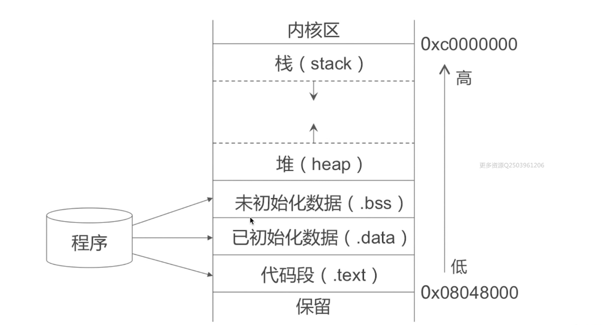
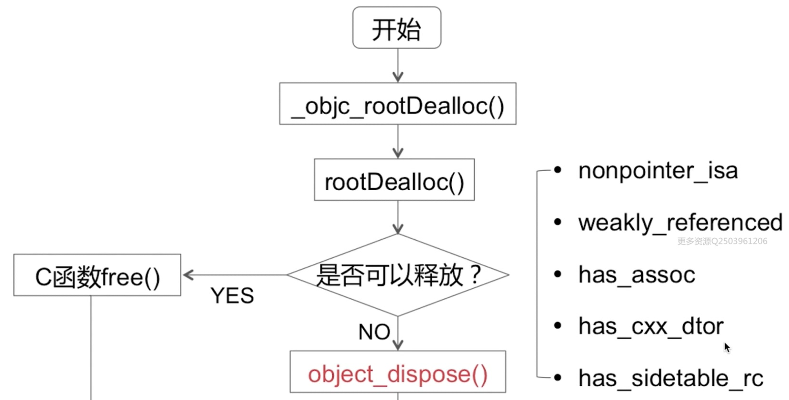

[TOC]

#### 一个objc对象如何进行内存布局？（考虑有父类的情况）

- 所有父类的成员变量和自己的成员变量都会存放在该对象所对应的存储空间中
- 每一个对象内部都有一个isa指针，指向他的类对象，类对象中存放着本对象的
  - 对象方法列表（对象能够接收的消息列表，保存在它所对应的类对象中）
  - 成员变量的列表
  - 属性列表

- 类对象内部也有一个isa指针，指向元对象(meta class)，元对象内部存放的是类方法列表，类对象内部还有一个superclass的指针，指向他的父类对象

#### 什么是内存泄漏

- 内存泄漏指动态分配内存的对象在使用完后没有被系统回收内存，导致对象始终占有着内存，属于内存管理出错。一次内存泄露危害可以忽略，但内存泄漏堆积后果很严重，无论多少内存，迟早会被耗光
- 常见的有ARC下block，delegate，NSTimer等的循环引用造成内存泄漏

#### 在 `Obj-C` 中，如何检测内存泄漏？你知道哪些方式？

目前常用的内存泄漏检测的方式有以下几种

- Memory Leaks: Instruments->Leaks
- Alloctions: Instruments->Allocations
- Analyze:Xcode->Product->Analyze
- Debug Memory Graph:Xcode->断点
- MLeaksFinder

泄露的内存主要有以下两种：

- `Laek Memory` 这种是忘记 `Release` 操作所泄露的内存。
- `Abandon Memory` 这种是循环引用，无法释放掉的内存。

上面所说的五种方式，其实前四种都比较麻烦，需要不断地调试运行，第五种是腾讯阅读团队出品，效果好一些，感兴趣的可以看一下这两篇文章：

- [MLeaksFinder：精准 iOS 内存泄露检测工具](https://links.jianshu.com/go?to=http%3A%2F%2Fwereadteam.github.io%2F2016%2F02%2F22%2FMLeaksFinder%2F)
- [MLeaksFinder 新特性](https://links.jianshu.com/go?to=http%3A%2F%2Fwereadteam.github.io%2F2016%2F07%2F20%2FMLeaksFinder2%2F)

#### 让你设计一种机制检测UIViewController的内存泄漏，你会怎么做

- 如果Controller被释放了，但其曾经持有过的子对象如果还存在，那么这些子对象就是泄漏的可疑目标
- 一个小示例：子对象（比如view）建立一个对controller的weak引用，如果Controller被释放，这个weak引用也随之置为nil。那怎么知道子对象没有被释放呢？用一个单例对象每个一小段时间发出一个ping通知去ping这个子对象，如果子对象还活着就回一个ping通知。所以结论就是：如果子对象的controller已不存在，但还能响应这个ping通知，那么这个对象就是可疑的泄漏对象

#### 循环引用

**循环引用的实质：多个对象相互之间有强引用，不能释放让系统回收**

**如何解决循环引用？**

1、避免产生循环引用，通常是将 strong 引用改为 weak 引用
 比如在修饰属性时用weak， 在block内调用对象方法时，使用其弱引用，这里可以使用两个宏

```rust
#define WS(weakSelf)            __weak __typeof(&*self)weakSelf = self; // 弱引用
#define ST(strongSelf)          __strong __typeof(&*self)strongSelf = weakSelf; //使用这个要先声明weakSelf
```

还可以使用__block来修饰变量
 在MRC下，__block不会增加其引用计数，避免了循环引用
 在ARC下，__block修饰对象会被强引用，无法避免循环引用，需要手动解除。

2、在合适时机去手动断开循环引用。
 通常我们使用第一种。

**1、代理(delegate)循环引用属于相互循环引用**

delegate 是iOS中开发中比较常遇到的循环引用，一般在声明delegate的时候都要使用弱引用 weak,或者assign,当然怎么选择使用assign还是weak，MRC的话只能用assign，在ARC的情况下最好使用weak，因为weak修饰的变量在释放后自动指向nil，防止野指针存在

**2、NSTimer循环引用属于相互循环使用**

在控制器内，创建NSTimer作为其属性，由于定时器创建后也会强引用该控制器对象，那么该对象和定时器就相互循环引用了。
 如何解决呢？
 这里我们可以使用手动断开循环引用：
 如果是不重复定时器，在回调方法里将定时器invalidate并置为nil即可。
 如果是重复定时器，在合适的位置将其invalidate并置为nil即可

**3、block循环引用**

一个简单的例子：

```objectivec
@property (copy, nonatomic) dispatch_block_t myBlock;
@property (copy, nonatomic) NSString *blockString;

- (void)testBlock {
  self.myBlock = ^() {
      NSLog(@"%@",self.blockString);
  };
}
```

由于block会对block中的对象进行持有操作,就相当于持有了其中的对象，而如果此时block中的对象又持有了该block，则会造成循环引用。
 解决方案就是使用__weak修饰self即可

```objectivec
__weak typeof(self) weakSelf = self;
self.myBlock = ^() {
    NSLog(@"%@",weakSelf.blockString);
};
```

- 并不是所有block都会造成循环引用。
   只有被强引用了的block才会产生循环引用
   而比如dispatch_async(dispatch_get_main_queue(), ^{}),[UIView animateWithDuration:1 animations:^{}]这些系统方法等或者block并不是其属性而是临时变量,即栈block

```objectivec
[self testWithBlock:^{
    NSLog(@"%@",self);
}];

- (void)testWithBlock:(dispatch_block_t)block {
    block();
}
```

还有一种场景，在block执行开始时self对象还未被释放，而执行过程中，self被释放了，由于是用weak修饰的，那么weakSelf也被释放了，此时在block里访问weakSelf时，就可能会发生错误(向nil对象发消息并不会崩溃，但也没任何效果)。
 对于这种场景，应该在block中对 对象使用__strong修饰，使得在block期间对 对象持有，block执行结束后，解除其持有。

```objectivec
__weak typeof(self) weakSelf = self;
self.myBlock = ^() {
    __strong __typeof(self) strongSelf = weakSelf;
    [strongSelf test];
};
```

#### 什么是内存溢出

- 当程序在申请内存时，没有足够的内存空间供其使用，出现out of memory；比如申请了一个int，但给它存了long才能存下的数，那就是内存溢出

#### 什么是僵尸对象

- 已经被销毁的对象(不能再使用的对象)，内存已经被回收的对象。一个引用计数器为0的对象被释放后就变为了僵尸对象

#### 说一下什么是 `悬垂指针`

> 指针指向的内存已经被释放了，但是指针还存在，这就是一个 `悬垂指针` 或者说 `迷途指针`

#### 什么是`野指针`

> 没有进行初始化的指针，其实都是 `野指针`

#### 什么是`空指针`

- 空指针不同于野指针，它是一个没有指向任何内存的指针，空指针是有效指针，值为`nil,NULL,Nil,0`等，给空指针发送消息不会报错，不会响应消息

#### OC对象的内存管理机制

- 通过 retainCount 的机制来决定对象是否需要释放。 每次 runloop 的时候，都会检查对象的 retainCount，如果retainCount 为 0，说明该对象没有地方需要继续使用了，可以释放掉了
- 在iOS中，使用引用计数来管理OC对象的内存，主要有`手动内存管理、自动内存管理、自动释放池`三种方式
  - 一个新创建的OC对象引用计数默认是1，当引用计数减为0时OC对象就会被销毁，释放其占用的内存空间
  - 自动内存计数ARC：由Xcode自动在App编译阶段，在代码中添加内存管理代码
  - 手动内存计数MRC：遵循内存`谁申请、谁管理；谁添加，谁释放`的原则，调用`retain`会让OC对象的引用计数+1，调用`release`会让OC对象的引用计数-1
  - 内存释放池Release Pool：把需要释放的内存统一放在一个池子中，当池子被抽干后(drain)，池子中所有的内存空间也被自动释放掉。内存池的释放操作分为自动和手动。自动释放受runloop机制影响
- 内存管理的经验总结

  - 如果调用的方法以 `alloc`、`new`、`copy`、`mutableCopy` 为前缀，则持有该对象，调用其他的方法不持有该对象，而是将其注册到 `autoreleasepool`
- 想拥有某个对象，就让它的引用计数+1；不想再拥有某个对象，就让它的引用计数-1
- 两个有用的方法

  - `extern uintptr_t _objc_rootRetainCount(id obj)`方法，作用是返回obj的引用计数
  - `extern void _objc_autoreleasePoolPrint(void)`方法，作用是打印当前的自动释放池对象

#### iOS内存管理方式

- Tagged Pointer（小对象）

Tagged Pointer 专门用来存储小的对象，例如 NSNumber 和 NSDate

Tagged Pointer 指针的值不再是地址了，而是真正的值。所以，实际上它不再是一个对象了，它只是一个披着对象皮的普通变量而已。所以，它的内存并不存储在堆中，也不需要 malloc 和 free

在内存读取上有着 3 倍的效率，创建时比以前快 106 倍

objc_msgSend 能识别 Tagged Pointer，比如 NSNumber 的 intValue 方法，直接从指针提取数据

使用 Tagged Pointer 后，指针内存储的数据变成了 Tag + Data，也就是将数据直接存储在了指针中

- NONPOINTER_ISA （指针中存放与该对象内存相关的信息） 苹果将 isa 设计成了联合体，在 isa 中存储了与该对象相关的一些内存的信息，原因也如上面所说，并不需要 64 个二进制位全部都用来存储指针。

isa 的结构：

```cpp
// x86_64 架构
struct {
    uintptr_t nonpointer        : 1;  // 0:普通指针，1:优化过，使用位域存储更多信息
    uintptr_t has_assoc         : 1;  // 对象是否含有或曾经含有关联引用
    uintptr_t has_cxx_dtor      : 1;  // 表示是否有C++析构函数或OC的dealloc
    uintptr_t shiftcls          : 44; // 存放着 Class、Meta-Class 对象的内存地址信息
    uintptr_t magic             : 6;  // 用于在调试时分辨对象是否未完成初始化
    uintptr_t weakly_referenced : 1;  // 是否被弱引用指向
    uintptr_t deallocating      : 1;  // 对象是否正在释放
    uintptr_t has_sidetable_rc  : 1;  // 是否需要使用 sidetable 来存储引用计数
    uintptr_t extra_rc          : 8;  // 引用计数能够用 8 个二进制位存储时，直接存储在这里
};

// arm64 架构
struct {
    uintptr_t nonpointer        : 1;  // 0:普通指针，1:优化过，使用位域存储更多信息
    uintptr_t has_assoc         : 1;  // 对象是否含有或曾经含有关联引用
    uintptr_t has_cxx_dtor      : 1;  // 表示是否有C++析构函数或OC的dealloc
    uintptr_t shiftcls          : 33; // 存放着 Class、Meta-Class 对象的内存地址信息
    uintptr_t magic             : 6;  // 用于在调试时分辨对象是否未完成初始化
    uintptr_t weakly_referenced : 1;  // 是否被弱引用指向
    uintptr_t deallocating      : 1;  // 对象是否正在释放
    uintptr_t has_sidetable_rc  : 1;  // 是否需要使用 sidetable 来存储引用计数
    uintptr_t extra_rc          : 19;  // 引用计数能够用 19 个二进制位存储时，直接存储在这里
};
```

这里的 has_sidetable_rc 和 extra_rc，has_sidetable_rc 表明该指针是否引用了 sidetable 散列表，之所以有这个选项，是因为少量的引用计数是不会直接存放在 SideTables 表中的，对象的引用计数会先存放在 extra_rc 中，当其被存满时，才会存入相应的 SideTables 散列表中，SideTables 中有很多张 SideTable，每个 SideTable 也都是一个散列表，而引用计数表就包含在 SideTable 之中。

- 散列表（引用计数表、弱引用表）

引用计数要么存放在 isa 的 extra_rc 中，要么存放在引用计数表中，而引用计数表包含在一个叫 SideTable 的结构中，它是一个散列表，也就是哈希表。而 SideTable 又包含在一个全局的 StripeMap 的哈希映射表中，这个表的名字叫 SideTables。

**当一个对象访问 SideTables 时：**

- 首先会取得对象的地址，将地址进行哈希运算，与 SideTables 中 SideTable 的个数取余，最后得到的结果就是该对象所要访问的 SideTable
- 在取得的 SideTable 中的 RefcountMap 表中再进行一次哈希查找，找到该对象在引用计数表中对应的位置
- 如果该位置存在对应的引用计数，则对其进行操作，如果没有对应的引用计数，则创建一个对应的 size_t 对象，其实就是一个 uint 类型的无符号整型
- 弱引用表也是一张哈希表的结构，其内部包含了每个对象对应的弱引用表 weak_entry_t，而 weak_entry_t 是一个结构体数组，其中包含的则是每一个对象弱引用的对象所对应的弱引用指针。

#### 循环引用

循环引用的实质：多个对象相互之间有强引用，不能释放让系统回收

**如何解决循环引用？**

1、避免产生循环引用，通常是将 strong 引用改为 weak 引用。 比如在修饰属性时用weak 在block内调用对象方法时，使用其弱引用，这里可以使用两个宏

```rust
#define WS(weakSelf) __weak __typeof(&*self)weakSelf = self; // 弱引用
```

```cpp
#define ST(strongSelf) __strong __typeof(&*self)strongSelf = weakSelf; 
```

//使用这个要先声明weakSelf 还可以使用__block来修饰变量 在MRC下，__block不会增加其引用计数，避免了循环引用 在ARC下，__block修饰对象会被强引用，无法避免循环引用，需要手动解除。

2、在合适时机去手动断开循环引用。 通常我们使用第一种。

- 代理(delegate)循环引用属于相互循环引用

delegate 是iOS中开发中比较常遇到的循环引用，一般在声明delegate的时候都要使用弱引用 weak,或者assign,当然怎么选择使用assign还是weak，MRC的话只能用assign，在ARC的情况下最好使用weak，因为weak修饰的变量在释放后自动指向nil，防止野指针存在

- NSTimer循环引用属于相互循环使用

在控制器内，创建NSTimer作为其属性，由于定时器创建后也会强引用该控制器对象，那么该对象和定时器就相互循环引用了。 如何解决呢？ 这里我们可以使用手动断开循环引用： 如果是不重复定时器，在回调方法里将定时器invalidate并置为nil即可。 如果是重复定时器，在合适的位置将其invalidate并置为nil即可

3、block循环引用

一个简单的例子：

```objectivec
@property (copy, nonatomic) dispatch_block_t myBlock;
@property (copy, nonatomic) NSString *blockString;

- (void)testBlock {
    self.myBlock = ^() {
        NSLog(@"%@",self.blockString);
    };
}
```

由于block会对block中的对象进行持有操作,就相当于持有了其中的对象，而如果此时block中的对象又持有了该block，则会造成循环引用。 解决方案就是使用__weak修饰self即可

```objectivec
__weak typeof(self) weakSelf = self;

self.myBlock = ^() {
        NSLog(@"%@",weakSelf.blockString);
 };
```

并不是所有block都会造成循环引用。 只有被强引用了的block才会产生循环引用 而比如dispatch_async(dispatch_get_main_queue(), ^{}),[UIView animateWithDuration:1 animations:^{}]这些系统方法等 或者block并不是其属性而是临时变量,即栈block

```objectivec
[self testWithBlock:^{
    NSLog(@"%@",self);
}];

- (void)testWithBlock:(dispatch_block_t)block {
    block();
}
```

还有一种场景，在block执行开始时self对象还未被释放，而执行过程中，self被释放了，由于是用weak修饰的，那么weakSelf也被释放了，此时在block里访问weakSelf时，就可能会发生错误(向nil对象发消息并不会崩溃，但也没任何效果)。

对于这种场景，应该在block中对 对象使用__strong修饰，使得在block期间对 对象持有，block执行结束后，解除其持有。

```objectivec
__weak typeof(self) weakSelf = self;
self.myBlock = ^() {
        __strong __typeof(self) strongSelf = weakSelf;
        [strongSelf test];
 };
```

#### ARC 的 retainCount 怎么存储的？

存在64张哈希表中，根据哈希算法去查找所在的位置，无需遍历，十分快捷

**散列表（引用计数表、weak表）**

- SideTables 表在 非嵌入式的64位系统中，有 64张 SideTable 表
- 每一张 SideTable 主要是由三部分组成。自旋锁、引用计数表、弱引用表。
- 全局的 引用计数 之所以不存在同一张表中，是为了避免资源竞争，解决效率的问题。
- 引用计数表 中引入了 分离锁的概念，将一张表分拆成多个部分，对他们分别加锁，可以实现并发操作，

**提升执行效率**

- 引用计数表（哈希表）
- 通过指针的地址，查找到引用计数的地址，大大提升查找效率
- 通过 DisguisedPtr(objc_object) 函数存储，同时也通过这个函数查找，这样就避免了循环遍历

#### 讲一下 `iOS` 内存管理的理解

实际上是三种方案的结合

- 1.TaggedPointer（针对类似于 `NSNumber` 的小对象类型）
- 2.NONPOINTER_ISA（64位系统下）
  - 第一位的 `0` 或 `1` 代表是纯地址型 `isa` 指针，还是 `NONPOINTER_ISA` 指针。
  - 第二位，代表是否有关联对象
  - 第三位代表是否有 `C++` 代码。
  - 接下来33位代表指向的内存地址
  - 接下来有 `弱引用` 的标记
  - 接下来有是否 `delloc` 的标记....等等
- 3.散列表（引用计数表、weak表）
  - `SideTables` 表在 非嵌入式的64位系统中，有 64张 `SideTable` 表
  - 每一张 `SideTable` 主要是由三部分组成。`自旋锁`、`引用计数表`、`弱引用表`。
  - 全局的 `引用计数` 之所以不存在同一张表中，是为了避免资源竞争，解决效率的问题。
  - `引用计数表` 中引入了 `分离锁`的概念，将一张表分拆成多个部分，对他们分别加锁，可以实现并发操作，提升执行效率

#### 说一下对 `strong`,`copy`,`assign`,`weak`,`_unsafe_unretain` 关键字的理解。

**strong**

> `strong` 修饰符表示指向并持有该对象，其修饰对象的引用计数会加1。该对象只要引用计数不为0就不会被销毁。当然可以通过将变量强制赋值 `nil` 来进行销毁

**weak**

> `weak` 修饰符指向但是并不持有该对象，引用计数也不会加1。在 `Runtime` 中对该属性进行了相关操作，无需处理，可以自动销毁。`weak`用来修饰对象，多用于避免循环引用的地方。`weak` 不可以修饰基本数据类型

**assign**

> `assign`主要用于修饰基本数据类型
>  例如`NSInteger`，`CGFloat`，存储在栈中，内存不用程序员管理。`assign`是可以修饰对象的，但是会出现悬垂指针的问题。当对象释放后继续给对象发送消息，将会造成crash

**copy**

> `copy`关键字和 `strong`类似，`copy` 多用于修饰有可变类型的不可变对象上 `NSString`,`NSArray`,`NSDictionary`上。

**__unsafe_unretain**

> `__unsafe_unretain` 类似于 `weak` ，但是当对象被释放后，指针已然保存着之前的地址，被释放后的地址变为 `僵尸对象`，访问被释放的地址就会出问题，所以说他是不安全的

**__autoreleasing**

> 将对象赋值给附有 `__autoreleasing`修饰的变量等同于 `ARC` 无效时调用对象的 `autorelease` 方法,实质就是扔进了自动释放池

#### ARC 都帮我们做了什么？

- LLVM + Runtime 会为我们代码自动插入retain和release以及 autorelease等代码，不需要我们手动管理
- 切换到ARC之后，每个指向OC对象的指针，都被赋上了所有权修饰符。一共有`__strong`、`__weak`、`__unsafe_unretained`和`__autoreleasing`这样四种所有权修饰符
- 当一个对象被赋值给一个使用`__autoreleasing`修饰符修饰的指针时，相当于这个对象在MRC下被发送了`autorelease`消息，也就是说它被注册到了autorelease pool中
- 全局变量和实例变量是无法用`__autoreleasing`来修饰的，不然编译器会报错
- 局部变量用`__autoreleasing`修饰后，其指向的对象，在当前autorelease pool结束之前不会被回收

#### iOS中ARC内部原理

ARC会自动插入`retain`和`release`语句。ARC编译器有两部分，分别是前端编译器和优化器。

- 前端编译器

  前端编译器会为“拥有的”每一个对象插入相应的`release`语句。如果对象的所有权修饰符是`__strong`，那么它就是被拥有的。如果在某个方法内创建了一个对象，前端编译器会在方法末尾自动插入`release`语句以销毁它。而类拥有的对象（实例变量/属性）会在`dealloc`方法内被释放。事实上，你并不需要写`dealloc`方法或调用父类的`dealloc`方法，ARC会自动帮你完成一切。此外，由编译器生成的代码甚至会比你自己写的`release`语句的性能还要好，因为编辑器可以作出一些假设。在ARC中，没有类可以覆盖`release`方法，也没有调用它的必要。ARC会通过直接使用`objc_release`来优化调用过程。而对于`retain`也是同样的方法。ARC会调用`objc_retain`来取代保留消息。

- ARC优化器

  虽然前端编译器听起来很厉害的样子，但代码中有时仍会出现几个对`retain`和`release`的重复调用。ARC优化器负责移除多余的`retain`和`release`语句，确保生成的代码运行速度高于手动引用计数的代码

#### 使用自动引用计数应遵循的原则

- 不能使用 `retain`、`release`、`retainCount`、`autorelease`
- 不可以使用 `NSAllocateObject`、`NSDeallocateObject`
- 必须遵守内存管理方法的命名规则
- 不需要显示的调用 `Dealloc`
- 使用 `@autoreleasePool` 来代替 `NSAutoreleasePool`
- 不可以使用区域 `NSZone`
- 对象性变量不可以作为 `C` 语言的结构体成员
- 显示转换 `id` 和 `void*`

#### weak指针的实现原理

- Runtime维护了一个全局的weak表，用于存储指向某个对象的所有weak指针，weak表其实是一个hash（哈希）表，Key是所指对象的地址，Value是weak指针的地址（这个地址的值是所指对象的地址）数组
  - 初始化时：runtime会调用objc_initWeak函数，初始化一个新的weak指针指向对象的地址
  - 添加引用时：objc_initWeak函数会调用 storeWeak() 函数， storeWeak() 的作用是更新指针指向，创建对应的弱引用表
  - 释放时,调用clearDeallocating函数。clearDeallocating函数首先根据对象地址获取所有weak指针地址的数组，然后遍历这个数组把其中的数据设为nil，最后把这个entry从weak表中删除，最后清理对象的记录

```cpp
struct SideTable {
    // 保证原子操作的自旋锁
    spinlock_t slock;
    // 引用计数的 hash 表
    RefcountMap refcnts;
    // weak 引用全局 hash 表
    weak_table_t weak_table;
}

struct weak_table_t {
    // 保存了所有指向指定对象的 weak 指针
    weak_entry_t *weak_entries;
    // 存储空间
    size_t    num_entries;
    // 参与判断引用计数辅助量
    uintptr_t mask;
    // hash key 最大偏移值
    uintptr_t max_hash_displacement;
};
```

#### 方法里有局部对象， 出了方法后会立即释放吗

- 如果是普通的局部对象，会立即释放
- 如果是放在了 autoreleasePool 自动释放池，则会等runloop 循环,进入休眠前释放

#### OC中有GC垃圾回收机制吗，iPhone上有GC吗

- 垃圾回收(GC)就是程序中用于处理废弃不用的内存对象的机制，防止内存泄露
- OC本身是支持垃圾回收的，不过只支持MAC OSX平台，iOS 平台不支持

#### 在OC中与 Alloc 语义相反的是 release 还是 dealloc

- alloc 与 dealloc 语义相反，alloc 是创建变量，dealloc是释放变量
- retain 与 release 语义相反，retain 保留一个对象，引用计数器+1；release 使引用计数器 -1

#### 内存区域划分

在iOS开发过程中，为了合理的分配有限的内存空间，将内存区域分为五个区

- 代码段：也叫程序区，存放程序编译产生的二进制的数据

- 常量区：存储常量数据，通常程序结束后由系统自动释放（编译时分配，APP结束由系统释放）

- 全局静态区：全局区又可分为未初始化全局区(.bss段)和初始化全局区(data段)

  全局变量和静态变量的存储是放在一块的，初始化的全局变量和静态变量在一块区域， 未初始化的全局变量和未初始化的静态变量在相邻的另一块区域，在程序结束后有系统释放（编译时分配，APP结束由系统释放）

- 堆区（heap) ：动态分配内存，需要程序员申请，也需要程序员自己管理(alloc、malloc等)，如果不释放，则出现内存泄露。是离散的，低地址往高地址扩展。容量大，速度慢，无序

- 栈区（stack）：由编译器自动分配和释放，一般存放函数的参数值，局部变量等，是连续的，高地址往低地址扩展，容量小速度快，有序



#### 堆和栈的区别

- `栈区(stack)`由编译器自动分配释放 ，存放方法(函数)的参数值，局部变量的值等，栈是向低地址扩展的数据结构，是一块连续的内存的区域。即栈顶的地址和栈的最大容量是系统预先规定好的
- `堆区(heap)`一般由程序员分配释放，若程序员不释放，程序结束时由OS回收，向高地址扩展的数据结构，是不连续的内存区域，这是由于系统是用链表来存储空闲内存地址的，自然是不连续的，而链表的遍历方向是由低地址向高地址。堆的大小受限于计算机系统中有效的虚拟内存。由此可见，堆获得的空间比较灵活，也比较大
- `碎片问题`：对于堆来讲，频繁的`new/delete`势必会造成内存空间的不连续，从而造成大量的碎片，使程序效率降低。对于栈来讲，则不会存在这个问题，因为栈是先进后出的队列，他们是如此的一一对应，以至于永远都不可能有一个内存块从栈中间弹出
- `分配方式`：堆都是动态分配的，没有静态分配的堆。栈有2种分配方式：静态分配和动态分配。静态分配是编译器完成的，比如局部变量的分配。动态分配由alloc函数进行分配，但是栈的动态分配和堆是不同的，他的动态分配是由编译器进行释放，无需我们手工实现。
- `分配效率`：栈是机器系统提供的数据结构，计算机会在底层对栈提供支持：分配专门的寄存器存放栈的地址，压栈出栈都有专门的指令执行，这就决定了栈的效率比较高。堆则是C/C++函数库提供的，它的机制是很复杂的。
- `全局区(静态区)(static)`,全局变量和静态变量的存储是放在一块 的,初始化的全局变量和静态变量在一块区域, 未初始化的全局变量和未初始化的静态变量在相邻的另一块区域。程序结束后有系统释放。
- `文字常量区`—常量字符串就是放在这里的。程序结束后由系统释放。
- `程序代码区`—存放函数体的二进制代码

#### 怎么保证多人开发进行内存泄露的检查

- 使用Analyze进行代码静态分析
- 为避免不必要的麻烦，多人开发时尽量使用ARC
- 使用leaks 进行内存泄漏检测
- 使用一些三方工具

#### block在ARC中和MRC中的用法有什么区别,需要注意什么

- 对于没有引用外部变量的Block，无论在ARC还是非ARC下，类型都是 **NSGlobalBlock**，这种类型的block可以理解成一种全局的block，不需要考虑作用域问题。同时，对他进行Copy或者Retain操作也是无效的
- 都需要应注意避免循环引用，ARC 下使用__weak 来解决，MRC下使用__Block 来解决

#### 非OC对象如何管理内存

- 非OC对象，需要手动执行释放操作（比如CGImageRelease(ref)），否则会造成大量的内存泄漏导致程序崩溃
- 对于CoreFoundation框架下的某些对象或变量需要手动释放、C语言代码中的malloc等需要对应free

#### CADisplayLink、NSTimer会出现的问题,以及解决办法

- 问题：CADisplayLink、NSTimer都是基于 runloop 实现的。runloop 会对CADisplayLink、NSTimer进行强引用，CADisplayLink、NSTimer会对target产生强引用，如果target又对它们产生强引用，那么就会引发循环引用

- 解决方案

  - 使用block

    ```objective-c
    // 内部使用 WeakSelf,并在视图消失前,关闭定时器
    __weak __typeof(self)weakSelf = self;
    NSTimer * timer = [NSTimer timerWithTimeInterval:1 repeats:YES block:^(NSTimer * _Nonnull timer) {
        NSLog(@"timer");
    }];
    self.timer= timer;
    [[NSRunLoop currentRunLoop]addTimer:timer forMode:NSRunLoopCommonModes];
    ```

  - 使用代理对象（NSProxy）

    ```css
    @interface TimerProxy : NSProxy
    + (instancetype)proxyWithTarget:(id)target;
    @end
    
    /*
     - (void)viewDidLoad {
     [super viewDidLoad];
     self.myTimer = [NSTimer scheduledTimerWithTimeInterval:1 target:[MyProxy proxyWithTarget:self] selector:@selector(doSomething) userInfo:nil repeats:YES];
     }
     - (void)dealloc {
     if (_myTimer) {
     [_myTimer invalidate];
     }
     NSLog(@"MyViewController dealloc");
     }
     */
    @interface TimerProxy()
    @property (weak, readonly, nonatomic) id weakTarget;
    @end
    
    @implementation TimerProxy
    + (instancetype)proxyWithTarget:(id)target {
        return [[TimerProxy alloc] initWithTarget:target];
    }
    
    - (instancetype)initWithTarget:(id)target {
        _weakTarget = target;
        return self;
    }
    
    - (void)forwardInvocation:(NSInvocation *)invocation {
        SEL sel = [invocation selector];
        if (_weakTarget && [self.weakTarget respondsToSelector:sel]) {
            [invocation invokeWithTarget:self.weakTarget];
        }
    }
    
    - (NSMethodSignature *)methodSignatureForSelector:(SEL)sel {
        return [self.weakTarget methodSignatureForSelector:sel];
    }
    
    - (BOOL)respondsToSelector:(SEL)aSelector {
        return [self.weakTarget respondsToSelector:aSelector];
    }
    @end
    ```

  - 使用工厂方法返回一个timer

    ```css
    @interface TargetTimer : NSObject
    + (NSTimer *)scheduledTimerWithTimeInterval:(NSTimeInterval)interval
                                         target:(id)target
                                       selector:(SEL)selector
                                       userInfo:(id _Nullable)userInfo
                                        repeats:(BOOL)repeats;
    @end
    
    /*
     self.myTimer = [MyTimerTarget scheduledTimerWithTimeInterval:1 target:self selector:@selector(doSomething) userInfo:nil repeats:YES];
     */
    
    #import "TargetTimer.h"
    
    @interface TargetTimer()
    @property (assign, nonatomic) SEL outSelector;
    @property (weak, nonatomic) id outTarget;
    @end
    
    @implementation TargetTimer
    + (NSTimer *)scheduledTimerWithTimeInterval:(NSTimeInterval)interval
                                         target:(id)target
                                       selector:(SEL)selector
                                       userInfo:(id _Nullable)userInfo
                                        repeats:(BOOL)repeats {
        TargetTimer *timerTarget = [[TargetTimer alloc] init];
        timerTarget.outTarget = target;
        timerTarget.outSelector = selector;
        NSTimer *timer = [NSTimer scheduledTimerWithTimeInterval:interval
                                                          target:timerTarget
                                                        selector:@selector(timerSelector:)
                                                        userInfo:userInfo
                                                         repeats:repeats];
        return timer;
    }
    
    - (void)timerSelector:(NSTimer *)timer {
        if (self.outTarget && [self.outTarget respondsToSelector:self.outSelector]) {
    #pragma clang diagnostic push
    #pragma clang diagnostic ignored "-Warc-performSelector-leaks"
            [self.outTarget performSelector:self.outSelector
                                 withObject:timer.userInfo];
    #pragma clang diagnostic pop
        }
        else {
            [timer invalidate];
        }
    }
    @end
    ```

#### 什么是Tagged Pointer

- 从64bit开始，iOS引入了Tagged Pointer技术，用于优化NSNumber、NSDate、NSString等小对象的存储
- 在没有使用Tagged Pointer之前， NSNumber等对象需要动态分配内存、维护引用计数等，NSNumber指针存储的是堆中NSNumber对象的地址值
- 使用Tagged Pointer之后，NSNumber指针里面存储的数据变成了：Tag + Data，也就是将数据直接存储在了指针中
- 当指针不够存储数据时，才会使用动态分配内存的方式来存储数据

#### copy和mutableCopy区别

| 数据类型 | copy       | mutableCopy |
| -------- | ---------- | ----------- |
| 不可变   | 浅拷贝     | 单层深拷贝  |
| 可变     | 单层深拷贝 | 单层深拷贝  |

#### 是否了解 深拷贝 和 浅拷贝 的概念，集合类深拷贝如何实现

**简而言之：**

1、对不可变的非集合对象，copy是指针拷贝，mutablecopy是内容拷贝

2、对于可变的非集合对象，copy，mutablecopy都是内容拷贝

3、对不可变的数组、字典、集合等集合类对象，copy是指针拷贝，mutablecopy是内容拷贝

4、对于可变的数组、字典、集合等集合类对象，copy，mutablecopy都是内容拷贝

但是，对于集合对象的内容复制仅仅是对对象本身，但是对象的里面的元素还是指针复制。要想复制整个集合对象，就要用集合深复制的方法，有两种：

（1）使用initWithArray:copyItems:方法，将第二个参数设置为YES即可

```objectivec
NSDictionary shallowCopyDict = [[NSDictionary alloc] initWithDictionary:someDictionary copyItems:YES];
```

（2）将集合对象进行归档（archive）然后解归档（unarchive）：

```objectivec
NSArray *trueDeepCopyArray = [NSKeyedUnarchiver unarchiveObjectWithData:[NSKeyedArchiver archivedDataWithRootObject:oldArray]];
```

#### 内存泄漏可能会出现的几种原因

第三方框架不当使用，block、delegate、NSTimer的循环引用，非OC对象内存处理，地图类处理，大次数循环内存暴涨

#### 能不能简述一下 `Dealloc` 的实现机制

1. `Dealloc` 调用流程
   - 首先调用 `_objc_rootDealloc()`
   - 接下来调用 `rootDealloc()`
   - 这时候会判断是否可以被释放，判断的依据主要有5个，判断是否有以上五种情况
     - `NONPointer_ISA`
     - `weakly_reference`
     - `has_assoc`
     - `has_cxx_dtor`
     - `has_sidetable_rc`
    - 如果有以上五中任意一种，将会调用 `object_dispose()`方法，做下一步的处理
    - 如果没有之前五种情况的任意一种，则可以执行释放操作，C函数的 `free()`
    - 执行完毕。

2. `object_dispose()` 调用流程
   - 直接调用 `objc_destructInstance()`
   - 之后调用 C函数的 `free()`

3. `objc_destructInstance()` 调用流程
   - 先判断 `hasCxxDtor`，如果有 `C++` 的相关内容，要调用 `object_cxxDestruct()` ，销毁 `C++` 相关的内容
   - 再判断 `hasAssocitatedObjects`，如果有的话，要调用 `object_remove_associations()`，销毁关联对象的一系列操作
   - 然后调用 `clearDeallocating()`
   - 执行完毕

4. `clearDeallocating()` 调用流程
   - 先执行 `sideTable_clearDellocating()`
   - 再执行 `weak_clear_no_lock`,在这一步骤中，会将指向该对象的弱引用指针置为 `nil`
   - 接下来执行 `table.refcnts.erase()`，从引用计数表中擦除该对象的引用计数
   - 至此为止，`Dealloc` 的执行流程结束

#### **static、const和sizeof关键字**

**static关键字**

Static的用途主要有两个，一是用于修饰存储类型使之成为静态存储类型，二是用于修饰链接属性使之成为内部链接属性。

- 静态存储类型：

在函数内定义的静态局部变量，该变量存在内存的静态区，所以即使该函数运行结束，静态变量的值不会被销毁，函数下次运行时能仍用到这个值

在函数外定义的静态变量——静态全局变量，该变量的作用域只能在定义该变量的文件中，不能被其他文件通过extern引用

- 内部链接属性

静态函数只能在声明它的源文件中使用

**const关键字**

- 声明常变量，使得指定的变量不能被修改。

```cpp
const int a = 5;/*a的值一直为5，不能被改变*/

const int b; b = 10;/*b的值被赋值为10后，不能被改变*/

const int *ptr; /*ptr为指向整型常量的指针，ptr的值可以修改，但不能修改其所指向的值*/

int *const ptr;/*ptr为指向整型的常量指针，ptr的值不能修改，但可以修改其所指向的值*/

const int *const ptr;/*ptr为指向整型常量的常量指针，ptr及其指向的值都不能修改*/
```

- 修饰函数形参，使得形参在函数内不能被修改，表示输入参数。

如

```kotlin
int fun(const int a);或int fun(const char *str);
```

- 修饰函数返回值，使得函数的返回值不能被修改。

```cpp
const char *getstr(void);使用：const *str= getstr();

const int getint(void);  使用：const int a =getint();
```

**sizeof关键字**

sizeof是在编译阶段处理，且不能被编译为机器码。sizeof的结果等于对象或类型所占的内存字节数。sizeof的返回值类型为size_t

- 变量：int a;  sizeof(a)为4；
- 指针：int *p;  sizeof(p)为4；
- 数组：int b[10]; sizeof(b)为数组的大小，4*10；int c[0]; sizeof(c)等于0
- 结构体：struct (int a; char ch;)s1; sizeof(s1)为8 与结构体字节对齐有关。
   对结构体求sizeof时，有两个原则：

```undefined
（1）展开后的结构体的第一个成员的偏移量应当是被展开的结构体中最大的成员的整数倍。

（2）结构体大小必须是所有成员大小的整数倍，这里所有成员计算的是展开后的成员，而不是将嵌套的结构体当做一个整体。
```

- 注意：不能对结构体中的位域成员使用sizeof
- - sizeof(void)等于1
- - sizeof(void *)等于4

#### 简要说一下 `@autoreleasePool` 的数据结构

简单说是双向链表，每张链表头尾相接，有 `parent`、`child`指针

每创建一个池子，会在首部创建一个 `哨兵` 对象,作为标记

最外层池子的顶端会有一个`next`指针。当链表容量满了，就会在链表的顶端，并指向下一张表

#### `retain`、`release` 的实现机制

**`Retain`的实现机制**

```c
id
objc_object::sidetable_retain()
{
#if SUPPORT_NONPOINTER_ISA
    assert(!isa.nonpointer);
#endif
    SideTable& table = SideTables()[this];
    
    table.lock();
    size_t& refcntStorage = table.refcnts[this];
    if (! (refcntStorage & SIDE_TABLE_RC_PINNED)) {
        refcntStorage += SIDE_TABLE_RC_ONE;
    }
    table.unlock();

    return (id)this;
}
```

**`Release`的实现机制。**

```c
uintptr_t
objc_object::sidetable_release(bool performDealloc)
{
#if SUPPORT_NONPOINTER_ISA
    assert(!isa.nonpointer);
#endif
    SideTable& table = SideTables()[this];

    bool do_dealloc = false;

    table.lock();
    RefcountMap::iterator it = table.refcnts.find(this);
    if (it == table.refcnts.end()) {
        do_dealloc = true;
        table.refcnts[this] = SIDE_TABLE_DEALLOCATING;
    } else if (it->second < SIDE_TABLE_DEALLOCATING) {
        // SIDE_TABLE_WEAKLY_REFERENCED may be set. Don't change it.
        do_dealloc = true;
        it->second |= SIDE_TABLE_DEALLOCATING;
    } else if (! (it->second & SIDE_TABLE_RC_PINNED)) {
        it->second -= SIDE_TABLE_RC_ONE;
    }
    table.unlock();
    if (do_dealloc  &&  performDealloc) {
        ((void(*)(objc_object *, SEL))objc_msgSend)(this, SEL_dealloc);
    }
    return do_dealloc;
}
```

二者的实现机制类似，概括讲就是通过第一层 `hash` 算法，找到 `指针变量` 所对应的 `sideTable`。然后再通过一层 `hash` 算法，找到存储 `引用计数` 的 `size_t`，然后对其进行增减操作。`retainCount` 不是固定的 1，`SIZE_TABLE_RC_ONE` 是一个宏定义，实际上是一个值为 4 的偏移量

`#define SIDE_TABLE_RC_ONE      (1UL<<2) // MSB-ward of deallocating bit`

#### MRC（手动引用计数）和ARC(自动引用计数)

**1、MRC：alloc，retain，release，retainCount,autorelease,dealloc**
 **2、ARC：**

- ARC是LLVM和Runtime协作的结果
- ARC禁止手动调用retain，release，retainCount,autorelease关键字
- ARC新增weak，strong关键字

**3、引用计数管理：**

- alloc: 经过一系列函数调用，最终调用了calloc函数，这里并没有设置引用计数为1
- retain: 经过两次哈希查找，找到其对应引用计数值，然后将引用计数加1(实际是加偏移量)
- release：和retain相反，经过两次哈希查找，找到其对应引用计数值，然后将引用计数减1
- dealloc: _rootDealloc->rootDealloc->objc_dispose->objc_destructInstance->`clearDeallocating



**4、弱引用管理：**

- 添加weak变量:通过哈希算法位置查找添加。如果查找对应位置中已经有了当前对象所对应的弱引用数组，就把新的弱引用变量添加到数组当中；如果没有，就创建一个弱引用数组，并将该弱引用变量添加到该数组中。
- 当一个被weak修饰的对象被释放后，weak对象怎么处理的？
   清除weak变量，同时设置指向为nil。当对象被dealloc释放后，在dealloc的内部实现中，会调用弱引用清除的相关函数，会根据当前对象指针查找弱引用表，找到当前对象所对应的弱引用数组，将数组中的所有弱引用指针都置为nil。

**5、自动释放池：**

在当次runloop将要结束的时候调用objc_autoreleasePoolPop，并push进来一个新的AutoreleasePool

AutoreleasePoolPage是以栈为结点通过双向链表的形式组合而成，是和线程一一对应的。
 内部属性有parent，child对应前后两个结点，thread对应线程  ，next指针指向栈中下一个可填充的位置。

- AutoreleasePool实现原理？

编译器会将 @autoreleasepool {} 改写为：

```cpp
void * ctx = objc_autoreleasePoolPush;
    {}
objc_autoreleasePoolPop(ctx);
```

- objc_autoreleasePoolPush：
   把当前next位置置为nil，即哨兵对象,然后next指针指向下一个可入栈位置，AutoreleasePool的多层嵌套，即每次objc_autoreleasePoolPush，实际上是不断地向栈中插入哨兵对象。
- objc_autoreleasePoolPop:
   根据传入的哨兵对象找到对应位置。 给上次push操作之后添加的对象依次发送release消息。回退next指针到正确的位置

#### `BAD_ACCESS` 在什么情况下出现

访问了已经被销毁的内存空间，就会报出这个错误。
根本原因是有 `悬垂指针` 没有被释放

#### `autoReleasePool` 什么时候释放

`App`启动后，苹果在主线程 `RunLoop` 里注册了两个 `Observer`，其回调都是 `_wrapRunLoopWithAutoreleasePoolHandler()`。

第一个 `Observer` 监视的事件是 `Entry(即将进入Loop)`，其回调内会调用 `_objc_autoreleasePoolPush()` 创建自动释放池。其 `order` 是 `-2147483647`，优先级最高，保证创建释放池发生在其他所有回调之前。

第二个 `Observer` 监视了两个事件： `BeforeWaiting`(准备进入休眠) 时调用`_objc_autoreleasePoolPop()`  和 `_objc_autoreleasePoolPush()` 释放旧的池并创建新池；`Exit`(即将退出Loop) 时调用 `_objc_autoreleasePoolPop()` 来释放自动释放池。这个 `Observer` 的 `order` 是 `2147483647`，优先级最低，保证其释放池子发生在其他所有回调之后。

在主线程执行的代码，通常是写在诸如事件回调、`Timer`回调内的。这些回调会被 `RunLoop` 创建好的 `AutoreleasePool` 环绕着，所以不会出现内存泄漏，开发者也不必显示创建 `Pool` 了

#### ARC自动内存管理的原则

- 自己生成的对象，自己持有
- 非自己生成的对象，自己可以持有
- 自己持有的对象不再需要时，需要对其进行释放
- 非自己持有的对象无法释放

#### `ARC` 在运行时做了哪些工作？

- 主要是指 `weak` 关键字。`weak` 修饰的变量能够在引用计数为`0` 时被自动设置成 `nil`，显然是有运行时逻辑在工作的。

- 为了保证向后兼容性，`ARC` 在运行时检测到类函数中的 `autorelease` 后紧跟其后 `retain`，此时不直接调用对象的 `autorelease` 方法，而是改为调用 `objc_autoreleaseReturnValue`。
   `objc_autoreleaseReturnValue` 会检视当前方法返回之后即将要执行的那段代码，若那段代码要在返回对象上执行 `retain` 操作，则设置全局数据结构中的一个标志位，而不执行 `autorelease` 操作，与之相似，如果方法返回了一个自动释放的对象，而调用方法的代码要保留此对象，那么此时不直接执行 `retain` ，而是改为执行 `objc_retainAoutoreleasedReturnValue`函数。此函数要检测刚才提到的标志位，若已经置位，则不执行 `retain` 操作，设置并检测标志位，要比调用 `autorelease` 和`retain`更快

#### `ARC` 在编译时做了哪些工作

根据代码执行的上下文语境，在适当的位置插入 `retain`，`release`

#### `ARC` 的 `retainCount` 怎么存储的

存在64张哈希表中，根据哈希算法去查找所在的位置，无需遍历，十分快捷

散列表（引用计数表、weak表）
 \- `SideTables` 表在 非嵌入式的64位系统中，有 64张 `SideTable` 表
 \- 每一张 `SideTable` 主要是由三部分组成。`自旋锁`、`引用计数表`、`弱引用表`。
 \- 全局的 `引用计数` 之所以不存在同一张表中，是为了避免资源竞争，解决效率的问题。
 \- `引用计数表` 中引入了 `分离锁`的概念，将一张表分拆成多个部分，对他们分别加锁，可以实现并发操作，提升执行效率

#### 引用计数表（哈希表）

通过指针的地址，查找到引用计数的地址，大大提升查找效率

通过 `DisguisedPtr(objc_object)` 函数存储，同时也通过这个函数查找，这样就避免了循环遍历

#### `__weak` 属性修饰的变量，如何实现在变量没有强引用后自动置为 `nil` 

用的弱引用 - `weak`表。也是一张 `哈希表`。

被 `weak` 修饰的指针变量所指向的地址是 `key` ，所有指向这块内存地址的指针会被添加在一个数组里，这个数组是 `Value`。当内存地址销毁，数组里的所有对象被置为 `nil`

#### `__weak` 和 `_Unsafe_Unretain` 的区别

weak 修饰的指针变量，在指向的内存地址销毁后，会在 `Runtime` 的机制下，自动置为 `nil`

`_Unsafe_Unretain`不会置为 `nil`，容易出现 `悬垂指针`，发生崩溃。但是 `_Unsafe_Unretain` 比 `__weak` 效率高


[理解ARC实现原理](https://juejin.im/post/5ce2b7386fb9a07eff005b4c)

