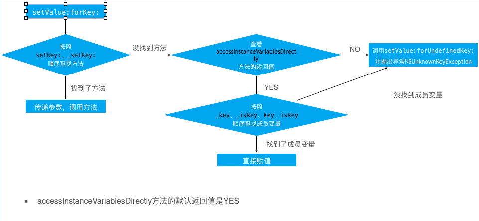
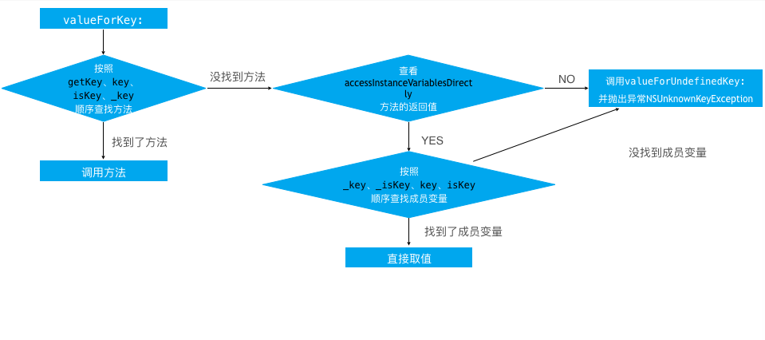
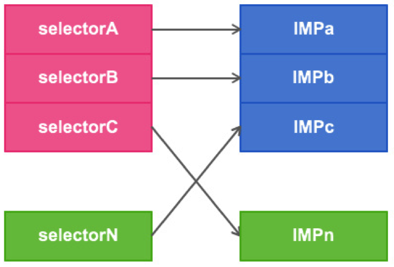
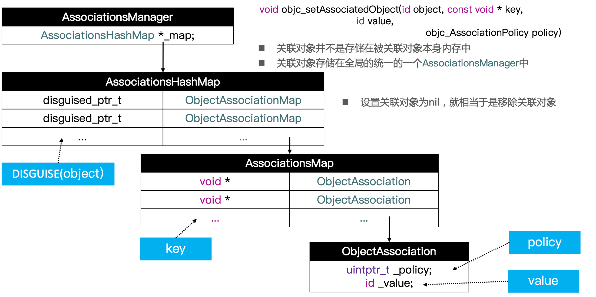
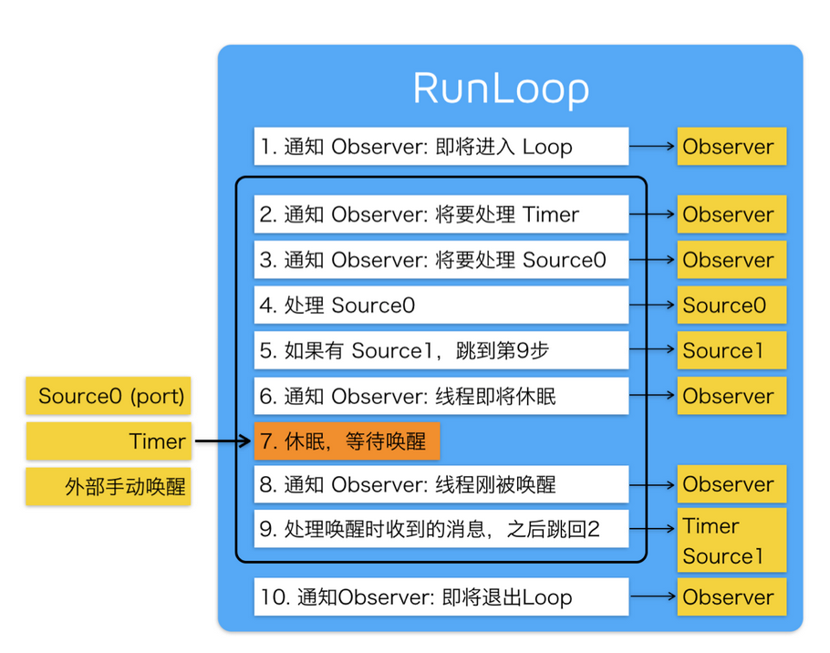
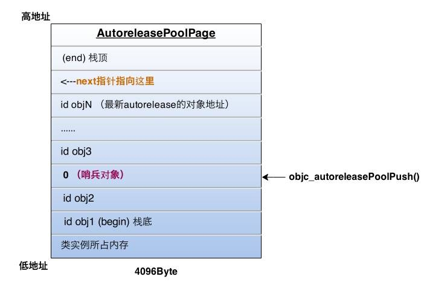
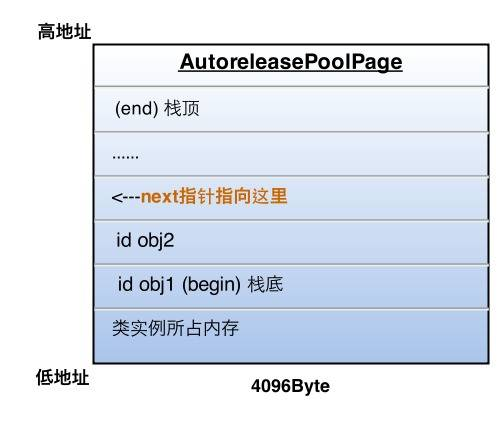

[TOC]

##  底层基础

#### NSObject对象的本质是什么

NSObject对象的本质就是结构体

```objective-c
typedef struct objc_class *Class;
@implementation NSObject
+ (Class)class {
    return self;
}
```

#### 一个NSObject对象占用多少内存

- 受限于内存分配的机制，一个 `NSObject`对象都会分配 `16byte` 的内存空间（malloc_size函数）

- 但是实际上在 64位 下，只使用了 `8byte`，在32位下，只使用了 `4byte`（`class_getInstanceSize`函数）

- 一个 NSObject 实例对象成员变量所占的大小，实际上是 8 字节

  ```objc
  #import <Objc/Runtime>
  Class_getInstanceSize([NSObject Class])
  ```

  本质是

  ```objc
  size_t class_getInstanceSize(Class cls) {
      if (!cls) return 0;
      return cls->alignedInstanceSize();
  }
  ```

  获取 Obj-C 指针所指向的内存的大小，实际上是16 字节

  ```objc
  #import <malloc/malloc.h>
  malloc_size((__bridge const void *)obj); 
  ```

  对象在分配内存空间时，会进行内存对齐，所以在 iOS 中，分配内存空间都是 16字节 的倍数

#### 对象的isa指针指向哪里，有什么作用

- 在Objective-C中，任何类的定义都是对象。类和类的实例（对象）没有任何本质上的区别。任何对象都有 `isa` 指针

-  `isa` 是一个Class 类型的指针。 每个实例对象有个 `isa` 的指针，他指向对象的类，而Class里也有个 `isa` 指针， 指向 `meteClass` (元类)。元类保存了类方法的列表。当类方法被调用时，先会从本身查找类方法的实现，如果没有，元类会向他父类查找该方法。同时注意的是：元类也是类，它也是对象。元类也有 `isa` 指针,它的 `isa` 指针最终指向的是一个根元类。根元类的 `isa` 指针指向本身，这样形成了一个封闭的内循环


- instance对象的isa指向class对象
- class对象的isa指向meta-class对象 
- meta-class对象的isa指向基类的meta-class对象(NSObject meta class)，基类meta-class对象的isa指向自己，也就是NSObject。
- 基类meta-class的superClass是基类NSObject，这样就形成了一个闭环。
- isa主要的作用在于从它所属的类/元类对象上查找方法

#### 说一下对 `isa` 指针的理解， `isa` 指针有哪两种类型？

```
isa` 等价于 `is kind of
```

`isa` 有两种类型

- 纯指针，指向内存地址
- `NON_POINTER_ISA`，除了内存地址，还存有一些其他信息

- 在Runtime源码查看isa_t的简化结构如下：
  - 在arm64构架之前，isa的值就是**类对象的地址值**

  - 在arm64构架开始的时候，采用了 isa优化的策略， 使用了联合的技术。将64位的内存地址存储了很多东西，其中33位存储的是isa具体的地址值。因为联合体中 前三位有存储的东西，所以&isa_mask出来的类对象地址值的二进制后面三位永远都是000， 十六进制就是8 或者0结尾的地址值

  ```objective-c
  union isa_t  {
      Class cls;
      uintptr_t bits;
      # if __arm64__ // arm64架构
  #   define ISA_MASK        0x0000000ffffffff8ULL //用来取出33位内存地址使用（&）操作
  #   define ISA_MAGIC_MASK  0x000003f000000001ULL
  #   define ISA_MAGIC_VALUE 0x000001a000000001ULL
      struct {
          uintptr_t nonpointer        : 1; //0：代表普通指针，1：表示优化过的，可以存储更多信息。
          uintptr_t has_assoc         : 1; //是否设置过关联对象。如果没设置过，释放会更快
          uintptr_t has_cxx_dtor      : 1; //是否有C++的析构函数
          uintptr_t shiftcls          : 33; // MACH_VM_MAX_ADDRESS 0x1000000000 内存地址值
          uintptr_t magic             : 6; //用于在调试时分辨对象是否未完成初始化
          uintptr_t weakly_referenced : 1; //是否有被弱引用指向过
          uintptr_t deallocating      : 1; //是否正在释放
          uintptr_t has_sidetable_rc  : 1; //引用计数器是否过大无法存储在ISA中。如果为1，那么引用计数会存储在一个叫做SideTable的类的属性中
          uintptr_t extra_rc          : 19; //里面存储的值是引用计数器减1
  
  #       define RC_ONE   (1ULL<<45)
  #       define RC_HALF  (1ULL<<18)
      };
  
  # elif __x86_64__ // arm86架构,模拟器是arm86
  #   define ISA_MASK        0x00007ffffffffff8ULL
  #   define ISA_MAGIC_MASK  0x001f800000000001ULL
  #   define ISA_MAGIC_VALUE 0x001d800000000001ULL
      struct {
          uintptr_t nonpointer        : 1;
          uintptr_t has_assoc         : 1;
          uintptr_t has_cxx_dtor      : 1;
          uintptr_t shiftcls          : 44; // MACH_VM_MAX_ADDRESS 0x7fffffe00000
          uintptr_t magic             : 6;
          uintptr_t weakly_referenced : 1;
          uintptr_t deallocating      : 1;
          uintptr_t has_sidetable_rc  : 1;
          uintptr_t extra_rc          : 8;
  #       define RC_ONE   (1ULL<<56)
  #       define RC_HALF  (1ULL<<7)
      };
  
  # else
  #   error unknown architecture for packed isa
  # endif
  }
  ```

#### OC类的信息存储在哪里？

- meta-class存储：类方法，类属性
- class对象存储：  对象方法列表，属性列表，成员变量列表，遵循的协议列表
- instance存储：  成员变量具体的值和isa指针

#### 说说你对函数调用的理解

- 函数调用实际上就是给对象发送一条消息，objc_msgSend(对象, @selector(对象方法))
- 寻找顺序（对象方法）根据instance的isa指针找到类对象，在类对象中寻找方法，若没有则去class对象的superClass中查找
- 寻找顺序（类方法）根据instance的isa指针找到meta-calss，在meta-class对象中寻找类方法，若没有则去meta class的superClass中查找

#### class方法和objc_getClass方法有什么区别

- object_getClass(obj)返回的是obj中的isa指针
- [obj class]则分两种情况
  - 当obj为实例对象时，[obj class]中class是实例方法：- (Class)class；返回的obj对象中的isa指针
  - 当obj为类或元类对象时，调用的是类方法：+ (Class)class，返回的结果为其本身

#### 能否向编译后得到的类中增加实例变量？能否向运行时创建的类中添加实例变量？为什么？

- 不能向编译后得到的类中增加实例变量
- 能向运行时创建的类中添加实例变量
- 因为编译后的类已经注册在 runtime 中，类结构体中的 objc_ivar_list 实例变量的链表 和 instance_size 实例变量的内存大小已经确定，同时runtime 会调用 class_setIvarLayout 或 class_setWeakIvarLayout 来处理 strong weak 引用。所以不能向存在的类中添加实例变量
- 运行时创建的类是可以添加实例变量，调用 class_addIvar 函数。但是得在调用 objc_allocateClassPair 之后，objc_registerClassPair 之前，原因同上。

#### 在运行时创建类的方法objc_allocateClassPair的方法名尾部为什么是pair（成对的意思）

- 动态创建类涉及到以下几个函数：

```css
// 创建一个新类和元类
Class objc_allocateClassPair ( Class superclass, const char *name, size_t extraBytes );
// 销毁一个类及其相关联的类
void objc_disposeClassPair ( Class cls );
// 在应用中注册由objc_allocateClassPair创建的类
void objc_registerClassPair ( Class cls );
objc_allocateClassPair函数：如果我们要创建一个根类，则superclass指定为Nil。extraBytes通常指定为0，该参数是分配给类和元类对象尾部的索引ivars的字节数
为了创建一个新类，我们需要调用objc_allocateClassPair
然后使用诸如class_addMethod，class_addIvar等函数来为新创建的类添加方法、实例变量和属性等
完成这些后，我们需要调用objc_registerClassPair函数来注册类，之后这个新类就可以在程序中使用了。
实例方法和实例变量应该添加到类自身上，而类方法应该添加到类的元类上。
objc_disposeClassPair函数用于销毁一个类，不过需要注意的是，如果程序运行中还存在类或其子类的实例，则不能调用针对类调用该方法。
```

#### objc中向一个nil对象发送消息将会发生什么？（返回值是对象，是标量，结构体）

- 向 nil 发送消息并不会引起程序crash,只是在运行时不会有任何作用。但是对`[NSNull null]`对象发送消息时,是会crash的。
- 如果一个方法返回值是一个对象，那么发送给nil的消息将返回0(nil)
- 如果方法返回值为指针类型，其指针大小为小于或者等于sizeof(void*) ，float，double，long double 或者long long的整型标量，发送给nil的消息将返回0
- 如果方法返回值为结构体,发送给nil的消息将返回0。结构体中各个字段的值将都是0
- 如果方法的返回值不是上述提到的几种情况，那么发送给nil的消息的返回值将是未定义的

#### 写出调用以下方法的几种方式

```objective-c
- (void)fun:(NSString*)name {
    NSLog(@"name === %@",name);
}
```

```objective-c
// 直接调用
[self fun:@"name"];
// 使用performselector
[self performSelector:@selector(fun:) withObject:@"funname"];
// 使用NSInvocation调用
SEL funSel = @selector(fun:);
NSMethodSignature * sign = [self methodSignatureForSelector:funSel];
NSInvocation * invocation = [NSInvocation invocationWithMethodSignature:sign];
[invocation setTarget:self];
[invocation setSelector:funSel];
//index 0是self, 1是Selector，所以这里从2开始
NSString * s = @"invocationname";
[invocation setArgument:&(s) atIndex:2];
[invocation invoke];
// 使用runtime发送消息给对象
((void (*)(id, SEL, NSString*))objc_msgSend)(self, @selector(fun:), @"name2");
```

## KVO

#### KVO (Key-value observing)

KVO是观察者模式的另一实现。使用了isa混写(isa-swizzling)来实现KVO

使用setter方法改变值KVO会生效，使用setValue:forKey即KVC改变值KVO也会生效，因为KVC会去调用setter方法

```csharp
- (void)setValue:(id)value
{
    [self willChangeValueForKey:@"key"];
    
    [super setValue:value];
    
    [self didChangeValueForKey:@"key"];
}
```

#### iOS用什么方式实现对一个对象的KVO？（KVO的本质是什么？）

- KVO是通过isa-swizzling技术实现的，利用RuntimeAPI动态生成一个子类，并且让instance对象的isa指向这个全新的子类，重写对应的class，setter方法等
- 当修改instance对象的属性时，会调用Foundation的_NSSetXXXValueAndNotify函数
    - willChangeValueForKey:
    - 父类原来的setter
    - didChangeValueForKey:
- 内部会触发监听器（Oberser）的监听方法(observeValueForKeyPath:ofObject:change:context:）
- 轻量级KVO框架：[GitHub - facebook/KVOController](https://github.com/facebook/KVOController)

#### 如何手动触发KVO

```objective-c
//手动调用willChangeValueForKey:和didChangeValueForKey:
- (void)viewDidLoad {
	[super viewDidLoad];
  Person *person = [[Person alloc]init];
  [p addObserver:self 
      forKeyPath:@"name" 
         options:NSKeyValueObservingOptionNew | NSKeyValueObservingOptionOld 
         context:nil];
  [p willChangeValueForKey:@"name"];
  [p didChangeValueForKey:@"name"];
}
-(void)observeValueForKeyPath:(NSString *)keyPath
  									 ofObject:(id)object 
    									 change:(NSDictionary<NSKeyValueChangeKey,id> *)change 
      								context:(void *)context{
    NSLog(@"被观测对象：%@, 被观测的属性：%@, 值的改变: %@\n, 携带信息:%@", object, keyPath, change, context);
}
```

#### 直接修改成员变量会触发KVO么？

self->_myBool,不会触发KVO，必须通过KVC或者setter方法才会触发

## KVC

#### KVC(Key-value coding)

```objectivec
-(id)valueForKey:(NSString *)key;

-(void)setValue:(id)value forKey:(NSString *)key;
```

KVC就是指iOS的开发中，可以允许开发者通过Key名直接访问对象的属性，或者给对象的属性赋值。而不需要调用明确的存取方法。这样就可以在运行时动态地访问和修改对象的属性。而不是在编译时确定，这也是iOS开发中的黑魔法之一。很多高级的iOS开发技巧都是基于KVC实现的

**当调用setValue：属性值forKey：@”name“的代码时，，底层的执行机制如下：**

- 程序优先调用set<Key>:属性值方法，代码通过setter方法完成设置。注意，这里的<key>是指成员变量名，首字母大小写要符合KVC的命名规则，下同
- 如果没有找到setName：方法，KVC机制会检查+ (BOOL)accessInstanceVariablesDirectly方法有没有返回YES，默认该方法会返回YES，如果你重写了该方法让其返回NO的话，那么在这一步KVC会执行setValue：forUndefinedKey：方法，不过一般开发者不会这么做。所以KVC机制会搜索该类里面有没有名为<key>的成员变量，无论该变量是在类接口处定义，还是在类实现处定义，也无论用了什么样的访问修饰符，只在存在以<key>命名的变量，KVC都可以对该成员变量赋值。
- 如果该类即没有set<key>：方法，也没有_<key>成员变量，KVC机制会搜索_is<Key>的成员变量。
- 和上面一样，如果该类即没有set<Key>：方法，也没有_<key>和_is<Key>成员变量，KVC机制再会继续搜索<key>和is<Key>的成员变量。再给它们赋值。
- 如果上面列出的方法或者成员变量都不存在，系统将会执行该对象的setValue：forUndefinedKey：方法，默认是抛出异常。

即如果没有找到Set<Key>方法的话，会按照_key，_iskey，key，iskey的顺序搜索成员并进行赋值操作。

如果开发者想让这个类禁用KVC，那么重写+ (BOOL)accessInstanceVariablesDirectly方法让其返回NO即可，这样的话如果KVC没有找到set<Key>:属性名时，会直接用setValue：forUndefinedKey：方法。

**当调用valueForKey：@”name“的代码时，KVC对key的搜索方式不同于setValue：属性值 forKey：@”name“，其搜索方式如下：**

- 首先按get<Key>,<key>,is<Key>的顺序方法查找getter方法，找到的话会直接调用。如果是BOOL或者Int等值类型， 会将其包装成一个NSNumber对象。
- 如果上面的getter没有找到，KVC则会查找countOf<Key>,objectIn<Key>AtIndex或<Key>AtIndexes格式的方法。如果countOf<Key>方法和另外两个方法中的一个被找到，那么就会返回一个可以响应NSArray所有方法的代理集合(它是NSKeyValueArray，是NSArray的子类)，调用这个代理集合的方法，或者说给这个代理集合发送属于NSArray的方法，就会以countOf<Key>,objectIn<Key>AtIndex或<Key>AtIndexes这几个方法组合的形式调用。还有一个可选的get<Key>:range:方法。所以你想重新定义KVC的一些功能，你可以添加这些方法，需要注意的是你的方法名要符合KVC的标准命名方法，包括方法签名。
- 如果上面的方法没有找到，那么会同时查找countOf<Key>，enumeratorOf<Key>,memberOf<Key>格式的方法。如果这三个方法都找到，那么就返回一个可以响应NSSet所的方法的代理集合，和上面一样，给这个代理集合发NSSet的消息，就会以countOf<Key>，enumeratorOf<Key>,memberOf<Key>组合的形式调用。
- 如果还没有找到，再检查类方法+

------

(BOOL)accessInstanceVariablesDirectly,如果返回YES(默认行为)，那么和先前的设值一样，会按_<key>,_is<Key>,<key>,is<Key>的顺序搜索成员变量名，这里不推荐这么做，因为这样直接访问实例变量破坏了封装性，使代码更脆弱。如果重写了类方法+ (BOOL)accessInstanceVariablesDirectly返回NO的话，那么会直接调用valueForUndefinedKey:方法，默认是抛出异常

#### 使用KVC会不会调用KVO

- 会调用KVO， 因为他的内部使用了:
  - willChangeValueForKey
  - 成员变量赋值
  - didChangeValueForKey，didChangeValueForKey 内部会触发监听

#### KVC的赋值和取值过程是怎么样的？原理是什么？

- KVC的全称是Key-Value Coding，俗称“键值编码”，可以通过一个key来访问某个属性

- setValue:forKey

  

  - 按照setKey，_setKey的顺序查找成员方法，如果找到方法，传递参数，调用方法
  - 如果没有找到，查看accessInstanceVariablesDirectly的返回值（accessInstanceVariablesDirectly的返回值默认是YES）
    - 返回值为YES，按照_Key,_isKey,Key,isKey的顺序查找成员变量， 如果找到，直接赋值，如果没有找到，调用setValue:forUndefinedKey:，抛出异常
    - 返回NO，直接调用setValue:forUndefinedKey:，抛出异常

- valueForKey
  
	
  
  - 按照getKey,key,isKey,_key的顺序查找成员方法，如果找到直接调用取值
  - 如果没有找到，查看accessInstanceVariablesDirectly的返回值
    - 返回值为YES，按照_Key,_isKey,Key,isKey的顺序查找成员变量，如果找到，直接取值，如果没有找到，调用setValue:forUndefinedKey:，抛出异常
    - 返回NO，直接调用setValue:forUndefinedKey:，抛出异常

## Category

#### Category的好处和使用场合是什么

- 在不修改原有类代码的情况下，为类添加对象方法或者类方法
- 分解庞大的类文件，减少单个文件的体积
- 把不同的功能组织到不同的category里
- 由多个开发者共同完成一个类
- 声明私有方法
- 可以按需加载想要的category 等等

使用场合:
- 添加实例方法
- 添加类方法
- 添加协议
- 添加属性
- 关联成员变量

#### Category的原理是什么？实现过程

```c
struct category_t {
    constchar*name;//类的名字（name）
    classref_t cls;//类（cls）
    struct method_list_t *instanceMethods; //category中所有给类添加的实例方法的列表（instanceMethods）
    structmethod_list_t *classMethods;//category中所有添加的类方法的列表（classMethods）
    structprotocol_list_t *protocols; //category实现的所有协议的列表（protocols）
    structproperty_list_t *instanceProperties;//category中添加的所有属性（instanceProperties）
};
```

- 原理：底层结构是结构体category_t，创建好分类之后分两个阶段：

  - 编译阶段：

    将每一个分类都生成所对应的category_t结构体，结构体中存放分类的所属类name、class、对象方法列表、类方法列表、协议列表、属性列表。

  - Runtime运行时阶段：

    将生成的分类数据合并到原始的类中去，某个类的分类数据会在合并到一个大的数组当中（后参与编译的分类会在数组的前面），分类的方法列表，属性列表，协议列表等都放在二维数组当中，然后重新组织类中的方法，将每一个分类对应的列表合并到原始类的列表中。（合并前会根据二维数组的数量扩充原始类的列表，然后将分类的列表放入前面）

- 调用顺序

  - 为什么Category的中的方法会优先调用？

    如上所述， 在扩充数组的时候会将原始类中拥有的方法列表移动到后面， 将分类的方法列表数据放在前面，所以分类的数据会优先调用

  - 如果多个分类中都实现了同一个方法，那么在调用该方法的时候会优先调用哪一个方法？

    在多个分类中拥有相同的方法的时候， 会根据编译的先后顺序来添加分类方法列表，后编译的分类方法在最前面，所以要看 Build Phases  --> compile Sources中的顺序。 后参加编译的在前面。

#### Category和Extension的区别是什么

- Category 在运行的时候才将数据合并到类信息中，有名字，不可以添加成员变量。可以声明属性，但是属性默认没有实现，可以使用runtime手写`getter/setter`方法
- Extension 在编译的时候就将数据包含在类信息中了，可以添加属性和成员变量。一般用来隐藏类的私有信息

#### Category中有load方法吗？load方法是什么时候调用的？load 方法能继承吗？

- 有load方法
- load方法在runtime加载类、分类的时候调用
- load方法可以继承，但是一般情况下不会主动去调用load方法，都是让系统自动调用

#### load、initialize方法的区别是什么？它们在Category中的调用顺序？以及出现继承时他们之间的调用过程？当一个类有分类的时候为什么+load能多次调用而initialize值调用了一次？

- 调用方式：

  - load 根据函数地址直接调用
  - initialize 是通过objc_msgSend调用

- 调用时刻：

  - load是runtime加载类、分类的时候调用（只会调用1次），main函数之前
  - initialize 是**类**第一次接收到消息的时候调用objc_msgsend方法 如alloc、每一个类只会调用1次（但是父类的initialize方法可能会调用多次），有些子类没有initialize方法所以调用父类的。

- 调用顺序：

  - load：父类->子类->分类
    - 先调用类的+load方法
      - 按照编译的先后顺序调用（先编译、先调用）
      - 调用子类的+load方法之前会先调用父类的+load
    - 再调用分类的+load方法
      - 按照编译的先后顺序调用（先编译、先调用）
  - initialize：分类->子类->父类
    - 初始化父类
    - 优先调用分类的 initialize，如果没有分类会调用 子类的,如果子类未实现则调用 父类的

- load方法可以继承，我们在子类没有实现的时候可以调用，但是一般都是类自动去调用，我们不会主动调用，当子类没有实现+load方法的时候不会自动调用

- 当一个类有分类的时候为什么+load能多次调用而initialize只调用了一次？

  - 根据源码看出来，+load 直接通过函数指针指向函数，拿到函数地址，找到函数代码，直接调用，它是分开来直接调用的，不是通过objc_msgsend调用的
  - 而 initialize是通过消息发送机制，isa找到类对象找到方法调用的，所以只调用一次

#### Category能否添加成员变量？如果可以，如何给Category添加成员变量？

- 不能直接给Category添加成员变量，但是可以间接添加。

- Category是发生在运行时,编译完毕,类的内存布局已经确定,无法添加成员变量(Category的底层数据结构也没有成员变量的结构)

  - 使用一个全局的字典 (缺点: 每一个属性都需要一套相同的代码)

  ```objective-c
   // DLPerson+Test.h
   @interface DLPerson (Test)
   // 如果直接使用 @property 只会生成方法的声名 不会生成成员变量和set、get方法的实现。
   @property (nonatomic, assign) int weigjt;
   @end
   
   // DLPerson+Test.m
  #import "DLPerson+Test.h"
  @implemention DLPerson (Test)
  NSMutableDictionary weights_;
  + (void)load{
     weights_ = [NSMutableDictionary alloc]init];
  }
  - (void)setWeight:(int)weight{
     NSString *key = [NSString stringWithFormat:@"%p",self];
     weights_[key] = @(weight);
  }
  - (int)weight{
     NSString *key = [NSString stringWithFormat:@"%p",self];
     return [weights_[key] intValue] 
  }
  @end
  ```
  
  - 使用runtime机制给分类添加属性
  
  ```objc
  #import<objc/runtime.h>
  const void *DLNameKey = &DLNameKey
  // 添加关联对象
  void objc_setAssociatedObject(
  id object,          //  给哪一个对象添加关联对象
  const void * key,   //   指针（赋值取值的key）  &DLNameKey
  id value,           //  关联的值
  objc_AssociationPolicy policy //  关联策略 下方表格
  )
    
  objc_setAssociatedObject(self,@selector(name),name,OBJC_ASSOCIATION_COPY_NONATOMIC);
  // 获得关联对象
  id objc_getAssociatedObject(
  id object,           //  哪一个对象的关联对象
  const void * key     //   指针（赋值取值的key） 
  )
  
  objc_getAssociatedObject(self,@selector(name));
  // _cmd  == @selector(name); 
  objc_getAssociatedObject(self,_cmd);
  
  // 移除所有的关联对象
  void objc_removeAssociatedObjects(id object)
  ```
  
  - objc_AssociationPolicy（关联策略）
  
  | objc_AssociationPolicy（关联策略） | 对应的修饰符      |
  | :--------------------------------- | :---------------- |
  | OBJC_ASSOCIATION_ASSIGN            | assign            |
  | OBJC_ASSOCIATION_RETAIN_NONATOMIC  | strong, nonatomic |
  | OBJC_ASSOCIATION_COPY_NONATOMIC    | copy, nonatomic   |
  | OBJC_ASSOCIATION_RETAIN            | strong, atomic    |
  | OBJC_ASSOCIATION_COPY              | copy, atomic      |
  

#### 如何给Category添加 weak 属性

- 我们知道runtime的objc_AssociationPolicy没有开放weak解决方案，但是object对象是可以有weak属性的。这就为我们提供了一个思路去用runtime实现一个weak属性

- 实现思路：我们通过**存取一个strong对象(这个对象间接持有weak属性)**就可以了。这样依然有一个问题：weak真正的对象被释放后，这个属性并不为nil。以下提供两个方案

  ```objective-c
  // 方案一
  // 定义一个包装类，将weak属性包装起来
  @interface WeakProWrapper : NSObject
  @property (nonatomic, weak) id proWeak;
  @end
  @implementation WeakProWrapper
  @end
  
  /*
  - (NSString *)myWeakPro {
      WeakProWrapper *wrapper = objc_getAssociatedObject(self, @selector(myWeakPro));
      return wrapper.proWeak;
  }
  
  - (void)setMyWeakPro:(NSString *)myWeakPro {
      WeakProWrapper *wrapper = nil;
      if (myWeakPro) {
          wrapper = [[WeakProWrapper alloc] init];
          wrapper.proWeak = myWeakPro;
      }
      objc_setAssociatedObject(self, @selector(myWeakPro), wrapper, OBJC_ASSOCIATION_RETAIN_NONATOMIC);
  }
  */
  ```

  ```objective-c
  // 方案二 使用block捕获机制。其实和方案一一个道理
  typedef id WeakId;
  typedef WeakId(^WeakReference)(void);
  
  WeakReference PackWeakReference(id ref) {
      __weak __typeof(WeakId) weakRef = ref;
      return ^{
          return weakRef;
      };
  }
  
  WeakId UnPackWeakReference(WeakReference closure) {
      return closure ? closure() : nil;
  }
  
  /*
  - (NSString *)myWeakPro {
      return UnPackWeakReference(objc_getAssociatedObject(self, @selector(myWeakPro)));
  }
  
  - (void)setMyWeakPro:(NSString *)myWeakPro {
      objc_setAssociatedObject(self, @selector(myWeakPro), PackWeakReference(myWeakPro), OBJC_ASSOCIATION_RETAIN_NONATOMIC);
  }
  */
  ```

#### @protocol 和 category 中如何使用 @property

- 在protocol中使用property只会生成setter和getter方法声明，我们使用属性的目的是希望遵守我协议的对象能实现该属性

- category 使用 @property也是只会生成setter和getter方法声明，如果我们真的需要给category增加属性的实现,需要借助于运行时的两个函数

  ```css
  objc_setAssociatedObject
  objc_getAssociatedObject
  ```

#### `Category` 在编译过后，是在什么时机与原有的类合并到一起的

1. 程序启动，通过编译之后，Runtime 会进行初始化，调用 `_objc_init`
2. 然后会 `map_images`
3. 接下来调用 `map_images_nolock`
4. 再然后就是 `read_images`，这个方法会读取所有的类的相关信息
5. 最后是调用 `reMethodizeClass:`，这个方法是重新方法化的意思
6. 在 `reMethodizeClass:` 方法内部会调用 **`attachCategories:`** ，这个方法会传入 Class 和 Category ，会将方法列表，协议列表等与原有的类合并。最后加入到 **`class_rw_t`** 结构体中

## Block

#### block的原理是怎样的？本质是什么

- block的本质就是一个oc对象，内部也有isa指针， 封装了函数及调用环境的OC对象，

#### 看代码解释原因

```objective-c
int main(int argc, const char *argv[]){
    @autoreleasepool{
      int age = 10；
      void  (^block)(void) = ^{
          NSLog(@" age is %d ",age);
      };
      age = 20;
      block();
    }
  }
  /*
  输出结果为？ 为什么？
  输出结果是： 10
  如果没有修饰符  默认是auto
  为了能访问外部的变量 
  block有一个变量捕获的机制 
  因为他是局部变量 并且没有用static修饰 
  所以它被捕获到block中是一个值，外部再次改变时 block中的age不会改变。
  */
int main(int argc, const char *argv[]){
  @autoreleasepool{
    int age = 10；
    static int height = 10;
    void  (^block)(void) = ^{
        NSLog(@" age is %d, height is %d",age, height);
    };
    age = 20;
    height = 20;
    block();
  }
}
/*
输出结果为？ 为什么？
age is 10, height is 20
局部变量用static修饰之后,捕获到block中的是height的指针，
因此修改通过指针修改变量之后 外部的变量也被修改了
*/
int age = 10；
static int height = 10;
int main(int argc, const char *argv[]){
  @autoreleasepool{
    void  (^block)(void) = ^{
        NSLog(@" age is %d, height is %d",age, height);
    };
    age = 20;
    height = 20;
    block();
  }
}
/*
输出结果为？ 为什么？
 age is 20, height is 20
 因为 age 和 height是全局变量不需要捕获直接就可以修改
 全局变量 可以直接访问，
 局部变量 需要跨函数访问，所以需要捕获
 因此修改通过指针修改变量之后 外部的变量也被修改了
*/
```
#### block捕获机制

| 变量类型 |        | 捕获到Block内部 | 访问方式 |
| :------- | :----- | :-------------- | :------- |
| 局部变量 | auto   | ✅               | 值传递   |
| 局部变量 | static | ✅               | 指针传递 |
| 全局变量 |        | ❌               | 直接访问 |
#### 既然block是一个OC对象，那么block的对象类型是什么？

- block在iOS平台有三种类型，最终都继承自NSBlock

  | block类型             | 环境                                         | 存放位置 |
| :-------------------- | :------------------------------------------- | :------- |
  | **__NSGlobalBlock__** | 没有访问auto变量                             | 静态区   |
  | **__NSStackBlock__**  | 访问了auto变量                               | 栈       |
  | **__NSMallocBlock__** | **__NSStackBlock__**进行了赋值或者调用了copy | 堆       |
  
- 每一种类型的block调用了copy之后结果如下所示

  | block的类型           | 副本源的配置存储域 | 复制后的区域 |
  | :-------------------- | :----------------- | :----------- |
  | **__NSGlobalBlock__** | 程序的数据区域     | 什么都不做   |
  | **__NSStackBlock__**  | 栈                 | 从栈复制到堆 |
  | **__NSMallocBlock__** | 堆                 | 引用计数器+1 |

#### 在什么情况下，编译器会根据情况自动将栈上的block复制到堆上？

- block作为函数的返回值

- ARC环境下使用copy修饰属性

- 将block赋值给__strong指针

- block作为 Cocoa API中方法名含有usingBlock的方法参数时

  ```objective-c
  NSArray *arr = @[];
  // 遍历数组中包含  usingBlock方法的参数
  [arr enumerateObjectUsingBlock:^(id _Nonnullobj, NSUInteger idx, Bool _Nonnull stop){}];
  ```
  
- block作为GCD属性的建议写法

  ```objective-c
  static dispatch_once_t onceToken;
  dispatch_once(&onceToken, ^{});
  disPatch_after(disPatch_time(IDSPATCH_TIME_NOW, (int64_t)(delayInSecounds *NSEC_PER_SEC)), dispatch_get_main_queue(), ^{});
  ```
  
- MRC下block属性建议写法

  - `@property (copy, nonatomic) void (^block)(void);`

- ARC下block属性建议写法

  - `@property (strong, nonatomic) void (^block)(void);`
  - `@property (copy, nonatomic) void (^block)(void);`

#### __weak的作用是什么？

- __weak 是一个修饰符

- ```objective-c
  iOS中总共有__strong,__weak,__unsafe_unretained,__autoreleasing四种修饰符
  ```

- 当block内部访问的对象类型是auto变量
  - 如果block是在栈上，将不会对auto变量产生强引用，只会声明一个同名的变量并将值复制过来
  - 如果Block被拷贝到堆上
    - 会调用block内部的copy函数
    - copy函数会调用源码中的_Block_object_assign函数
    - _Block_object_assign函数会根据修饰 auto 变量的修饰符（__strong、__weak 、__unsafe_unretained）来决定作出相应的操作，形成强引用或者弱引用
  - block从堆上移除
    - 会调用block内部的dispose函数
    - dispose函数会调用源码中的 _Block_object_dispose函数
    - _Block_object_dispose函数会自动释放auto变量（release）

#### __block的作用是什么？

- 如果需要在 block 内部修改外部的 局部变量的值,就需要使用block 修饰(全局变量和静态变量不需要加block 可以修改)
- **block 修饰以后,局部变量的数据结构就会发生改变,底层会变成一个结构体的对象**,结构内部会声明一个 block修饰变量的成员, 并且将 __block修饰变量的地址保存到堆内存中. 后面如果修改这个变量的值,可以通过 isa 指针找到这个结构体,进来修改这个变量的值;
- 使用注意点： 在MRC环境下不会对指向的对象产生强引用的

#### __block的属性修饰词是什么？为什么？使用block有哪些注意点？

- 修饰词是copy
- MRC下block 如果没有进行copy操作就不会在堆上，在堆上才能控制它的生命周期
- 注意循环引用的问题
- 在ARC环境下 使用strong和copy都可以没有区别，在MRC环境下有区别，需要使用copy
- block是一个对象, 所以block理论上是可以retain/release的. **但是block在创建的时候它的内存是默认分配在栈(stack)上, 而不是堆(heap)上的. 所以它的作用域仅限创建时候的当前上下文(函数, 方法...), 当你在该作用域外调用该block时, 程序就会崩溃.**

#### block在修饰NSMutableArray，需不需要添加__block？

- 不需要，可以理解为block捕获了指向对象的变量的不可变副本，这个副本不可被赋值，只可操作它指向的对象。

  ```objective-c
  NSMutableArray *array = [[NSMutableView alloc]init]
  void (^block)(void) = ^{
    array = nil;   //  这样操作是需要__block的。  // 
    // 下面这个是不需要 __block修饰的，因为这个只是使用它的指针而不是修改它的值
  	[array addObject:@"aa"];
  	[array addObject:@"aa"];
  }
  ```
  
- 如果是操作 NSMutableArray 对象不需要,因为 block 内部拷贝了 NSMutableArray对象的内存地址,实际是通过内存地址操作的

- 如果 NSMutableArray 对象要重新赋值,就需要加__block

#### Block 内部为什么不能修改局部变量,需要加__block

* 通过查看Block 源码,可以发现, block 内部如果单纯使用外部变量, 会在 block 内部创建同样的一个变量,并且将 外部变量的值引用过来(只是将外部变量值拷贝到 block 内部), 内部这个变量和外部实际已经没关系了
* 加了__block 以后, 会将外部变量的内存拷贝到堆中, 内存由 block 去管理.

#### 为什么在block外部使用__weak修饰的同时需要在内部使用__strong修饰？

```css
__weak __typeof(self) weakSelf  = self;
self.block = ^{
    __strong __typeof(self) strongSelf = weakSelf; 
    [strongSelf doSomeThing];
    [strongSelf doOtherThing];
};
1、为什么使用weakSelf
    因为block截获self之后，self属于block结构体中的一个由__strong修饰的属性，会强引用self， 所以需要使用__weak修饰的weakSelf防止循环引用

2、为什么在block里面需要使用strongSelf
	block使用的__strong修饰的weakSelf是为了在block（可以理解为函数）生命周期中self不会提前释放，但存在执行前self就已经被释放的情况，导致strongSelf=nil，注意判空处理

3、为什么在block外边使用了__weak修饰self，里面使用__strong修饰weakSelf的时候不会发生循环引用
    strongSelf实质是一个局部变量（在block这个“函数”里面的局部变量），当block执行完毕就会释放自动变量strongSelf，不会对self一直进行强引用
    外部使用了weakSelf，里面使用strongSelf却不会造成循环，究其原因就是因为weakSelf是block截获的属性，而strongSelf是一个局部变量会在“函数”执行完释放
```

#### block内一定要使用weakSelf来解决循环运用？

- 不一定。**self不直接或间接的持有block是不会存在循环引用的，所以也不需要使用weakSelf**
- 比如系统的dispatch里面的block，self并没有持有它，所以不会造成循环引用。NSArray的enumerateObjectsUsingBlock是同步block并且Array实例没有持有这个block，所以也不会造成循环引用


#### 函数指针和 Block区别

- 相同点:

  - 二者都可以看成是一个代码片段。

  - 函数指针类型和 Block 类型都可以作为变量和函数参数的类型

- 不同点:

  - 函数指针只能指向预先定义好的函数代码块，函数地址是在编译链接时就已经确定好的。从内存的角度看，函数指针只不过是指向代码区的一段可执行代码

  - block 本质是 OC对象，是 NSObject的子类，是程序运行过程中在栈内存动态创建的对象，可以向其发送copy消息将block对象拷贝到堆内存，以延长其生命周期。

## Runtime

#### 说一下对 `class_rw_t` 的理解

`rw`代表可读可写。

`ObjC` 类中的属性、方法还有遵循的协议等信息都保存在 `class_rw_t` 中：

```objc
// 可读可写
struct class_rw_t {
    // Be warned that Symbolication knows the layout of this structure.
    uint32_t flags;
    uint32_t version;

    const class_ro_t *ro; // 指向只读的结构体,存放类初始信息

    /*
     这三个都是二维数组，是可读可写的，包含了类的初始内容、分类的内容。
     methods中，存储 method_list_t ----> method_t
     二维数组，method_list_t --> method_t
     这三个二维数组中的数据有一部分是从class_ro_t中合并过来的。
     */
    method_array_t methods; // 方法列表（类对象存放对象方法，元类对象存放类方法）
    property_array_t properties; // 属性列表
    protocol_array_t protocols; //协议列表

    Class firstSubclass;
    Class nextSiblingClass;
  
    char *demangledName;

#if SUPPORT_INDEXED_ISA
    uint32_t index;
#endif
    //...
}
```

#### 说一下对 `class_ro_t` 的理解

存储了当前类在编译期就已经确定的属性、方法以及遵循的协议。

```objc
struct class_ro_t {
    uint32_t flags;
    uint32_t instanceStart;
    uint32_t instanceSize;
#ifdef __LP64__
    uint32_t reserved;
#endif

    const uint8_t * ivarLayout;
    
    const char * name;
    method_list_t * baseMethodList;
    protocol_list_t * baseProtocols;
    const ivar_list_t * ivars;

    const uint8_t * weakIvarLayout;
    property_list_t *baseProperties;
	  //...
}
```

`baseMethodList`，`baseProtocols`，`ivars`，`baseProperties`三个都是一维数组

#### 讲一下OC的消息机制

- OC中的方法调用最后都是objc_msgSend函数调用，给receiver(方法调用者)发送了一条消息(selector方法名)
- objc_msgSend底层有三大模块，消息发送(当前类、父类中查找)、动态方法解析、消息转发

#### 消息发送机制流程

- 消息发送阶段
  - 给当前类发送一条消息，判断消息是否认要忽略。比如 Mac OS X 开发，有了垃圾回收就不理会 retain，release 这些函数
  - 判断对象是否为nil，若为nil直接退出消息发送，返回对应类型的默认值
  - 从当前的类中的缓存查找
  - 如果没有去遍历 class_rw_t 方法列表查找
  - 如果没有再去父类的缓存查找
  - 如果没有再去父类的class_rw_t方法列表中查找
  - 循环反复，如果找到，调用方法， 并且将方法缓存到方法调用者的方法缓存中
  - 如果一直没有，转到下一个阶段：动态解析阶段
- 动态解析阶段
  - 动态解析会调用-resolveInstanceMethod \ +resolveClassMethod 方法，在方法中手动添加class_addMethod方法的调用。
  - 只会解析一次，会将是否解析过的参数置位YES
  - 然后重新走消息发送阶段
  - 如果我们实现了方法的添加，则在消息发送阶段可以找到这个方法
  - 调用方法并将方法缓存到方法调用者的缓存中
  - 如果没有实现， 再第二次走到动态解析阶段，不会进入动态解析，因为上一次已经解析过了
  - 我们将动态解析过的参数设置为YES，所以会走到下一个阶段：消息转发阶段
- 消息转发阶段
  - 第一种： 实现了forwardingTargetForSelector方法
    - 调用forwardingTargetForSelector 方法（返回一个类对象）， 直接使用我们设置的类去发送消息。
  - 第二种： 没有实现forwardingTargetForSelector
    - 会去调用 methodSignatureForSelector 方法，在这个方法添加方法签名
    - 之后会调用forwardInvocation 方法， 在这个方法中我们 [anInvocation invokeWithTarget:类对象];
    - 或者其他操作都可以，这里没有什么限制。

#### 说一下 `Runtime` 的方法缓存？存储的形式、数据结构以及查找的过程

`cache_t` 是一种增量扩展的哈希表结构。哈希表内部存储的是 `bucket_t`

`bucket_t` 中存储的是 `SEL` 和 `IMP`的键值对

- 如果是有序方法列表，采用二分查找
- 如果是无序方法列表，直接遍历查找

```objc
// 缓存曾经调用过的方法，提高查找速率
struct cache_t {
    struct bucket_t *_buckets; // 散列表
    mask_t _mask; //散列表的长度 - 1
    mask_t _occupied; // 已经缓存的方法数量，散列表的长度是大于已经缓存的数量的。
    //...
}
```

```objc
struct bucket_t {
private:
    // IMP-first is better for arm64e ptrauth and no worse for arm64.
    // SEL-first is better for armv7* and i386 and x86_64.
#if __arm64__
    uintptr_t _imp;// 函数的内存地址
    SEL _sel;//SEL作为Key @selector()
#else
    SEL _sel;
    uintptr_t _imp;
#endif
  //...
}
```

散列表查找过程，在`objc-cache.mm`文件中

```objc
// 查询散列表，k
bucket_t * cache_t::find(SEL s, id receiver) 
{
    assert(k != 0); // 断言

    bucket_t *b = buckets(); // 获取散列表
    mask_t m = mask(); // 散列表长度 - 1
    mask_t begin = cache_hash(s, m); // & 操作
    mask_t i = begin; // 索引值
    do {
        if (b[i].sel() == 0  ||  b[i].sel() == s) {
            return &b[i];
        }
    } while ((i = cache_next(i, m)) != begin);
    // i 的值最大等于mask,最小等于0。

	 // hack
    Class cls = (Class)((uintptr_t)this - offsetof(objc_class, cache));
    cache_t::bad_cache(receiver, (SEL)s, cls);
}
```

上面是查询散列表函数，其中`cache_hash(k, m)`是静态内联方法，将传入的`sel和`mask`进行`&`操作返回`uint32_t`索引值。`do-while`循环查找过程，当发生冲突`cache_next`方法将索引值减1

#### 使用runtime Associate方法关联的对象，需要在主对象dealloc的时候释放么

无论在MRC下还是ARC下均不需要，被关联的对象在生命周期内要比对象本身释放的晚很多，它们会在被 NSObject -dealloc 调用的object_dispose()方法中释放

```objectivec
1、调用 -release ：引用计数变为零
对象正在被销毁，生命周期即将结束. 
不能再有新的 __weak 弱引用，否则将指向 nil.
调用 [self dealloc]

2、 父类调用 -dealloc 
继承关系中最直接继承的父类再调用 -dealloc 
如果是 MRC 代码 则会手动释放实例变量们（iVars）
继承关系中每一层的父类 都再调用 -dealloc

>3、NSObject 调 -dealloc 
只做一件事：调用 Objective-C runtime 中object_dispose() 方法

>4. 调用 object_dispose()
为 C++ 的实例变量们（iVars）调用 destructors
为 ARC 状态下的 实例变量们（iVars） 调用 -release 
解除所有使用 runtime Associate方法关联的对象 
解除所有 __weak 引用 
调用 free()
```

#### 实例对象的数据结构？

具体可以参看 `Runtime` 源代码，在文件 `objc-private.h`中有定义

```cpp
struct objc_object {
private:
    isa_t isa;
  //...
}
```

本质上 `objc_object` 的私有属性只有一个 `isa` 指针。指向 `类对象` 的内存地址

#### 什么是method swizzling（俗称黑魔法)

简单说就是进行方法交换

在Objective-C中调用一个方法，其实是向一个对象发送消息，查找消息的唯一依据是selector的名字。利用Objective-C的动态特性，可以实现在运行时偷换selector对应的方法实现，达到给方法挂钩的目的。
 每个类都有一个方法列表，存放着方法的名字和方法实现的映射关系，selector的本质其实就是方法名，IMP有点类似函数指针，指向具体的Method实现，通过selector就可以找到对应的IMP。
 换方法的几种实现方式

- 利用 method_exchangeImplementations 交换两个方法的实现

- 利用 class_replaceMethod替换方法的实现

- 利用 method_setImplementation 来直接设置某个方法的IMP

  

#### 什么时候会报unrecognized selector的异常

- 该错误是基于OC的消息机制:
  - 在方法列表中未找到方法实现
  - 尝试动态方法解析，也未绑定方法
  - 进行消息转发，也未处理
  - 最后进行报错

#### 如何给 `Category` 添加属性？关联对象以什么形式进行存储

可以使用运行时objc_setAssociatedObject和objc_getAssociatedObject添加



#### 如果向一个nil对象发消息不会crash的话,那么message sent to deallocated instance的错误是怎么回事？

- 这是因为这个对象已经被释放了（引用计数为0了），那么这个时候再去调用方法肯定是会Crash的，因为这个时候这个对象就是一个野指针（指向僵尸对象（对象的引用计数为0，指针指向的内存已经不可用）的指针）了，安全的做法是释放后将对象重新置为nil，使它成为一个空指针

#### 向一个nill对象发送消息会发生什么？

- OC中向nil发消息，什么都不会方式,程序是不会崩溃的。
- 因为OC的函数都是通过objc_msgSend进行消息发送来实现的，相对于C和C++来说，对于空指针的操作会引起crash问题，而objc_msgSend会通过判断self来决定是否发送消息，如果self为nil，那么selector也会为空，直接返回，不会出现问题。视方法返回值，向nil发消息可能会返回nil（返回值为对象），0（返回值为一些基础数据）或0X0（返回值为id）等。但对于[NSNull null]对象发送消息时，是会crash的，因为NSNull类只有一个null方法

#### 什么是runtime? 平时项目中有用过吗？

- Objective-C runtime是一个`运行时`库，它为Objective-C语言的动态特性提供支持，我们所写的OC代码在运行时都转成了runtime相关的代码，类转换成C语言对应的结构体，方法转化为C语言对应的函数，发消息转成了C语言对应的函数调用。通过了解runtime以及源码,可以更加深入的了解OC其特性和原理
- OC是一门动态性比较强的语言，允许很多操作推迟到程序运行时才进行
- OC的动态性是由runtime来支撑实现的，runtime是一套C语言的API，封装了许多动态性相关的函数
- 平时写的代码底层都是转换成了runtime的API进行调用的
- 具体应用
  - 关联对象，给分类添加属性，set和get的实现
  - 遍历类的成员变量，归档解档、字典转模型
  - 交换方法（系统的交换方法）
  - 利用消息转发机制解决方法找不到的异常问题

#### 使用method swizzling要注意什么?

- 方式无限循环

- 进行版本迭代的时候需要进行一些检验，防止系统库的函数发生了变化

#### 一个系统方法被 多次交换,会有什么影响吗?以及调用顺序?原理

```
都会执行,后交换的会先调用.
                         
第一次交换   viewwillAppAppear 和 test1 的指向的方法实现地址发生变化
第二次交换   viewwillAppAppear 和 test2 实际上等于是 test2 和 test1 进行了交换,因为 viewwillAppAppear 已经变为了 test1了.

调用 --> viewwillAppAppear
实际调用顺序 -->test2--->test1-->viewwillAppAppear
形成一个闭环:viewwillAppAppear 也只会调用一次
```

#### 类对象的数据结构

具体可以参看 `Runtime` 源代码

```cpp
struct objc_class : objc_object {
    // Class ISA;
    Class superclass; //父类指针
    cache_t cache;             // formerly cache pointer and vtable 方法缓存
    class_data_bits_t bits;    // class_rw_t * plus custom rr/alloc flags 用于获取地址

    class_rw_t *data() { 
        return bits.data(); // &FAST_DATA_MASK 获取地址值
    }
```

它的结构相对丰富一些。继承自`objc_object`结构体，所以包含`isa`指针

- `isa`：指向元类
- `superClass`: 指向父类
- `Cache`: 方法的缓存列表
- `data`: 顾名思义，就是数据。是一个被封装好的 `class_rw_t`

#### runtime如何通过selector找到对应的IMP地址

每一个类对象中都一个方法列表，方法列表中记录着方法的名称、方法实现以及参数类型，其实selector本质就是方法名称，通过这个方法名称就可以在方法列表中找到对应的方法实现

#### runtime如何实现weak变量的自动置nil？知道SideTable吗

> runtime 对注册的类会进行布局，对于 weak 修饰的对象会放入一个 hash 表中。 用 weak 指向的对象内存地址作为key，当此对象的引用计数为0的时候会调用 dealloc，假如 weak 指向的对象内存地址是a，那么就会以a为键， 在这个 weak表中搜索，找到所有以a为键的 weak 对象，从而设置为 nil

SideTable结构体是负责管理类的引用计数表和weak表

**具体过程**

1. 初始化时：runtime会调用objc_initWeak函数，初始化一个新的weak指针指向对象的地址

```objectivec
{
    NSObject *obj = [[NSObject alloc] init];
    id __weak obj1 = obj;
}
```

当我们初始化一个weak变量时，runtime会调用 NSObject.mm 中的objc_initWeak函数

```objectivec
// 编译器的模拟代码
 id obj1;
 objc_initWeak(&obj1, obj);
/*obj引用计数变为0，变量作用域结束*/
 objc_destroyWeak(&obj1);
```

通过objc_initWeak函数初始化“附有weak修饰符的变量（obj1）”，在变量作用域结束时通过objc_destoryWeak函数释放该变量（obj1）

2. 添加引用时：objc_initWeak函数会调用objc_storeWeak() 函数， objc_storeWeak()的作用是更新指针指向，创建对应的弱引用表

objc_initWeak函数将“附有weak修饰符的变量（obj1）”初始化为0（nil）后，会将“赋值对象”（obj）作为参数，调用objc_storeWeak函数。

```undefined
obj1 = 0；
obj_storeWeak(&obj1, obj);
```

**也就是说：**

weak 修饰的指针默认值是 nil （在Objective-C中向nil发送消息是安全的）

然后obj_destroyWeak函数将0（nil）作为参数，调用objc_storeWeak函数

```undefined
objc_storeWeak(&obj1, 0);
```

前面的源代码与下列源代码相同

```objectivec
// 编译器的模拟代码
id obj1;
obj1 = 0;
objc_storeWeak(&obj1, obj);
/* ... obj的引用计数变为0，被置nil ... */
objc_storeWeak(&obj1, 0);
```

objc_storeWeak函数把第二个参数的赋值对象（obj）的内存地址作为键值，将第一个参数__weak修饰的属性变量（obj1）的内存地址注册到 weak 表中。如果第二个参数（obj）为0（nil），那么把变量（obj1）的地址从weak表中删除。

由于一个对象可同时赋值给多个附有__weak修饰符的变量中，所以对于一个键值，可注册多个变量的地址。

可以把objc_storeWeak(&a, b)理解为：objc_storeWeak(value, key)，并且当key变nil，将value置nil。在b非nil时，a和b指向同一个内存地址，在b变nil时，a变nil。此时向a发送消息不会崩溃：在Objective-C中向nil发送消息是安全的

3. 释放时,调用clearDeallocating函数。clearDeallocating函数首先根据对象地址获取所有weak指针地址的数组，然后遍历这个数组把其中的数据设为nil，最后把这个entry从weak表中删除，最后清理对象的记录

当weak引用指向的对象被释放时，又是如何去处理weak指针的呢？当释放对象时，其基本流程如下：

	- 调用objc_release
	- 因为对象的引用计数为0，所以执行dealloc
 - 在dealloc中，调用了_objc_rootDealloc函数_
 - _在_objc_rootDealloc中，调用了object_dispose函数
 - 调用objc_destructInstance
 - 最后调用objc_clear_deallocating

对象被释放时调用的objc_clear_deallocating函数:

- 从weak表中获取废弃对象的地址为键值的记录
- 将包含在记录中的所有附有 weak修饰符变量的地址，赋值为nil
- 将weak表中该记录删除
- 从引用计数表中删除废弃对象的地址为键值的记录

**总结:**

其实Weak表是一个hash（哈希）表，Key是weak所指对象的地址，Value是weak指针的地址（这个地址的值是所指对象指针的地址）数组

#### _objc_msgForward 函数是做什么的?直接 调用它将会发生什么?

- `_objc_msgForward`是一个函数指针（和 IMP 的类型一样），是用于消息转发的：当向一个对象发送一条消息，但它并没有实现的时候`，_objc_msgForward`会尝试做消息转发
- 直接调用_objc_msgForward 是非常危险的事，这是把双刃刀，如果用不好会直接导致程序 Crash，但是如果用得好，能做很多非常酷的事
- JSPatch 就是直接调用_objc_msgForward 来实现其核心功能的

#### iskindOfClass 和 isMemberOfClass的区别

- isMemberOfClass源码：

  ```objective-c
    //  返回的直接是 是否是当前的类
  - (BOOL)isMemberOfClass:(Class)cls {
      return [self class] == cls;
  }
  
  //  返回的直接是 是否是当前的类， 
  // 当前元类对象
  + (BOOL)isMemberOfClass:(Class)cls {
      return object_getClass((id)self) == cls;
  } 
  ```
  
- iskindOfClass源码：

  ```objective-c
  // for循环查找 ， 会根据当前类和 当前类的父类去逐级查找 ，
  - (BOOL)isKindOfClass:(Class)cls {
    for (Class tcls = [self class]; tcls; tcls = tcls->superclass) {
        if (tcls == cls) return YES;
    }
    return NO;
  }
  
  //   for循环查找 ， 会根据当前类和 当前类的额父类去逐级查找 ，
  // 当前元类对象
   + (BOOL)isKindOfClass:(Class)cls {
    for (Class tcls = object_getClass((id)self); tcls; tcls = tcls->superclass) {
        if (tcls == cls) return YES;
    }
    return NO;
  } 
  ```
  
- 相关面试题：

  ```objective-c
  // 这句代码的方法调用者不管是哪个类（只要是NSObject体系下的、继承于NSObject），都返回YES
  NSLog(@"%d", [NSObject isKindOfClass:[NSObject class]]); // 1
  NSLog(@"%d", [NSObject isMemberOfClass:[NSObject class]]); // 0
  NSLog(@"%d", [Person isKindOfClass:[MJPerson class]]); // 0
  NSLog(@"%d", [Person isMemberOfClass:[MJPerson class]]); // 0
  ```

## Runloop

#### RunLoop概念

RunLoop是通过内部维护的`事件循环(Event Loop)`来对`事件/消息进行管理`的一个对象。

1、没有消息处理时，休眠已避免资源占用，由用户态切换到内核态(CPU-内核态和用户态)
 2、有消息需要处理时，立刻被唤醒，由内核态切换到用户态

**为什么main函数不会退出？**

```objectivec
int main(int argc, char * argv[]) {
    @autoreleasepool {
       return UIApplicationMain(argc, argv, nil, NSStringFromClass([AppDelegate class]));
    }
}
```

UIApplicationMain内部默认开启了主线程的RunLoop，并执行了一段无限循环的代码（不是简单的for循环或while循环）

```objectivec
//无限循环代码模式(伪代码)
int main(int argc, char * argv[]) {        
    BOOL running = YES;
    do {
        // 执行各种任务，处理各种事件
        // ......
    } while (running);

    return 0;
}
```

UIApplicationMain函数一直没有返回，而是不断地接收处理消息以及等待休眠，所以运行程序之后会保持持续运行状态

#### 讲讲Runloop在项目中的应用

- runloop运行循环，保证程序一直运行,主线程默认开启

- 用于处理线程上的各种事件,定时器等

- 可以提高程序性能，节约CPU资源，有事情做就做，没事情做就让线程休眠

  应用范畴:
  定时器，事件响应，手势识别，界面刷新以及autoreleasePool 等等

#### runloop内部实现逻辑

对于RunLoop而言，最核心的事情就是保证线程在没有消息的时候休眠，在有消息时唤醒，以提高程序性能。RunLoop这个机制是依靠系统内核来完成的（苹果操作系统核心组件Darwin中的Mach）。

RunLoop通过`mach_msg()`函数接收、发送消息。它的本质是调用函数`mach_msg_trap()`，相当于是一个系统调用，会触发内核状态切换。在用户态调用 `mach_msg_trap()`时会切换到内核态；内核态中内核实现的`mach_msg()`函数会完成实际的工作。
 即基于port的source1，监听端口，端口有消息就会触发回调；而source0，要手动标记为待处理和手动唤醒RunLoop

[Mach消息发送机制](https://www.jianshu.com/p/a764aad31847)
 大致逻辑为：
 1、通知观察者 RunLoop 即将启动。
 2、通知观察者即将要处理Timer事件。
 3、通知观察者即将要处理source0事件。
 4、处理source0事件。
 5、如果基于端口的源(Source1)准备好并处于等待状态，进入步骤9。
 6、通知观察者线程即将进入休眠状态。
 7、将线程置于休眠状态，由用户态切换到内核态，直到下面的任一事件发生才唤醒线程。

- 一个基于 port 的Source1 的事件(图里应该是source0)。
- 一个 Timer 到时间了。
- RunLoop 自身的超时时间到了。
- 被其他调用者手动唤醒。

8、通知观察者线程将被唤醒。
9、处理唤醒时收到的事件。

- 如果用户定义的定时器启动，处理定时器事件并重启RunLoop。进入步骤2。
- 如果输入源启动，传递相应的消息。
- 如果RunLoop被显示唤醒而且时间还没超时，重启RunLoop。进入步骤2

10、通知观察者RunLoop结束



#### runloop和线程的关系

- 每条线程都有唯一的一个与之对应的RunLoop对象

- RunLoop保存在一个全局的Dictionary里，线程作为key，RunLoop作为value

- 线程刚创建时并没有RunLoop对象，RunLoop会在第一次获取它时创建

- 主线程的RunLoop已经自动获取（创建），子线程默认没有开启RunLoop

  ##### 怎么创建一个常驻线程

  1. 为当前线程开启一个RunLoop（第一次调用 [NSRunLoop currentRunLoop]方法时实际是会先去创建一个RunLoop）
  2. 向当前RunLoop中添加一个Port/Source等维持RunLoop的事件循环（如果RunLoop的mode中一个item都没有，RunLoop会退出）
  3. 启动该RunLoop

  ```objectivec
  @autoreleasepool {
      NSRunLoop *runLoop = [NSRunLoop currentRunLoop];
      [[NSRunLoop currentRunLoop] addPort:[NSMachPort port] forMode:NSDefaultRunLoopMode];
      [runLoop run];
  }
  ```

  ##### 输出下边代码的执行顺序

  ```objectivec
  NSLog(@"1");
  dispatch_async(dispatch_get_global_queue(0, 0), ^{
      NSLog(@"2");
      [self performSelector:@selector(test) withObject:nil afterDelay:10];
      NSLog(@"3");
  });
  NSLog(@"4");
  
  - (void)test {
      NSLog(@"5");
  }
  ```

  答案是1423，test方法并不会执行。
   原因是如果是带afterDelay的延时函数，会在内部创建一个 NSTimer，然后添加到当前线程的RunLoop中。也就是如果当前线程没有开启RunLoop，该方法会失效。
   那么我们改成

  ```objectivec
  dispatch_async(dispatch_get_global_queue(0, 0), ^{        
      NSLog(@"2");
      [[NSRunLoop currentRunLoop] run];
      [self performSelector:@selector(test) withObject:nil afterDelay:10];
      NSLog(@"3");
  });
  ```

  然而test方法依然不执行。
   原因是如果RunLoop的mode中一个item都没有，RunLoop会退出。即在调用RunLoop的run方法后，由于其mode中没有添加任何item去维持RunLoop的时间循环，RunLoop随即还是会退出。
   所以我们自己启动RunLoop，一定要在添加item后

  ```objectivec
  dispatch_async(dispatch_get_global_queue(0, 0), ^{        
      NSLog(@"2");
      [self performSelector:@selector(test) withObject:nil afterDelay:10];
      [[NSRunLoop currentRunLoop] run];
      NSLog(@"3");
  });
  ```

  ##### 怎样保证子线程数据回来更新UI的时候不打断用户的滑动操作

  当我们在子请求数据的同时滑动浏览当前页面，如果数据请求成功要切回主线程更新UI，那么就会影响当前正在滑动的体验。
   我们就可以将更新UI事件放在主线程的`NSDefaultRunLoopMode`上执行即可，这样就会等用户不再滑动页面，主线程RunLoop由`UITrackingRunLoopMode`切换到`NSDefaultRunLoopMode`时再去更新UI

  ```objectivec
  [self performSelectorOnMainThread:@selector(reloadData) withObject:nil waitUntilDone:NO modes:@[NSDefaultRunLoopMode]];
  ```

#### mode 与 runloop 的关系

- 一个RunLoop包含若干个Mode，每个Mode又包含若干个Source0/Source1/Timer/Observer
- RunLoop启动时只能选择其中一个Mode，作为currentMode
- 如果需要切换Mode，只能退出当前Loop，再重新选择一个Mode进入
- 不同组的Source0/Source1/Timer/Observer能分隔开来，互不影响
- 如果Mode里没有任何Source0/Source1/Timer/Observer，RunLoop会立马退出
- OS 中公开暴露出来的只有 `NSDefaultRunLoopMode` 和 `NSRunLoopCommonModes`。 `NSRunLoopCommonModes` 实际上是一个 Mode 的集合，默认包括 `NSDefaultRunLoopMode` 和 `NSEventTrackingRunLoopMode`
- 如果视图滑动会切换到  UITrackingRunLoopMode,如果需要在多种 mode 下运行则需要手动设置 kCFRunLoopCommonModes;
  - kCFRunLoopDefaultMode：App的默认Mode，通常主线程是在这个Mode下运行
  - UITrackingRunLoopMode：界面跟踪 Mode，用于 ScrollView 追踪触摸滑动，保证界面滑动时不受其他 Mode 影响
  - UIInitializationRunLoopMode: 在刚启动 App 时第进入的第一个 Mode，启动完成后就不再使用，会切换到kCFRunLoopDefaultMode
  - GSEventReceiveRunLoopMode: 接受系统事件的内部 Mode，通常用不
  - kCFRunLoopCommonModes: 这是一个占位用的Mode，作为标记kCFRunLoopDefaultMode和UITrackingRunLoopMode用，并不是一种真正的Mode

#### 解释一下 `NSTimer`。

`NSTimer` 其实就是 `CFRunLoopTimerRef`，他们之间是 `toll-free bridged` 的。一个 `NSTimer` 注册到 `RunLoop` 后，`RunLoop` 会为其重复的时间点注册好事件。例如 `10:00`, `10:10`, `10:20` 这几个时间点。`RunLoop` 为了节省资源，并不会在非常准确的时间点回调这个`Timer`。`Timer` 有个属性叫做 `Tolerance` (宽容度)，标示了当时间点到后，容许有多少最大误差。

如果某个时间点被错过了，例如执行了一个很长的任务，则那个时间点的回调也会跳过去，不会延后执行。就比如等公交，如果 10:10 时我忙着玩手机错过了那个点的公交，那我只能等 10:20 这一趟了。

```
CADisplayLink` 是一个和屏幕刷新率一致的定时器（但实际实现原理更复杂，和 NSTimer 并不一样，其内部实际是操作了一个 `Source`）。如果在两次屏幕刷新之间执行了一个长任务，那其中就会有一帧被跳过去（和 `NSTimer` 相似），造成界面卡顿的感觉。在快速滑动 `TableView` 时，即使一帧的卡顿也会让用户有所察觉。`Facebook` 开源的 `AsyncDisplayLink` 就是为了解决界面卡顿的问题，其内部也用到了 `RunLoop
```

#### 程序中添加每3秒响应一次的NSTimer，当拖动tableview时timer可能无法响应要怎么解决？

- 滑动scrollView时，主线程的`RunLoop`会切换到`UITrackingRunLoopMode`这个Mode，执行的也是`UITrackingRunLoopMode`下的任务（Mode中的item），而timer是添加在`NSDefaultRunLoopMode`下的，所以timer任务并不会执行，只有当`UITrackingRunLoopMode`的任务执行完毕，runloop切换到`NSDefaultRunLoopMode`后，才会继续执行timer

- 将 timer 对象添加到 runloop 中，并修改 runloop 的运行 mode

  ```objective-c
  NSTimer *timer = [NSTimer timerWithTimeInterval:1 repeats:YES block:nil];
  [[NSRunLoop currentRunLoop] addTimer:timer forMode:NSRunLoopCommonModes];
  ```

#### 在子线程中怎么开启和关闭runloop

- 想要子线程的runloop开启，mode里必须有timer/source中的至少一个

- 子线程开启runloop：

  ```objective-c
  // runloop会一直运行下去，在此期间会处理来自输入源的数据，并且会在NSDefaultRunLoopMode模式下重复调用runMode:beforeDate:方法
  - (void)run;
  // 可以设置超时时间，在超时时间到达之前，runloop会一直运行，在此期间runloop会处理来自输入源的数据，并且也会在NSDefaultRunLoopMode模式下重复调用runMode:beforeDate:方法
  - (void)runUntilDate:(NSDate *)limitDate；
  // runloop会运行一次，超时时间到达或者第一个input source被处理，则runloop就会退出
  - (void)runMode:(NSString *)mode beforeDate:(NSDate *)limitDate;
  ```

- 子线程关闭runloop：

  ```objective-c
  // 如果不想退出runloop可以使用第一种方式启动runloop；
  // 使用第二种方式启动runloop，可以通过设置超时时间来退出；
  // 使用第三种方式启动runloop，可以通过设置超时时间或者使用CFRunLoopStop方法来退出
  ```

#### `AutoreleasePool` 和 `RunLoop` 有什么联系？

> iOS应用启动后会注册两个 Observer 管理和维护 AutoreleasePool。应用程序刚刚启动时默认注册了很多个Observer，其中有两个Observer的 callout 都是 _ wrapRunLoopWithAutoreleasePoolHandler，这两个是和自动释放池相关的两个监听。

- 第一个 Observer 会监听 RunLoop 的进入，它会回调objc_autoreleasePoolPush() 向当前的 AutoreleasePoolPage 增加一个哨兵对象标志创建自动释放池。这个 Observer 的 order 是 -2147483647 优先级最高，确保发生在所有回调操作之前。
- 第二个 Observer 会监听 RunLoop 的进入休眠和即将退出 RunLoop 两种状态，在即将进入休眠时会调用 objc_autoreleasePoolPop() 和 objc_autoreleasePoolPush() 根据情况从最新加入的对象一直往前清理直到遇到哨兵对象。而在即将退出 RunLoop 时会调用objc_autoreleasePoolPop() 释放自动自动释放池内对象。这个Observer 的 order 是 2147483647 ，优先级最低，确保发生在所有回调操作之后。

#### runloop 主线程监听卡顿

- 用户层面感知的卡顿都是来自处理所有UI的主线程上，包括在主线程上进行的大量计算，大量的IO操作，或者比较重的绘制工作。

- 如何监控主线程呢，首先需要知道的是主线程和其它线程一样都是靠NSRunLoop来驱动的。可以先看看CFRunLoopRun的大概的逻辑 ,不难发现NSRunLoop调用方法主要就是在kCFRunLoopBeforeSources和kCFRunLoopBeforeWaiting之间,还有kCFRunLoopAfterWaiting之后,也就是如果我们发现这两个时间内耗时太长,那么就可以判定出此时主线程卡顿.只需要另外再开启一个线程,实时计算这两个状态区域之间的耗时是否到达某个阀值,便能揪出这些性能杀手.

- 用GCD里的dispatch_semaphore_t开启一个新线程，设置一个极限值和出现次数的值，然后获取主线程上在kCFRunLoopBeforeSources到kCFRunLoopBeforeWaiting再到kCFRunLoopAfterWaiting两个状态之间的超过了极限值和出现次数的场景，将堆栈dump下来，最后发到服务器做收集，通过堆栈能够找到对应出问题的那个方法。

  ```objective-c
  - (void)start {
      if (observer) return;
      // // 创建信号
      semaphore = dispatch_semaphore_create(0);
      // 注册RunLoop状态观察
      CFRunLoopObserverContext context = {0,(__bridge void*)self,NULL,NULL};
      observer = CFRunLoopObserverCreate(kCFAllocatorDefault,
                                         kCFRunLoopAllActivities,
                                         YES,
                                         0,
                                         &runLoopObserverCallBack,
                                         &context);
      CFRunLoopAddObserver(CFRunLoopGetMain(), observer, kCFRunLoopCommonModes);
      
      // 在子线程监控时长
      dispatch_async(dispatch_get_global_queue(0, 0), ^{
          while (YES) {
              // 假定连续5次超时50ms认为卡顿(当然也包含了单次超时250ms)
              long st = dispatch_semaphore_wait(semaphore, dispatch_time(DISPATCH_TIME_NOW, 50*NSEC_PER_MSEC));
              // Returns zero on success, or non-zero if the timeout occurred.
              if (st != 0) {
                  if (!observer) {
                      timeoutCount = 0;
                      semaphore = 0;
                      activity = 0;
                      return;
                  }
                  
                  // kCFRunLoopBeforeSources 即将处理source kCFRunLoopAfterWaiting 刚从睡眠中唤醒
                  // RunLoop会一直循环检测，从线程start到线程end，检测检测到事件源（CFRunLoopSourceRef）执行处理函数，首先会产生通知，corefunction向线程添加runloopObservers来监听事件，并控制NSRunLoop里面线程的执行和休眠，在有事情做的时候使当前NSRunLoop控制的线程工作，没有事情做让当前NSRunLoop的控制的线程休眠。
                  
                  if (activity == kCFRunLoopBeforeSources || 
                      activity == kCFRunLoopAfterWaiting) {
                      if (++timeoutCount < 3)
                          continue;
                       NSLog(@"有点儿卡");
                  }
              }
              timeoutCount = 0;
          }
      });
  }
  ```

#### `PerformSelector` 的实现原理

当调用 NSObject 的 performSelecter:afterDelay: 后，实际上其内部会创建一个 Timer 并添加到当前线程的 RunLoop 中。所以如果当前线程没有 RunLoop，则这个方法会失效。

当调用 performSelector:onThread: 时，实际上其会创建一个 Timer 加到对应的线程去，同样的，如果对应线程没有 RunLoop 该方法也会失效

#### RunLoop的数据结构

`NSRunLoop(Foundation)`是`CFRunLoop(CoreFoundation)`的封装，提供了面向对象的API
 RunLoop 相关的主要涉及五个类：

`CFRunLoop`：RunLoop对象
 `CFRunLoopMode`：运行模式
 `CFRunLoopSource`：输入源/事件源
 `CFRunLoopTimer`：定时源
 `CFRunLoopObserver`：观察者

**1、CFRunLoop**

由`pthread`(线程对象，说明RunLoop和线程是一一对应的)、`currentMode`(当前所处的运行模式)、`modes`(多个运行模式的集合)、`commonModes`(模式名称字符串集合)、`commonModelItems`(Observer,Timer,Source集合)构成

**2、CFRunLoopMode**

由name、source0、source1、observers、timers构成

**3、CFRunLoopSource**

分为source0和source1两种

- `source0:`
   即非基于port的，也就是用户触发的事件。需要手动唤醒线程，将当前线程从内核态切换到用户态

- `source1:`
   基于port的，包含一个 mach_port 和一个回调，可监听系统端口和通过内核和其他线程发送的消息，能主动唤醒RunLoop，接收分发系统事件。
   具备唤醒线程的能力

**4、CFRunLoopTimer**

基于时间的触发器，基本上说的就是NSTimer。在预设的时间点唤醒RunLoop执行回调。因为它是基于RunLoop的，因此它不是实时的（就是NSTimer 是不准确的。 因为RunLoop只负责分发源的消息。如果线程当前正在处理繁重的任务，就有可能导致Timer本次延时，或者少执行一次）。

**5、CFRunLoopObserver**

监听以下时间点:`CFRunLoopActivity`

- `kCFRunLoopEntry`             
   RunLoop准备启动
- `kCFRunLoopBeforeTimers`      
   RunLoop将要处理一些Timer相关事件
- `kCFRunLoopBeforeSources`     
   RunLoop将要处理一些Source事件
- `kCFRunLoopBeforeWaiting`        
   RunLoop将要进行休眠状态,即将由用户态切换到内核态
- `kCFRunLoopAfterWaiting`
   RunLoop被唤醒，即从内核态切换到用户态后
- `kCFRunLoopExit`
   RunLoop退出
- `kCFRunLoopAllActivities`
   监听所有状态

**6、各数据结构之间的联系**

线程和RunLoop一一对应， RunLoop和Mode是一对多的，Mode和source、timer、observer也是一对多的

#### 看代码解释原因

```objective-c
- (void)test{
    NSLog(@"2");
}

- (void)touchesBegan03{
//    NSThread *thread = [[NSThread alloc]initWithBlock:^{
//        NSLog(@"1");
//    }];
//    [thread start];
//    [self performSelector:@selector(test) onThread:thread withObject:nil waitUntilDone:YES];
//    运行后会崩溃  因为子线程 performSelector方法 没有开启runloop， 当执行test的时候这个线程已经没有了。
    
    NSThread *thread = [[NSThread alloc]initWithBlock:^{
        NSLog(@"1");
        [[NSRunLoop  currentRunLoop] addPort:[[NSPort alloc]init] forMode:NSDefaultRunLoopMode];
        [[NSRunLoop currentRunLoop] runMode:NSDefaultRunLoopMode beforeDate:[NSDate distantFuture]];
    }];
    [thread start];
    [self performSelector:@selector(test) onThread:thread withObject:nil waitUntilDone:YES];
    // 添加开启runloop后 在线程中有runloop存在线程就不会死掉,之后调用performSelect就没有问题了
}

- (void)touchesBegan02{
    // 创建全局并发队列
    dispatch_queue_t queue = dispatch_get_global_queue(0, 0);
    dispatch_async(queue, ^{
        NSLog(@"1");
        //[self performSelector:@selector(test) withObject:nil];//  打印结果  1  2  3   等价于[self test]
        // 这句代码点进去发现是在Runloop中的方法
        // 本质就是向Runloop中添加了一个定时器。  子线程默认是没有启动 Runloop的
        [self performSelector:@selector(test) withObject:nil afterDelay:.0]; //  打印结果  1  3 2
        NSLog(@"3");
        // 启动runloop,若没有下面的两行代码就只会输出1 3
        [[NSRunLoop  currentRunLoop] addPort:[[NSPort alloc]init] forMode:NSDefaultRunLoopMode];
        [[NSRunLoop currentRunLoop] runMode:NSDefaultRunLoopMode beforeDate:[NSDate distantFuture]];
    });
}
```

## AutoreleasePool

#### ARC下什么样的对象由 Autoreleasepool 管理

- 当使用`alloc/new/copy/mutableCopy`开始的方法进行初始化时，会生成并持有对象(系统会自动的帮它在合适位置release)，不需要pool进行管理
- 一般类方法创建的对象需要使用Autoreleasepool进行管理

#### 如何实现AutoreleasePool

- `AutoreleasePool`并没有单独的结构，而是由若干个`AutoreleasePoolPage`以双向链表的形式组合而成（分别对应结构中的parent指针和child指针）


- `AutoreleasePool`是按线程一一对应的（结构中的`thread`指针指向当前线程）
- `AutoreleasePoolPage`每个对象会开辟4096字节内存（也就是虚拟内存一页的大小），除了上面的实例变量所占空间，剩下的空间全部用来储存autorelease对象的地址
- 上面的`id *next`指针作为游标，指向栈顶最新`add`进来的`autorelease`对象的下一个位置
- 一个`AutoreleasePoolPage`的空间被占满时，会新建一个`AutoreleasePoolPage`对象，连接链表，后来的`autorelease`对象在新的`page`加入
- 调用push方法会将一个POOL_BOUNDARY入栈，并且返回其存放的内存地址
- 调用pop方法时传入一个POOL_BOUNDARY的内存地址，会从最后一个入栈的对象开始发送release消息，直到遇到这个POOL_BOUNDARY

#### 释放时机

- 在没有手加`Autorelease Pool`的情况下，`Autorelease`对象是在当前的`runloop`迭代结束时释放的，而它能够释放的原因是系统在每个`runloop`迭代中都加入了自动释放池`Push`和`Pop`

- 每当进行一次objc_autoreleasePoolPush调用时，runtime向当前的AutoreleasePoolPage中add进一个哨兵对象，值为0（也就是个nil），那么这一个page就变成了下面的样子



- objc_autoreleasePoolPush的返回值正是这个哨兵对象的地址，被objc_autoreleasePoolPop(哨兵对象)作为入参，于是：根据传入的哨兵对象地址找到哨兵对象所处的page，在当前page中，将晚于哨兵对象插入的所有autorelease对象都发送一次- release消息，并向回移动next指针到正确位置

- 从最新加入的对象一直向前清理，可以向前跨越若干个page，直到哨兵所在的page 刚才的objc_autoreleasePoolPop执行后，最终变成了下面的样子

  


#### Autoreleasepool 与 Runloop 的关系，autorelease对象在什么时机会被调用release

- 主线程默认为我们开启 Runloop，Runloop 会自动帮我们创建Autoreleasepool，并进行Push、Pop 等操作来进行内存管理

- iOS在主线程的Runloop中注册了2个Observer
  - 第1个Observer监听了`kCFRunLoopEntry`事件，会调用`objc_autoreleasePoolPush()`
  - 第2个Observer 监听了`kCFRunLoopBeforeWaiting`事件，会调用`objc_autoreleasePoolPop()、objc_autoreleasePoolPush()`；监听了`kCFRunLoopBeforeExit`事件，会调用`objc_autoreleasePoolPop()`  **autorelease 对象是在 runloop 的即将进入休眠时进行释放的**
- `objc_autoreleasePoolPop()`调用时候会给 pool 中的对象发送一次 release 消息

#### 子线程默认不会开启 Runloop，那出现 Autorelease 对象如何处理？不手动处理会内存泄漏吗？

- 在子线程你创建了 Pool 的话，产生的 Autorelease 对象就会交给 pool 去管理。
- 如果你没有创建 Pool ，但是产生了 Autorelease 对象，就会调用 autoreleaseNoPage 方法。在这个方法中，会自动帮你创建一个 hotpage（hotPage 可以理解为当前正在使用的 AutoreleasePoolPage，如果你还是不理解，可以先看看 Autoreleasepool 的源代码，再来看这个问题 ），并调用 page->add(obj)将对象添加到 AutoreleasePoolPage 的栈中，也就是说你不进行手动的内存管理，也不会内存泄漏啦！StackOverFlow 的作者也说道，这个是 OS X 10.9+和 iOS 7+ 才加入的特性。

#### 不手动指定autoreleasepool的前提下，一个autorealese对象在什么时刻释放？（比如在一个vc的viewDidLoad中创建）

分两种情况：手动干预释放时机、系统自动去释放。

1. 手动干预释放时机--指定autoreleasepool 就是所谓的：当前作用域大括号结束时释放。
2. 系统自动去释放--不手动指定autoreleasepool Autorelease对象出了作用域之后，会被添加到最近一次创建的自动释放池中，并会在当前的 runloop 迭代结束时释放

#### 以下代码运行会有是什么问题?

```objectivec
for (int i= 0; i< 1000000; i++) {
      NSString * str = [NSString stringWithFormat:@"abcdefghijklmn1234566!@#$"];
}
    
for (int i= 0; i< 1000000; i++) {
       NSString * str = [NSString stringWithFormat:@"abc!"];
 }
```

- 第一个内存会暴涨，str对象会不停的创建。由于是类方法，会加入到自动释放池，会延迟释放造成内存暴涨，使用@autoreleasepool 解决
- 第二个内存固定，会使用 Tagged Pointer 将值存在str 变量地址中，存在栈空间地址中,，出了作用域会自动销毁

## 程序启动过程优化

- App启动分为两种

  - 冷启动（Cold Launch）：从零开始启动App
  - 热启动（Warm Launch）：App已经在内存中，在后台存活，再次点击图标启动App

- App启动时间的优化，主要针对于冷启动

  - 通过添加环境变量可以打印app启动的时间分析（Edit scheme -> Run -> Arguments
  - DYLD_PRINT_STATISTICS设置为1
  - 如果想要看更详细的内容，那就将DYLD_PRINTP_STATISTICS_DETAILS设置为1

- 冷启动分为三大阶段

  - dyld（dynamic link editor），Apple的动态连接器，可用来装在Mach-O文件（可执行文件，动态库等）

    - 当程序启动时，系统会读取程序的可执行文件（mach-o），从里面获取动态加载器(dyld)的路径
    - 加载dyld，dyld会初始化运行环境，配合ImageLoader将二进制文件加载到内存中去，同时递归加载所有依赖的动态库
    - 当dyld把所有的可执行文件和动态库都装载完毕之后，会通知runtime进行下一步处理

  - runtime

    - 调用map_images进行可执行文件内容的解析和处理
    - 在load_images中调用call_load_methods,调用所有Class和Catrgory的+load方法
    - 进行各种Objc结构的初始化，（注册Objc类、初始化类对象等等）
    - 调用C++静态初始化器和attribute((constructor))修饰的函数

    - 到此为止可执行文件的动态库和所有的符号（Class、protocols、Selector、IMP...）都已经按格式成功加载到内存中，被runtime所管理
    - 最后 dylb 会返回 main 函数地址，main 函数被调用，进入程序入口

  - main

    - 内部会调用 UIApplicationMain 函数，创建一个UIApplication对象和它的代理，就是我们项目中的 Appdelegate 类
    - 开启一个事件循环(main runloop)，监听系统事件
    - 程序启动完毕时，通知代理Appdelegate，调用  didFinishLaunching 代理方法，在这里会创建 UIWindow，设置它的rootViewController
    - 最后调用 self.window makeKeyAndVisable显示窗口

- 总结一下

  - APP的启动由dyld主导，将可执行文件加载到内存、顺便加载所有依赖的动态库

  - 并由Runtime负责加载成objc定义的结构

  - 所有初始化工作结束后，dyld就会调用main函数

  - 接下来就是UIApplicationMain函数，AppDelegate的Application：didFinishLaunchingWithOptions:方法

- 如何优化启动时间

  - dyld

    - 减少动态库、合并一些动态库（定期清理不必要的动态库）
    - 减少Objc类、分类的数量、减少Selector数量（定期清理不必要的类、分类）
    - 减少C++虚函数数量
    - swift尽量使用struct

  - runtime

    - 用+initialize方法和dispatch_once取代所有的__attribute__((constructor))、C++静态构造器、Objc的+load

  - main

    - 不影响用户体验的操作,做延迟加载,不要全部放在  didFinishLaunchingWithOptions中去做

    * 版本更新,一些三方初始化,不需要在 didFinishLaunchingWithOptions 初始化的放到,界面展示完以后再初始化
    * 一些网络请求延迟 请求..
    * 一些业务逻辑延迟 加载
    * 初始化第三方 SDK
    * 配置 APP 运行需要的环境
    * 自己的一些工具类的初始化

## 内存优化

内存优化可以从 内存泄漏 和 内存开销 2方面入口

- 减少内存泄露
  可以使用静态分析以及instruments的leaks分析
  注意 NStimer 以及 block ,delegate 等的使用,避免循环引用

- 降低内存使用峰值
  1. 关于图片加载占用内存问题：
  
     imageNamed: 方法会在内存中缓存图片，用于常用的图片。
     imageWithContentsOfFile: 方法在视图销毁的时候会释放图片占用的内存，适合不常用的大图等。
  
  2. tableView cell 尽量使用重用机制,减少额外的开销
  3. tableView 列表图片展示尽量使用缩略图
  4. 延迟加载对象,节约内存开销
  5. 避免短时间大量创建对象,配合 autoreleasePool 减少内存峰值
  6. 重用大开销对象,比如: NSDateFormatter和NSCalendar
  7. 加载 html 尽量使用 wkwebView
  8. 单例使用不易过多
  9. 线程最大并发数

## 性能优化

#### 什么是CPU和GPU

- CPU (Central Processing Unit，中央处理器 )

  - 对象的创建和销毁、对象属性的调整、布局计算、文本的计算和排版、图片的格式转换和解码、图像的绘制 (Core Graphics)

- GPU (Graphics Processing Unit，图形处理器 )

  - 纹理的渲染


#### 卡顿原因

- CPU处理后GPU处理,若垂直同步信号早于GPU处理的速度那么会形成掉帧问题

- 在 iOS中有双缓存机制，有前帧缓存、后帧缓存

#### 卡顿优化 - CPU

- 尽量使用轻量级的对象，比如用不到事件处理的地方，可以考虑使用CALayer 替代 UIView
  - UIView和CALayer的区别？
    - CALayer是UIView的一个成员
    - CALayer是专门用来显示东西的
    - UIView是用来负责监听点击事件等
- 不要频繁的调用UIView的相关属性，比如frame、bounds、transform等属性，尽量减少不必要的修改。
- 尽量提前计算好布局，在有需要时一次性调整好对应的属性，不要多次修改属性。
- Autolayout会比直接设置frame消耗更多的CPU资源
- 图片的size最好跟UIImageView的size保持一致
  - 因为如果超出或者UIImageView会对图片进行伸缩的处理
- 控制线程的最大并发数量
- 尽量把一些耗时的操作放到子线程
  - 文本处理（储存计算和绘制）
  - 图片处理（解码、绘制）

#### 卡顿优化 - GPU

- 尽量减少视图数量和层次
- 尽量避免短时间内大量图片的显示，尽可能将多张图片合成一张进行显示
- GPU能处理的最大纹理尺寸是4096x4096，一旦超过这个尺寸，机会占用CPU资源进行处理，所以纹理尽量不要超过这个尺寸。
- 减少透明视图，不透明的就设置opaque为YES
- 尽量避免离屏渲染

#### 离屏渲染

- 在OpenGL中，GPU有2中渲染方式

  - On-Screen Rendering: 当前屏幕渲染，在当前用于显示的屏幕缓冲区进行渲染操作。
  - Off-Screen Rendering: 离屏渲染，在当前屏幕缓冲区以外新开辟一个缓冲区进行渲染操作

- 离屏渲染消耗性能原因：

  - 需要创建新的缓冲区
  - 离屏渲染的整个过程，需要多次切换上下文环境，先是从当前屏幕（On-Screen）切换到离屏（Off-Screen）；等到离屏渲染结束后，将离屏缓冲区的渲染结果显示到屏幕上，有需要将上下文环境从离屏切换到当前屏幕

- 哪些操作会触发离屏渲染

  - 光栅化  layer.shouldRasterize = YES;

  - 遮罩，layer.mask =

  - 圆角，同时设置layer.maskToBounds = YES、layer.cornerRadius大于0

    - 考虑通过CoreGraphics绘制圆角，或者美工直接提供。
- 设置圆角的几种方法
  
    - 第一种方法:通过设置layer的属性
    
      ```objective-c
      imageView.layer.masksToBounds = YES;
      [self.view addSubview:imageView];
      ```
    
  - 第二种方法:使用贝塞尔曲线UIBezierPath和Core Graphics框架画出一个圆角
  
    ```objc
    UIImageView *imageView = [[UIImageView alloc]initWithFrame:CGRectMake(100, 100, 100, 100)];
    imageView.image = [UIImage imageNamed:@"1"];
    //开始对imageView进行画图
    UIGraphicsBeginImageContextWithOptions(imageView.bounds.size, NO, 1.0);
    //使用贝塞尔曲线画出一个圆形图
    [[UIBezierPath bezierPathWithRoundedRect:imageView.bounds cornerRadius:imageView.frame.size.width] addClip];
    [imageView drawRect:imageView.bounds];
    
    imageView.image = UIGraphicsGetImageFromCurrentImageContext();
     //结束画图
    UIGraphicsEndImageContext();
    [self.view addSubview:imageView];
    ```
  
  - 第三种方法:使用CAShapeLayer和UIBezierPath设置圆角
  
    ```objective-c
    #import "ViewController.h"
    @interface ViewController ()
    @end
    @implementation ViewController
    
    - (void)viewDidLoad {
     [super viewDidLoad];
    UIImageView *imageView = [[UIImageView alloc]initWithFrame:CGRectMake(100, 100, 100, 100)];
    imageView.image = [UIImage imageNamed:@"1"];
    UIBezierPath *maskPath = [UIBezierPath bezierPathWithRoundedRect:imageView.bounds byRoundingCorners:UIRectCornerAllCorners cornerRadii:imageView.bounds.size];
    
    CAShapeLayer *maskLayer = [[CAShapeLayer alloc]init];
    //设置大小
    maskLayer.frame = imageView.bounds;
    //设置图形样子
    maskLayer.path = maskPath.CGPath;
    imageView.layer.mask = maskLayer;
    [self.view addSubview:imageView];
    }
    推荐第三种方式，对内存的消耗最少，渲染速度快
    ```
  
  - 阴影， layer.shadowXXX
  
    - 如果设置了layer.shadowPath就不会产生

#### 如果检测离屏渲染

- 模拟器debug-选中color Offscreen - Renderd离屏渲染的图层高亮成黄 可能存在性能问题
- 真机Instrument-选中Core Animation-勾选Color Offscreen-Rendered Yellow

**离屏渲染的触发方式**

设置了以下属性时，都会触发离屏绘制：

1、layer.shouldRasterize（光栅化）

光栅化概念：将图转化为一个个栅格组成的图象

光栅化特点：每个元素对应帧缓冲区中的一像素

2、masks（遮罩）

3、shadows（阴影）

4、edge antialiasing（抗锯齿）

5、group opacity（不透明）

6、复杂形状设置圆角等

7、渐变

8、drawRect

例如我们日程经常打交道的TableViewCell,因为TableViewCell的重绘是很频繁的（因为Cell的复用）,如果Cell的内容不断变化,则Cell需要不断重绘,如果此时设置了cell.layer可光栅化。则会造成大量的离屏渲染,降低图形性能。

如果将不在GPU的当前屏幕缓冲区中进行的渲染都称为离屏渲染，那么就还有另一种特殊的“离屏渲染”方式：CPU渲染。如果我们重写了drawRect方法，并且使用任何Core Graphics的技术进行了绘制操作，就涉及到了CPU渲染。整个渲染过程由CPU在App内同步地完成，渲染得到的bitmap最后再交由GPU用于显示。

现在摆在我们面前得有三个选择：当前屏幕渲染、离屏渲染、CPU渲染，该用哪个呢？这需要根据具体的使用场景来决定。

**尽量使用当前屏幕渲染**

鉴于离屏渲染、CPU渲染可能带来的性能问题，一般情况下，我们要尽量使用当前屏幕渲染。

**离屏渲染 VS CPU渲染**

由于GPU的浮点运算能力比CPU强，CPU渲染的效率可能不如离屏渲染；但如果仅仅是实现一个简单的效果，直接使用CPU渲染的效率又可能比离屏渲染好，毕竟离屏渲染要涉及到缓冲区创建和上下文切换等耗时操作

UIButton 的 masksToBounds = YES又设置setImage、setBackgroundImage、[button setBackgroundColor:[UIColor colorWithPatternImage:[UIImage imageNamed:@"btn_selected"]]];

下发生离屏渲染，但是[button setBackgroundColor:[UIColor redColor]];是不会出现离屏渲染的

关于 UIImageView,现在测试发现(现版本: iOS10),在性能的范围之内,给UIImageView设置圆角是不会触发离屏渲染的,但是同时给UIImageView设置背景色则肯定会触发.触发离屏渲染跟 png.jpg格式并无关联

日常我们使用layer的两个属性，实现圆角

imageView.layer.cornerRaidus = CGFloat(10);

imageView.layer.masksToBounds = YES;

这样处理的渲染机制是GPU在当前屏幕缓冲区外新开辟一个渲染缓冲区进行工作，也就是离屏渲染，这会给我们带来额外的性能损耗。如果这样的圆角操作达到一定数量，会触发缓冲区的频繁合并和上下文的的频繁切换，性能的代价会宏观地表现在用户体验上——掉帧

#### 卡顿检测

- 平时所说的“卡顿”主要是因为在主线程执行了比较耗时的操作
- 可以添加Observer到主线程RunLoop中，通过监听RunLoop状态切换的耗时，以达到监控卡顿的目的
- 参考代码：[GitHub - UIControl/LXDAppFluecyMonitor](https://github.com/UIControl/LXDAppFluecyMonitor)

#### 耗电优化

- 耗电来源

  - CPU处理  Processing
  - 网络     Networking
  - 定位     Location
  - 图像     Graphice

- 尽可能降低CPU、GPU的功耗

- 少用定时器

- 优化I/O操作  文件读写

  - 尽量不要频繁的写入小数据，最好批量一次性写入
  - 读写大量重要的数据的时候，考虑使用dispatch_io，其提供了基于GCD的异步操作文件I/O的API。用dispatch_io系统会优化磁盘访问
  - 数据量比较大的，建议使用数据库（比如SQList、CoreData）

- 网络优化

  - 减少压缩网络数据 （XML -> JSON -> ProtoBuf），如果可能建议使用 ProtoBuf
  - 如果请求的返回数据相同，可以使用 NSCache 进行缓存
  - 使用断点续传，否则网络不稳定时可能多次传输相同的内容
  - 网络不可用时尽量不要尝试执行网络请求
  - 让用户可以取消长时间运行或者网络速度很慢的网络操作，设置合理的超时时间
  - 批量传输，比如：下载视频流时，不要传输很小的数据包，直接下载整个文件或者一大块一大块的下载，如果下载广告，一次性多下载一些，然后慢慢展示。如果下载电子邮件，一次下载多封,不要一封一封的下载。

- 定位优化

  - 如果只需要快速确定用户位置，最好用CLLocationManager的requestLocation方法。定位完成之后，会自动让定位硬件断电
  - 如果不是导航应用，尽量不要实时更新位置，定位完毕之后就关掉定位服务
  - 尽量降低定位的精准度，如果没有需求的话尽量使用低精准度的定位。随软件自身要求
  - 如果需要后台定位，尽量设置pausesLocationUpdatasAutomatically为YES，如果用户不太可能移动的时候系统会自动暂停位置更新
  - 尽量不要使用 startMonitoringSignificantLocationChanges，优先考虑 startMonitoringForRegion


#### 安装包瘦身

- 安装包（IPA）主要由可执行文件、资源组成

- 资源（图片、音频、视频等）

  - 采用无损压缩
  - 去除没用到的资源文件（[GitHub -查询多余的资源文件_下载链接](https://github.com/tinymind/LSUnusedResources)）

- 可执行文件瘦身

  - 编译器优化

    - Strip Linked Product、Make Strings Read-Only、Symbols Hidden by Default设置为YES
    - 去掉异常支持，Enable C++ Exceptions、Enable Objective-C Exceptions设置为NO，Other C Flags添加-fno-exceptions

  - 利用AppCode（[AppCode下载链接](https://www.jetbrains.com/objc/)）检测未使用的代码:

    - 菜单栏 -> Code -> inspect Code

  - 编写LLVM插件检测出重复代码、未被调用的代码

  - 生成LinkMap文件

    可借助第三方工具解析LinkMap文件 [GitHub -检查每个类占用空间大小工具_下载链接](https://github.com/huanxsd/LinkMap)

#### 列表卡顿的原因可能有哪些？你平时是怎么优化的？

- 最常用的就是cell的重用， 注册重用标识符
  - 如果不重用cell时，每当一个cell显示到屏幕上时，就会重新创建一个新的cell；

  - 如果有很多数据的时候，就会堆积很多cell。

  - 如果重用cell，为cell创建一个ID，每当需要显示cell 的时候，都会先去缓冲池中寻找可循环利用的cell，如果没有再重新创建cell
- 避免cell的重新布局
  - cell的布局填充等操作 比较耗时，一般创建时就布局好
  - 如可以将cell单独放到一个自定义类，初始化时就布局好
- 提前计算并缓存cell的属性及内容

  - 当我们创建cell的数据源方法时，编译器并不是先创建cell 再定cell的高度

  - 而是先根据内容一次确定每一个cell的高度，高度确定后，再创建要显示的cell，滚动时，每当cell进入屏幕区都会计算高度，提前估算高度告诉编译器，编译器知道高度后，紧接着就会创建cell，这时再调用高度的具体计算方法，这样可以方式浪费时间去计算显示以外的cell
- 减少cell中控件的数量
  - 尽量使cell得布局大致相同，不同风格的cell可以使用不用的重用标识符
  - 初始化时添加控件，不适用的可以先隐藏
- 不要使用ClearColor，无背景色，透明度也不要设置为0，否则渲染耗时比较长
- 使用局部更新，如果只是更新某组的话，使用reloadSection进行局部更新
- 加载网络数据，下载图片，使用异步加载，并缓存
- 懒加载,不要一次性创建所有的subview,而是需要时才创建.
- 按需加载cell，cell滚动很快时，只加载范围内的cell
- 不要实现无用的代理方法，tableView只遵守两个协议
- 缓存行高：estimatedHeightForRow不能和HeightForRow里面的layoutIfNeed同时存在，这两者同时存在才会出现“窜动”的bug。所以我的建议是：只要是固定行高就写预估行高来减少行高调用次数提升性能。如果是动态行高就不要写预估方法了，用一个行高的缓存字典来减少代码的调用次数即可
- 不要做多余的绘制工作。在实现drawRect:的时候，它的rect参数就是需要绘制的区域，这个区域之外的不需要进行绘制。例如上例中，就可以用CGRectIntersectsRect、CGRectIntersection或CGRectContainsRect判断是否需要绘制image和text，然后再调用绘制方法。
- 预渲染图像。当新的图像出现时，仍然会有短暂的停顿现象。解决的办法就是在bitmap context里先将其画一遍，导出成UIImage对象，然后再绘制到屏幕
- 避免庞大的xib,storyBoard,尽量使用纯代码开发
- 使用正确的数据结构来存储数据
  - NSArray,使用index来查找很快(插入和删除很慢)
  - 字典,使用键来查找很快

  - NSSets,是无序的,用键查找很快,插入/删除很快
