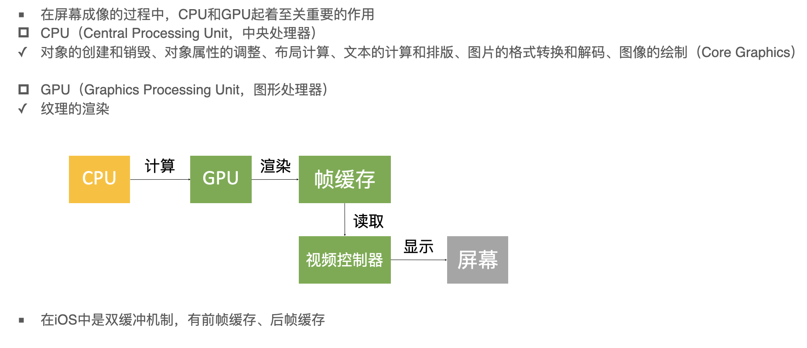

[TOC]


# GPU和CPU



# 卡顿

## 原因

- CPU处理后GPU处理,若垂直同步信号早于GPU处理的速度那么会形成掉帧问题
- 按照60FPS的刷帧率，每隔16ms就会有一次VSync信号

## 优化 - CPU

- 尽量使用轻量级的对象，比如用不到事件处理的地方，可以考虑使用CALayer 替代 UIView
  - UIView和CALayer的区别？
    - CALayer是UIView的一个成员
    - CALayer是专门用来显示东西的
    - UIView是用来负责监听点击事件等
- 不要频繁的调用UIView的相关属性，比如frame、bounds、transform等属性，尽量减少不必要的修改。
- 尽量提前计算好布局，在有需要时一次性调整好对应的属性，不要多次修改属性。
- Autolayout会比直接设置frame消耗更多的CPU资源
- 图片的size最好跟UIImageView的size保持一致
  - 因为如果超出或者UIImageView会对图片进行伸缩的处理
- 控制线程的最大并发数量
- 尽量把一些耗时的操作放到子线程
  - 文本处理（储存计算和绘制）
  - 图片处理（解码、绘制）

## 优化 - GPU

- 尽量减少视图数量和层次
- 尽量避免短时间内大量图片的显示，尽可能将多张图片合成一张进行显示
- GPU能处理的最大纹理尺寸是4096x4096，一旦超过这个尺寸，机会占用CPU资源进行处理，所以纹理尽量不要超过这个尺寸。
- 减少透明视图（alpha < 1），不透明的就设置opaque为YES
- 尽量避免出现离屏渲染

# 离屏渲染

## 概述

- 在OpenGL中，GPU有2中渲染方式

  - On-Screen Rendering: 当前屏幕渲染，在当前用于显示的屏幕缓冲区进行渲染操作。
  - Off-Screen Rendering: 离屏渲染，在当前屏幕缓冲区以外新开辟一个缓冲区进行渲染操作

## 原因

  - 需要创建新的缓冲区
  - 离屏渲染的整个过程，需要多次切换上下文环境，先是从当前屏幕（On-Screen）切换到离屏（Off-Screen）；等到离屏渲染结束后，将离屏缓冲区的渲染结果显示到屏幕上，又需要将上下文环境从离屏切换到当前屏幕

- 哪些操作会触发离屏渲染

  - 光栅化  layer.shouldRasterize = YES;
  - 遮罩，layer.mask
  - 圆角，同时设置layer.maskToBounds = YES、layer.cornerRadius大于0

    - 考虑通过CoreGraphics绘制圆角，或者美工直接提供。
  - 阴影 layer.shadowXXX
    - 如果设置了layer.shadowPath就不会产生离屏渲染

- 设置圆角的几种方法

  - 第一种方法:通过设置layer的属性

    ```objective-c
    imageView.layer.masksToBounds = YES;
    [self.view addSubview:imageView];
    ```

  - 第二种方法:使用贝塞尔曲线UIBezierPath和Core Graphics框架画出一个圆角

    ```objc
    UIImageView *imageView = [[UIImageView alloc]initWithFrame:CGRectMake(100, 100, 100, 100)];
    imageView.image = [UIImage imageNamed:@"1"];
    //开始对imageView进行画图
    UIGraphicsBeginImageContextWithOptions(imageView.bounds.size, NO, 1.0);
    //使用贝塞尔曲线画出一个圆形图
    [[UIBezierPath bezierPathWithRoundedRect:imageView.bounds cornerRadius:imageView.frame.size.width] addClip];
    [imageView drawRect:imageView.bounds];
    
    imageView.image = UIGraphicsGetImageFromCurrentImageContext();
     //结束画图
    UIGraphicsEndImageContext();
    [self.view addSubview:imageView];
    ```

  - 第三种方法:使用CAShapeLayer和UIBezierPath设置圆角

    ```objective-c
    #import "ViewController.h"
    @interface ViewController ()
    @end
    @implementation ViewController
    
    - (void)viewDidLoad {
     [super viewDidLoad];
    UIImageView *imageView = [[UIImageView alloc]initWithFrame:CGRectMake(100, 100, 100, 100)];
    imageView.image = [UIImage imageNamed:@"1"];
    UIBezierPath *maskPath = [UIBezierPath bezierPathWithRoundedRect:imageView.bounds byRoundingCorners:UIRectCornerAllCorners cornerRadii:imageView.bounds.size];
    
    CAShapeLayer *maskLayer = [[CAShapeLayer alloc]init];
    //设置大小
    maskLayer.frame = imageView.bounds;
    //设置图形样子
    maskLayer.path = maskPath.CGPath;
    imageView.layer.mask = maskLayer;
    [self.view addSubview:imageView];
    }
    推荐第三种方式，对内存的消耗最少，渲染速度快
    ```

  - 阴影， layer.shadowXXX

    - 如果设置了layer.shadowPath就不会产生

## 如何检测

- 模拟器debug-选中color Offscreen - Renderd离屏渲染的图层高亮成黄 可能存在性能问题
- 真机Instrument-选中Core Animation-勾选Color Offscreen-Rendered Yellow

**离屏渲染的触发方式**

设置了以下属性时，都会触发离屏绘制：

1、layer.shouldRasterize（光栅化）

光栅化概念：将图转化为一个个栅格组成的图象

光栅化特点：每个元素对应帧缓冲区中的一像素

2、masks（遮罩）

3、shadows（阴影）

4、edge antialiasing（抗锯齿）

5、group opacity（不透明）

6、复杂形状设置圆角等

7、渐变

8、drawRect

例如我们日程经常打交道的TableViewCell,因为TableViewCell的重绘是很频繁的（因为Cell的复用）,如果Cell的内容不断变化,则Cell需要不断重绘,如果此时设置了cell.layer可光栅化。则会造成大量的离屏渲染,降低图形性能。

如果将不在GPU的当前屏幕缓冲区中进行的渲染都称为离屏渲染，那么就还有另一种特殊的“离屏渲染”方式：CPU渲染。如果我们重写了drawRect方法，并且使用任何Core Graphics的技术进行了绘制操作，就涉及到了CPU渲染。整个渲染过程由CPU在App内同步地完成，渲染得到的bitmap最后再交由GPU用于显示。

现在摆在我们面前得有三个选择：当前屏幕渲染、离屏渲染、CPU渲染，该用哪个呢？这需要根据具体的使用场景来决定。

**尽量使用当前屏幕渲染**

鉴于离屏渲染、CPU渲染可能带来的性能问题，一般情况下，我们要尽量使用当前屏幕渲染。

**离屏渲染 VS CPU渲染**

由于GPU的浮点运算能力比CPU强，CPU渲染的效率可能不如离屏渲染；但如果仅仅是实现一个简单的效果，直接使用CPU渲染的效率又可能比离屏渲染好，毕竟离屏渲染要涉及到缓冲区创建和上下文切换等耗时操作

UIButton 的 masksToBounds = YES又设置setImage、setBackgroundImage、[button setBackgroundColor:[UIColor colorWithPatternImage:[UIImage imageNamed:@"btn_selected"]]];

下发生离屏渲染，但是[button setBackgroundColor:[UIColor redColor]];是不会出现离屏渲染的

关于 UIImageView,现在测试发现(现版本: iOS10),在性能的范围之内,给UIImageView设置圆角是不会触发离屏渲染的,但是同时给UIImageView设置背景色则肯定会触发.触发离屏渲染跟 png.jpg格式并无关联

日常我们使用layer的两个属性，实现圆角

imageView.layer.cornerRaidus = CGFloat(10);

imageView.layer.masksToBounds = YES;

这样处理的渲染机制是GPU在当前屏幕缓冲区外新开辟一个渲染缓冲区进行工作，也就是离屏渲染，这会给我们带来额外的性能损耗。如果这样的圆角操作达到一定数量，会触发缓冲区的频繁合并和上下文的的频繁切换，性能的代价会宏观地表现在用户体验上——掉帧

# 卡顿

## 检测

- 平时所说的“卡顿”主要是因为在主线程执行了比较耗时的操作
- 可以添加Observer到主线程RunLoop中，通过监听RunLoop状态切换的耗时，以达到监控卡顿的目的
- 参考代码：[GitHub - UIControl/LXDAppFluecyMonitor](https://github.com/UIControl/LXDAppFluecyMonitor)

## 有哪些，怎么解决

1. 主线程中进行IO或其他耗时操作
   - 解决：把耗时操作放到子线程中操作
2. GCD并发队列短时间内创建大量任务
   - 解决：使用线程池
3. 文本计算
   - 解决：把计算放在子线程中避免阻塞主线程
4. 大量图像的绘制
   - 解决：在子线程中对图片进行解码之后再展示
5. 高清图片的展示
   - 解法：可在子线程中进行下采样处理之后再展示
6. 列表
   - 最常用的就是cell的重用， 注册重用标识符
     - 如果不重用cell时，每当一个cell显示到屏幕上时，就会重新创建一个新的cell；

     - 如果有很多数据的时候，就会堆积很多cell。

     - 如果重用cell，为cell创建一个ID，每当需要显示cell 的时候，都会先去缓冲池中寻找可循环利用的cell，如果没有再重新创建cell
   - 避免cell的重新布局
     - cell的布局填充等操作 比较耗时，一般创建时就布局好
     - 如可以将cell单独放到一个自定义类，初始化时就布局好
   - 提前计算并缓存cell的属性及内容

     - 当我们创建cell的数据源方法时，编译器并不是先创建cell 再定cell的高度

     - 而是先根据内容一次确定每一个cell的高度，高度确定后，再创建要显示的cell，滚动时，每当cell进入屏幕区都会计算高度，提前估算高度告诉编译器，编译器知道高度后，紧接着就会创建cell，这时再调用高度的具体计算方法，这样可以方式浪费时间去计算显示以外的cell
   - 减少cell中控件的数量
     - 尽量使cell得布局大致相同，不同风格的cell可以使用不用的重用标识符
     - 初始化时添加控件，不适用的可以先隐藏
   - 不要使用ClearColor，无背景色，透明度也不要设置为0，否则渲染耗时比较长
   - 使用局部更新，如果只是更新某组的话，使用reloadSection进行局部更新
   - 加载网络数据，下载图片，使用异步加载，并缓存
   - 懒加载,不要一次性创建所有的subview,而是需要时才创建.
   - 按需加载cell，cell滚动很快时，只加载范围内的cell
   - 不要实现无用的代理方法，tableView只遵守两个协议
   - 缓存行高：estimatedHeightForRow不能和HeightForRow里面的layoutIfNeed同时存在，这两者同时存在才会出现“窜动”的bug。所以我的建议是：只要是固定行高就写预估行高来减少行高调用次数提升性能。如果是动态行高就不要写预估方法了，用一个行高的缓存字典来减少代码的调用次数即可
   - 不要做多余的绘制工作。在实现drawRect:的时候，它的rect参数就是需要绘制的区域，这个区域之外的不需要进行绘制。例如上例中，就可以用CGRectIntersectsRect、CGRectIntersection或CGRectContainsRect判断是否需要绘制image和text，然后再调用绘制方法。
   - 预渲染图像。当新的图像出现时，仍然会有短暂的停顿现象。解决的办法就是在bitmap context里先将其画一遍，导出成UIImage对象，然后再绘制到屏幕
   - 避免庞大的xib,storyBoard,尽量使用纯代码开发
   - 使用正确的数据结构来存储数据
     - NSArray,使用index来查找很快(插入和删除很慢)
     - 字典,使用键来查找很快

     - NSSets,是无序的,用键查找很快,插入/删除很快

# 耗电

## 来源

- CPU处理  Processing
- 网络     Networking
- 定位     Location
- 图像     Graphice

## 优化

- 尽可能降低CPU、GPU的功耗
- 少用定时器

### I/O操作

  - 尽量不要频繁的写入小数据，最好批量一次性写入
  - 读写大量重要的数据的时候，考虑使用dispatch_io，其提供了基于GCD的异步操作文件I/O的API。用dispatch_io系统会优化磁盘访问
  - 数据量比较大的，建议使用数据库（比如SQList、CoreData）

### 网络

  - 减少压缩网络数据 （XML -> JSON -> ProtoBuf），如果可能建议使用 ProtoBuf
  - 如果请求的返回数据相同，可以使用 NSCache 进行缓存
  - 使用断点续传，否则网络不稳定时可能多次传输相同的内容
  - 网络不可用时尽量不要尝试执行网络请求
  - 让用户可以取消长时间运行或者网络速度很慢的网络操作，设置合理的超时时间
  - 批量传输，比如：下载视频流时，不要传输很小的数据包，直接下载整个文件或者一大块一大块的下载，如果下载广告，一次性多下载一些，然后慢慢展示。如果下载电子邮件，一次下载多封,不要一封一封的下载。
  - 优化DNS解析和缓存
- 对传输的数据进行压缩，减少传输的数据
- 使用缓存手段减少请求的发起次数
- 使用策略来减少请求的发起次数，比如在上一个请求未着地之前，不进行新的请求
- 避免网络抖动，提供重发机制

### 定位

  - 如果只需要快速确定用户位置，最好用CLLocationManager的requestLocation方法。定位完成之后，会自动让定位硬件断电
  - 如果不是导航应用，尽量不要实时更新位置，定位完毕之后就关掉定位服务
  - 尽量降低定位的精准度，如果没有需求的话尽量使用低精准度的定位。随软件自身要求
  - 如果需要后台定位，尽量设置pausesLocationUpdatasAutomatically为YES，如果用户不太可能移动的时候系统会自动暂停位置更新
  - 尽量不要使用 startMonitoringSignificantLocationChanges，优先考虑 startMonitoringForRegion
### 硬件检测优化

  - 用户移动、摇晃、倾斜设备时，会产生动作(motion)事件，这些事件由加速度计、陀螺仪、磁力计等硬件检测。在不需要检测的场合，应该及时关闭这些硬件

# App的启动

## 概述

- APP的启动可以分为2种
  - 冷启动（Cold Launch）：从零开始启动APP
  - 热启动（Warm Launch）：APP已经在内存中，在后台存活着，再次点击图标启动APP

- APP启动时间的优化，主要是针对冷启动进行优化
- 通过添加环境变量可以打印出APP的启动时间分析（Edit scheme -> Run -> Arguments）
  - `DYLD_PRINT_STATISTICS`设置为1
  - 如果需要更详细的信息，那就将DYLD_PRINT_STATISTICS_DETAILS设置为1

## 冷启过程


- dyld（dynamic link editor），Apple的动态链接器，可以用来装载Mach-O文件（可执行文件、动态库等）
- 启动APP时，dyld所做的事情有
  - 装载APP的可执行文件，同时会递归加载所有依赖的动态库
  - 当dyld把可执行文件、动态库都装载完毕后，会通知Runtime进行下一步的处理
- 启动APP时，runtime所做的事情有
  - 调用`map_images`进行可执行文件内容的解析和处理
  - 在`load_images`中调用`call_load_methods`，调用所有Class和Category的+load方法
  - 进行各种objc结构的初始化（注册Objc类 、初始化类对象等等）
  - 调用C++静态初始化器和`__attribute__((constructor))`修饰的函数

- 到此为止，可执行文件和动态库中所有的符号(Class，Protocol，Selector，IMP，…)都已经按格式成功加载到内存中，被runtime 所管理

- 总结一下
  - APP的启动由dyld主导，将可执行文件加载到内存，顺便加载所有依赖的动态库
  - 并由runtime负责加载成objc定义的结构
  - 所有初始化工作结束后，dyld就会调用main函数
  - 接下来就是UIApplicationMain函数，AppDelegate的application:didFinishLaunchingWithOptions:方法

## 优化

- 按照不同的阶段

- dyld
  - 减少动态库、合并一些动态库（定期清理不必要的动态库）
  - 减少Objc类、分类的数量、减少Selector数量（定期清理不必要的类、分类）
  - 减少C++虚函数数量
  - Swift尽量使用struct

- runtime
  - 用+initialize方法和dispatch_once取代所有的__attribute__((constructor))、C++静态构造器、ObjC的+load

- main
  - 在不影响用户体验的前提下，尽可能将一些操作延迟，不要全部都放在finishLaunching方法中
  - 按需加载

# 安装包瘦身

## 概述

- 安装包（IPA）主要由可执行文件、资源组成

## 优化

- 资源（图片、音频、视频等）

  - 采用无损压缩
  - 去除没用到的资源文件（[GitHub -查询多余的资源文件_下载链接](https://github.com/tinymind/LSUnusedResources)）
- 可执行文件瘦身

  - 编译器优化

    - Strip Linked Product、Make Strings Read-Only、Symbols Hidden by Default设置为YES
    - 去掉异常支持，Enable C++ Exceptions、Enable Objective-C Exceptions设置为NO，Other C Flags添加-fno-exceptions
  - 利用AppCode（[AppCode下载链接](https://www.jetbrains.com/objc/)）检测未使用的代码:
  
    - 菜单栏 -> Code -> inspect Code
  - 编写LLVM插件检测出重复代码、未被调用的代码
  - 生成LinkMap文件，可以查看可执行文件的具体组成
  - 可借助第三方工具解析LinkMap文件 [GitHub -检查每个类占用空间大小工具_下载链接](https://github.com/huanxsd/LinkMap)


#### 一、入门级

1、用ARC管理内存
 2、在正确的地方使用 reuseIdentifier
 3、尽量把views设置为透明
 4、避免过于庞大的XIB
 5、不要阻塞主线程

6、在ImageViews中调整图片大小。如果要在UIImageView中显示一个来自bundle的图片，你应保证图片的大小和UIImageView的大小相同。在运行中缩放图片是很耗费资源的，特别是UIImageView嵌套在UIScrollView中的情况下。如果图片是从远端服务加载的你不能控制图片大小，比如在下载前调整到合适大小的话，你可以在下载完成后，最好是用background
 thread，缩放一次，然后在UIImageView中使用缩放后的图片。

7、选择正确的Collection。

- Arrays: 有序的一组值。使用index来lookup很快，使用value lookup很慢， 插入/删除很慢。
- Dictionaries: 存储键值对。 用键来查找比较快。
- Sets: 无序的一组值。用值来查找很快，插入/删除很快。

8、打开gzip压缩。app可能大量依赖于服务器资源，问题是我们的目标是移动设备，因此你就不能指望网络状况有多好。减小文档的一个方式就是在服务端和你的app中打开gzip。这对于文字这种能有更高压缩率的数据来说会有更显著的效用。
 iOS已经在NSURLConnection中默认支持了gzip压缩，当然AFNetworking这些基于它的框架亦然。

#### 二、中级

1、重用和延迟加载(lazy load) Views

- 更多的view意味着更多的渲染，也就是更多的CPU和内存消耗，对于那种嵌套了很多view在UIScrollView里边的app更是如此。
- 这里我们用到的技巧就是模仿UITableView和UICollectionView的操作: 不要一次创建所有的subview，而是当需要时才创建，当它们完成了使命，把他们放进一个可重用的队列中。这样的话你就只需要在滚动发生时创建你的views，避免了不划算的内存分配。

2、Cache, Cache, 还是Cache!

- 一个极好的原则就是，缓存所需要的，也就是那些不大可能改变但是需要经常读取的东西。
- 我们能缓存些什么呢？一些选项是，远端服务器的响应，图片，甚至计算结果，比如UITableView的行高。
- NSCache和NSDictionary类似，不同的是系统回收内存的时候它会自动删掉它的内容。

3、权衡渲染方法.性能能还是要bundle保持合适的大小。

4、处理内存警告.移除对缓存，图片object和其他一些可以重创建的objects的strong references.

5、重用大开销对象

6、一些objects的初始化很慢，比如NSDateFormatter和NSCalendar。然而，你又不可避免地需要使用它们，比如从JSON或者XML中解析数据。想要避免使用这个对象的瓶颈你就需要重用他们，可以通过添加属性到你的class里或者创建静态变量来实现。

7、避免反复处理数据.在服务器端和客户端使用相同的数据结构很重要。

8、选择正确的数据格式.解析JSON会比XML更快一些，JSON也通常更小更便于传输。从iOS5起有了官方内建的JSON deserialization 就更加方便使用了。但是XML也有XML的好处，比如使用SAX 来解析XML就像解析本地文件一样，你不需像解析json一样等到整个文档下载完成才开始解析。当你处理很大的数据的时候就会极大地减低内存消耗和增加性能。

9、正确设定背景图片

- 全屏背景图，在view中添加一个UIImageView作为一个子View
- 只是某个小的view的背景图，你就需要用UIColor的colorWithPatternImage来做了，它会更快地渲染也不会花费很多内存：

10、减少使用Web特性。想要更高的性能你就要调整下你的HTML了。第一件要做的事就是尽可能移除不必要的javascript，避免使用过大的框架。能只用原生js就更好了。尽可能异步加载例如用户行为统计script这种不影响页面表达的javascript。注意你使用的图片，保证图片的符合你使用的大小。

11、Shadow Path 。CoreAnimation不得不先在后台得出你的图形并加好阴影然后才渲染，这开销是很大的。使用shadowPath的话就避免了这个问题。使用shadow path的话iOS就不必每次都计算如何渲染，它使用一个预先计算好的路径。但问题是自己计算path的话可能在某些View中比较困难，且每当view的frame变化的时候你都需要去update shadow path.

12、优化Table View

- 正确使用reuseIdentifier来重用cells
- 尽量使所有的view opaque，包括cell自身
- 避免渐变，图片缩放，后台选人
- 缓存行高
- 如果cell内现实的内容来自web，使用异步加载，缓存请求结果
- 使用shadowPath来画阴影
- 减少subviews的数量
- 尽量不适用cellForRowAtIndexPath:，如果你需要用到它，只用-一次然后缓存结果
- 使用正确的数据结构来存储数据
- 使用rowHeight, sectionFooterHeight 和 sectionHeaderHeight来设定固定的高，不要请求delegate

13、选择正确的数据存储选项

- NSUserDefaults的问题是什么？虽然它很nice也很便捷，但是它只适用于小数据，比如一些简单的布尔型的设置选项，再大点你就要考虑其它方式了
- XML这种结构化档案呢？总体来说，你需要读取整个文件到内存里去解析，这样是很不经济的。使用SAX又是一个很麻烦的事情。
- NSCoding？不幸的是，它也需要读写文件，所以也有以上问题。
- 在这种应用场景下，使用SQLite 或者 Core Data比较好。使用这些技术你用特定的查询语句就能只加载你需要的对象。
- 在性能层面来讲，SQLite和Core Data是很相似的。他们的不同在于具体使用方法。
- Core Data代表一个对象的graph model，但SQLite就是一个DBMS。
- Apple在一般情况下建议使用Core Data，但是如果你有理由不使用它，那么就去使用更加底层的SQLite吧。
- 如果你使用SQLite，你可以用FMDB这个库来简化SQLite的操作，这样你就不用花很多经历了解SQLite的C API了。

#### 三、高级

1、加速启动时间。快速打开app是很重要的，特别是用户第一次打开它时，对app来讲，第一印象太太太重要了。你能做的就是使它尽可能做更多的异步任务，比如加载远端或者数据库数据，解析数据。避免过于庞大的XIB，因为他们是在主线程上加载的。所以尽量使用没有这个问题的Storyboards吧！一定要把设备从Xcode断开来测试启动速度

2、使用Autorelease Pool。NSAutoreleasePool`负责释放block中的autoreleased objects。一般情况下它会自动被UIKit调用。但是有些状况下你也需要手动去创建它。假如你创建很多临时对象，你会发现内存一直在减少直到这些对象被release的时候。这是因为只有当UIKit用光了autorelease pool的时候memory才会被释放。消息是你可以在你自己的@autoreleasepool里创建临时的对象来避免这个行为。

3、选择是否缓存图片。常见的从bundle中加载图片的方式有两种，一个是用imageNamed，二是用imageWithContentsOfFile，第一种比较常见一点。

4、避免日期格式转换。如果你要用NSDateFormatter来处理很多日期格式，应该小心以待。就像先前提到的，任何时候重用NSDateFormatters都是一个好的实践。如果你可以控制你所处理的日期格式，尽量选择Unix时间戳。你可以方便地从时间戳转换到NSDate:

```objectivec
    - (NSDate*)dateFromUnixTimestamp:(NSTimeInterval)timestamp {
    return[NSDate dateWithTimeIntervalSince1970:timestamp];
    }
    
```

这样会比用C来解析日期字符串还快！需要注意的是，许多web API会以微秒的形式返回时间戳，因为这种格式在javascript中更方便使用。记住用dateFromUnixTimestamp之前除以1000就好了。

**平时你是如何对代码进行性能优化的？**

- 利用性能分析工具检测，包括静态 Analyze 工具，以及运行时 Profile 工具，通过Xcode工具栏中Product->Profile可以启动,
- 比如测试程序启动运行时间，当点击Time Profiler应用程序开始运行后.就能获取到整个应用程序运行消耗时间分布和百分比.为了保证数据分析在统一使用场景真实需要注意一定要使用真机,因为此时模拟器是运行在Mac上，而Mac上的CPU往往比iOS设备要快。
- 为了防止一个应用占用过多的系统资源，开发iOS的苹果工程师门设计了一个“看门狗”的机制。在不同的场景下，“看门狗”会监测应用的性能。如果超出了该场景所规定的运行时间，“看门狗”就会强制终结这个应用的进程。开发者们在crashlog里面，会看到诸如0x8badf00d这样的错误代码。

**优化Table View**

- 正确使用reuseIdentifier来重用cells
- 尽量使所有的view opaque，包括cell自身
- 如果cell内现实的内容来自web，使用异步加载，缓存请求结果
   减少subviews的数量
- 尽量不适用cellForRowAtIndexPath:，如果你需要用到它，只用一次然后缓存结果
- 使用rowHeight, sectionFooterHeight和sectionHeaderHeight来设定固定的高，不要请求delegate

**UIImage加载图片性能问题**

- imagedNamed初始化
- imageWithContentsOfFile初始化
- imageNamed默认加载图片成功后会内存中缓存图片,这个方法用一个指定的名字在系统缓存中查找并返回一个图片对象.如果缓存中没有找到相应的图片对象,则从指定地方加载图片然后缓存对象，并返回这个图片对象.
- imageWithContentsOfFile则仅只加载图片,不缓存.
- 加载一张大图并且使用一次，用imageWithContentsOfFile是最好,这样CPU不需要做缓存节约时间.
- 使用场景需要编程时，应该根据实际应用场景加以区分，UIimage虽小，但使用元素较多问题会有所凸显.
  - 不要在viewWillAppear 中做费时的操作：viewWillAppear: 在view显示之前被调用，出于效率考虑，方法中不要处理复杂费时操作；在该方法设置 view 的显示属性之类的简单事情，比如背景色，字体等。否则，会明显感觉到 view 有卡顿或者延迟。
  - 在正确的地方使用reuseIdentifier：table view用 tableView:cellForRowAtIndexPath:为rows分配cells的时候，它的数据应该重用自UITableViewCell。
  - 尽量把views设置为透明：如果你有透明的Views你应该设置它们的opaque属性为YES。系统用一个最优的方式渲染这些views。这个简单的属性在IB或者代码里都可以设定。
  - 避免过于庞大的XIB：尽量简单的为每个Controller配置一个单独的XIB，尽可能把一个View Controller的view层次结构分散到单独的XIB中去, 当你加载一个引用了图片或者声音资源的nib时，nib加载代码会把图片和声音文件写进内存。
  - 不要阻塞主线程：永远不要使主线程承担过多。因为UIKit在主线程上做所有工作，渲染，管理触摸反应，回应输入等都需要在它上面完成,大部分阻碍主进程的情形是你的app在做一些牵涉到读写外部资源的I/O操作，比如存储或者网络。
     dispatch_async(dispatch_get_global_queue(DISPATCH_QUEUE_PRIORITY_DEFAULT,   0), ^{
     // 选择一个子线程来执行耗时操作
     dispatch_async(dispatch_get_main_queue(), ^{
     // 返回主线程更新UI
     });
     });
  - 在Image Views中调整图片大小
     如果要在UIImageView中显示一个来自bundle的图片，你应保证图片的大小和UIImageView的大小相同。在运行中缩放图片是很耗费资源的.

**讲讲你用Instrument优化动画性能的经历吧**

```cpp
Apple的instrument为开发者提供了各种template去优化app性能和定位问题。很多公司都在赶feature，并没有充足的时间来做优化，导致不少开发者对instrument不怎么熟悉。但这里面其实涵盖了非常完整的计算机基础理论知识体系，memory，disk，network，thread，cpu，gpu等等，顺藤摸瓜去学习，是一笔巨大的知识财富。动画性能只是其中一个template，重点还是理解上面问题当中CPU GPU如何配合工作的知识。
```

**facebook启动时间优化**

1.瘦身请求依赖
 2.UDP启动请求先行缓存
 3.队列串行化处理启动响应

