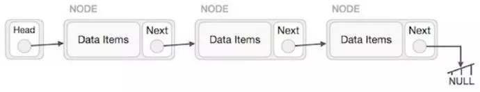
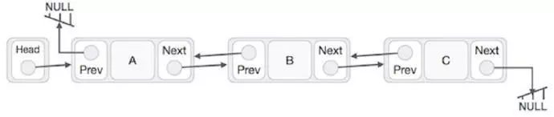

#### 集合结构 线性结构 树形结构 图形结构

- 1.1、集合结构 说白了就是一个集合，就是一个圆圈中有很多个元素，元素与元素之间没有任何关系  这个很简单
- 1.2、线性结构 说白了就是一个条线上站着很多个人。 这条线不一定是直的。也可以是弯的。也可以是值的 相当于一条线被分成了好几段的样子 （发挥你的想象力）。 线性结构是一对一的关系
- 1.3、树形结构 说白了  做开发的肯定或多或少的知道xml 解析  树形结构跟他非常类似。也可以想象成一个金字塔。树形结构是一对多的关系
- 1.4、图形结构 这个就比较复杂了。他呢 无穷。无边  无向（没有方向）图形机构 你可以理解为多对多 类似于我们人的交集关系

#### 数据结构的存储

数据结构的存储一般常用的有两种   顺序存储结构 和 链式存储结构

- 2.1  顺序存储结构

发挥想象力啊。 举个列子。数组。1-2-3-4-5-6-7-8-9-10。这个就是一个顺序存储结构 ，存储是按顺序的  举例说明啊。 栈。做开发的都熟悉。栈是先进后出 ，后进先出的形式 对不对 ？！他的你可以这样理解

hello world 在栈里面从栈底到栈顶的逻辑依次为 h-e-l-l-o-w-o-r-l-d 这就是顺序存储 再比如 队列 ，队列是先进先出的对吧，从头到尾 h-e-l-l-o-w-o-r-l-d 就是这样排对的

- 2.2 链式存储结构

再次发挥想象力 这个稍微复杂一点 这个图片我一直弄好 ，回头找美工问问，再贴上  例如 还是一个数组

1-2-3-4-5-6-7-8-9-10  链式存储就不一样了 1(地址)-2(地址)-7(地址)-4(地址)-5(地址)-9(地址)-8(地址)-3(地址)-6(地址)-10(地址)。每个数字后面跟着一个地址 而且存储形式不再是顺序 ，也就说顺序乱了，1（地址） 1后面跟着的这个地址指向的是2，2后面的地址指向的是3，3后面的地址指向是谁你应该清楚了吧。他执行的时候是 1(地址)-2(地址)-3(地址)-4(地址)-5(地址)-6(地址)-7(地址)-8(地址)-9(地址)-10(地址)，但是存储的时候就是完全随机的。明白了？！

#### 单向链表\双向链表\循环链表

还是举例子。理解最重要。不要去死记硬背 哪些什么。定义啊。逻辑啊。理解才是最重要滴

- 3.1 单向链表

A->B->C->D->E->F->G->H. 这就是单向链表 H 是头 A 是尾 像一个只有一个头的火车一样 只能一个头拉着跑

- 3.2 双向链表

> 数组和链表区别：
>  数组：数组元素在内存上连续存放，可以通过下标查找元素；插入、删除需要移动大量元素，比较适用于元素很少变化的情况
>  链表：链表中的元素在内存中不是顺序存储的，查找慢，插入、删除只需要对元素指针重新赋值，效率高

- 3.3 循环链表

循环链表是与单向链表一样，是一种链式的存储结构，所不同的是，循环链表的最后一个结点的指针是指向该循环链表的第一个结点或者表头结点，从而构成一个环形的链。发挥想象力  A->B->C->D->E->F->G->H->A. 绕成一个圈。就像蛇吃自己的这就是循环  不需要去死记硬背哪些理论知识。

#### 二叉树／平衡二叉树

- 4.1 什么是二叉树

树形结构下,两个节点以内 都称之为二叉树 不存在大于2 的节点 分为左子树 右子树 有顺序 不能颠倒 ，懵逼了吧，你肯定会想这是什么玩意，什么左子树右子树 ，都什么跟什么鬼？  现在我以普通话再讲一遍，你把二叉树看成一个人 ，人的头呢就是树的根 ，左子树就是左手，右子树就是右手，左右手可以都没有（残疾嘛，声明一下，绝非歧视残疾朋友，勿怪，勿怪就是举个例子，i am very sorry）  , 左右手呢可以有一个，就是不能颠倒。这样讲应该明白了吧

**二叉树有五种表现形式**

1.空的树（没有节点）可以理解为什么都没 像空气一样
 2.只有根节点。 （理解一个人只有一个头 其他的什么都没，说的有点恐怖）
 3.只有左子树 （一个头 一个左手 感觉越来越写不下去了）
 4.只有右子树
 5.左右子树都有

二叉树可以转换成森林 树也可以转换成二叉树。这里就不介绍了 你做项目绝对用不到
 数据结构大致介绍这么多吧。理解为主, 别死记，死记没什么用

