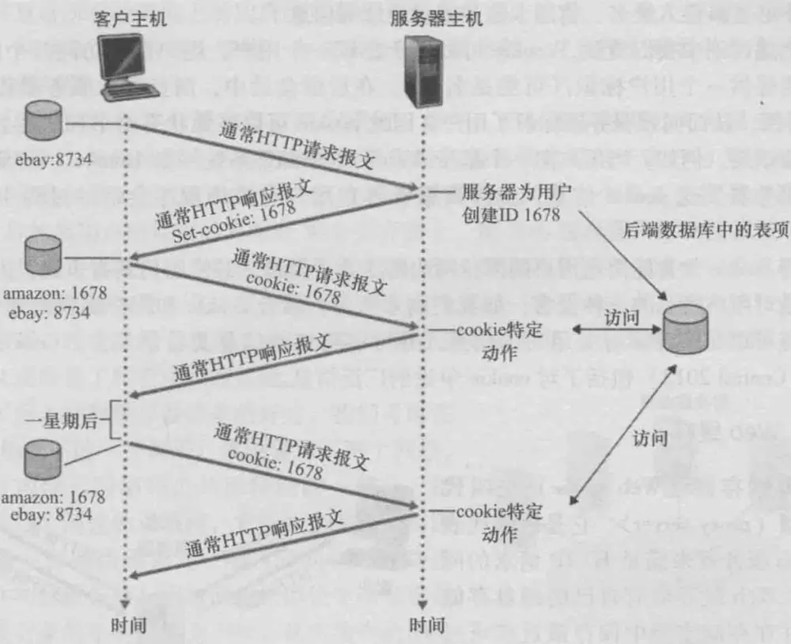
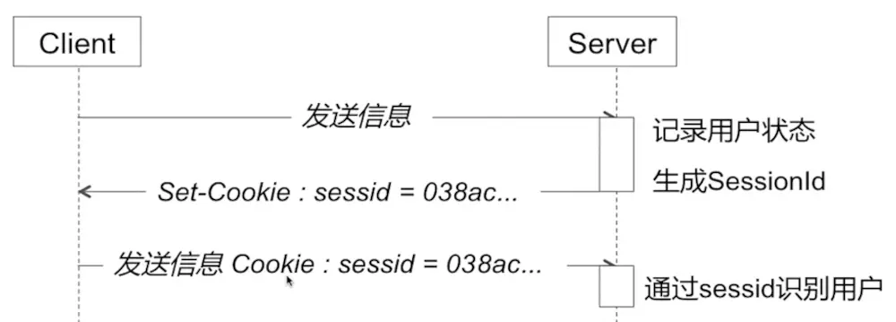

#### 一、Cookie

这里有说到，HTTP协议是无状态的，服务器中没有保存客户端的状态，客户端必须每次带上自己的状态去请求服务器
 基于HTTP这种特点，就产生了`cookie/session`

**1、用户与服务器的交互：Cookie**

`cookie`主要是用来记录用户状态，区分用户，**状态保存在客户端**。

- 1.首次访问`amazon`时，客户端发送一个HTTP请求到服务器端 。服务器端发送一个HTTP响应到客户端，其中包含`Set-Cookie`头部
- 2.客户端发送一个HTTP请求到服务器端，其中包含`Cookie`头部。服务器端发送一个HTTP响应到客户端
- 3.隔段时间再去访问时，客户端会直接发包含`Cookie`头部的HTTP请求。服务器端发送一个HTTP响应到客户端

cookie技术有4个组件：

- 1.在HTTP响应报文中的一个`cookie`首部行
- 2.在HTTP请求报文中的一个`cookie`首部行
- 3.在用户端系统中保留一个`cookie`文件，并由用户的浏览器进行管理
- 4.位于Web站点的一个后端数据库

也就是说，`cookie`功能需要浏览器的支持。如果浏览器不支持`cookie`（如大部分手机中的浏览器）或者把`cookie`禁用了，`cookie`功能就会失效。

**2、cookie的修改和删除**

在修改`cookie`的时候，只需要新`cookie`覆盖旧`cookie`即可，在覆盖的时候，由于`Cookie`具有不可跨域名性，注意`name、path、domain`需与原`cookie`一致
 删除`cookie`也一样，设置`cookie`的过期时间`expires`为过去的一个时间点，或者`maxAge = 0`(Cookie的有效期,单位为秒)即可

**3、cookie的安全**

事实上，`cookie`的使用存在争议，因为它被认为是对用户隐私的一种侵害，而且`cookie`并不安全
 HTTP协议不仅是`无状态`的，而且是`不安全`的。使用HTTP协议的数据不经过任何加密就直接在网络上传播，有被截获的可能。使用HTTP协议传输很机密的内容是一种隐患。

- 如果不希望`Cookie`在HTTP等非安全协议中传输，可以设置Cookie的`secure`属性为`true`。浏览器只会在HTTPS和SSL等安全协议中传输此类Cookie。
- 此外，`secure`属性并不能对Cookie内容加密，因而不能保证绝对的安全性。如果需要高安全性，需要在程序中对Cookie内容加密、解密，以防泄密。
- 也可以设置`cookie`为**HttpOnly**，如果在cookie中设置了**HttpOnly**属性，那么通过js脚本将无法读取到`cookie`信息，这样能有效的防止**XSS（跨站脚本攻击）**攻击

#### 二、Session

除了使用`Cookie`，Web应用程序中还经常使用**Session**来记录客户端状态。`Session`是服务器端使用的一种记录客户端状态的机制，使用上比`Cookie`简单一些，相应的也增加了服务器的存储压力。

Session是另一种记录客户状态的机制，不同的是**Cookie保存在客户端浏览器中，而Session保存在服务器上**。
 客户端浏览器访问服务器的时候，服务器把客户端信息以某种形式记录在服务器上。这就是`Session`。客户端浏览器再次访问时只需要从该`Session`中查找该客户的状态就可以了。

- 当程序需要为某个客户端的请求创建一个`session`时，服务器首先检查这个客户端的请求里是否已包含了一个`session`标识（称为`SessionId`）
- 如果已包含则说明以前已经为此客户端创建过session，服务器就按照SessionId把这个`session`检索出来，使用（检索不到，会新建一个）
- 如果客户端请求不包含`SessionId`，则为此客户端创建一个`session`并且生成一个与此`session`相关联的`SessionId`，`SessionId`的值应该是一个既不会重复，又不容易被找到规律以仿造的字符串，这个`SessionId`将被在本次响应中返回给客户端保存。
- 保存这个`SessionId`的方式可以采用`cookie`，这样在交互过程中浏览器可以自动的按照规则把这个标识发送给服务器。但`cookie`可以被人为的禁止，则必须有其他机制以便在`cookie`被禁止时仍然能够把`SessionId`传递回服务器。

#### 三、Cookie 和Session 的区别：

1、`cookie`数据存放在客户的浏览器上，`session`数据放在服务器上。
 2、`cookie`相比`session`不是很安全，别人可以分析存放在本地的`cookie`并进行`cookie`欺骗,考虑到安全应当使用session。
 3、`session`会在一定时间内保存在服务器上。当访问增多，会比较占用你服务器的性能,考虑到减轻服务器性能方面，应当使用`cookie`。
 4、单个`cookie`保存的数据不能超过4K，很多浏览器都限制一个站点最多保存20个`cookie`。而`session`存储在服务端，可以无限量存储
 5、所以：将登录信息等重要信息存放为`session`;其他信息如果需要保留，可以放在`cookie`中