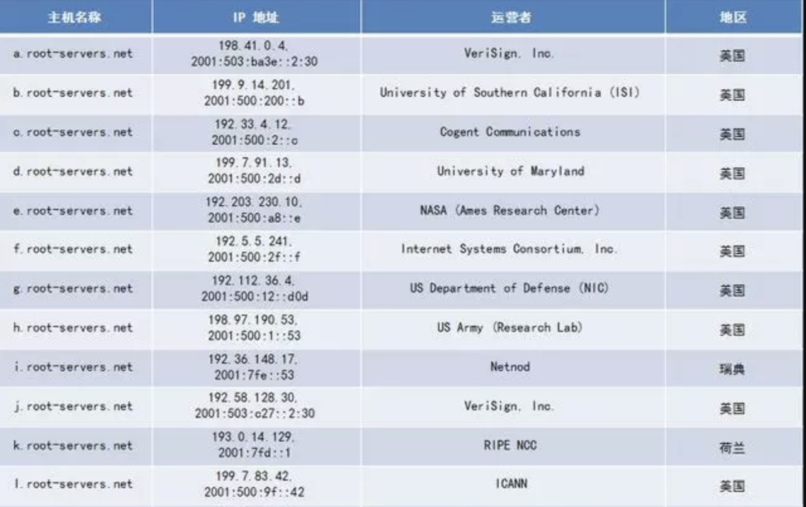
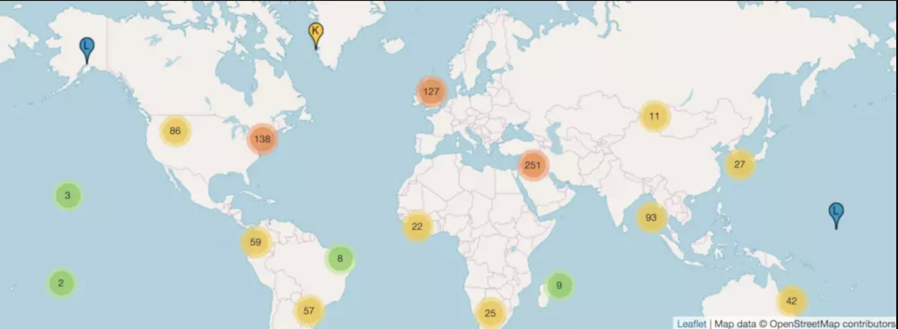
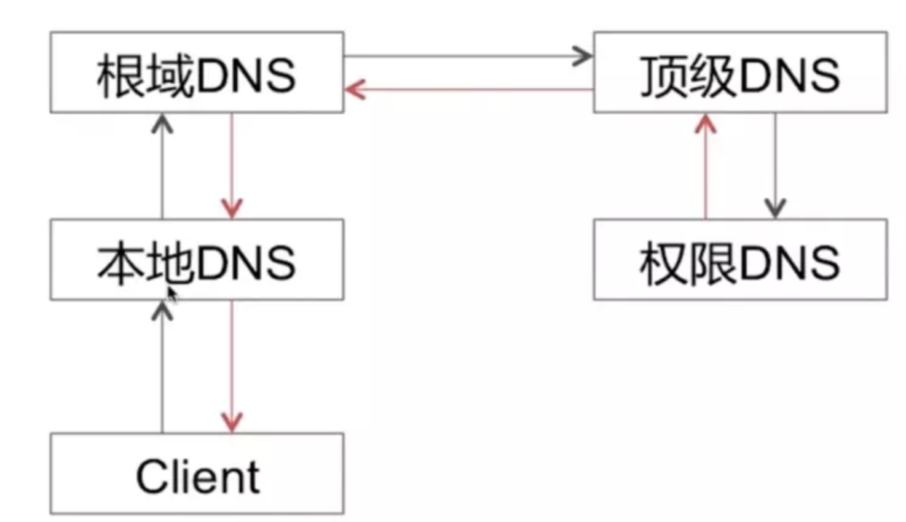
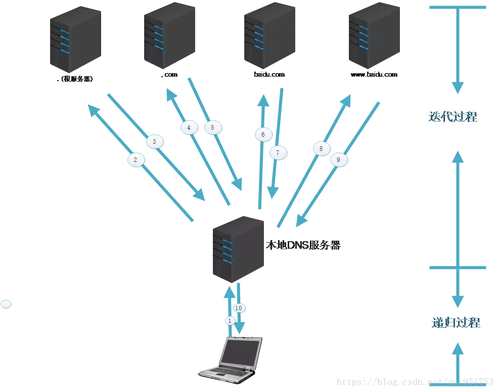
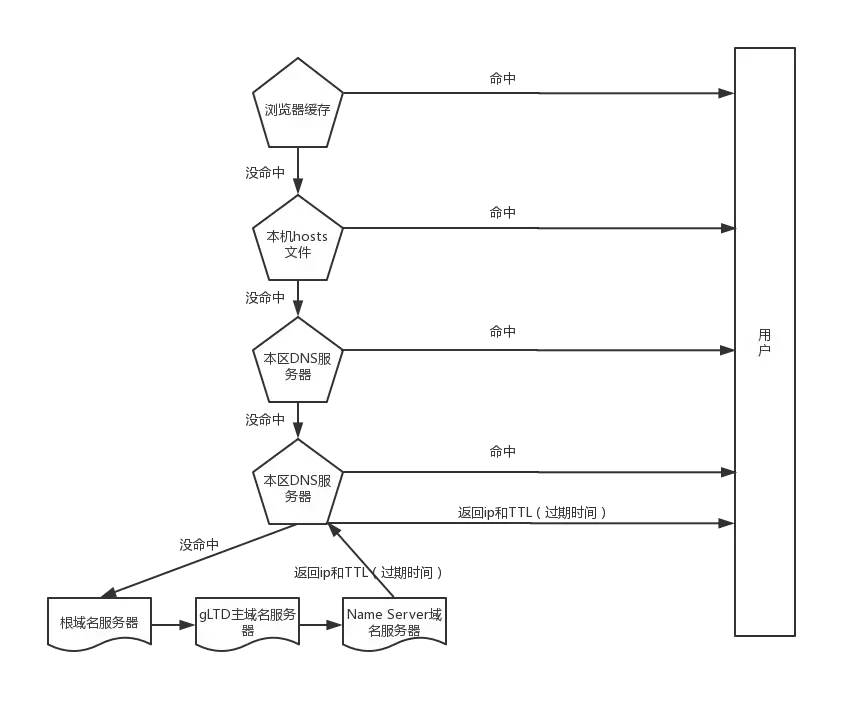
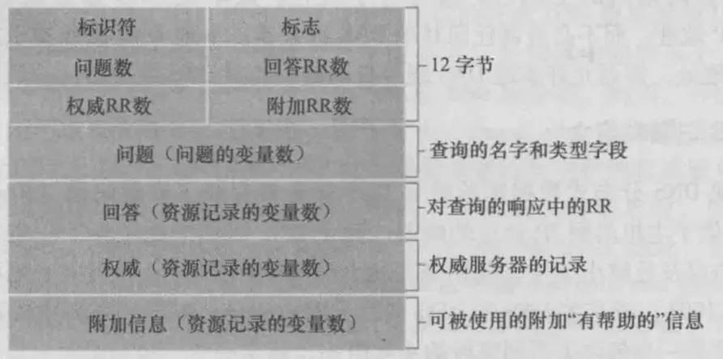

#### 一、DNS

因特网上的主机，可以使用多种方式标识，比如主机名或IP地址。

- 一种标识方法就是用它的**主机名（hostname）**，比如·[www.baidu.com](https://links.jianshu.com/go?to=http%3A%2F%2Fwww.baidu.com)、[www.google.com](https://links.jianshu.com/go?to=http%3A%2F%2Fwww.google.com)、[gaia.cs.umass.edu](https://links.jianshu.com/go?to=http%3A%2F%2Fgaia.cs.umass.edu)等。这方式方便人们记忆和接受，但是这种长度不一、没有规律的字符串路由器并不方便处理。
- 还有一种方式，就是直接使用定长的、有着清晰层次结构的IP地址，路由器比较热衷于这种方式。

为了折衷这两种方式，我们需要一种能进行主机名到IP地址转换的目录服务。这就是***域名系统（Domain Name System，DNS）**的主要任务。

**DNS**是：
 1、一个由分层的**DNS服务器**实现的分布式数据库
 2、一个使得主机能够查询分布式数据库的**应用层协议**

而DNS服务器通常是运行BIND软件的UNIX机器，DNS协议运行在**UDP**上，使用53号端口
 DNS通常是由其他应用层协议所使用的，包括`HTTP`、`SMTP`等。其作用则是：**将用户提供的主机名解析为IP地址**

DNS的一种简单设计就是在因特网上只使用一个DNS服务器，该服务器包含所有的映射。很明显这种设计是有很大的问题的：

- **单点故障**：如果该DNS服务器崩溃，全世界的网络随之瘫痪
- **通信容量**：单个DNS服务器必须处理所有DNS查询
- **远距离的集中式数据库**：单个DNS服务器必须面对所有用户，距离过远会有严重的时延。
- **维护**：该数据库过于庞大，还需要对新添加的主机频繁更新。

所以，DNS被设计成了一个**分布式、层次数据库**

#### 二、DNS服务器

为了处理扩展性问题，DNS使用了大量的DNS服务器，它们以层次方式组织，并且分布在全世界范围内。

域名服务器是提供域名解析的服务器，在有基本的知识下，任何人都可以搭建域名服务器，甚至是根域名服务器，有名的软件有：BIND

目前的DNS服务器大致分为3种类型的DNS服务器：根DNS服务器、顶级域DNS服务器、权威DNS服务器

**1、 根DNS服务器**

因特网上有13个根DNS服务器（标号A到M），1个为主根服务器在美国。其余12个均为辅根服务器，其中9个在美国，欧洲2个，位于英国和瑞典，亚洲1个位于日本。这里的个并不是指物理意义上的单个服务器，它是一个逻辑概念，根DNS服务器可以由分布在全球的多个服务器组成，形成一个集群，对外统一为1台逻辑的根DNS服务器（即每个标号下的根DNS服务器的IP地址是一样的）。而实际物理意义上的根DNS服务器，已超过千台
 [https://root-servers.org/](https://links.jianshu.com/go?to=https%3A%2F%2Froot-servers.org%2F) 这里可以查到所有根DNS服务器的分布

**2、顶级域（TLD）DNS服务器**

这些服务器负责顶级域名如com、org、net、edu和gov，以及所有国家的顶级域名如uk、fr、ca和cn

**3、权威DNS服务器**

在因特网上具有公共可访问主机的每个组织机构必须提供公共可访问的DNS记录，这些记录将这些主机的名字映射为IP地址。一个组织机构的权威DNS服务器收藏了这些DNS记录。

除此之外，还有一种很重要的DNS，成为**本地DNS服务器**，其严格来说不属于该服务器的层次结构，但它对DNS层次结构是重要的。每个**ISP** （互联网服务提供商），比如一个大学，一个公司或一个居民区的`ISP`，都有一台`本地DNS服务器`。

#### 三、DNS解析过程

**1、迭代查询和递归查询**

很清晰地显示出了一条DNS查询链：`本地DNS服务器`-->`根DNS服务器`-->`顶级域DNS服务器`-->`权威DNS服务器` ，所有查询都是递归的。
 这是**递归查询**。

这种利用了**迭代查询**和**递归查询**，从Client与本地DNS之间是**递归查询**，其余则是**迭代查询**。
 所谓 **递归查询**过程 就是 “查询的递交者” 更替, 而 **迭代查询**过程 则是 “查询的递交者”不变。
 从理论上讲，任何DNS查询既可以是迭代的也能是递归的。
 而在实际过程中，更常用的是图上 **从请求主机到本地DNS服务器的查询是递归，其余查询是迭代的**这种方式。

**2、DNS缓存**

**DNS缓存（DNS Caching）**：为了改善时延性能并减少在因特网上到处传输的DNS报文数量，DNS广泛使用了缓存技术。
 在一个请求链中，当某DNS服务器接收一个DNS回答时，它能将该回答中的信息缓存在本地存储器中。那么另一个对相同主机名的查询到达该DNS服务器时，该DNS服务器就可以提供所要求的IP地址，即使它不是该主机名的权威服务器。
 由于IP和主机名的映射并不是永久的，DNS服务器在一段时间后就会丢弃缓存的信息。
 本地DNS服务器也能够缓存TLD服务器的IP地址，从而允许本地DNS绕过查询链中的根DNS服务器。
 **而事实上，有DNS的地方，就有缓存。浏览器、操作系统、本地 DNS服务器、根DNS服务器，它们都会对DNS结果做一定程度的缓存。**

**3、DNS解析过程**

大致分为8步：

> - 1、发起基于域名的请求后，首先检查`本地缓存`（浏览器缓存-->操作系统的hosts文件）
> - 2、如果`本地缓存`中有，直接返回目标IP地址，否则将域名解析请求发送给`本地DNS服务器`
> - 3、如果`本地DNS服务器`中有，直接返回目标IP地址，到这一步基本能解析80%的域名。如果没有，`本地DNS服务器`将解析请求发送给`根DNS服务器`
> - 4、`根DNS服务器`会返回给`本地DNS服务器`一个所查询的`TLD服务器`地址列表
> - 5、`本地DNS服务器`再向上一步返回的`TLD服务器`发送请求，`TLD服务器`查询并返回域名对应的`权威域名服务器`的地址
> - 6、`本地DNS服务器`再向上一步返回的`权威域名服务器`发送请求，`权威域名服务器`会查询存储的域名和IP的映射关系表，将IP连同一个`TTL`（过期时间）值返回给`本地DNS服务器`
> - 7、`本地DNS服务器`会将IP和主机名的映射保存起来，保存时间由`TTL`来控制
> - 8、`本地DNS服务器`把解析的结果返回给用户，用户根据`TTL`值缓存在`本地系统缓存`中，域名解析过程结束

#### 四、DNS记录和报文

- **1、资源记录**

所有DNS服务器都存储了**资源记录（Resource Record，RR）**，其提供了主机名到IP的映射。
 资源记录是一个包含以下字段的四元组：
 **（Name，Value，Type，TTL）**
 TTL是该记录的生存时间，决定了资源记录应当从缓存中删除的时间。
 Name和Value的值取决于Type(以下涉及的foo,bar均为伪变量)：

- Type = A，则Name是主机名，Value使其对应的IP地址。这也是一个标准的主机名到IP地址的映射。如(replay1.bar.foo.com,145.37.93.126,A)
- Type = NS，则Name是个域（如`foo.com`），而Value是个知道如何获取该域中主机IP地址的权威DNS服务器的主机名，如(foo.com,dns.foo.com,NS)
- Type = CNAME,则Name是别名为Name的主机对应的规范主机名。该记录能够向查询的主机提供一个主机名对应的规范主机名，如（foo.com,replay1.bar.foo.com,CNAME）
- Type = MX，则Value是个别名为Name的邮件服务器的规范主机名。如（foo.com,main.bar.foo.com,MX）

**2、DNS报文**

DNS只有查询和回答两种报文，这两种报文格式是一样的。

- 前12个字节是**首部区域**。
   标识符用于标识该查询，这个标识符会被复制到对查询的回答报文中，以便让客户用它来匹配发送的请求和接收到的回答。
   标志字段中含有若干标志。1比特的“查询/回答”标志位指出报文是查询报文（0）还是回答报文（1）。当某DNS服务器是所请求名字的权威DNS服务器时，1比特的“权威的”标志位被置在回答报文中。此外，还有“希望递归”、“递归可用”等标志位。
   在首部中，还有4个数量相关的字段，指出来在首部后的4类数据区域出现的数量，其中RR是资源记录的意思。
- **问题区域**包含着正在进行的查询信息。该区域包括：️名字字段，指出正在被查询的主机名字；️类型字段，指出有关该名字的正被查询的问题类型，即上边说的四元组中的Type
- **回答区域**包含了对最初请求的名字的资源记录。在回答区域中可以包含多条RR，因此一个主机名理论上能够有多个IP地址（不同用户在不同地点访问同一个域名，可能会访问到不同的IP地址）
- **权威区域**中包含了其他权威服务器的记录
- **附加区域**包含了其他有帮助的记录

得知DNS的报文格式后，我们也就可以手动发送DNS查询包了。
 一个在线DNS查询的工具：[https://tool.lu/dns/index.html](https://links.jianshu.com/go?to=https%3A%2F%2Ftool.lu%2Fdns%2Findex.html)

#### 五、DNS解析安全问题

**1、DNS劫持**

一种可能的域名劫持方式即黑客侵入了宽带路由器并对终端用户的本地DNS服务器进行篡改，指向黑客自己伪造的本地DNS服务器，进而通过控制本地DNS服务器的逻辑返回错误的IP信息进行域名劫持。

另一方面，由于DNS解析主要是基于UDP协议，除了上述攻击行为外，攻击者还可以监听终端用户的域名解析请求，并在本地DNS服务器返回正确结果之前将伪造的DNS解析响应传递给终端用户，进而控制终端用户的域名访问行为。

**2、缓存污染（DNS污染）。**

我们知道在接收到域名解析请求时，本地DNS服务器首先会查找缓存，如果缓存命中就会直接返回缓存结果，不再进行递归DNS查询。这时候如果本地DNS服务器针对部分域名的缓存进行更改，比如将缓存结果指向第三方的广告页，就会导致用户的访问请求被引导到这些广告页地址上。

**3、如何解决DNS劫持？**

DNS解析发生在HTTP协议之前，DNS解析和DNS劫持和HTTP没有关系，DNS协议使用的是UDP协议向服务器的53端口进行请求。
 要想解决DNS劫持：

- 可以使用HttpDNS的方案：**使用 HTTP协议向DNS服务器的80端口进行请求**,来规避DNS劫持
   比如：`http://119.29.29.29/d?dn=domain&ip=clientIp`
- 在终端上，可以更换DNS服务器，不管手机还是电脑，都能手动配置DNS