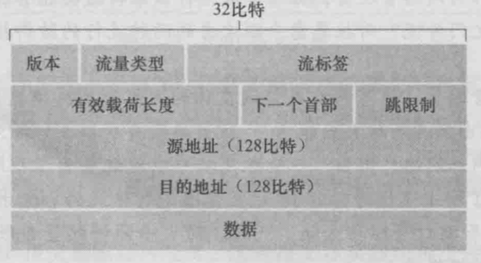
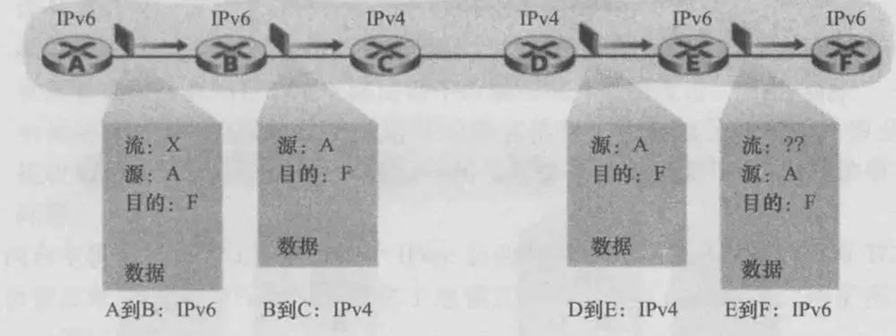
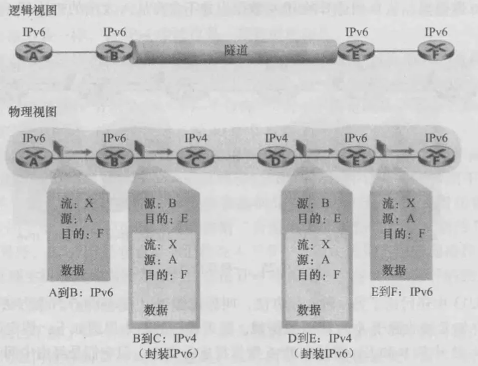

由于新的子网和IP结点以惊人的增长率连到因特网上，并被分配唯一的IP地址，32比特的IPv4地址空间即将用尽，为了解决这一问题，**IPv6**也应运而生。而事实上在20多年前，因特网工程任务组就开始致力于开发一种替代IPv4的协议，即**IPv6**

#### 一、IPv6数据报格式

###### 1、IPv6数据报格式

> - ***版本\***（4比特）
>    该字段用于标识IP版本号，IPv6将该字段值设为6。而如果将该字段设为4并不能创建一个合法的IPv4数据报
>
> - ***流量类型\***（8比特）
>    类似于IPv4数据报中的服务类型（TOS）
>
> - ***流标签\***（20比特）
>    流标签字段是IPv6数据报中新增的一个字段，用来标识一条数据报的流类型，以便在网络层区分不同的报文。
>
> - ***有效载荷长度\***（16比特）

IPv6数据报中在40定长字节数据报首部后的字节数量，即除了IPv6的数据报首部以外的其他部分的总长度

> - ***下一个首部\***（8比特）
>    当IPv6没有扩展报头时，该字段的作用和IPv4的协议字段一样。当含有扩展报头时，该字段的值即为第一个扩展报头的类型
>
> - ***跳限制\***（8比特）
>    与IPv4报文中的TTL字段类似，转发数据报的每台路由器将对该字段的内容减1.如果跳限制计数到达0，则该数据报将被丢弃
>
> - ***源地址和目的地址\***（各128比特）
>    记录源IP地址，目的IP地址
>
> - ***数据\***

可以看出，在IPv4数据报中出现的几个字段在IPv6数据报中已不复存在：

> - ***分片/重新组装\***
>    IPv6不允许在中间路由器上进行分片和重新组装。这种操作只能在源与目的地上执行。如果路由器收到的IPv6数据报因太大不能转发出链路上的话，路由器会丢掉该数据报，并回一个“分组太大”的ICMP差错报文
> - ***首部检验和\***
>    因为运输层和数据链路层协议执行了检验操作，该项功能在网络层就没有必要了，从而更快速处理IP分组
> - ***选项\***
>    选项字段不再是标准IP首部的一部分了。但并没有消失，而是可能出现在IPv6首部中由“下一个首部”指出的位置上。即就像TCP或UDP协议首部能够是IP分组中的“下一个首部”，选项字段也能是“下一个首部”

IPv6相对IPv4最重要的变化如下：

> - ***扩大的地址容量\***
>    IPv6将IP地址长度由32比特增加到128比特，这使得理论可存在的IP地址增加到2的128次方个，约`340万亿亿亿亿`个，这是一个非常大的数字，确保全世界再也不会用尽IP地址，甚至可以为地球上每一粒沙子都分配一个唯一的IP地址
>    除了单播和多播地址外，IPv6没有广播这一说法，而是引入了一种称为**任播地址**的新型地址，这种地址可以使数据报交付给一组主机中的任意一个
> - ***简化高效的40字节首部\***
>    除去共32字节的源地址和目标地址外，首部其余字段只占了8字节
> - ***流标签与优先级\***
>    给属于特殊流的分组打上标签，这些特殊流是发送方要求进行特殊处理的流，如一种非默认服务质量或需要实时服务的流

###### 2、IPv6书写和表达方式

表述和书写时，把长度为128比特的IPv6地址分成8个16位的二进制段、每一个16位的二进制段用4位的16进制数表示，段间用“：”（冒号）隔开（其书写方法和IPv4的十进制数加“.”不同）。

例如：`1000:0000:0000:0000:000A:000B:000C:000D`就是每一个16位的二进制数的段用4位16进制数的段来表示、段间用“：”（冒号）隔开的一个IPv6地址；其中：各个4位16进制数的段中的高位0允许省略；因此，上面的IPv6地址也可以缩写成：`1000:0:0:0:A:B:C:D`。

为了更进一步简化，IPv6的地址规范中还规定，可以在一个IPv6地址中**最多使用一次双冒号`（::）`**来取代IPv6地址中紧密相连的多个全0的16进制数的段（因为如果允许在一个IPv6地址中使用一次以上的双冒号时将无法判断IPv6地址的长度，所以IPv6的地址规范中才规定：在一个IPv6地址中最多只能使用一次双冒号），这样上面的IPv6地址还可以缩写成：`1000::A:B:C:D`。

双冒号使用的地点可以在IPv6地址的前面、后面或者是中间；例如：对于`1000:0:0:0:A:B:0:0`这样的一个IPv6地址，可以写成`1000::A:B:0:0`，也可以写成`1000:0:0:0:A:B::`；但是不能写成`1000::A:B::`。

带有端口号的IPV6地址字符串形式，地址部分应当用“[]”括起来，在后面跟着‘：’带上端口号，如 `[A01F::0]:8000`

#### 二、从IPv4到IPv6的迁移

基于IPv4的公共因特网如何迁移到IPv6呢？这是个非常现实的问题
 虽然IPv6使能系统可做成向后兼容，即能接收、发送和路由IPv4数据报，但已部署的IPv4使能系统却不能处理IPv6数据报

###### 1、双协议栈

引入IPv6使能结点的最直接方式是**双栈**方法，即使用该方法的`IPv6结点`还有完整的IPv4实现，即**IPv6/IPv4结点**，具有接收和发送IPv4和IPv6两种数据报的能力。
 当与`IPv4结点`互操作时，`IPv6/IPv4结点`可使用IPv4数据报；当与`IPv6结点`互操作时，`IPv6/IPv4结点`又可使用IPv6数据报。

`IPv6/IPv4结点`必须有IPv6与IPv4两种地址。此外，它们还必须能确定另一个结点是否是IPv6使能的或仅IPv4使能的。

可以使用**DNS**来解决，若要解析的结点名字是IPv6使能的，则DNS会返回一个IPv6地址，否则返回一个IPv4地址。如果发出DNS请求的结点是仅IPv4使能的，则只返回一个IPv4地址。

两个IPv6使能的结点不应相互发送IPv4数据报，而如果发送方或接收方任意一个仅为IPv4使能的,则必须使用IPv4数据报。
 这样就会有下面这种情况：

> 如图，假如结点A、B、E、F都是IPv6使能的结点，而结点C和D是仅IPv4使能的结点，那么当按`A->B->C->D->E->F`顺序发送数据报时,AB之间会发IPv6数据报，BC会发IPV4数据报， 由于IPv6数据报特定的字段在IPv4数据报中无对应的部分，这些字段将会丢失。因此，即使E和F之间能发IPv6数据报，从D到达E的IPv4数据报并未含有从A发出的初始IPv6数据报中的所有字段。

###### 2、隧道

**建隧道**是另一种双栈方法，该方法能解决上述问题。
 假定两个IPv6结点要使用IPv6数据报进行交互，但是它们是经由中间IPv4路由器互联的。将两台IPv6路由器中间的IPv4路由器的集合成为一个隧道，如`B->C->D->E`。

> 如图，借助于隧道，在隧道发送端的`IPv6结点`可将整个IPv6数据报放到一个IPv4数据报的数据字段中。于是，该IPv4数据报的地址设为指向隧道接收端的`IPv6结点`，再发送给隧道中的第一个结点。而隧道中的IPv4路由器在它们之间为该数据报提供路由，就像对待其他IPv4数据报一样，完全不知道该数据报自身就含有一个完整的IPv6数据报。而隧道接收端的`IPv6结点`最终收到该IPv4数据报，并确定该IPv4数据报中含有一个IPv6数据报，于是提取出该IPv6数据报，然后再为该IPv6数据报提供路由

###### 3、NAT-PT

除了双栈和隧道方案外，还有一种**NAT-PT(Network Address Translator - Protocol Translator)附带协议转换器的网络地址转换器**方案
 [IPv4 IPv6共存技术-----NAT-PT](https://links.jianshu.com/go?to=https%3A%2F%2Fblog.csdn.net%2Fshengmingbi%2Farticle%2Fdetails%2F70160161)
 可以参考下这篇文章

[*IPv6 测试*](https://links.jianshu.com/go?to=%5Bhttp%3A%2F%2Ftest-ipv6.com%2F%5D(http%3A%2F%2Ftest-ipv6.com%2F))可在这测试是否支持IPv6