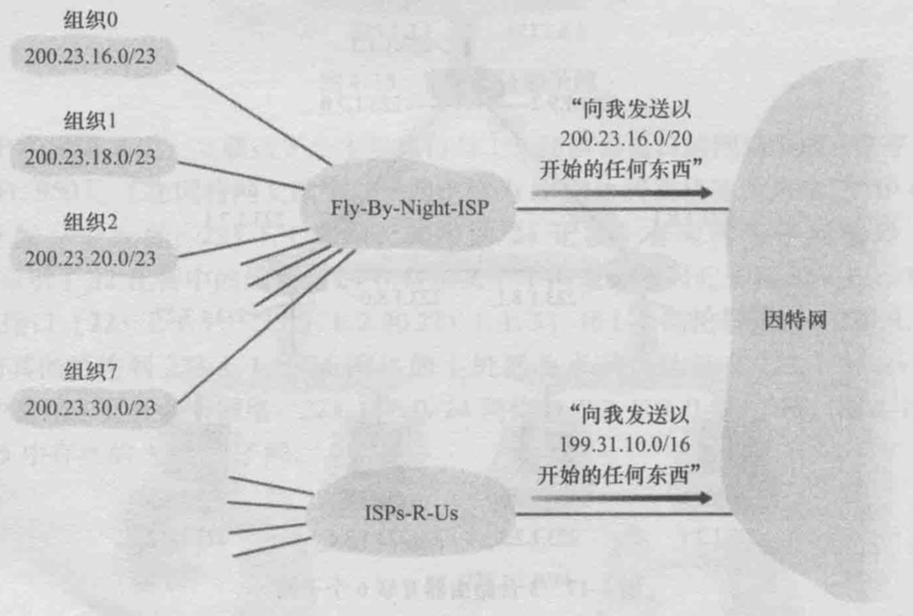

网络层负责IP数据报的产生以及IP数据包在逻辑网络上的路由转发，网络层分为三个组件：


- ###### 1、IP协议

- ###### 2、路由选择协议，它决定了数据报从源到目的地所流经的路径

- ###### 3、ICMP协议 (Internet Control Message Protocol, 因特网控制报文协议)，报告数据报中的差错和对某些网路层信息请求进行响应对设施。

###### 网络层和传输层的区别

> - 网络层只是根据网络地址将源结点发出的数据包传送到目的结点（点到点），其主要任务是：通过路由选择算法，为报文或分组通过通信子网选择最适当的路径。该层控制数据链路层与传输层之间的信息转发，建立、维持和终止网络的连接。具体地说，数据链路层的数据在这一层被转换为数据包，然后通过路径选择、分段组合、顺序、进/出路由等控制，将信息从一个网络设备传送到另一个网络设备。

###### 即网络层提供了主机之间的逻辑通信

> - 而传输层则负责将数据可靠地传送到相应的端口（端到端），传输层提供了主机应用程序进程之间的端到端的服务。传输层利用网络层提供的服务，并通过传输层地址提供给高层用户传输数据的通信端口，使高层用户看到的只是在两个传输实体间的一条端到端的、可由用户控制和设定的、可靠的数据通路。

###### 即传输层为运行在不同主机上的进程之间提供了逻辑通信

#### 一、IP协议

IP协议是TCP/IP核心协议。

###### 1、IP协议的数据报格式（IPv4）


> - 版本号
>    规定了数据报的IP协议版本（IPv4还是IPv6）。不同的IP版本使用不同的数据报格式 ，上图是IPv4的数据报格式
>
> - 首部长度
>    大多数IP数据报不包含选项，所以一般IP数据报具有20字节的首部。
>
> - 服务类型
>    使不同类型的IP数据报能相互区别开来。
>
> - 数据报长度
>    **整个IP数据报的长度**，**利用首部长度和总长度就可以是算出IP数据报中数据内容的起始地址**。该字段长度为16比特，所以IP数据报最长可达`2^16=65535`字节，而事实上，数据报很少有超过`1500`字节的
>
> - 标识、标志、片偏移字段
>    这三个字段与IP分片有关。此外，IPv6不允许在路由器上对分组分片
>
> - 生存时间TTL
>    用来确保数据报不会永远在网络中循环。设置该数据报可以经过的最多的路由器数。指定了数据报的生存时间，经过一个路由器，它的值就减1，当该字段为0时，数据报就被丢弃
>
> - 协议
>    该字段只有在一个IP数据报到达其目的地才有用。该字段值指示了IP数据报的数据部分应交给哪个特定的传输层协议，比如，值为6表明要交给TCP，而值为17则表明要交给UDP
> - 首部检验和
>    与UDP/TCP的检验和不同，这个字段只检验数据报的首部，不包括数据部分。
>
> - 选项字段
>    是一个可变长字段，选项字段一直以4字节作为界限。这样就可以保证首部始终是4字节的整数倍。很少被用到
>
> - 源IP和目的IP

```undefined
记录源IP地址，目的IP地址
```

> - 数据

#### 二、IP数据报分片

一个链路层帧能承载的最大数据量叫做**最大传送单元（Maximun Transmission Unit,MTU）**,即链路层的MTU限制着IP数据报的长度。
 问题是在不同的链路上，可能使用不同的链路层协议，且每种协议可能具有不同的MTU。
 假定在某条链路上收到一个IP数据报，通过检查转发表确定`出链路`，且出链路的MTU比该IP数据报的长度要小，如何将这个过大的IP数据报压缩进链路层帧的有效载荷字段呢？

解决方案就是**分片**：将IP数据报中的数据分片为两个或更多个较小的IP数据报，用单独的链路层帧封装这些较小的IP数据报，然后向出链路上发送这些帧，每个这些较小的数据都称为**片（fragment）**。

###### 片在到达目的地传输层前需要重新组装。

实际上，TCP和UDP都希望从网络层上收到完整的未分片的报文。IPv4的数据报重组工作是在端系统中，而不是在网络路由器中。
 当一台目的主机从相同源收到一系列数据时，需要确定这些数据报中的某些是否是一些原来较大的数据报中的片。而如果是片的话，需要进一步确定何时收到最后一片，并且如何将这些片拼接到一起以形成初始的数据报。从而就用到了前边说到的IPv4数据报首部中的***标识、标志、片偏移\*** 字段。

> - 1、当生成一个数据报时，发送主机在为该数据报设置`源和目的地址`的同时在贴上`标识号`,发送主机通常将为它发送的每个数据报`标识号`加1
> - 2、当某路由器需要对一个数据报分片时，形成的每个数据报（即片）具有初始数据报的`源地址`、`目的地址`和`标识号`
> - 3、当目的地从同一发送主机收到一系列数据报时，它能够检查数据报的`标识号`以确定哪些数据报实际上是同一较大数据报的片
> - 4、由于IP协议是不可靠服务，一个或者多个片可能永远到达不了目的地。为了让目的主机绝对相信它已收到初始数据报的最后一个片，最后一个片的`标志比特`被设为0，其余被设为1
> - 5、为了让目的主机确定是否丢失了一个片，并且能按照正确的顺序重新组装片，使用`偏移字段`指定该片应放在初始IP数据报的哪个位置>
>    此外，如果有一个片或者多个片未能到达，则该不完整的数据报将会被丢弃且不会交给传输层。但如果传输层正使用着TCP，则TCP将通过让源以初始数据来重传数据。因为IP层没有超时重传机制，所以会重传整个数据报，而不是某个片

#### 三、IPv4编址

###### 1、IP地址

一台主机通常只有一条链路连接到网络，当主机上的IP想发送一条数据报时，就在该链路上发送。主机与物理链路之间的边界叫做**接口（interface）**。
 而路由器的任务是从链路上接收数据报并从某些其他链路转发出去，路由器必须有两条或更多链路与其连接，路由器与它的任意一条链路之间的边界也叫做`接口`。即一台路由器会有多个`接口`，每个`接口`有其链路。
 因为每台主机与路由器都能发送和接收IP数据报，IP要求每台主机和路由器`接口`都有自己的IP地址。因此，一个IP地址技术上是与一个`接口`相关联的，而不是与包括该接口的主机或路由器相关联的。

###### 2、子网

每个IP地址（IPv4）长度为32比特（4字节），按**点分十进制记法**书写，即地址中的每个字节都用它的十进制形式书写，各字节间以点`.`隔开，比如`193.32.122.30`
 在因特网上的每台主机和路由器上的每个接口，必须有一个全球唯一的IP地址（NAT后的接口除外）。这些地址不能自由选择，一个接口的IP地址的一部分需要由其连接的子网来决定。


如图，一台路由器有三个接口，连接7台主机。左侧的三台主机以及连接它们的路由器的接口，都有一个形如`223.1.1.x`的IP地址。即在它们的IP地址中，最左侧的`24`比特是相同的。


互联左侧这三个主机接口与1个路由器接口的网络形成1个**子网（subnet）**（也被称为IP网络或直接称为网络）。IP编址为这个子网分配一个地址：`223.1.1.0/24`，其中的`/24`记法，有时称为**子网掩码（network mask）**，指示了32比特中的最左侧`24`比特定义了子网地址。任何连接到该子网的主机都要求其地址具有`223.1.1.x`的形式。同样图中下侧和右侧也是子网，分别为`223.1.3.0/24`和`223.1.2.0/24`


上图显示了3台通过点对点链路彼此互联的路由器，这里出现了6个子网。
 一个具有多个以太网段和点对点链路的组织将具有多个子网，在给定子网上的所有设备都具有相同的子网地址。
 虽然在理论上来说，不同子网可以有完全不同的子网地址。但上图可以看出，这6个子网在前16个比特是一致的，都是`223.1`

###### 3、无类别域间路由选择（CIDR）

因特网的地址分配策略被称为**无类别域间路由选择（CIDR）**(也被称为`无分类编址`，以区分于`分类编址`)。对于子网寻址，32比特的IP地址被分为两部分，也是点分十进制数形式`a.b.c.d/x`，其中x指示了地址的第一部分中的比特数，又被称为该地址的**前缀（prefix）**。
 一个组织通常被分配一块连续的地址，即具有相同前缀的地址。在该组织外的的路由器仅考虑前面的前缀比特x，这相当大地减少了在这些路由器中转发表的长度，形式为`a.b.c.d/x`单一表项足以将数据报转发到该组织内的任何目的地。



如图，`200.23.16.0/20`下有8个组织，分别是`200.23.16.0/23`到`200.23.30.0/23`，每个组织有自己的子网。而外界不需要知道这8个组织。这种使用单个网络前缀通告多个网络的能力通常称为**地址聚合**，也称为**路由聚合**或**路由摘要**

###### 4、分类编址

在CIDR被采用之前，IP地址的网络部分被限制长度为8、16、24比特，也就是**分类编址（classful addressing）**。具有8、16、24比特子网地址的子网被称为`A、B`和`C`类网络。
 一个`C类（/24）`子网既能容纳***2的8次方 - 2 = 254\***台主机（其中两个地址预留用于特殊用途），这对于很多组织来说都太小了。
 而一个`B类（/16）`子网可支持多达***2的16次方 - 2 = 65534\***
 台主机，又太大了。
 在分类编址方法下，一个有`2000`台主机的组织通常被分给一个B类（/16）地址，那么剩下的6万多个地址就浪费掉了。这就会导致**B类地址空间的迅速损耗以及所分配的地址空间的利用率低**。

此外，`255.255.255.255`是IP广播地址，当一台主机发出一个目的地址为该地址的数据报时，该报文会交付给同一个网络中的所有主机。

###### 5、获取主机地址

某组织一旦获得了一块地址，它就可为本组织内的主机与路由器逐一分配IP地址。系统管理员通常手工配置路由器中的IP地址。主机地址也能手动配置，但更多使用的是**动态主机配置协议（DHCP）**。DHCP允许主机自动获取IP地址。网络管理员可以配置DHCP，以使某给定主机每次与网络连接时能得到一个相同的IP地址，或者某主机将被分配一个**临时的IP地址**，该地址在每次与网络连接时也许是不同的。

###### 6、网络地址转换

每个IP地址（IPv4）长度为32比特（4字节），因此总共有2的32次方个可能的IP地址，约为40亿个。在互联网越来越普及的当下，个人计算机及智能手机等越来越多，这些IP地址显然无法满足人们的需求。
 为了解决IP地址不足的问题，于是就有了**网络地址转换(Network Address Translation， NAT)**，它的思想就是给一个局域网络分配一个IP地址就够了，对于这个网络内的主机，则分配私有地址，这些私有地址对外是不可见的，他们对外的通信都要借助那个唯一分配的IP地址。

如果从广域网到达`NAT路由器`的所有数据报都有相同的目的IP地址，那么该路由器如何知道是发送给哪个内部主机的呢？其原理就是使用在NAT路由器上的一张**NAT转换表**，并在该表内包含了端口号及其IP地址。

> 假设一台主机向广域网请求数据，`NAT路由器`收到该数据报，会为该数据报生成一个新的端口号替换掉源端口号，并将源IP替换为其广域网一侧接口的IP地址。当生成一个新的源端口号时，该端口号可以是任意一个当前未在`NAT转换表`中的源端口号（端口号字段是16比特，意味着`NAT协议`可以支持超过`60000`个并行使用路由器广域网一侧IP地址的连接），路由器中的NAT也在其`NAT转换表中`增加一表项。
>
> 该`NAT路由器`收到广域网返回的数据时，路由器使用目的IP地址与目的端口号从`NAT转换表`中检索出该主机使用的IP地址和目的端口号，改写该数据报的目的IP地址和目的端口号，并向该主机转发该数据报

NAT虽然在近几年得到了很广泛的应用，但也被很多人反对。
 主要是：

> - 1、端口号是用来进程编址的，而不是主机编址的（NAT协议类似 NAT路由器将该家庭网络的主机都当做进程处理，并通过NAT转换表为其分配端口号）
> - 2、路由器通常仅应当处理高达第三层的分组
> - 3、违背端到端原则，即主机彼此之间应当相互直接对话，结点不应当介入修改IP地址与端口号。
> - 4、应当用IPv6来解决IP地址短缺问题

但不管反对与否，NAT终究已成为当今因特网的一个重要组件