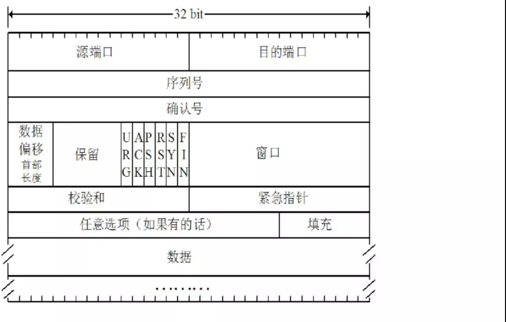
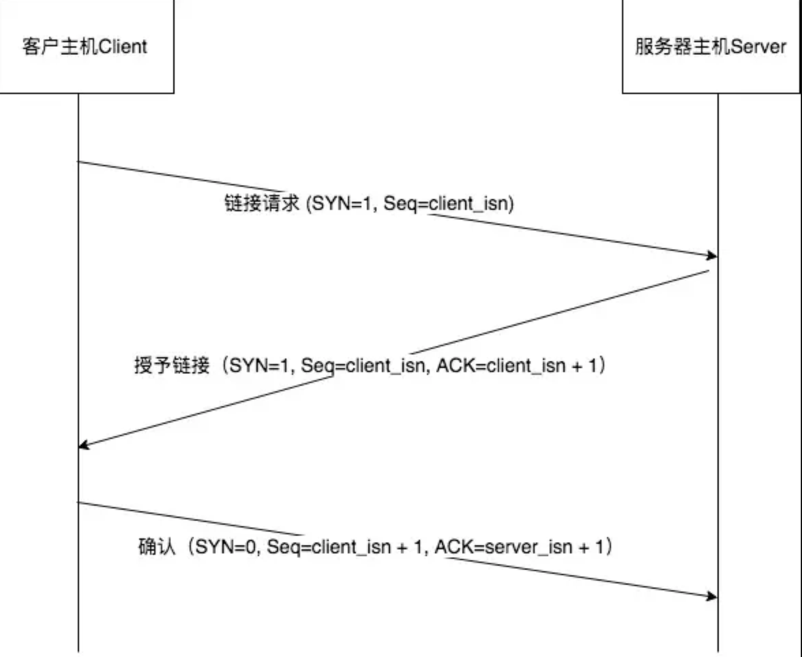
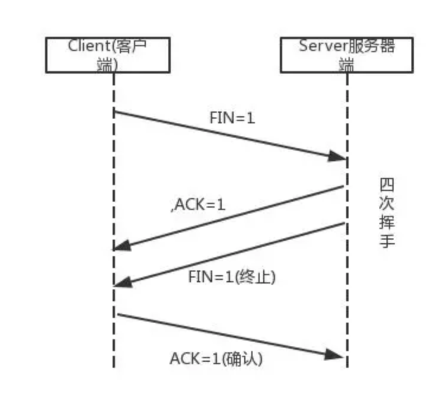

#### 一、TCP的特点和报文结构

**1、面向连接、可靠传输、面向字节流、全双工服务**

**2、TCP的报文结构**

TCP报文段由**首部字段**和一个**数据字段**组成。
 数据字段包含一块应用数据。最大报文长度`MSS`（Maximum Segment Size）限制了报文段数据字段的最大长度。`MSS`选项用于在TCP连接建立时，收发双方协商通信时每一个报文段所能承载的最大数据长度。
 所以当TCP发送一个大文件（比如一张高清图片）时，通常是将该文件划分为`MSS`长度的若干块（最后一块除外，通常会小于`MSS`）。而实际交互式应用通常传送长度小于`MSS`的数据块。

如图，与UDP一样，首部包括**源端口号**和**目的端口号**，用于多路复用/分解来自上层或送到上层应用的数据。TCP首部也同样包括**检验和字段**

TCP首部还包含下列字段:

- 32比特的**序号字段Seq(sequence number field)** 和32比特的**确认号字段Ack(acknowledge number field)**
- 16比特的**接收窗口字段RW(receive window field)**,该字段用于流量控制，用于指示接收方愿意接收的字节数量。
- 4比特的**首部长度字段（header length field）**，该字段指示了以32比特的字为单位的TCP首部长度。由于TCP选项字段的原因，TCP首部长度是可变的。（通常，选项字段为空，所以TCP首部的典型长度就是20字节）
- 可选和变长的**选项字段（option field）**，该字段用于发送方和接收方协商最大报文段长度（MSS）时，或用作窗口调节因子时使用。
- 6比特的**标志字段（flag field）**。ACK比特用于指示确认字段中的值是有效的，即该报文段包括一个对已被接收报文段的确认。**RST、SYN、FIN**比特用于连接建立和拆除。
   **PSH**比特指示接收方应立即将数据交给上层。**URG**比特用于指示报文段里存在着被发送端的上层实体置为“紧急”的数据。紧急数据的最后一个字节由16比特的紧急数据指针字段指出。当紧急数据存在并给出指向紧急数据尾的指针的时候，TCP必须通知接收端的上层实体。在实践中，PSH、URG和紧急数据指针并没有使用。

**3、序号字段Seq和确认号字段Ack**

- 在TCP通讯中，无论是建立连接，数据传输，友好断开，强制断开，都离不开Seq值和Ack值，它们是TCP传输的可靠保证。

**序号Seq**：
 TCP把数据看成一个无结构的、有序的字节流。一个**报文段的序号**因此是该报文段的首字节的字节流编号。
 比如数据流由一个包含`100000`字节的文件组成，其`MSS`是`1000`字节，数据流的首字节编号是0。该TCP将为该数据流构建`100`个报文段。给第一个报文段分配序号0，第二个则是`1000`，第三个是`2000`，以此类推。每一个序号被填入到相应TCP报文段首部的序号字段中。

**确认号Ack：**
 TCP是全双工服务的，因此主机A在向主机B发送数据的同时，也许也在接收主机B的数据。
 主机A填充进报文段的确认号是主机A期望从主机B收到的下一个字节的序号。

在上个例子中，假如服务端已经接收包含字节`0-999`的报文段和包含字节`2000-2999`的报文段，但由于某种原因，还未收到包含字节`1000-1999`的报文段，那么将仍会等待字节`1000`（及其后的字节）。因此服务端发给客户端的下一个报文段将在**确认号Ack**字段中包含1000。
 因为TCP只确认该流中至第一个丢失字节为止的字节，所以TCP被称为**累积确认**。

#### 二、三次握手

-数据开始传输前，需要通过 `三次握手`来建立连接
 事实上我认为，这里称呼`三步握手`（three-way handshake）才更贴切些

**第一步：**

- 客户端的TCP首先向服务端的TCP发送一条特殊的TCP报文段。该报文段不包含应用层数据，该报文段首部中的一个`标志位（SYN比特）`被置为1，所以该报文段被称为**SYN报文段**。另外，客户会随机选择一个初始序号`client_isn`，并将该序号放置于该起始的TCP `SYN`报文段的序号字段中。
- 客户端和服务端最开始都处于`CLOSED`状态，发送过该 `SYN`报文段后，客户端TCP进入`SYN_SENT`状态，等待服务端确认并将SYN比特置为1的报文段。

**第二步：**

- 收到SYN报文段后，服务端会为该TCP连接分配TCP缓存和变量，服务端TCP会进入`SYN_RCVD`状态，等待客户端TCP发送确认报文段。
- 并向该客户端TCP发送允许连接的报文段，该报文段同样不包含应用层数据。该报文段首部的`SYN`比特被置为1，确认号字段被置为`client_isn`+1。服务端还会选择自己的初始序号`server_isn`，放到报文段首部的序号段中。该连接被称为**SYNACK报文段**。

**第三步：**

- 收到SYNACK报文段后，客户端也要为该TCP连接分配缓存和变量，客户端TCP进入`ESTABLISHED`状态，在此状态，客户端就能发送和接收包含有效载荷数据的报文段了。
- 并向服务端TCP发送一个报文段：这最后一个报文段对服务端的允许连接的报文表示了确认（将`server_isn` + 1放到报文段首部的确认字段中）。因为连接已经建立了，所以该`SYN`比特被置为0。这个阶段，可以在报文段负载中携带应用层数据。
- 收到客户端该报文段后，服务端TCP也会进入`ESTABLISHED`状态，可以发送和接收包含有效载荷数据的报文段。

1. List item

#### 三、四次挥手

**参与TCP连接的两个进程中的任何一个都能终止该连接，当连接结束后，主机中的资源（缓存和变量）会被释放。**

上边说到，SYN和FIN标志位分别对应着TCP连接的建立和拆除。

**第一步：**

- 客户应用进程发出一个关闭连接的指令。会引起客户端TCP向服务端发送一个特殊的TCP报文段。该报文段即是将首部的一个标志位`FIN`比特置为1。
- 同时，客户端进入`FIN_WAIT_1`状态，等待服务端的带有确认的TCP报文段。

**第二步：**

- 收到该报文段后会向客户端发送一个确认报文段。
- 服务端TCP进入`CLOSE_WAIT`状态，对应客户端的`TIME_WAIT`，表示被动关闭。
- 客户端收到该报文段后，进入`FIN_WAIT_2`状态，等待服务端的FIN比特置为1的报文段。

**第三步：**

- 服务端发送自己的终止报文段，同样是把报文段首部的标志位`FIN`比特置为1。
- 服务端TCP进入`LAST_ACK`状态，等待服务端最后的确认报文段。

**第四步：**

- 客户端收到服务端的终止报文段后，向服务端发送一个确认报文段。同时，客户端进入`TIME_WAIT`状态。
- 假如ACK丢失，`TIME_WAIT`状态使TCP客户重传最后的确认报文，`TIME_WAIT`通常会等待2MSL（Maximum Segment Lifetime 最长报文段寿命）。经过等待后，连接就正式关闭，重新进入`CLOSED`状态，客户端所有资源将被释放。
- 服务端收到该报文段后，同样也会关闭，重新进入`CLOSED`状态，释放所有服务端TCP资源。

###### 一些问题

**1、问：为什么建立连接只用三次握手，而断开连接却要四次挥手？**

- 首先，当客户端数据已发送完毕，且知道服务端也全部接收到了时，就会去断开连接即向服务端发送FIN
- 服务端接收到客户端的FIN，为了表示接收到了，就会向客户端发送ACK
- 但此时，服务端可能还在发送数据，并没有关闭TCP窗口的意思，所以服务端的FIN和ACK并不是同步发的，只有当数据发送完了，才会发送FIN
- **答：服务端的FIN和ACK需要分开发，并不是像三次握手中那样，SYN可以和ACK同步发，所以就需要四次挥手**

**2、在四次挥手中，客户端为什么在TIME_WAIT后必须等待2MSL时间呢？**

这个`ACK`报文段有可能丢失，因而使处在`LAST_ACK`端的服务端收不到对已发送的`FIN`报文段的`ACK`报文段，从而服务端会去不断重传`FIN`报文段。
 而客户端就能在2`MSL`时间内收到重传的`FIN`报文段。接着客户端重传一次确认，重新启动2`MSL`计时器。直至服务端收到后，客户端和服务端就都会进入`CLOSED`状态，关闭TCP连接。
 而如果客户端不等待2`MSL`时间，而是在发送完`ACK`确认后立即释放资源，关闭连接，那么就无法收到服务端重传的`FIN`报文段，因而也不会再发送一次`ACK`确认报文段，这样，服务端就无法正常进入`CLOSED`状态，资源就一直无法释放了。

- 答：为了保证客户端发送的最后一个ACK报文段能够到达服务端。

**3、TCP在创建连接时，为什么需要三次握手而不是两次或四次？**

一个简单的例子：

- `三次握手`：
   “喂，你听得到吗？”
   “我听得到呀，你听得到我吗？”
   “我能听到你，今天balabala……”
- `两次握手`：
   “喂，你听得到吗？”
   “我听得到呀，你听得到我吗？”
   “喂，你听得到吗？”
   “……谁在说话？”
   “喂，你听得到吗？”
   “……”
- `四次握手`：
   “喂，你听得到吗？”
   “我听得到呀”“你能听到我吗？”
   “……不想跟傻逼说话”

之所以不用`四次握手`的原因很容易理解，就是浪费资源，服务端的`SYN`和`ACK`可以一起发，完全没必要分开两次。

而如果是`两次握手`：
 客户端发出的第一个连接请求`SYN`报文段并没有丢失，而是在某个网络结点长时间的滞留了，以致延误到连接释放以后的某个时间才到达服务端。本来这是一个早已失效的报文段。但服务端收到此失效的连接请求`SYN`报文段后，就误认为是客户端再次发出的一个新的连接请求`SYN`报文段。于是就向客户端发出`ACK`确认报文段，同意建立连接。假设不采用`三次握手`，那么只要服务端发出确认，新的连接就建立了。
 由于现在客户端并没有发出建立连接的`SYN`请求，因此不会理睬服务端的确认，也不会向服务端发送数据。但服务端却以为新的运输连接已经建立，并一直等待客户端发来数据。这样，服务端的很多资源就白白浪费掉了。

事实上：TCP对有数据的TCP报文段必须确认的原则，所以，客户端对服务端的`SYN`报文段必须回复一个`ACK`报文段表示确认。并且，TCP不会为没有数据的`ACK`超时重传，那么当服务端没收到客户端的`ACK`确认报文段时，会超时重传自己的`SYN`报文段，一直到收到客户端的`ACK`为止。

- **答：两次握手会可能导致已失效的连接请求报文段突然又传送到了服务端产生错误，四次握手又太浪费资源**

