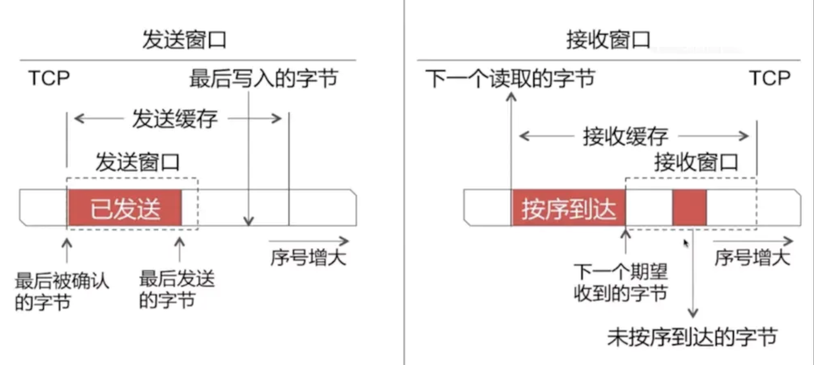
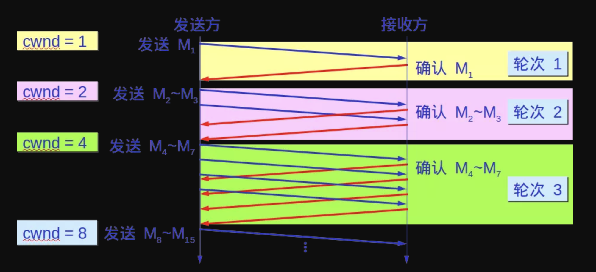
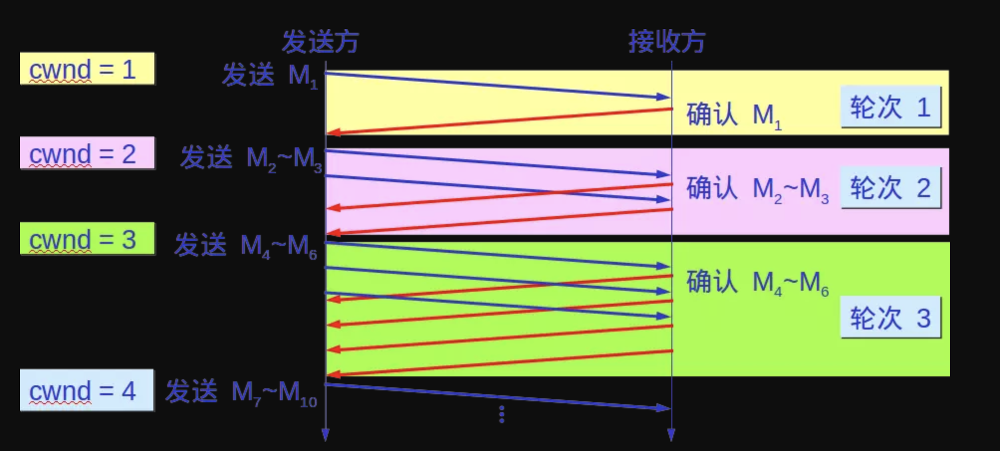

#### 一、可靠数据传输

**网络层服务（IP服务）是不可靠的。IP不保证数据报的交付，不保证数据报的按序交付，也不保证数据报中数据的完整性。**

TCP则是在IP服务上创建了一种**可靠数据传输服务**
TCP的**可靠数据传输服务**确保一个进程从其接收缓存中读出的数据流是无损坏、无间隔、无冗余、按序的数据流。即该字节流与连接的另一端发出的字节流是完全相同的。
作为TCP接收方，有三个与发送和重传有关的主要事件

**1、从上层应用数据接收数据**

将数据封装到一个报文段中，并把报文段交付给IP。每个报文段都包含一个序号Seq，即该报文段第一个数据字节的字节流编号。如果定时器还没有为其他报文段而运行，则启动定时器(即不是每条报文段都会启动一个定时器，而是一共只启动一个定时器)，定时器的过期间隔是`TimeoutInterval`
是由EstimatedRTT和DevRTT计算得来的:TCP的往返时间的估计与超时

**2、超时**

TCP通过重传引起超时的报文段来响应超时事件，然后重启定时器。

而发送端超时有两种情况：发送数据超时，接收端发送ACK超时。这两种情况都会导致发送端在`TimeoutInterval`内接收不到ACK确认报文段。

- 1、如果是发送数据超时，直接重传即可。
- 2、而如果是接收端发送ACK超时，这种情况接收端实际上已经接收到发送端的数据了。那么当发送端超时重传时，接收端会丢弃重传的数据，同时再次发送ACK。

而如果在`TimeoutInterval`后接收到了ACK，会收下ACK，但不做任何处理

- TCP不会为没有数据的ACK超时重传

以下两种情况：

- 1、如果在发送两条或多条数据报文段都超时，那么只会重传序号最小的那个，并重启定时器。只要其余报文段的ACK在新重启的定时器超时前到达，就不会重传。
- 2、如果发送序号为`100`和`120`的两条数据报文段，序号`100`的ACK丢失，但收到了序号`120`的ACK，由于累积确认机制，可以得出接收方已经接收到了序号`100`的报文段，这种情况也不会去重传。

**3、接收到ACK**

用TCP状态变量`SendBase`指最早未被确认的字节的序号。则`SendBase - 1` 指接收方已正确按序接收到的数据的最后一个字节的序号。
当收到ACK确认报文段后，会将ACK的值Y与`SendBase`比较。TCP采用**累计确认**的方法，所以`Y`确认来字节编号在Y之前的所有字节都已经收到。如果`Y`比`SendBase`小，不用理会；而如果`Y`比`SendBase`大，则该ACK是在确认一个或多个先前未被确认的报文段，因此要更新`SendBase`变量，如果当前还有未被确认的报文段，TCP还要重启定时器。
**通过超时重传，能保证接收到的数据是无损坏、无冗余的数据流，但并不能保证按序。**

而通过TCP滑动窗口，能够有效保证接收数据有序

#### 二、流量控制

TCP连接的双方主机都会为该TCP连接分配缓存和变量。当该TCP连接收到正确、按序的字节后，就将数据放入`接收缓存`。上层的应用进程会从该缓存中读取数据，但不必是数据一到达就立即读取，因为此时应用程序可能在做其他事务。而如果应用层读取数据相对缓慢，而发送方发送得太多、太快，发送的数据就会很容易地使该连接的`接收缓存`溢出。

所以，TCP为应用程序提供了**流量控制服务**（flow-control service），以消除发送方使接收方缓存溢出的可能性。

`流量控制`是一个速度匹配服务，即发送方的发送速率与接收方应用程序的读取速率相匹配。
作为全双工协议，TCP会话的双方都各自维护一个**发送窗口**和一个**接收窗口**（receive window）的变量来提供流量控制。而`发送窗口`的大小是由对方`接收窗口`来决定的，`接收窗口`用于给发送方一个指示--该接收方还有多少可用的缓存空间。

 

**1、发送窗口**

发送方的发送缓存内的数据都可以被分为4类:

- 已发送，已收到ACK
- 已发送，未收到ACK
- 未发送，但允许发送
- 未发送，但不允许发送

则2和3属于`发送窗口`

- `发送窗口`只有收到`发送窗口`内字节的ACK确认，才会移动发送窗口的左边界

**2、接收窗口**

接收方的缓存数据分为3类：
1.已接收
2.未接收但准备接收
3.未接收而且不准备接收
则2 属于`接收窗口`（这里的接收指接收数据并确认）

- `接收窗口`只有在前面所有的报文段都确认的情况下才会移动左边界。当在前面还有字节未接收但收到后面字节的情况下，会先接收下来，`接收窗口`不会移动，并不对后续字节发送ACK确认报文，以此确保发送端会对这些数据重传。

我们定义以下变量：

- `LastByteRead`：接收方应用程序读取的数据流的最后一个字节编号。可以得知，这是`接收缓存`的起点
- `LastByteRcvd`：从网络中到达的并且已放入`接收缓存`中的数据流的最后一个自己的的编号。

可以得知：`LastByteRcvd` - `LastByteRead` <= `RcvBuffer`(接收缓存大小)
那么接收窗口`rwnd` =`RcvBuffer` - （`LastByteRcvd` - `LastByteRead`）
`rwnd`是随时间动态变化的，如果`rwnd`为0，则意味着接收缓存已经满了。
接收端在回复给发送端的ACK中会包含该rwnd，发送端则会根据ACK中的接收窗口的值来控制发送窗口。

有一个问题，如果当发送`rwnd`为0的`ACK`后，发送端停止发送数据。等待一段时间后，接收方应用程序读取了一部分数据，接收端可以继续接收数据，于是给发送端发送报文告诉发送端其`接收窗口`大小，但这个报文不幸丢失了，我们知道，**不含数据的ACK是不会超时重传的**，于是就出现发送端等待接收端的`ACK`通知||接收端等待发送端发送数据的死锁状态。

为了处理这种问题，TCP引入了`持续计时器`（Persistence timer），当发送端收到对方的`rwnd=0`的`ACK`通知时，就启用该计时器，时间到则发送一个1字节的探测报文，对方会在此时回应自身的`接收窗口`大小，如果结果仍未0，则重设持续计时器，继续等待。

#### 三、拥塞控制

TCP除了`可靠传输服务`外，另一个关键部分就是`拥塞控制`。
TCP让每一个发送方根据所感知到的网络拥塞程度来限制其能向连接发送流量的速率。
可能有三个疑问：
1、TCP发送方如何感知网络拥塞？
2、TCP发送方如何限制其向连接发送流量的速率？
3、发送方感知到网络拥塞时，采用何种算法来改变其发送速率？
这就是TCP的**拥塞控制机制**。
前边说到，TCP连接的每一端都是由一个接收缓存、一个发送缓存和几个变量（`LastByteRead`、`LastByteRcvd`、`rwnd`等）组成。而运行在发送方的TCP拥塞控制机制会跟踪一个额外的变量，即**拥塞窗口cwnd**（congestion window）。它对一个TCP发送方能向网络中发送流量的速率进行了限制。
发送方中未被确认的数据量不会超过`cwnd`和`rwnd`的最小值:`min(rwnd,cwnd)`

**1、TCP发送方如何感知网络拥塞？**

**冗余ACK（duplicate ACK）**：就是再次确认某个报文段的ACK，而发送方先前已经收到对该报文段的确认。

**冗余ACK的产生原因：**

- 1.当接收端接收到`失序报文段`时，即该报文段序号大于下一个期望的、按序的报文段，检测到数据流中的间隔，即由报文段丢失，并不会对该报文段确认。TCP不使用`否定确认`，所以不能向发送方发送显式的否定确认，为了使接收方得知这一现象，会对上一个按序字节数据进行`重复确认`，这也就产生了一个`冗余ACK`。
- 2.因为发送方经常发送大量的报文段，如果其中一个报文段丢失，可能在定时器过期前，就会收到大量的`冗余ACK`。一旦收到3个`冗余ACK`（3个以下很可能是链路层的乱序引起的，无需处理），说明在这个已被确认3次的报文段之后的报文段已经丢失，TCP就会执行**快速重传**，即在该报文段的定时器过期之前重传丢失的报文段。

**将TCP发送方的`丢包事件`定义为：要么出现超时，要么收到来自接收方的3个`冗余ACK`。**

当出现过度的拥塞时，路由器的缓存会溢出，导致一个数据报被丢弃。丢弃的数据报接着会引起发送方的`丢包事件`。那么此时，发送方就认为在发送方到接收方的路径上出现了`网络拥塞`。

**2、TCP发送方如何限制其向连接发送流量的速率？**

- 当出现丢包事件时：应当降低TCP发送方的速率。
- 当对先前未确认报文段的确认到达时，即接收到非冗余ACK时，应当增加发送方的速率。

**3、发送方感知到网络拥塞时，采用何种算法来改变其发送速率？**

即**TCP拥塞控制算法（TCP congestion control algorithm）**
包括三个主要部分：**慢启动、拥塞避免、快速恢复**，其中快速恢复并非是发送方必须的，慢启动和拥塞避免则是TCP强制要求的

- **1、慢启动**
  当一条TCP连接开始时，拥塞窗口`cwnd`的值通常置为一个`MSS`的较小值，这就使初始发送速率大约为**MSS/RTT**（RTT：往返时延，报文段从发出到对该报文段的确认被接收之间的时间量）。
  而对TCP发送方来说，可用带宽可能比`MSS/RTT`大得多,TCP发送方希望迅速找到可用带宽的数量。因此，在慢启动状态，`cwnd`以一个`MSS`的值开始并且每当收到一个非`冗余ACK`就增加一个`MSS`。

最初`cwnd`值为`1MSS`，发送一个报文段`M1`。收到`M1`的确认后，`cwnd`增加为`2MSS`，这时可以发送两个报文段`M2`，`M3`。收到这两个报文段的确认后，`cwnd`则增加为`4MSS`，可以发送四个报文段，以此类推...

**因此，TCP虽然发送速率起始慢，但在慢启动阶段以指数增长。**

这种指数增长很显然不是无限制的，那么何时结束呢？
如果出现丢包事件，TCP发送方将ssthresh（慢启动阈值）设置为`cwnd/2`

- 发生由超时引起的丢包事件，并将`cwnd`重置为`1MSS`，重启`慢启动`
- 当TCP发送方的`cwnd`值达到或超过`ssthresh`，再继续翻倍显然不合适。这时将结束`慢启动`转移到`拥塞避免`模式。
- TCP发送方检测到3个冗余ACK，会结束慢启动，并`快速重传`，即在该报文段的定时器过期之前重传丢失的报文段。且进入快速恢复状态。
- **2、拥塞避免**

一旦进入拥塞避免状态，`cwnd`的值大约是上次遇到拥塞时的值的一半，即距离拥塞并不遥远。因此，TCP无法每过一个RTT就将`cwnd`翻倍。而是每个RTT只增加`1MSS`，即每收到一个非冗余ACK，就将`cwnd`增加1/cwnd。即假如此时`cwnd`为`10MSS`，则每收到一个非冗余ACK，`cwnd`就增加`1/10MSS`，在10个报文段都收到确认后，拥塞窗口的值就增加了`1MSS`。

那么何时结束拥塞避免的线性增长（每RTT 1MSS）呢？
和慢启动一样，如果出现丢包事件，TCP发送方将`ssthresh`（慢启动阈值）设置为`cwnd/2`（加法增大， 乘法减小）

- 发生由超时引起的丢包事件，拥塞避免和慢启动处理的方式相同。即TCP发送方将`ssthresh`（慢启动阈值）设置为`cwnd/2`，并将cwnd重置为`1MSS`，重启慢启动
- TCP发送方检测到3个冗余ACK，`cwnd`为原来的一半加上`3MSS`，进入快速恢复状态。

- **3、快速恢复**

快速恢复是由3个冗余ACK引起的。
在快速恢复中，对引起TCP进入快速恢复状态的缺失报文段，对收到的每个冗余ACK，`cwnd`增加1个MSS。最终，当对丢失报文段的一个ACK到达时，TCP在降低cwnd后进入拥塞避免状态。
如果出现超时，和之前一样，即TCP发送方将`ssthresh`（慢启动阈值）设置为`cwnd/2`，并将`cwnd`重置为`1MSS`，重启`慢启动`

快速恢复并非是必须的。

TCP的拥塞控制是：每个RTT内`cwnd`线性（加性增）增加`1MSS`，然后出现3个冗余ACK事件时`cwnd`减半（乘性减），因此TCP拥塞控制常被称为**加性增，乘性减**拥塞控制方式

